# 在警察数据上使用薄层

> 原文：<https://towardsdatascience.com/using-folium-on-police-data-3207e505c649>

## 对合唱团的混乱说“是”

在熨斗学校学习数据科学课程还不到一周，我就已经被口语化的知识所困扰了。真是**。“即使在最好的情况下，我也认为警方的数据会很混乱。警察没有接受过将数据收集作为首要任务的培训，他们也不应该这样做。这很容易与在网飞、Spotify 或谷歌工作的整个数据收集团队形成对比——他们的首要任务是设计他们的数据，以优化分析。**

*然而，我认为凌乱的警方数据实际上是可视化的成熟之作，仅仅是因为它太杂乱，太复杂，太庞大，一般人无法理解。在这些情况下，可视化可以带来非常需要的直观理解。一个简单的 choropleth 可以成为我们的数据故事的开始。这个故事是一个普通纽约人应该知道的故事。如果你是一个普通的纽约人，并且更关心调查结果而不是代码，请随意向下滚动到**调查结果**。*

# *NYPD 和拦截搜身，一个样板:*

*在这个项目中，我使用了 2020 年 NYPD 的停车搜身数据。美国公民自由联盟已经彻底分析了这些数据。[1]他们发现在记录的 9544 次停车中，有 5791 次是无辜的(61%)。*

*他们还发现:*

> *5367 人是黑人(56%)。2879 人是拉丁裔(30%)。856 人是白人(9%)。219 人是亚洲/太平洋岛民(2%)
> 132 人是中东/西南亚人(1.4%)*

*为什么这些人口统计数据与拦截搜身的基本知识相关，是因为拦截搜身在 2013 年被视为违宪，违反了第四修正案，禁止不合理的搜查和扣押。*

*如果你在谷歌上搜索“停下来搜身+违宪”，你首先会看到以下内容，来自维基百科:*

> *在 2013 年 8 月 12 日裁决的 Floyd 诉纽约市一案中，美国地方法院法官 Shira Scheindlin 裁定，拦截搜身的使用方式违反了宪法，并指示警方采取书面政策，具体说明这种拦截的授权地点。*

*在纽约市，市长 Adams 是一名前警察队长，也是执法部门 100 名黑人关心组织的创始成员，该组织致力于打击非裔美国人社区及其与 NYPD 互动之间的不公正现象。埃里克·亚当斯还承诺恢复合法的盘查方式，他说*“如果你有一个警察部门，你说你不能盘查，那不是一种负责任的警务方式…”**

# *昂贵的机构:*

*2022 年，[“2022 财年 NYPD 费用预算提案为 54.4 亿美元，占全市总额的 5.5%。”](https://council.nyc.gov/budget/wp-content/uploads/sites/54/2021/05/NYPD.pdf)【3】*

*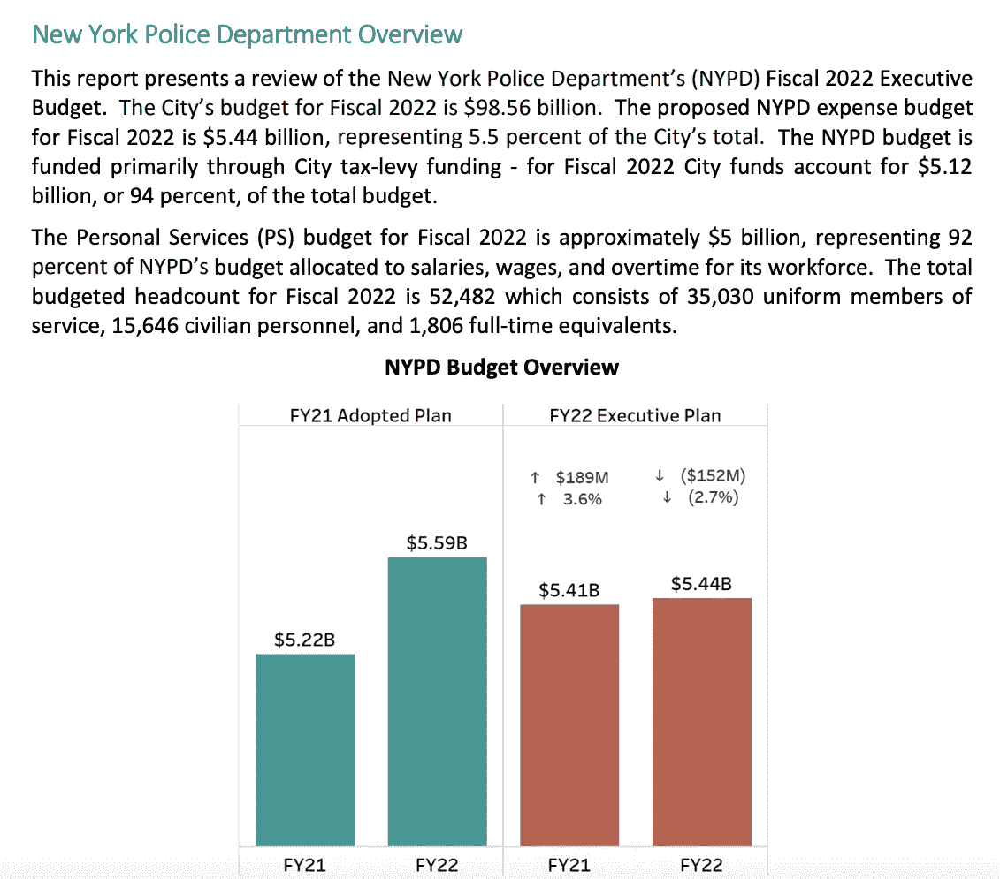*

*图片作者([来自链接的纽约市议会预算](https://council.nyc.gov/budget/wp-content/uploads/sites/54/2021/05/NYPD.pdf)第 2 页)。)*

*[Business Insider 估计，2020 年 NYPD 的实际融资成本接近 100 亿英镑。](https://www.businessinsider.com/the-real-cost-of-police-nypd-actually-10-billion-year-2020-8) [4]纽约人的税收约占 NYPD 资金的 95%，是世界上资金最多的警察。普通纽约人了解他们城市的警察每天在做什么，这对纽约市的健康极其重要。但是信息有一个巨大的瓶颈。*

# *公共警察数据的可访问性问题:*

*为了透明，NYPD 公开了大部分数据。[5]但是在[拦截搜身数据](https://www1.nyc.gov/site/nypd/stats/reports-analysis/stopfrisk.page)的情况下，没有一个数据被汇总。取而代之的是，每一行信息代表一次独立的拦截和搜查。*

*(视频由作者提供。youtube 上的视频片段链接如下:[https://www.youtube.com/watch?v=illObkP3TLQ](https://www.youtube.com/watch?v=illObkP3TLQ)*

*没有什么不寻常的公共数据集不是为了让普通人从中辨别意义而制作的。这是惯例。但除非我们采取措施，否则这对普通纽约人没什么好处。让我们把它放在地图上！*

# *纽约人了解社区:*

*也许是因为经常看地铁图？*

*毕竟，普通纽约人现在可以看着这张地图并理解*“拦截搜身对东哈莱姆区、东纽约和布朗克斯区(用红色箭头标出)的意义与它对斯塔滕岛、金融区和湾脊区(用绿色箭头标出)的意义截然不同。)"**

**

*图片由作者提供。*

# *代码:*

*注意，这篇博文是*而不是*来教你我没有从[杰德·亚当斯](https://medium.com/u/dce21577b847?source=post_page-----3207e505c649--------------------------------)的惊人博文[“使用 learn 和 GeoPandas 进行地理制图的 Python 教程](https://medium.com/@jade.adams517/using-geopandas-and-folium-to-build-maps-on-python-c51c5aad5f44)”中学到的任何东西[6]看看那个帖子如果你正在寻找一个惊人的叶子教程，我将继续谈论如何具体可视化 NYPD 数据。我将带你浏览我是如何制作上面这张地图的。*

*首先，打开你用来写代码的任何东西，我喜欢 Jupyter 笔记本。让我们导入熊猫来读取 excel 文件和叶子来制作地图。*

*下一步是查看数据的形状和列。*

*输出告诉我们，我们正在处理 9544 行、83 列以及所有列的名称。*

*出于我们的目的，让我们去掉任何不是 id 或 zipcode 的数据，只是为了让事情变得特别简单。我们总是可以在以后回到这个极其复杂的数据集进行进一步的研究(我们也应该这样做！)毕竟这张图不是我们过程的结束，只是开始。*

*然而，现在我们有了这个新的数据框，保存为 zipcode_frequency，我们需要做一些基本的重新格式化才能使用它。*

*上面的代码将返回我们的列的以下报告，该列中有多少非空值，以及该列的数据类型。*

```
*<class 'pandas.core.frame.DataFrame'>
RangeIndex: 9544 entries, 0 to 9543
Data columns (total 2 columns):
 #   Column                  Non-Null Count  Dtype 
---  ------                  --------------  ----- 
 0   STOP_ID                 9544 non-null   int64 
 1   STOP_LOCATION_ZIP_CODE  9544 non-null   object
dtypes: int64(1), object(1)
memory usage: 149.2+ KB*
```

*注意非空计数是如何显示`STOP_ID`和`STOP_LOCATION_ZIP_CODE,`的`9544 non-null`值的。这向我们表明，我们的空值不会被简单的`zipcode_frequency.fill_na(<params here>)`填充。然而，当我们运行下面的代码时:*

*我们得到了以下输出:每次填写邮政编码的计数、唯一邮政编码的计数、最常出现的邮政编码以及最常出现的邮政编码的频率。*

```
*count       9544
unique       179
top       (null)
freq         654
Name: STOP_LOCATION_ZIP_CODE, dtype: object*
```

*这告诉我们，我们的空值在邮政编码列中填充了值“(null)”654 次。但是这占数据的百分比是多少呢？有多少次纽约市的警察在他们记录了一次拦截搜身的地方没有记录邮政编码？*

*这段代码返回我们的字符串，它的值被填充为我们要清除的数据的百分比。*

```
*This data has 0.07 percent of its zipcode data missing.*
```

***删除空值，还是将空值添加到 Yes 列，还是将空值添加到 No 列**:这里有点两难。将来，我想回到这个项目上来，找出一种既能聚集数据，又能保留所有三种不同价值的方法。通常情况下，我不会保留空值，但是对于这种数据，空值可以说明它们自己的故事(某些邮政编码更倾向于在它们的报告中包含空值吗？)然而，为了这篇博文的目的，为了简单起见，为了对数据的内容有一个初步的了解，我将从数据中删除空值，并跟踪这些损失。*

# *汇总熊猫的数据:*

*而回报显示的是我们的汇总数据！现在我们的行代表整个邮政编码，而不是一个实例。*

*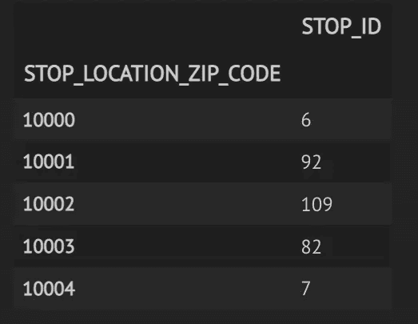*

*请注意，STOP_LOCATION_ZIP_CODE 现在是索引，而 STOP_ID 不再与 ID 相关，因为它对聚合时该列中的所有 ID 进行计数。图片由作者提供。*

*但是在绘制地图之前，我们还有三件事要做。*

1.  *为了清楚起见，我们将把`STOP_ID`重命名为`FREQUENCY`。*
2.  *我们将把邮政编码转换成字符串，而不是数值。这将允许 lyum 将邮政编码的频率分配给它们的邮政编码标签。*
3.  *最后，从数据中移除那些`"(null)"`值，理解我们正在将偏差引入我们的过程，并改变我们的地图的含义。*

# *制作 Choropleth 地图:*

*choropleth 是一个地理热图。Folium 是一个 python 地图制作库。我们需要两个基本的东西来制作一个 choropleth:作为 GeoJson 文件的地图的一些边界，以及我们的数据。我们已经准备好了数据。我将使用我在这里找到的 NYC GeoJson 文件:[https://github . com/fed here/pui 2015 _ EC/blob/master/mam 1612 _ EC/NYC-zip-code-table-areas-polygons . geo JSON【T6，](https://github.com/fedhere/PUI2015_EC/blob/master/mam1612_EC/nyc-zip-code-tabulation-areas-polygons.geojson)*

*关于 follow choropleths 的更多信息，我将直接向您推荐 follow 文档:[https://python-visualization . github . io/follow/quick start . html](https://python-visualization.github.io/folium/quickstart.html)*

*这是真的，理想情况下，我会让这些地图互动，这样人们可以点击地图上的每个邮政编码区，该邮政编码的统计数据就会弹出，我可能想使用 tableau，而不是 lyum 来制作这些地图。这肯定会增加可用性。有很多方法可以改进这些地图，以增加我们从这些地图中学到的知识。*

*但是我想说的是，只要快速浏览一下我们在这里一起制作的地图，让我们再快速浏览一下，就已经能告诉我们比查看原始 excel 文件更多的信息。*

*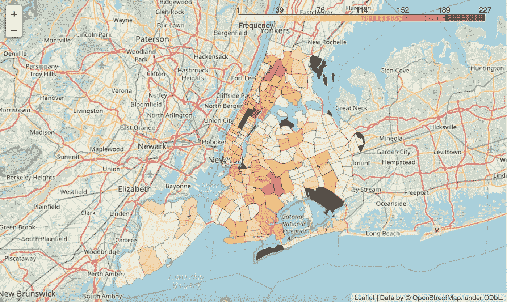*

*图片由作者提供。*

# *拥抱问题，寻找故事:*

*虽然这不是我们梦想的仪表板，但它是一个奇妙的讲故事工具，因为它已经让我们对我们的数据产生了好奇:*

*   *这些邮政编码如何与`PHSYSICAL_FORCE_RESTRAINED_USED_FLAG`列相关联，这一点我们还没有在数据中探索。有没有哪个邮政编码的人被限制的比例更高，这些邮政编码是不是发生最多拦截搜身的地方？*
*   *这些邮政编码如何与我们数据中的`ASK_FOR_CONSENT_FLAG`列相关联？不同邮政编码的人们是否以同样的比率征求他们的同意？*
*   *那`OFFICER_IN_UNIFORM_FLAG`专栏呢？当我们按邮政编码聚合时，该列会发生什么变化？(在某些邮政编码区有更多的便衣警察吗？)*
*   *该地图与 2019 年的具有相同参数的地图相比如何？那里经常发生停车搜查的邮政编码和前一年一样吗？*
*   *也许最引人注目的是:“东哈莱姆区、东纽约和布朗克斯区正在发生什么？”*

*我对杂乱数据和使用直方图的热情可以总结给各位数据科学家，因此: ***就像我们使用直方图来建立对频率数据的基线理解一样，我们可以使用简单的直方图来建立对地理数据的基线理解。从那里，我们可以使用我们的 choropleth 来找出数据中我们想要探索更多的地方。****

# *同意-问道:*

*使用类似的方法，我能够得到同意的百分比频率——通过邮政编码询问。(需要注意的是，`ASK_FOR_CONSENT`并不衡量在该数据集中征求同意和给予同意的时间，而只衡量征求同意的时间。在很多情况下，被要求同意的人会被拦下搜身，但没有得到同意，拦下搜身的事还是发生了。)*

*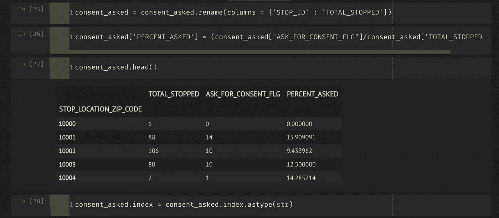*

*使用简单的除法，按邮政编码显示 2020 年 NYPD 要求某人同意停车搜身的频率(百分比)。图片由作者提供。*

*利用这些数据，我制作了以下地图:*

*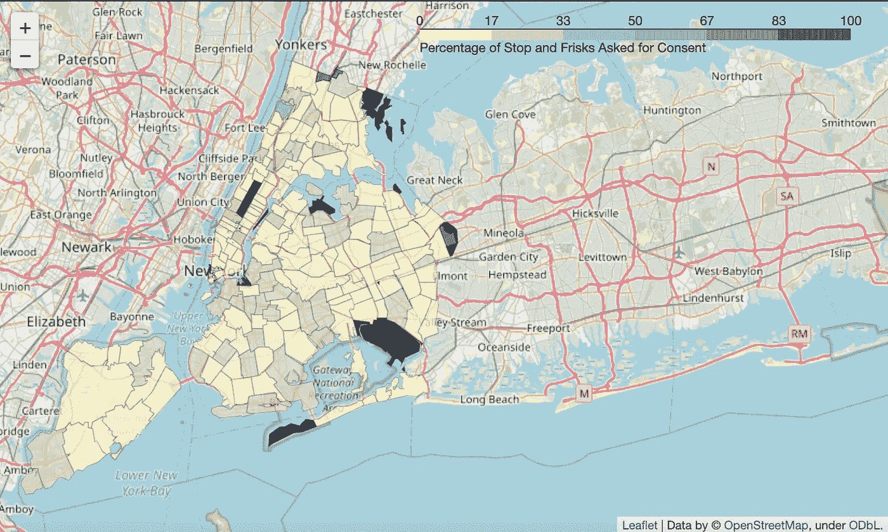*

*这张地图显示了按邮政编码要求的同意率。它很好地显示了大多数邮政编码的同意率在 0%到 33%之间。图片由作者提供。*

*上面的地图很好地显示了 2020 年自愿停车搜身的真实范围，有两个小的邮政编码，一个在东皇后区，一个在扬克斯附近，有 100%的同意率。但是，如果我们想比较这些邮政编码中的同意询问率，以真正突出大部分数据在哪里呢？*

# *在 Choropleth 图中使用四分位数范围:*

*以下代码:*

*会给我们以下的地图:*

*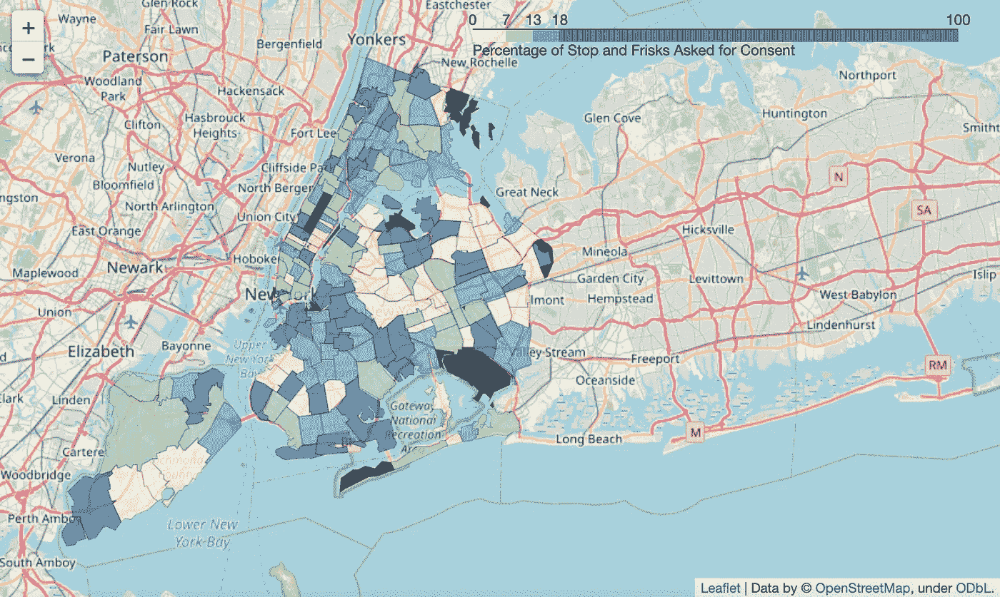*

*现在，这张地图显示的是同样的数据，但是大部分数据都是分散的。图片由作者提供。*

*重要的是要指出图例，它表明邮政编码必须在前 75 个百分点，同意率才能高于 18%。作为故事讲述者，我们有责任指出这一点，以免这张地图被误解为表明*“2020 年整个纽约市的同意率普遍很高，因为地图上有一部分是深蓝色的。”*我们应该或不应该认为“高”同意率是我不会在本博客中讨论的话题，但直觉上“高”可能与“大部分时间”有关，我们必须让我们的观众知道数据并非如此。*

# *继续挖掘寻找一个故事:*

*仔细查看这张地图时，我想再次指出一些有趣的街区:*

*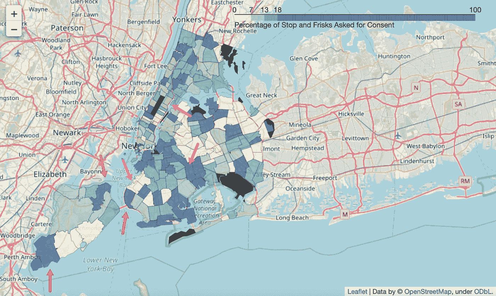*

*图片由作者提供。*

***红色箭头**:这是斯塔滕岛的两个邮政编码，那里的拦截搜身频率相对较低，但询问同意率相对较高。湾脊显示了类似的模式。*

***紫色箭头**:这是日落公园，相对于其频繁的拦截搜身，它的同意率相对较低。东哈莱姆区看起来也显示出这种模式。*

*橙色箭头:这是东纽约，与东哈莱姆区一样，这里的拦截搜身频率相对较高，但这里记录的征得同意率比东哈莱姆区高。*

*我不会进入这张地图上的每个街区，也不会深入研究我的进一步分析，这些都在我的 GitHub 上。然而，通过查看一些地图和数据，我有以下发现。请注意，我将在上下文中互换使用邮政编码和社区名称，但这也不是最准确的。*

# *调查的结果*

***高频停车搜身邮政编码***

## *10029:*

*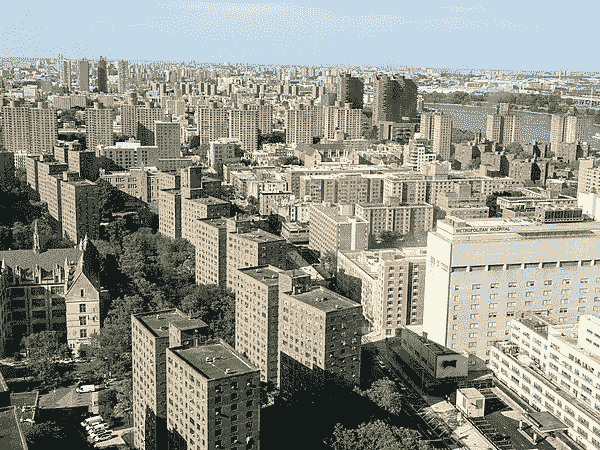*

*图片来自[维基百科](https://en.wikipedia.org/wiki/East_Harlem#/media/File:East_Harlem_Skyline_(48200097101).jpg)。*

*在东哈莱姆区，最常见的拦截搜身邮政编码，据报道 2020 年有 220 人被拦截搜身，征求同意率约为 11%(在第一和第二四分位数之间，因此略低于该数据集的绝对平均值。)*

## *11207:*

*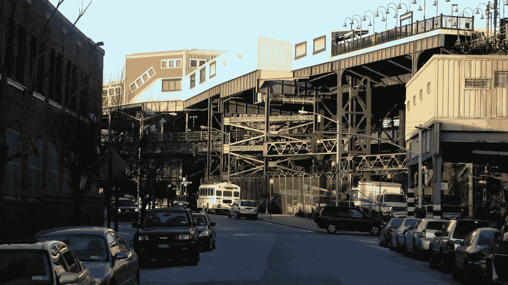*

*图片来自[维基百科](https://en.wikipedia.org/wiki/Broadway_Junction_station#/media/File:Broadway_Junction_from_outside_vc.jpg)。*

*东纽约是第二个最常见的拦截搜身的邮政编码，询问百分比约为 20%(也是最常见的拦截搜身的 75%)。)这与东哈莱姆区 11%的征得同意率大相径庭，因为有 169 人被拦下搜身。*

## *11206:*

*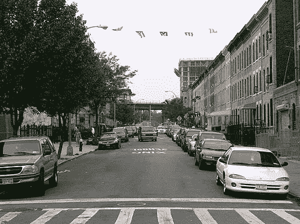*

*图片来自[维基百科](https://commons.wikimedia.org/wiki/File:Almost_bedstuy.jpg)。*

*Bushwick 是第七个最常见的拦截搜身邮政编码，征求同意率约为 25%(也是大多数征求同意邮政编码的 75%)。)这个邮政编码是停车搜身最频繁的邮政编码之一。*

## *11234:*

**

*图片来自[维基百科](https://en.wikipedia.org/wiki/Mill_Basin,_Brooklyn#/media/File:Brooklyn,_Mill_Basin_(28118760587).jpg)。*

*Flatlands/Bergen Beach 是第 14 个最常见的拦截搜身邮政编码，征求同意率约为 23%，而在隔壁的 Canarsie，邮政编码 11236，征求同意率不到一半，约为 10.5%。*

## *11220:*

*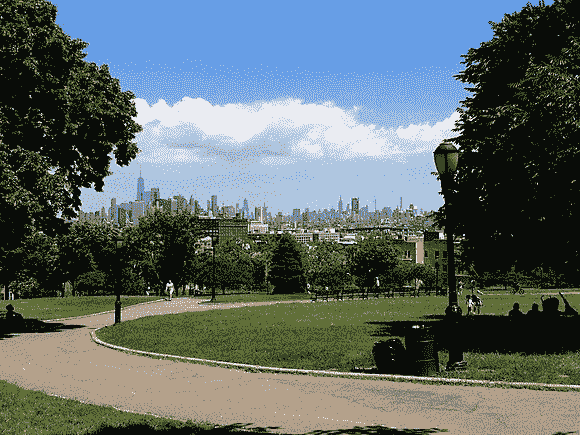*

*图片来自[维基百科](https://en.wikipedia.org/wiki/Sunset_Park,_Brooklyn#/media/File:SunsetPark.jpg)。*

*日落公园(Sunset Park)是第 15 个最常见的拦截搜身邮政编码，是前 25 个最常见的邮政编码中百分比最低的，询问率不到 4%。这是一个非常有趣的案例，因为前 25 个最常见的邮政编码中的所有其他邮政编码的同意询问率至少高出约 3 倍。在前 25 名中，下一个最需要同意的邮政编码是 10002(下东区),需要同意的比例约为 9%。*

***低频问同意邮编:***

## *11232:*

*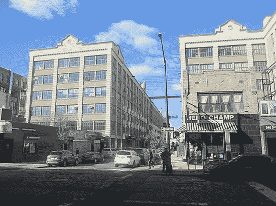*

*图片来自[维基百科](https://en.wikipedia.org/wiki/Industry_City#/media/File:Industry_City_Dec_4,_2018_02.jpg)。*

*这是布什终点站/格林伍德/日落公园。在 2020 年从来不需要征得同意的邮政编码中，这个邮政编码有最高的 40 人被拦截搜身。*

## *11375:*

*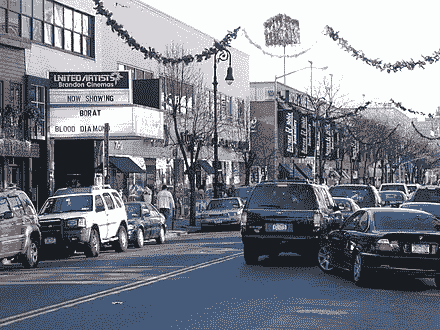*

*图片来自[维基百科](https://en.wikipedia.org/wiki/Industry_City#/media/File:Industry_City_Dec_4,_2018_02.jpg)。*

*福里斯特山的同意询问率也很低，相比之下，它的拦截搜身频率约为 30 人，类似于日落公园。*

## *10306:*

**

*图片来自[维基百科](https://en.wikipedia.org/wiki/Midland_Beach,_Staten_Island#/media/File:Hylan_Bl_Midland_Av_td_(2018-09-19)_10.jpg)。*

*这个邮政编码是在斯塔滕岛，包括米德兰海滩。与隔壁 10309 年的 22 人被拦下搜身相比，这里 31 人被拦下搜身的同意率为 0%。但是当我们试图了解 10309 中有多少人被要求同意时，我们看到接近 20%的人同意。*

## *11210:*

**

*图片来自[维基百科](https://en.wikipedia.org/wiki/Flatlands,_Brooklyn#/media/File:EuropeanBUilding1238a.jpg)。*

*对于 2020 年在这部分平原被拦下搜身的大约 30 个人，**没有人被问及他们是否同意。***

# *总之:*

*我想挑战我的数据科学家同事，让他们具体地将警方数据可视化。我知道这很乱。我知道它很笨重。但是不要害怕空值！相反，要保持对丢失数据的追踪，做一个可视化，一次一列。在你开始理解数据之前，你不需要讲述数据背后的全部故事。让你的问题引导你的过程。用 choropleths 对警方的乱七八糟的数据说是！*

## *参考资料:*

*[1] NYCLU，[白思豪时代的拦截搜身](https://www.nyclu.org/sites/default/files/field_documents/20190314_nyclu_stopfrisk_singles.pdf) (2019)，NYCLU*

*[2] E. Ngo，[埃里克·亚当斯解释了他为什么支持合法使用的“拦截搜身”](https://www.ny1.com/nyc/all-boroughs/news/2021/05/25/eric-adams-explains-why-he-supports-stop-and-frisk--when-it-s-used-legally) (2021)，光谱新闻*

*[3]纽约市议会，[向财政和公共安全委员会报告纽约警察局 2022 财年执行预算](https://council.nyc.gov/budget/wp-content/uploads/sites/54/2021/05/NYPD.pdf) (2021)*

*[4] A. Narishkin，K. Hauwanga，H. Gavin，J. Chou，A. Schmitz，[警察的真正成本，以及为什么 NYPD 的实际价格标签是每年 100 亿美元](https://www.businessinsider.com/the-real-cost-of-police-nypd-actually-10-billion-year-2020-8) (2020)，《商业内幕》*

*[5] NYPD，[拦截、询问和搜身数据](https://www1.nyc.gov/site/nypd/stats/reports-analysis/stopfrisk.page) (2020)*

*[6] J. Adams，[使用 leav 和 GeoPandas 进行地理制图的 Python 教程](https://medium.com/@jade.adams517/using-geopandas-and-folium-to-build-maps-on-python-c51c5aad5f44) (2022)，中等*