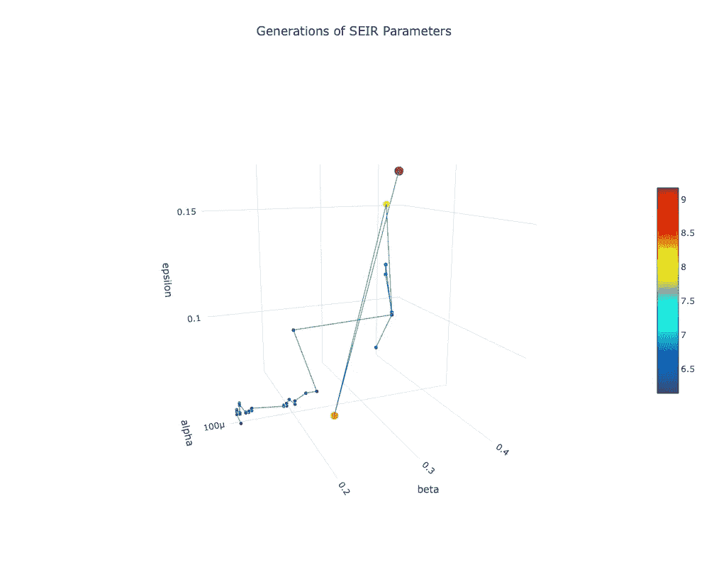
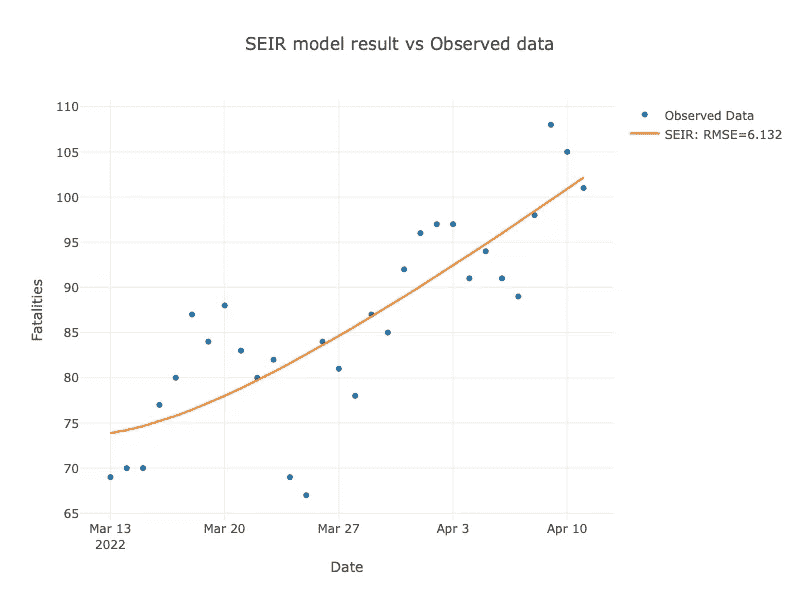
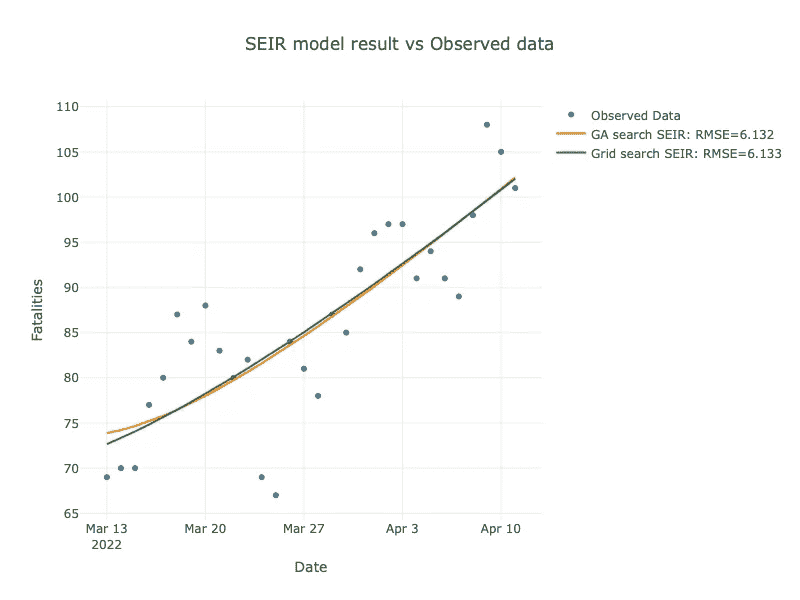
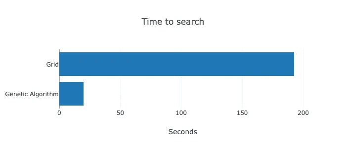
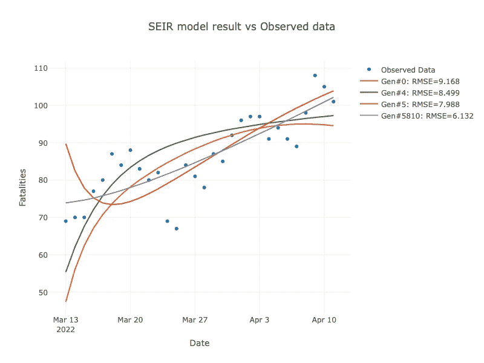
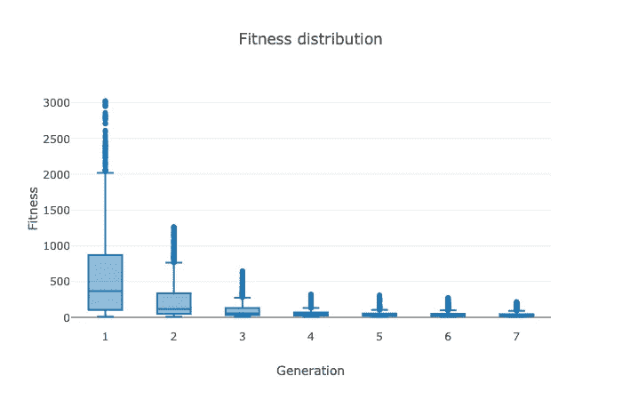
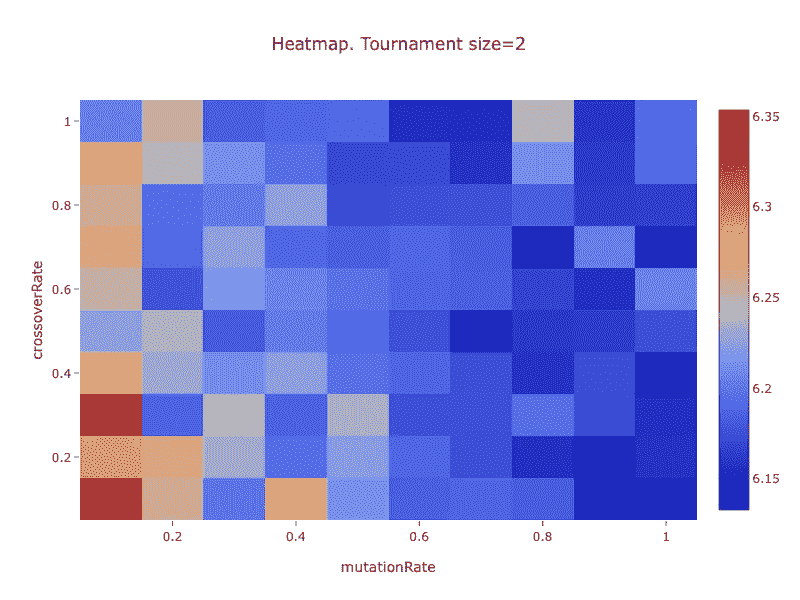
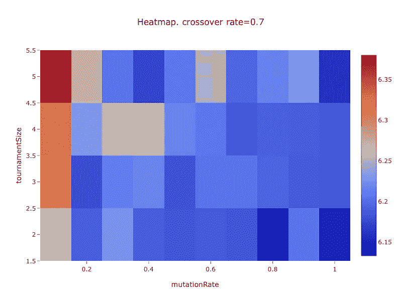

# 利用遗传算法进行新冠肺炎数据分析

> 原文：<https://towardsdatascience.com/using-genetic-algorithm-for-covid-19-data-analysis-b8e05445108f>

遗传算法是用于优化或搜索问题的随机过程。这是一种受自然选择和进化启发的算法。我们将使用遗传算法来寻找新冠肺炎 SEIR 参数。然后，我们将这个结果与网格搜索方法的结果进行比较。

图片作者。该图显示了 SEIR 参数从开始到结束是如何演变的。泰国的新冠肺炎数据是从 2022 年 3 月 13 日到 2022 年 4 月 12 日

有一些遗传算法库可供使用。不过算法比较直观，不太复杂。所以，我们决定从头开始实现这个算法。这样，我们可以添加现有库中没有的功能。

下面描述如何使用遗传算法来搜索新冠肺炎 SEIR 参数。

*   为基因组定义一个接口。
*   实现一个具体的基因组类来描述我们的领域问题。
*   实现一个遗传算法。
*   运行算法。
*   调整算法参数。

# 基因组

基因组代表了我们问题的一个候选解决方案。基因组最初是随机的。然后，它们演变成越来越好的解决方案。在我们的代码中，基因组是一个 Java 接口。下面是代码。

该接口描述了哪些基因组操作必须可用。根据界面，它需要:

*   交叉。两个基因组交配产生两个基因组。孩子们随机地继承了父母双方的特征。
*   变异。单个基因组会随机改变一点点特性。
*   计算适合度，稍后得到值。适应性表达了一个基因组如何适应一个环境。
*   与另一个进行比较，以便算法知道哪个更好。通常，我们通过使用适应值来进行比较。

一个具体的类需要实现上述内容。

# SEIR 基因组

这篇[文章](/forecasting-the-covid-19-trend-using-the-seir-model-90979abb9e64)将向读者介绍使用 SEIR 模型进行新冠肺炎分析。

为了使用遗传算法搜索 SEIR 参数，我们需要将 SEIR 参数建模为基因组。

我们需要搜索以下七个参数来使用 SEIR 模型进行预测:

*   希腊字母的第一个字母
*   贝塔
*   埃普西隆
*   微克
*   初始暴露计数
*   初始感染计数
*   初始恢复计数

前四个是 SEIR 模型参数。最后三个是初始条件。我们可以把这七个看作我们需要寻找的变量。
作为一个基因组，每个参数就是一个基因。在 Java 代码中，我们将每个基因存储在一个字节中。这意味着每个基因有 256 个可能的值。对我们来说应该够了。

## 将每个基因解码为参数值

对于每个参数，我们有一个最小值和一个最大值。下面的代码是将基因值解码为参数值。

以下代码是模型参数的范围。

## 交叉

一般交叉取两个基因组，产生两个基因组。每个孩子继承父母双方的财产。在 SEIR 模型中，交叉从第一个基因组中随机取出一个基因，并与第二个基因组中相同位置的基因交换。
这里是代码。

## 变化

通常，突变会稍微改变基因组的特性。在我们的例子中，它从七个基因中选择一个来改变。然后，它随机选择基因中的一个比特。最后，它翻转了这一点。
这里是代码。

## 适合度计算

适合度代表模型有多好。我们的适应度可以是模型预测和观察值之间的距离。
我们根据 SEIR 模型计算死亡人数。此外，我们还有实际值。然后，我们通过使用均方根误差(RMSE)来计算差异，并将其用作我们的适应度。这是我们需要最小化的值。
这里是代码。

整个班级的代码是[这里是](https://gist.github.com/mananai/cf54c5647c48b2f937d22d1851659f69)。

## 初始人口工厂

我们需要一种方法来创建初始随机群体。由于 SEIR 基因组由 7 个基因组成，该代码为每个基因组创建了一个 7 字节的数组。每个字节都有一个随机值。然后，它从随机基因中实例化一个基因组。这个过程一直重复，直到我们得到了我们需要的基因组数量。这里是工厂代码。

# 遗传算法

## 概观

在高层次上，算法的工作方式如下:

*   它产生一个随机的基因组群体。我们称这一代为零。
*   它计算每个成员的适应度。最佳健身也是确定的。
*   该算法从前一代生成下一代。通常，构建新模型有三个步骤:

1.  它从上一代中选择成员。健康状况越好，每个人成为新一代的机会就越大。
2.  然后，它选择两个成员并执行交叉。
3.  最后每个成员都会变异。

一些算法有一个可选步骤。

*   它从上一代中挑选一些最优秀的成员作为精英成员。
*   当它完成了上述步骤，我们就有了新一代。
*   该算法计算新一代的适应度。最佳健身也是确定的。
*   该算法将继续产生新的一代，直到它达到预定的数目或者最佳适应度足够好。
*   该算法也可以有事件监听器。当新一代可用时，它将调用指定的方法。这将允许我们收集更多的数据用于进一步的分析。

这里是[类](https://gist.github.com/mananai/4f0e2782f4840e2c0251314cec384af5)的链接。

有几个参数需要在算法中指定。它会影响算法行为。

*   群体大小是每个群体中基因组的数量。这一数字在所有世代都不会改变。
*   最大代数是算法将运行的代数。
*   具有相同基因组的最大世代。如果每代的最佳适应度在特定的迭代次数后没有提高，算法将在该次数后停止。
*   交叉率是一个从零到一的数字。这个数字是两个基因组交叉的几率。
*   突变率是一个从零到一的数字。这个数字是基因组变异的概率。
*   锦标赛规模是锦标赛选择过程中随机选择的基因组数量。
*   精英群体的规模是上一代最优秀成员的数量。

## 遗传算法的运行方法

下面是代码。

下面是 run 方法的工作原理:

*   该算法创建特定数量基因组的初始群体。
*   它计算所有基因组的适合度。
*   它对人口进行分类。最佳健身第一。
*   然后，它进入一个循环。每一次循环迭代都会产生新的一代。循环运行特定的次数。
*   该算法从当前群体中构建一个新群体。稍后将详细介绍。
*   它计算新一代的适应度。
*   它将以前的精英基因组添加到新的基因组中。
*   它对新一代进行分类。
*   然后，如果需要，它会进行截断，以确保新的群体具有相同的大小。
*   该算法检查当前最佳适应度是否在一定次数的迭代中保持不变。如果是这种情况，它退出循环。否则，它将继续。
*   该方法返回具有最佳适应性的基因组。

## 构建新种群的遗传算法方法

该方法获取当前人口并返回新人口。下面是代码。

这个方法有三个步骤:

*   它从以前的种群中选择基因组。
*   它通过交叉创建了上一步的基因组列表。
*   它通过突变创建了上一步的基因组列表。

接下来我们将讨论更多的步骤。

## 遗传算法的选择方法

该方法获取一个基因组列表并返回另一个列表。这是用来创造新一代的第一部分。

有几种方法可供选择。在我们的实现中，我们使用锦标赛选择。

下面是代码。

锦标赛选择的工作方式如下:

*   锦标赛规模最初是指定的。数量通常很少，比如两个、三个或四个。
*   该算法将从列表中随机选择指定数量的基因组。体能最好的人获胜。该算法将重复进行，直到获得所有数量的基因组。

## 遗传算法的交叉方法

该方法获取一个基因组列表，并返回另一个基因组列表。这是培养新一代的第二步。

下面是代码。

它是这样工作的:

*   交叉率影响行为。假设利率是 0.6。这意味着总人口的 60%将会交叉。
*   它列举了列表中的所有基因组。
*   进行交叉需要两个相邻的基因组。它会产生两个子基因组。它会将孩子添加到结果列表中。
*   该算法将交叉操作委托给基因组具体类。

# 遗传变异法

该方法获取一个基因组列表，并返回另一个基因组列表。这是培养新一代的第三步。

下面是代码。

它是这样工作的:

*   突变率影响行为。假设利率是 0.8。这意味着 80%的基因组会变异。
*   它列举了列表中的所有基因组。如果一个基因组要突变，算法会将突变委托给具体的基因组类。

# SEIR 参数搜索的遗传算法

我们将 SEIR 参数搜索的遗传算法包装在 ModelParameterGASearch 类中。

该搜索方法将初始参数和观察到的死亡数据作为自变量，并将它们传递给遗传算法。它运行算法并返回模型参数和适应值。下面的代码展示了如何把所有的东西放在一起。

*   前几行代码是遗传算法参数的声明。
*   然后，我们检索在线新冠肺炎数据，并将案例转换成类似表格的结构。
*   我们用案例数据运行算法。获得模型参数和 RMSE 值作为结果。

## 搜索和结果

新冠肺炎数据集介于 2022 年 3 月 13 日和 2022 年 4 月 12 日之间。我们对数据运行了遗传算法。然后，我们将观察到的死亡率和模型死亡率绘制如下。

图片作者。泰国 2022 年 3 月 13 日至 2022 年 4 月 12 日的每日死亡人数观察图和模型结果

从图中，我们可以注意到模型试图尽可能地符合实际数据。此外，RMSE 值足够低。

## 遗传算法搜索和网格搜索

我们对同一个数据集进行了网格搜索。我们绘制了两种方法的观察值和模型死亡率。

图片作者。泰国 2022 年 3 月 13 日至 2022 年 4 月 12 日观察到的每日死亡人数、遗传算法和网格搜索结果的图表

两种方法的模型线几乎相同。RMSE 值也非常接近。
下图显示了两种方法的搜索时间。

图片作者。使用网格搜索和遗传算法搜索 SEIR 参数的时间。

即使模型几乎完全相同，网格法也需要更多的搜索时间。

## 基因组的进化

我们绘制了自第一代以来 SEIR 基因组的变化。每个 SEIR 基因组包含七个参数。我们选择在图表中显示三个。此外，每个基因组的大小和颜色代表了适合度。

图片作者。该图显示了 SEIR 参数从开始到结束是如何演变的。泰国的新冠肺炎数据是从 2022 年 3 月 13 日到 2022 年 4 月 12 日

图表与封面图片相同。

我们可以观察到以下情况:

*   它如何移动没有明确的模式。它随机曲折。
*   前几招很长。越到最后越短。
*   RMSE 在开始的几个动作中下降得很快。后来 RMSE 下降得越来越慢。

我们在同一张图表上绘制了前几代和最后一代的模型。

图片作者。泰国 2022 年 3 月 13 日至 2022 年 4 月 12 日几代人的每日死亡人数观察图和模型结果

我们可以注意到以下情况:

*   初始模型与观察到的数据相差很大。这是因为最初的一个来自随机人群。
*   经过几次迭代后，模型得到了改进，更加接近实际数据。

# 方框图

为了可视化每一代的适应度分布，我们绘制了如下的箱线图:

图片作者。前几代的适合度分布。泰国的新冠肺炎数据是从 2022 年 3 月 13 日到 2022 年 4 月 12 日

图表显示了每一代人的健康分布。为了整理一下，我们只显示前几代。正如我们所料，第一种变化最大。随着进化的进行，变异不断减少。经过几千次迭代之后，我们认为算法收敛了。

## 遗传算法的参数调整

有几个参数可能会影响遗传算法的行为:

*   交叉率
*   突变率
*   锦标赛规模

我们将探讨上述参数的影响。我们将按如下方式改变参数:

*   交叉率将从 0.1 上升到 1.0
*   突变率的范围从 0.1 到 1.0
*   锦标赛规模从 2 人到 5 人不等

我们将根据这些参数运行算法，并观察适应度如何变化。我们将通过使用热图图表来可视化它。

下图显示了不同变异率和交叉率下的适应值。由于我们喜欢低适应值，所以我们更喜欢热图图表中蓝色最深的那个。

图片作者。不同变异率和交叉率下的适应值。

以下是观察结果:

*   最佳适应度值是变异率为 0.8，交叉率为 0.7 时。
*   很明显，当突变率为 0.7 或更高时，它在图表的右半部分工作得更好
*   交叉率如何影响健康还不太清楚。0.4–0.7 的值应该可以。

下图显示了不同变异率和锦标赛规模下的适应值。

图片作者。不同变异率和锦标赛规模下的适应值。

以下是观察结果:

*   最佳适应值是变异率为 0.8，锦标赛规模为 2 时。
*   当锦标赛规模为 2 人时效果最佳。

两个图表的结论是:

*   突变率应该在 0.7 以上。
*   交叉率应该是 0.4 到 0.7
*   锦标赛规模应为两人。

请记住，不同的问题可能会产生不同的结果。

# 结论

我们在本文中讨论了遗传算法。我们已经解释了算法如何工作以及如何实现它。

我们已经使用该算法来搜索最小化均方根误差的 SEIR 参数。其结果与网格搜索法相当。不过，它跑得更快。

我们还讨论了如何选择产生良好结果的算法参数。

尽管我们将遗传算法应用于 SEIR 建模问题，但我们相信，在许多应用中，该算法也能很好地工作。

所有的源代码文件都可以在 GitHub [这里](https://github.com/mananai/repository/tree/master/ForecastCovidTrend)获得。

**引用:**迪伦杰伦。泰国新冠肺炎数据。从 https://github.com/djay/covidthailand[取回](https://github.com/djay/covidthailand)。它是在[知识共享署名 4.0 国际许可](http://creativecommons.org/licenses/by/4.0/)下授权的