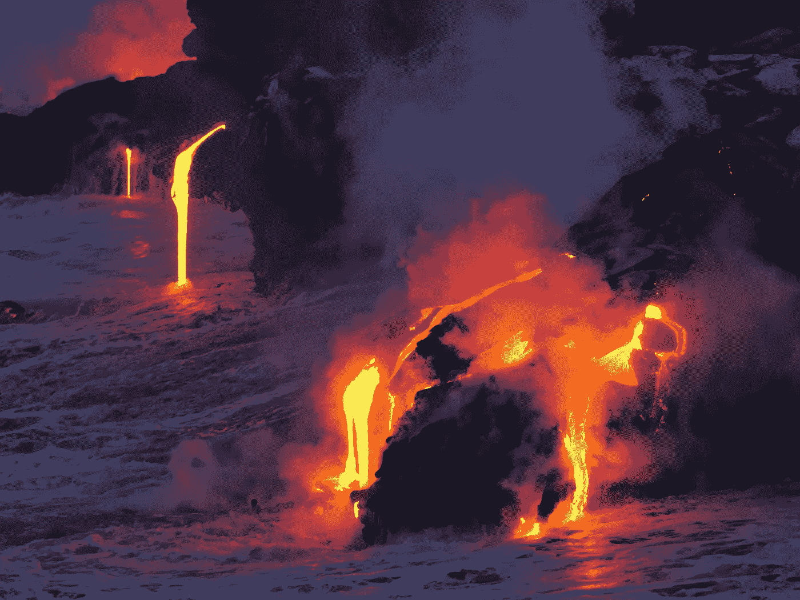
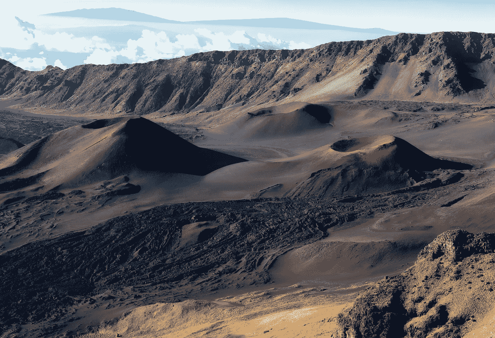
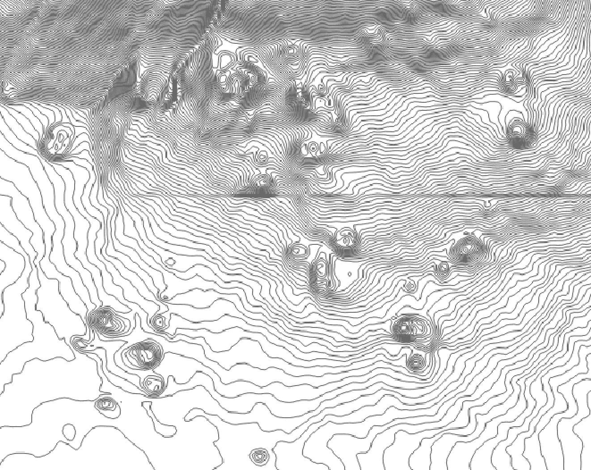
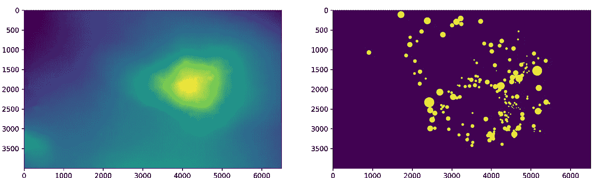
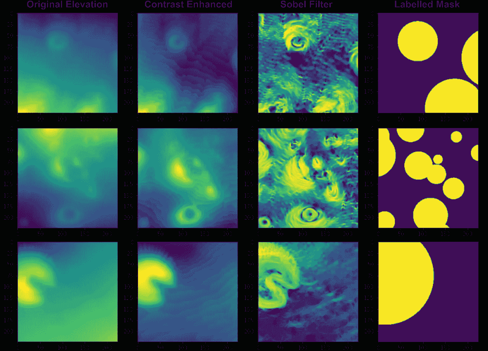
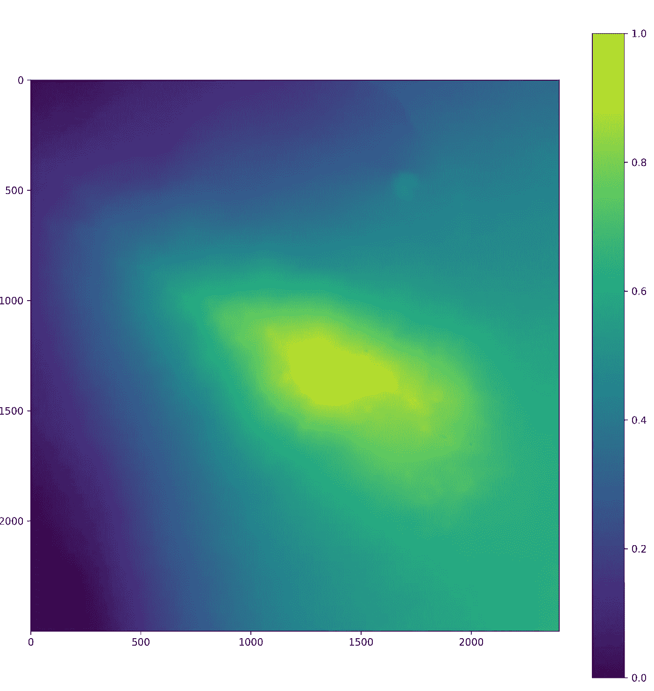
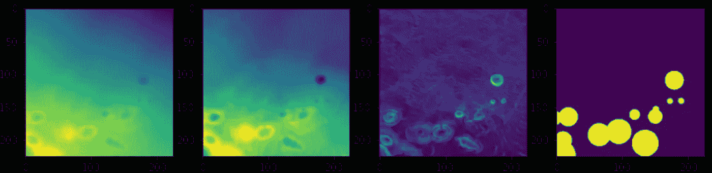
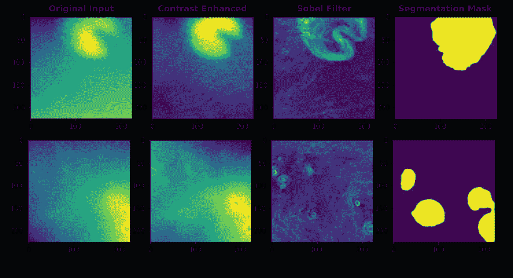
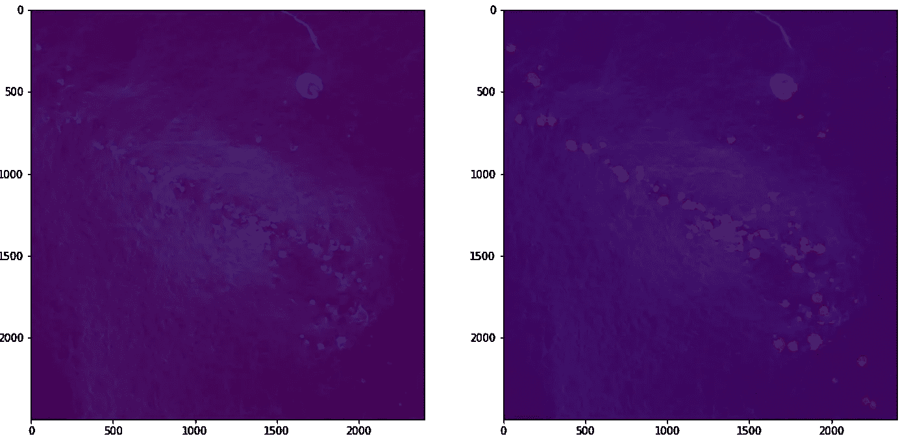

# 使用地理空间数据发现夏威夷的火山

> 原文：<https://towardsdatascience.com/using-geospatial-data-to-discover-volcanoes-in-hawaii-67a15c18fa8f>

## [实践教程](https://towardsdatascience.com/tagged/hands-on-tutorials)

# 使用地理空间数据发现夏威夷的火山

## 使用地形数据和迁移学习的地理空间图像分割



马克·塞格拉特在 [Unsplash](https://unsplash.com/s/photos/volcano-hawaii?utm_source=unsplash&utm_medium=referral&utm_content=creditCopyText) 上的照片

P 语义图像分割的实际例子旨在以像素为基础识别特征，从[无人驾驶汽车](https://smartlabai.medium.com/deep-learning-based-semantic-segmentation-in-simulation-and-real-world-for-autonomous-vehicles-e7fe25cef816)到[在卫星图像中检测船只](/deep-learning-for-ship-detection-and-segmentation-71d223aca649)。但是那些不使用这些传统图像数据集的实际应用呢？

在本文中，我将通过一个语义分割的地理空间示例**，在这里我们将**使用数字高程模型(DEM)数据绘制夏威夷的煤渣锥**。**

**我们将从快速介绍**什么是煤渣锥**，以及如何使用 [QGIS](https://qgis.org/en/site/index.html) 快速**创建一个带标签的数据集**开始。然后，在**用新数据测试我们训练好的模型**之前，我们将经历一些**数据处理**和模型选择/训练。**

# **那么什么是煤渣锥呢？**

**根据美国地质调查局的定义:**

> **“火山渣锥是最简单的火山类型。它们是由从一个单一的喷口喷出的凝结的熔岩颗粒和水滴构成的。…大多数煤渣锥在顶部都有一个碗状的坑……**

**但是一张照片胜过千言万语，所以这里有一些煤渣锥的漂亮照片:**

****

**[杰夫·金](https://unsplash.com/@jeffkingla?utm_source=unsplash&utm_medium=referral&utm_content=creditCopyText)在 [Unsplash](https://unsplash.com/s/photos/volcanic-cone?utm_source=unsplash&utm_medium=referral&utm_content=creditCopyText) 上拍照**

**所以我们现在知道从空间的角度来看我们大概在寻找什么；**侧面陡峭，中间有圆形弹坑的锥形特征。****

****让我们继续看看这在我们的数据集中是什么样子。****

# **数据加载和标记**

**我们将为此使用的数据集是来自夏威夷群岛最大岛屿(由美国地质调查局提供)的 DEM 数据(又名地形数据)，在这里我们可以看到煤渣锥的形态。我们将绘制在休眠火山<https://www.google.ru/maps/place/Mauna+Kea+Ice+Age+Natural+Area+Reserve/@19.8235951,-155.5825901,11.18z/data=!4m13!1m7!3m6!1s0x7bffdb064f79e005:0x4b7782d274cc8628!2sHawaii,+USA!3b1!8m2!3d19.8967662!4d-155.5827818!3m4!1s0x7953bdf95561b15d:0x582987cd20952faf!8m2!3d19.7915039!4d-155.4748835!5m1!1e4>**上发现的火山渣锥，以建立一个模型，该模型将用于绘制附近火山 [**华莱**](https://www.google.ru/maps/place/Hual%C4%81lai/@19.6811034,-155.9165149,12.38z/data=!4m13!1m7!3m6!1s0x7bffdb064f79e005:0x4b7782d274cc8628!2sHawaii,+USA!3b1!8m2!3d19.8967662!4d-155.5827818!3m4!1s0x79540a70234d7c0f:0xdf4d56417549044!8m2!3d19.6890817!4d-155.8646894!5m1!1e4) 上的火山渣锥。****

****QGIS 是处理地理空间应用程序的一个很好的应用程序，将用于标记煤渣锥。加载作为. geotiff 的数据，并将输出更改为 10m 等高线有助于我们可视化煤渣锥( ***提示:寻找紧密间隔的小同心等高线圆*** ):****

********

****莫纳克亚山南翼煤渣锥等高线图(间隔 10 米)。图片作者。****

****基于我们之前定义的空间标准，我们可以看到煤渣锥，所以现在**我们需要映射它们**来创建我们的**标签遮罩**。为了简单起见，我们可以假设煤渣锥是圆形的，因此使用圆形多边形作为标签是可以的，并创建一个圆形的形状文件。我们可以开始加载 DEM geotiff 和 shapefile 标签:****

```
**#Loading a geotiff shapefile
def readimage():
 print(‘reading image…’)
 with rasterio.open(path_image, ‘r’) as ds:
 arr = ds.read()
 arr = np.transpose(arr, (1, 2, 0))
 #Clip negative values to 0 
 arr = arr.clip(0)
 print(arr.shape)
 return arr#Loading the shapefile mask
def readmask(link):
print(‘reading mask…’)
geo = gpd.read_file(link)
with rasterio.open(path_image) as src:
raster = src.read()
geo = geo.to_crs(src.crs)
out_image, out_transform = rasterio.mask.mask(src, geo.geometry, filled=True)
masks = out_image[0,:,:]
#Set the mask labels to 1 and the rest to 0
masks[np.where(masks<=0)] = 0
masks[np.where(masks>0)] = 1
masks = masks.astype(np.int8)
masks = np.expand_dims(masks, axis=2)
return masks**
```

# ****数据预处理****

****我们的 DEM 阵列覆盖了整个岛屿，所以我们需要在 Mauna Kea 周围做一些裁剪，在那里我们有我们的标记遮罩。此外，我们将需要我们的 DEM 阵列，这是 2D，并**把它变成一个三维阵列**与三个通道。我们为什么要这样做？稍后，我们将使用**预训练编码器**构建分割模型，这通常需要 3 通道图像输入(即彩色图像)，因此这确保了兼容性:****

```
**#Crop both the image and masks to the same Mauna Kea area
image = image[ymin:ymax, xmin:xmax,:]
masks = masks[ymin:ymax, xmin:xmax,:]

#Stack the image array and normalise
image = np.dstack((image, image, image))
image = (image — image.min())/(image.max() — image.min())

original_size = image.shape**
```

****这给了我们 **(4000，6500，3)** 的最终形状。完美。让我们一起来看看并想象图像和面具:****

********

****高程数据(左)和带标签的煤渣锥形遮罩(右)的图像。图片作者。****

****既然我们已经知道如何复制同一个图像三次，我们可以通过应用一些滤镜来使这些图像更有用。我们将**增强对比度**，以便煤渣圆锥体与更平坦的环境相比更加突出，并且**添加一个索贝尔滤镜来突出圆锥体的形状:******

```
**#Contrast enhancing
image_eq = exposure.equalize_adapthist(image, clip_limit=0.05)#Sobel filter and normalising
image_sobel = filters.sobel(np.squeeze(image))
image_sobel = (image_sobel — image_sobel.min())/(image_sobel.max() — image_sobel.min())#concatenate standard image, equalised and sobel together
images = np.dstack((image[:,:,0], image_sobel[:,:,0], image_sobel[:,:,0]))**
```

****现在我们已经对这三个通道做了一些额外的使用，我们现在需要**将这个大数组细分为更小的数组，这些数组将被输入到我们的模型中。我们将拆分数组，使输出看起来像这样:******

> ****(样本数量、高度、宽度、通道数量)****

```
**#Making image tiles
size = 224
step = int(size/2)patch_arr = skimage.util.view_as_windows(image, (size, size, layer.shape[2]), step = step)
output = patch_arr.reshape((-1,) + (size, size, layer.shape[2]))**
```

****对输入图像和蒙版都重复这一过程，因此一切都是互补的。最后，留给我们以下输入:****

********

****来自莫纳克亚山 DEM 数据的图像切片和掩膜。图片作者。****

****这里有不少有趣的图片！我们最终的阵形是 **(1938，224，224，3)；**没有太多构建模型的示例来进一步支持使用预训练模型的需求。最后一步是在训练集和验证集之间拆分数据:****

```
**x_train, x_val, y_train, y_val = train_test_split(images, masks, test_size=0.2, shuffle=True, random_state=123)
print(x_train.shape)
print(x_val.shape)
print(y_train.shape)
print(y_val.shape)y_train = tf.cast(y_train, tf.float32)
y_val = tf.cast(y_val, tf.float32)**
```

# ******模型建立和训练******

****现在我们准备建立一个模型！我们将使用 **UNET 模型**，这似乎是分段架构的首选，在 [Keras](https://keras.io/api/applications/) 中提供了预训练的编码器。由于其在 imagenet 数据集上的性能，我选择使用 **InceptionResNetV2** 作为编码器，但是我们可以使用任何预训练的模型。****

```
**input_shape = (size, size, 3)
inception = InceptionResNetV2(include_top = False, weights = 'imagenet', input_tensor = input_shape)inception.summary()
layer_names = [layer.name for layer in model.layers]**
```

****使用我们的输入维度加载预训练的编码器，并获得编码器的层名称列表，这将有助于构建 UNET 的解码器部分，因为我们希望在编码器和解码器之间添加跳过连接。将“include_top”设置为 False 可以确保我们可以构建匹配的解码器。解码器会将编码器的输出恢复到原始输入图像尺寸，以便我们有一个匹配的分段掩码:****

```
**x = Conv2DTranspose(num_filters, (2,2), strides=2, padding=’same’)(inputs)
x = Conv2D(size, 2, padding=’same’, dilation_rate = 1, kernel_initializer = ‘he_normal’)(x)
x = BatchNormalization()(x)
x = Dropout(0.2)(x)
x = Activation(‘LeakyReLU’)(x)**
```

****将这些具有递减滤波器尺寸的块堆叠在一起，将构成我们的解码器，现在是跳过连接。跳过连接可以被添加到激活层，其中输入层大小对应于 **224、112、56 和 28。**根据使用的模型，层大小可能不直接对应这些尺寸，因此可能需要填充，如下例所示:****

```
**skip_connection_2 = inception.get_layer(index = 3).output 
skip_connection_2 = ZeroPadding2D(( (1, 0), (1, 0))  (skip_connection_2)**
```

****在这里，我们看到第四层(指数 3)需要填补，以符合我们想要的形状。****

****这些跳过连接将通过将指定激活层的输出与我们的转置解码器模块相连接来链接编码器和解码器，例如:****

```
**x = Concatenate()([x, skip_connection_2])**
```

****一旦解码器构建完成，我们使用 sigmoid 激活完成具有最终输出层的模型，因为我们的任务是**二进制分割**(即是否为煤渣锥)。****

```
**outputs = Conv2D(1, (1,1), padding=’same’, activation=’sigmoid’)(last_layer)**
```

****在编译模型时，损失函数应考虑类别不平衡，因为煤渣锥的数量相对于背景区域并不高，因此我们可以使用 **Tversky 损失**。这里有很多不同的损失函数[可以使用，这有助于实验不同的损失。我们的度量将是 **Jaccard 相似性系数**，以测量我们的输入遮罩和分割遮罩之间的重叠像素的百分比。](https://www.kaggle.com/bigironsphere/loss-function-library-keras-pytorch)****

```
**model.compile(tf.keras.optimizers.Adam(5e-5), 
loss= tversky_loss, metrics=[jaccard_coefficient],)reduce_lr = ReduceLROnPlateau(monitor=’loss’, factor=0.2, patience=15, verbose=1, mode=’max’, min_lr=1e-6)
early = tf.keras.callbacks.EarlyStopping(monitor=’val_loss’, patience=10)history = model.fit(x_train, y_train, epochs=100, batch_size = 32, validation_data = (x_val,y_val), callbacks = [reduce_lr, early])**
```

****在 100 个时期的训练期间使用低学习率 1e-5 和 ReduceLROnPlateau 允许模型实现仅超过 80%的验证 IoU，这并不太坏。也许这可以进一步改善更定制的标签策略(即。没有将标签简化为圆圈)或不同的编码器模型。也可以尝试冻结不同的编码器层。****

# ****在另一座火山测试模型****

****移动到 Hualālai 火山，在那里我们将看到我们的分割模型如何识别煤渣锥。让我们来看看这座新火山:****

********

****Hualālai 火山的归一化 DEM。图片作者。****

****我们需要像处理 Mauna Kea 输入一样应用所有相同的预处理步骤，以便一切都与我们的模型兼容。在裁剪了这个区域，应用了滤镜，并把数组分成一个个小块之后，我们得到了一个(420，224，224，3)的形状。值得一提的是**我们在平铺图像**时不需要一个步骤，因为我们对增加样本的大小不感兴趣。****

****让我们快速看一下之前的输入图块示例:****

********

****来自 Hualālai DEM 数据的图像图块和遮罩。图片作者。****

****使用我们的模型进行预测后:****

```
**y_pred = model.predict(tiled_Hualalai_image)**
```

****在**重新组合图像拼贴**以形成与原始图像尺寸相同的分割蒙版之前，我们可以快速浏览一些分割的拼贴:****

********

****具有输入图像块的预测分割掩模。图片作者。****

****预测似乎还可以，但看起来模型很难分割小煤渣锥，这可能是由于我们在莫纳克亚山训练集中的煤渣锥的大小(通常更大)。****

****我们现在可以查看叠加在原始输入图像上的分割图像。为了使煤渣锥更容易被发现，我们将在 sobel 过滤器图像上覆盖预测的分割蒙版(*煤渣锥显示为小点/环*):****

********

****带 sobel 滤波器的 DEM 数据(左)与叠加分段掩膜(右)相结合。图片作者。****

****从整体上看，这幅图像看起来要好得多:****

> ****遮罩的位置大致与火山沿线的火山渣锥的西北-东南方向相匹配；****
> 
> ****各种尺寸的煤渣锥体被分段(即不仅仅是大的)；****
> 
> ****每个煤渣锥体的形状与分段遮罩的形状大致匹配。****

# ****摘要****

****总的来说，我们已经完成了一个**使用图像分割**和地理空间数据集来识别夏威夷煤渣锥的新颖例子。由于我们可以从 DEM 输入数据中将分割蒙版转换回原始坐标，因此我们现在有能力**将分割蒙版转换成真实数据集**以供进一步分析(**，即煤渣锥大小的分布情况如何？煤渣锥的密度如何变化？**)。****

****感谢阅读！****

*****【1】美国地质调查局，2013，USGS 13 弧秒 n20w156 1 x 1 度:美国地质调查局。数据来自美国地质调查局，国家地理空间计划。来自国家地图的数据是免费的，并且在公共领域。*****