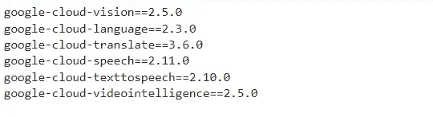

# 在 python 中以编程方式使用 Google Cloud 机器学习 APIs 第 1 部分

> 原文：<https://towardsdatascience.com/using-google-cloud-machine-learning-apis-programmatically-in-python-part-1-430f608af6a5>

照片由[米切尔罗](https://unsplash.com/@mitchel3uo?utm_source=unsplash&utm_medium=referral&utm_content=creditCopyText)在 [Unsplash](https://unsplash.com/s/photos/google-logo?utm_source=unsplash&utm_medium=referral&utm_content=creditCopyText)

# 介绍

从零开始开发机器学习系统并不是一件容易的事情。这非常耗费时间和资源。端到端机器学习系统的开发包括各种不同的阶段，例如:

1.  问题理解
2.  数据提取
3.  数据清理
4.  数据标记
5.  特征选择
6.  模型选择、训练和超参数调整
7.  测试
8.  部署和维护

所有这些阶段都有其自身的复杂性。google cloud 等云提供商提供的各种完全托管的服务大大降低了上述任务的难度。但是在生产中开发、部署和维护一个成熟的端到端 ml 管道仍然不容易。企业通常只为定制用例这样做。对于一般的用例，使用已经可用的机器学习 API 更有意义，也节省了时间和资源。

Google Cloud 提供了高度精确、完全托管的 API，可以解决大多数常见的机器学习问题。这些都非常容易使用。只需调用它们的端点，我们就可以获得高度准确的结果。只需接受输入，以可接受的格式创建一个请求，并将其发送到一个端点，我们就会得到作为响应的结果。无需担心数据处理、模型实验、部署问题或再培训问题。这些 API 也在大型数据集上进行训练，结果比我们自己构建和训练定制模型要准确得多。

# 谷歌云 ML APIs

以下是我试验过的机器学习 API 列表:

*   视觉 API
*   语音转文本 API
*   文本到语音 API
*   自然语言 API
*   视频智能 API
*   翻译 API

*在文章的这一部分(第 1 部分)，我将解释如何在 python 中使用上面列表中的前 3 个 API(视觉、语音到文本和文本到语音)。其余三个将在下一部分(第 2 部分)中讨论。*

# 先决条件

*   创建一个谷歌云人工智能笔记本实例。如果不知道如何做，请遵循这里给出的步骤。不需要创建一个非常强大的实例。“n1-标准-2”实例就可以了。
*   在笔记本实例中通过 pip 安装以下 python 包

作者图片

*   通过在 google Cloud shell 实例中运行下面给出的命令，创建一个 Google 云服务帐户及其相关密钥。最后一个命令创建了一个 key.json。从 notebook 实例访问 API 需要这个 JSON 文件。

*   API 在使用前需要启用。可以从谷歌云的 API 库[这里](https://console.cloud.google.com/apis/library?project=text-analysis-323506)启用 API

## **注**

*在 Medium 中，笔记本上的小部件无法在手机这样的小屏幕上正常显示。它们只有在笔记本电脑这样的大屏幕上才能正常显示。*

# **1。视觉 API**

Vision API 具有解决大多数常见图像处理问题的功能。继续之前，启用[云视觉 API](https://console.cloud.google.com/apis/library/vision.googleapis.com) 。

我试验过的 Vision API 特性列表:

*   **文本检测**

此功能使用 OCR 从输入图像中检测所有类型的文本。一个例子:

*   **标签检测**

该特征标记输入图像。它主要检测并返回在查询图像中找到的所有内容的列表。一个例子:

*   **人脸检测**

此功能检测查询图像中的所有人脸。返回检测到的面部的边界框的坐标以及每个检测到的面部的情感。还会返回面部标志注释。一个例子:

*   **地标检测**

该特征检测查询图像中的位置。在下面的例子中，我给出了纽约时代广场的图片。并且地标检测端点能够正确地检测到它。

*   **标志检测**

此功能可检测查询图像中的流行徽标。一个例子:

*   **网页检测**

此功能通过互联网检索图像，这些图像与所查询的图像相似(完全、部分或视觉上)。(基于内容的图像检索)。一个例子:

# **2。**语音转文本 API

顾名思义，Google Cloud 语音转文本 API 用于语音转录。API 需要在使用前在这里启用[。](https://console.cloud.google.com/marketplace/product/google/speech.googleapis.com)

在这个例子中，我自己创建了一个演讲录音并使用了它。这里有[这里有](https://github.com/Subrahmanyajoshi/Google-Cloud-Machine-Learning-APIs/tree/main/cloud-speech-api/data)。

# 3.文本到语音 API

这个 API 用于文本到语音的转换。API 需要在使用前在这里启用[。](https://console.cloud.google.com/marketplace/product/google/texttospeech.googleapis.com)

在将文本转换为语音时，这个 API 提供了许多不同的语音配置。男声和女声都有多种口音可供选择。

剩下的三个 API(自然语言、视频智能和翻译 API)将在本文的下一部分解释。

**更新:**

文章的第二部分也是最后一部分现已发表。请在下面找到它

 [## 用 python 编程使用 Google Cloud 机器学习 APIs 第 2 部分

### 了解如何在 python 中以编程方式使用 Google Cloud 的高度精确的机器学习 API。

medium.com](https://medium.com/@subrahmanyajoshi123/using-google-cloud-machine-learning-apis-programmatically-in-python-part-2-8867d272edf0) 

**更新二:**

非常感谢 Chema Bescós 将整篇文章(两部分)翻译成西班牙语，以帮助西班牙读者。点击查看[。](https://www.ibidem-translations.com/edu/api-machine-learning-google-cloud-python/)

谢谢