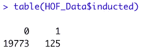
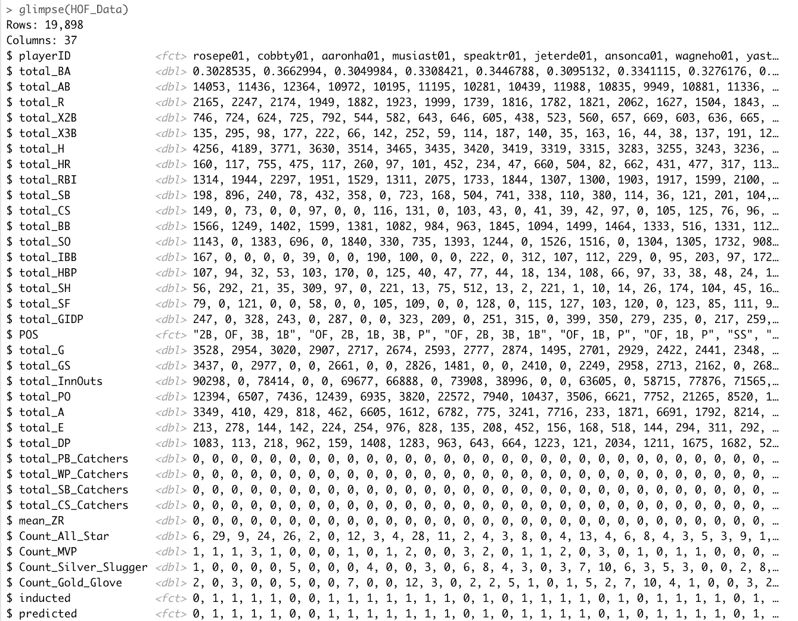
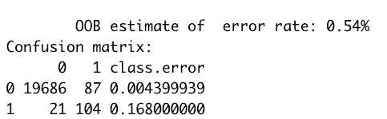
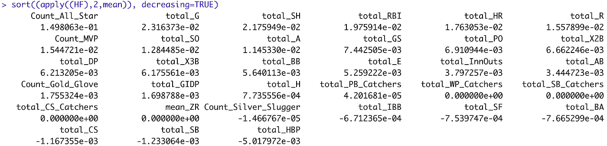
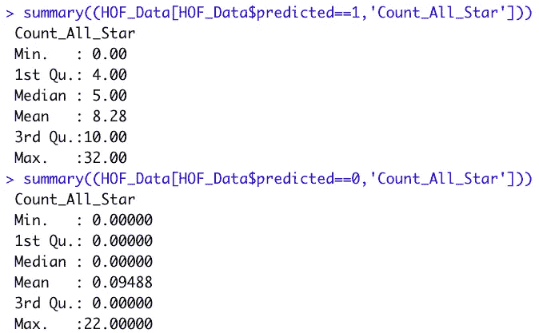
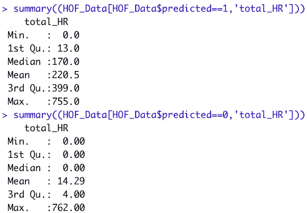
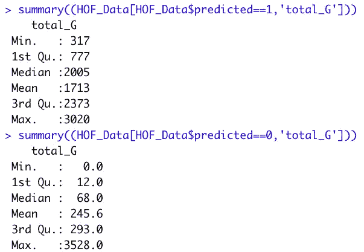

# 使用随机森林帮助解释为什么 MLB 球员进入名人堂

> 原文：<https://towardsdatascience.com/using-local-importance-scores-from-random-forests-to-help-explain-why-mlb-players-make-the-hall-of-aa1d42649db2>

## 如何使用局部重要性分数来获得类别整体变量重要性，以帮助理解原因。


凯特琳·康纳在 [Unsplash](https://unsplash.com/?utm_source=medium&utm_medium=referral) 上的照片

# 介绍

去年秋天，我写了一篇文章，标题是: [Rfviz:一个用于解释 R](/rfviz-an-interactive-visualization-package-for-random-forests-in-r-8fb71709c8bf?source=your_stories_page----------------------------------------) 中随机森林的交互式可视化包。那篇文章是 r 中可视化工具的教程，我想给出一个不使用可视化工具获得相同类型结果的选项。因此，本文是一个关于使用 r 中的 randomForest 库中的局部重要性分数的编码示例，我们将使用它来识别类级别上的整体变量重要性。使用这种方法，我们将探索为什么一些 MLB 球员进入名人堂，而许多人却没能进入名人堂。

# 理论背景

## 随机森林

随机森林(Breiman (2001))使许多树木(通常 500 或更多)适合回归或分类数据。每棵树都适合数据的引导样本，因此一些观察值不包括在每棵树的拟合中(这些被称为树的*外*观察值)。在每棵树的每个节点上独立地随机选择相对少量的预测变量(称为 *mtry* ),这些变量用于寻找最佳分割。树长得很深，没有修剪。为了预测一个新的观察值，观察值被传递到所有的树上，预测值被平均(回归)或投票(分类)。

## 可变重要性

对于每个变量，为数据集中的每个观察值获得局部重要性分数。为了获得观察值 *i* 和变量 *j* 的局部重要性分数，对观察值 *i* 超出范围的每棵树随机排列变量 *j* ，并将变量 *j* 排列数据的误差与实际误差进行比较。观察值 *i* 超出范围的所有树的平均误差差是其局部重要性分数。

变量 *j* 的(总体)变量重要性分数是所有观测值的局部重要性分数的平均值。

# 例子

我们这里的数据是美国职业棒球大联盟的统计数据。我们将试图解释的问题是，为什么一些 MLB 球员进入名人堂，而许多人却没有进入名人堂。

我们将使用击球和防守统计数据以及这些球员的季末奖励。在这个例子中，我们忽略了投手统计和投手的季末奖。使用 R 中的随机森林，我们将在类的基础上发现整体变量的重要性，以及我们如何使用结果来帮助回答这个问题。

此示例使用来自 R 包 Lahman 的数据，这是一个棒球统计数据集，包含 1871 年至 2019 年(Lahman 2020 年)美国职业棒球大联盟的投球、击球、防守和奖项统计数据。它是在[知识共享署名-共享 3.0 无版权许可下授权的。](http://creativecommons.org/licenses/by-sa/3.0/)

关于我们用来聚合和创建数据集的变量定义的参考，请参见此链接:【http://www.seanlahman.com/files/database/readme2017.txt

## **资料准备和勘探**

```
library('Lahman')
library(randomForest)
library(dplyr)#Get the list of players inducted into the Hall of Fame
HallOfFamers <-
  HallOfFame %>%
  group_by(playerID) %>%
  filter((votedBy=="BBWAA" | votedBy=="Special Election") 
         & category == "Player") %>%
  summarise(inducted = sum(inducted == "Y")) %>% 
  ungroup()#Batting Statistics
Batting_Stats <-
  Batting %>%
  group_by(playerID) %>%
  mutate(total_BA=sum(H)/sum(AB),
            total_AB=sum(AB), total_R=sum(R),
            total_X2B=sum(X2B),total_X3B=sum(X3B), 
            total_H = sum(H), total_HR = sum(HR),
            total_RBI=sum(RBI), total_SB=sum(SB), total_CS=sum(CS),
            total_BB=sum(BB), total_SO=sum(SO), 
            total_IBB=sum(IBB), total_HBP=sum(HBP),
            total_SH=sum(SH), total_SF=sum(SF),
            total_GIDP=sum(GIDP)) %>%
  select(playerID, total_BA, total_AB, total_R, total_X2B, total_X3B, total_H, total_HR,
         total_RBI, total_SB, total_CS, total_BB, total_SO, total_IBB, total_HBP, total_SH,
         total_SF, total_GIDP) %>% 
  group_by_all() %>% 
  summarise() %>% 
  arrange(desc(total_H)) %>% 
  ungroup()#Fielding Statistics
Fielding_Stats <- 
  Fielding %>% group_by(playerID) %>% 
  mutate(POS=toString(unique(POS)), total_G=sum(G), total_GS=sum(GS), total_InnOuts=sum(InnOuts),
            total_PO=sum(PO), total_A=sum(A), total_E=sum(E), total_DP=sum(DP), total_PB_Catchers=sum(PB),
            total_WP_Catchers=sum(WP), total_SB_Catchers=sum(SB), total_CS_Catchers=sum(CS), mean_ZR=mean(ZR)) %>% 
  select(playerID, POS, total_G, total_GS, total_InnOuts, total_PO, total_A, total_E, total_DP,
         total_PB_Catchers, total_WP_Catchers, total_SB_Catchers, total_CS_Catchers, mean_ZR) %>% 
  group_by_all() %>% 
  summarise() %>% 
  arrange(desc(total_G)) %>% 
  ungroup()#End of Season Awards
Season_Awards <-
  AwardsPlayers %>%
  group_by(playerID) %>%
  mutate(Count_All_Star=sum(awardID=='Baseball Magazine All-Star' | awardID=='TSN All-Star'), Count_MVP = sum(awardID == "Most Valuable Player"), 
         Count_Silver_Slugger = sum(awardID == "Silver Slugger"), Count_Gold_Glove = sum(awardID == "Gold Glove")) %>% 
  select(playerID, Count_All_Star, Count_MVP, Count_Silver_Slugger, Count_Gold_Glove) %>% 
  group_by_all() %>% 
  summarise() %>% 
  ungroup()#Joining the datasets together
HOF_Data <- Batting_Stats %>% 
  full_join(Fielding_Stats, by=c('playerID')) %>% 
  left_join(Season_Awards, by='playerID') %>% 
  left_join(HallOfFamers, by='playerID')  %>%  
  #Filling in NA's based on data type
  mutate_if(is.integer, ~replace(., is.na(.), 0)) %>% 
  mutate_if(is.numeric, ~replace(., is.na(.), 0)) %>% 
  mutate_if(is.character, ~replace(., is.na(.), 'xx')) %>% 
  mutate_if(is.character, as.factor) #Converting characters to factors in preparation for Random Forests#Double checking filling in NA's and converting the response variable to a factor. 
HOF_Data[is.na(HOF_Data)] <- 0
HOF_Data$inducted <- as.factor(HOF_Data$inducted)#Looking at the spread of inducted vs. not to the Hall of Fame
table(HOF_Data$inducted)
```

下面的结果显示，我们的数据集有 19，773 名球员没有入选名人堂，125 名球员入选了名人堂:



浏览一下数据，我们可以直观地看到数据和类类型的结构:



## **模型输出**

```
#For purposes of exploratory analysis, we will not be splitting into training and test.#Quick trick for getting all variables separated by a '+' for the formula. (We just omit the response variable and any others we don't want before copying as pasting the output) 
paste(names(HOF_Data), collapse='+')rf <- randomForest(inducted~total_BA+total_AB+total_R+total_X2B+total_X3B+
        total_H+total_HR+total_RBI+total_SB+total_CS+total_BB+
        total_SO+total_IBB+total_HBP+total_SH+total_SF+total_GIDP+
        total_G+total_GS+total_InnOuts+total_PO+total_A+total_E+
        total_DP+total_PB_Catchers+total_WP_Catchers+
        total_SB_Catchers+total_CS_Catchers+mean_ZR+Count_All_Star+
        Count_MVP+Count_Silver_Slugger+Count_Gold_Glove,
                   data=HOF_Data, 
                   localImp=TRUE, cutoff=c(.8,.2))
rf
```



看起来该模型在两个类之间体面地分离了训练数据，即使没有优化截止和仅仅猜测。

## **类别整体变量重要性**

接下来，让我们看看当地的重要性分数是什么，对那些进入名人堂的人来说是最重要的。

```
#Rather than using the model for predictions I am using it to see how the trees separated the data. This way it is more of an unsupervised learning problem. Because of this I am okay predicting on the data set I used to train the model.HOF_Data$predicted <- predict(rf, HOF_Data)#Looking at the class-wise variable importance for those who were classified as making the Hall of Fame.
HF <- data.frame(t(rf$localImportance[,which(HOF_Data$predicted==1)]))sort((apply((HF),2,mean)), decreasing=TRUE)
```



“sort((apply((HF)，2，mean))，decreasing=TRUE)”的作用是计算第 1 类或那些被模型归类为进入名人堂的球员的整体变量重要性。这是因为我们在前面的编码步骤中为该类设置了子集。现在我们在类的层面上有了整体的变量重要性。

现在让我们看看对面的类

```
#Looking at the class-wise variable importance for those who were classified as not making the Hall of Fame.
NHF <- data.frame(t(rf$localImportance[,which(HOF_Data$predicted==0)]))sort((apply((NHF),2,mean)), decreasing=TRUE)
```


我们可以看到，就对该类预测最重要的因素而言，这些类具有不同的变量。但是这些区别是什么呢？让我们深入了解一下那些被归类到名人堂的人。

## **回答为什么**

根据随机森林的当地重要分数，被归类为击球手/外野手名人堂的前 5 个特征是:

1.  Count_All_Star(一名球员被评为全明星的次数)
2.  total_G(一个玩家总共玩了多少场游戏)
3.  total_SH(玩家命中多少次总牺牲命中)
4.  total_RBI(一名球员总共击出多少分)
5.  total_HR(一名球员总共击出多少支全垒打)

让我们取其中的三个，Count_All_Star，total_HR 和 total_G，比较两个类之间的数据:

```
summary((HOF_Data[HOF_Data$predicted==1,'Count_All_Star']))
summary((HOF_Data[HOF_Data$predicted==0,'Count_All_Star']))
```



```
summary((HOF_Data[HOF_Data$predicted==1,’total_HR’]))
summary((HOF_Data[HOF_Data$predicted==0,’total_HR’]))
```



```
summary((HOF_Data[HOF_Data$predicted==1,’total_G’]))
summary((HOF_Data[HOF_Data$predicted==0,’total_G’]))
```



我们可以看到，随机森林的本地重要性分数表明，更多年被命名为全明星，更多的本垒打，更多的比赛是被归类为击球手/外野手名人堂的前 5 个最重要变量中的 3 个。通过使用这种方法，我们可以很快地看到实际的数据分布和类之间的差异。

注意:看看那些明显的离群值，这位打了 3528 场比赛的球员是查理·格里奇，他实际上进入了名人堂。他是一个错误的分类。打出 762 支全垒打而未被列入名人堂的球员是巴里·邦兹，一个众所周知的类固醇使用者。玩了 3528 场游戏并被归类为未进入大厅的玩家是皮特·罗斯，他因在游戏上下注而被关在门外。具有讽刺意味的是，后两者没有入选名人堂，兰登森林将他们归类为没有入选。

## **结论**

总之，对棒球有中等水平了解的人可能知道，加入 500 支全垒打俱乐部并 10 次入选全明星会让你有机会进入名人堂。但是，并不能保证。这似乎是事实，因为没有[明确的规则来制作名人堂](https://www.forbes.com/sites/berniepleskoff/2020/01/21/what-are-the-standards-for-election-to-the-national-baseball-hall-of-fame/?sh=17c57173149e)。另一方面，如果一个人没有职业棒球大联盟的知识呢？或者他们正在运行的模型的主题？嗯，使用局部重要性分数和 R 中随机森林的类整体变量重要性，他们可以帮助解释为什么他们的分类问题。

**参考文献:**

布雷曼，2001 年。“随机森林。”*机器学习*。[http://www.springerlink.com/index/u0p06167n6173512.pdf](http://www.springerlink.com/index/u0p06167n6173512.pdf)。

布雷曼，我，和一个卡特勒。2004.*随机森林*。[https://www . stat . Berkeley . edu/~ brei man/random forests/cc _ graphics . htm](https://www.stat.berkeley.edu/~breiman/RandomForests/cc_graphics.htm)。

C Beckett，*Rfviz:R 中随机森林的交互式可视化包*，2018，[https://chrisbeckett8.github.io/Rfviz.](https://chrisbeckett8.github.io/Rfviz.)

拉赫曼，S. (2020)拉赫曼棒球数据库，1871–2019，主页，[http://www.seanlahman.com/baseball-archive/statistics/](http://www.seanlahman.com/baseball-archive/statistics/)

普莱斯科夫，伯尼。"入选国家棒球名人堂的标准是什么？"*福布斯*，福布斯杂志，2020 年 1 月 22 日，[https://www . Forbes . com/sites/berniepleskoff/2020/01/21/入选国家棒球名人堂的标准是什么/？sh=17c57173149e。](https://www.forbes.com/sites/berniepleskoff/2020/01/21/what-are-the-standards-for-election-to-the-national-baseball-hall-of-fame/?sh=17c57173149e.)