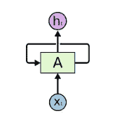
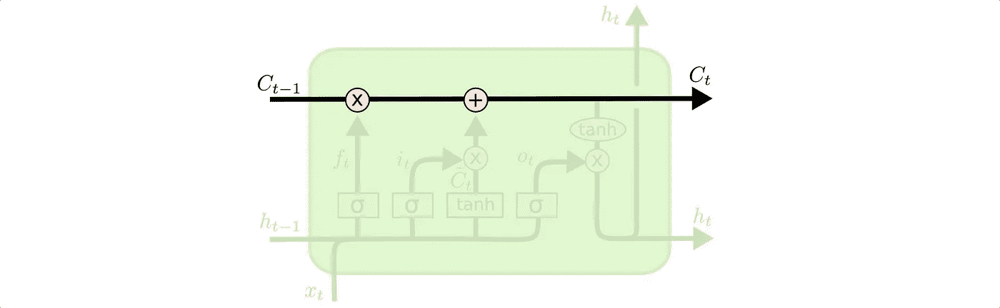
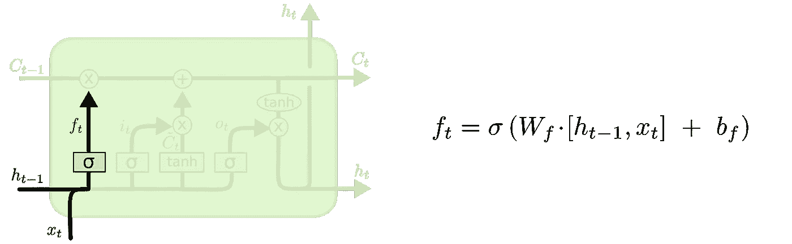
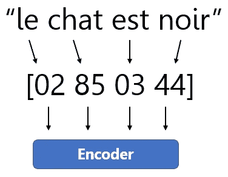
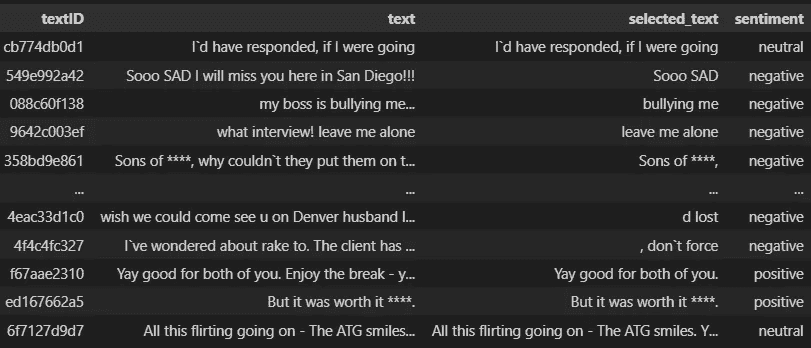
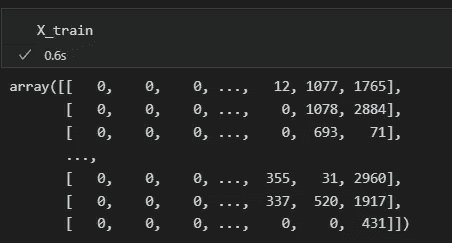
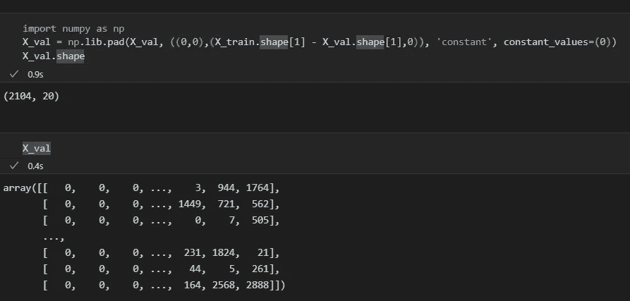
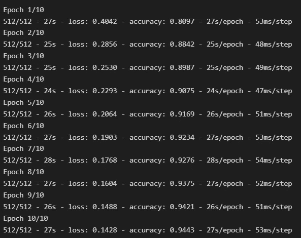
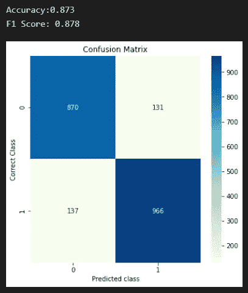

# 使用 LSTM 的推特情感分析

> 原文：<https://towardsdatascience.com/using-lstm-in-twitter-sentiment-analysis-a5d9013b523b>

## 详细了解 LSTM 应用于情感分析的能力


尼古拉·伯恩森在 [Unsplash](https://unsplash.com?utm_source=medium&utm_medium=referral) 上拍摄的照片

当你坐上汽车的驾驶座时，你是能够发动引擎开车离开，还是在开车离开之前，你需要考虑你将如何做以及这个过程的每一步？对于大多数人来说，这是第一选择。

这也是递归神经网络(RNNs)的工作方式。你不需要从头开始考虑你一天中要做的每一个基本任务，因为我们有一个叫做记忆的小东西，循环神经网络也是如此。但是他们是如何学习和储存这些记忆的呢？



rnn 有环路，允许它们从信息中学习。来源:https://colah.github.io/posts/2015-08-Understanding-LSTMs/

在上图中，神经网络的一个单元接收某种类型的输入 *Xt* 并输出一个值 *Ht。*然后，循环将信息提供给下一个单元格，依此类推。因此，rnn 可以被认为是同一个网络的副本，每个都向下一个传递信息。当我们看一个完整的链时，就更容易理解了，它是上图中展开的环:


展开的递归神经网络的完整链。来源:[https://colah.github.io/posts/2015-08-Understanding-LSTMs/](https://colah.github.io/posts/2015-08-Understanding-LSTMs/)

在过去的几年中，RNNs 已经被成功地应用于多种自然语言处理项目中。这些应用包括语音识别、语言建模、翻译，当然还有我们将在本文中探讨的情感分析。如果没有一种特殊的 RNN，这一切都是不可能的，那就是 LSTM(长短期记忆)。出于许多目的，LSTMs 比传统的递归网络工作得更好，这里我们将展示如何以及为什么。但首先，我们需要谈谈为什么我们不能只使用正常的 RNNs，它有什么问题。

rnn 令人兴奋的一点是，它们可以在预测中使用过去的信息。考虑一个试图根据前面的单词来预测一个句子的最后一个单词的模型。在句子“书在*桌子*上”中，最后一个单词的选择范围很窄，而“*桌子*将是一个很好的预测，不需要太多额外的上下文就可以正确预测。在相关单词与预测之间的距离很小的情况下，RNNs 可以很好地预测。然而，如果我们需要更多的上下文来进行单词预测，会发生什么呢？

想想这个句子“这几天我一直在学习，在桌子上，有一本书”。最近的信息表明，桌子上有一些物体，但如果我们想缩小到哪个物体，我们应该进一步回到句子。然后，如果我们在第一句话中查看单词“*学习*，我们将获得预测正确所需的额外上下文。由于句子以“*我一直在学习*”开头，所以桌子上不太可能有足球或伏特加酒瓶，而不是一支笔或一本书。这正是为什么 LSTM 模型现在被广泛使用，因为它们被特别设计成具有长期“记忆”，能够比受长期依赖问题影响的其他神经网络更好地理解整体背景。

理解 LSTM 如何工作的关键是细胞状态。细胞状态通过一些微小的线性相互作用来运行整个链，在这些相互作用中，LSTM 可以通过称为门的结构来添加或删除信息。有两个门:一个 sigmoid 神经网络层和一个逐点乘法操作。



单元格状态是穿过顶部的粗体线条。来源:[https://colah.github.io/posts/2015-08-Understanding-LSTMs/](https://colah.github.io/posts/2015-08-Understanding-LSTMs/)

盖茨负责选择哪些信息将通过。例如，sigmoid 层将 sigmoid 函数应用于原始向量，并输出 0 和 1 之间的值。那是什么意思？零值将阻挡所有信息，而值 1 将让所有信息通过第一门并在单元状态流中继续。



“忘记”栅极层将 sigmoid 函数应用于单元状态。来源:[https://colah.github.io/posts/2015-08-Understanding-LSTMs/](https://colah.github.io/posts/2015-08-Understanding-LSTMs/)

我们已经说过，LSTM 的第一个决定来自 sigmoid 层门，我们也可以称之为“忘记”门。该层查看两个输入: *Xt，*带有矢量化文本，我们希望预测情感(借助于标记器，如下图所示)，以及 *Ht-1* 带有模型已经拥有的先前信息。然后，应用 sigmoid 函数，并且它为每个单元状态 *Ct-1 输出 0 和 1 之间的数字。*



Tokenizer:这就是如何将原始文本矢量化为 LSTM 模型的输入。每个字相当于编码器定义的一个数字。来源:作者

在本文中，我们不会详细介绍其他 LSTM 层，因为重点是展示如何将其应用于 Twitter 情感分析，但该算法的演练在这里[详细解释](https://colah.github.io/posts/2015-08-Understanding-LSTMs/)。既然我们已经谈论了很多 LSTM 理论，让我们编码并展示如何使用它来预测推文的情绪。

最初，我们需要获得一个包含分类推文的数据集来训练和测试我们的模型。我选择了 Kaggle 的 [Tweet 情感提取比赛](https://www.kaggle.com/competitions/tweet-sentiment-extraction/overview)的数据集。这个数据集是大约 27，500 条推文的集合。

那么，让我们加载数据:

```
import pandas as pd

df_train = pd.read_csv('train.csv',sep=',')
df_train.text=df_train.text.astype(str)
df_val = pd.read_csv('test.csv',sep=',')
df_val.text=df_val.text.astype(str)
```



预览我们加载的训练数据集(df_train)。来源:作者

加载完数据后，我们的下一步是合并训练和验证数据集以创建单个数据集，我们可以对其应用预处理步骤，尤其是标记化过程，稍后我们将对此进行详细解释。

```
df = pd.concat([df_train.assign(ind="train"),df_val.assign(ind="validation")])
```

现在，下一步是去除中立情绪。这不是共识，但是[一些文章](https://essay.utwente.nl/78791/1/Rietvelt_BA_EEMCS.pdf)表明去除中性词是增强情感分析模型性能的一种方式。二元分类的结果更容易解释，模型往往表现更好。此外，因为我们要处理数组，所以有必要将“正”标签转换为 1，将“负”标签转换为 0。

```
df **=** df**.**loc[(df['sentiment'] **==** 'Positive') **|** (df['sentiment'] **==** 'Negative')]

df**.**loc[df['sentiment'] **==** 'Positive','sentiment'] **=** 1 df**.**loc[df['sentiment'] **==** 'Negative','sentiment'] **=** 0
```

现在好戏开始了！让我们开始操纵推文并对它们进行预处理，以准备我们的 LSTM 模型的输入。为此，我们需要加载两个库:Spacy 和 RE(正则表达式)。Spacy 是一个令人惊叹的自然语言处理库，它有一些工具，如预训练的单词向量、词汇化、存储的停用词、实体识别，以及用于 60 多种语言的其他工具。我们所要做的就是在我们的 Python 环境中安装 Spacy 并下载我们想要的语言，在本文中是英语。然后我们将下载 *en_core_web_sm* 这是一个英语培训的管道，它有较小的版本(也有中等和较大的版本)。然后，我们使用空间函数“load”将刚刚下载的管道应用到“ *nlp* 对象。

```
*# pip install -U spacy
# python -m spacy download en_core_web_sm*

**import** spacy
**import** renlp **=** spacy**.**load('en_core_web_sm')
```

既然已经加载了 NLP 库，我们可以开始文本预处理了。首先，我们应该将我们的文本列转换为字符串，然后我们可以删除停用词，并使用上面刚刚创建的 nlp 加载管道中的“lemma_”和“is_stop”方法，通过一行代码应用词汇化。然后，我们必须将字符串转换成小写，并使用正则表达式库，这样我们就可以删除空格(\s)和字母数字字符(\w)，只留下对我们的模型有影响的单词。

```
df["text"] **=** df["text"]**.**astype(str)
df["text"] **=** df['text']**.**apply(**lambda** x: " "**.**join([y**.**lemma_ **for** y **in** nlp(x) **if** **not** y**.**is_stop]))
df['text'] **=** df['text']**.**apply(**lambda** x: x**.**lower())
df['text'] **=** df['text']**.**apply((**lambda** x: re**.**sub('[^\w\s]','',x)))
```

现在是时候对我们的推文进行矢量化了，我们将使用 Keras 库预处理工具来完成这项工作。首先，我们必须基于词频定义要保留的最大单词数，我们将它设置为 3000，以便在我们的向量中有一个稳定的单词种类。当我们将记号赋予文本时，重要的是我们在完整数据(df)上进行，否则，如果我们仅将记号赋予训练 tweets，然后尝试使用相同的记号来转换验证数据集，我们可能会得到错误。有些单词只出现在验证数据集中，而对于标记器来说是未知的，因为它只适合使用训练数据集单词。因此，我们将使我们的 tokenizer 对象适合我们的完整数据集。

```
**from** tensorflow.keras.preprocessing.text **import** Tokenizer
**from** tensorflow.keras.preprocessing.sequence **import** pad_sequences

max_features **=** 3000
tokenizer **=** Tokenizer(num_words**=**max_features, split**=**' ')
tokenizer**.**fit_on_texts(df['text']**.**values)
```

将记号赋予器仅适用于训练数据集的另一个问题是输出的形状。例如，让我们想象我们的火车数据集只有一条推文，上面的例子是“ *le chat est noir* ”。在标记化之后，我们将得到一个形状为(1，4)的数组。然后，如果我们试图预测一条推文“*我很高兴*”的情绪，一个形状为(1，3)的数组，这是不可能的，因为这些数组的形状不匹配。在这种情况下，我们可以使用 numpy lib pad 用 0 填充测试数组，以匹配标记器的原始形状(1，4)。这样做之后，我们仍然会遇到上一段提到的不适合单词的问题，因为单词“ *I* ”、“ *am* ”或“ *happy* ”都不适合分词器，最终我们的数组将是[0，0，0，0]。可以使用 max_features 参数将 tokenizer 的形状设置为一个限制，但通常情况下，它与最大元素的形状相同，或者在我们的示例中，与包含最多单词的 tweet 的形状相同。

既然记号赋予器已经适合完整的数据框，我们可以分割回训练和验证数据集。

```
df_train, df_val **=** df[df["ind"]**.**eq("train")], df[df["ind"]**.**eq("validation")]
```

在拆分回 *df_train* 和 *df_val* 并拟合记号化器之后，是时候对 tweets 进行矢量化了。这可以使用 Keras '*texts _ to _ sequences*和 *pad_sequences 来完成。*

```
X_train **=** tokenizer**.**texts_to_sequences(df_train['text']**.**values)
X_train **=** pad_sequences(X_train)X_val **=** tokenizer**.**texts_to_sequences(df_val['text']**.**values)
X_val **=** pad_sequences(X_val)
```



矢量化的 X_train 数组。来源:作者

在对推文进行矢量化之后，是时候检查数据集的形状是否匹配了，否则我们需要调整其中一个。

```
[X_train.shape,X_val.shape]
```

我们得到的输出是[(16.363，20)，(2.104，18)]，意味着 X_train 数据集有 16.363 行(或 tweets)和 20 个特征(或单词)，X_val 数据集有 2.104 行(或 tweets)和 18 个特征(或单词)。因此，我们需要用 0 填充 X_val 数据集，以匹配 X_train 的 20 个特征。但是我们怎么能对一个数组这么做呢？当然是 Numpy！使用 numpy lib pad，我们可以使用 X_train 的形状减去 X_val 的形状，以获得两个数组之间的特征(或单词)差异，并用常数值 0 填充 X_val 以匹配形状。

```
**import** numpy **as** np
X_val **=** np**.**lib**.**pad(X_val, ((0,0),(X_train**.**shape[1] **-** X_val**.**shape[1],0)), 'constant', constant_values**=**(0))
X_val**.**shape
```



长度与 X_train 匹配的矢量化 X_val 数组。来源:作者

我们得到的输出是(2.104，20)，最后，训练和验证数组具有相同的特征长度(20)，可以用于我们的预测。现在，我们预处理的最后一步是准备我们的目标值，所以我们要从这些变量中取出虚拟变量，并将它们转换成数组，以便在我们的训练和验证中使用。

```
Y_train **=** np**.**array(pd**.**get_dummies((df_train['sentiment'])**.**values))
Y_val **=** np**.**array(pd**.**get_dummies((df_val['sentiment'])**.**values))
```

训练和验证数组都设置好了，是时候构建我们的 LSTM 模型了！但是我们从哪里开始呢？喀拉斯！最受欢迎的深度学习和神经网络库之一，它运行在机器学习库 TensorFlow 之上。它允许我们建立一个模型，并使用 Keras 上的 sequential 类，我们可以将一个线性堆栈的层组合到我们的模型中。这些层与我们在本文第一部分的 LSTM 解释中提到的层相同。

```
**from** tensorflow.keras.models **import** Sequential
**from** tensorflow.keras.layers **import** Dense, Embedding, LSTM, SpatialDropout1D
```

现在，构建 LSTM 网络的第一步是创建一个嵌入层。嵌入层允许我们将每个单词转换成固定长度的向量，这是一种更好的方式来表示这些单词，同时降低维度。max_features 参数是我们已经在标记化中设置的词汇表的大小，embed_dim 参数是我们想要的每个单词的向量的长度，input_length 是一个序列的最大长度，所以在我们的例子中，我们可以使用 X_train.shape[1]，它输出 20。就这样，我们的嵌入层完成了。

```
max_features = 3000
embed_dim = 128model **=** Sequential()
model**.**add(Embedding(max_features, embed_dim,input_length **=** X_train**.**shape[1]))
```

继续，在我们的嵌入层之后，是时候给我们的模型添加一个空间下降 1D 层了。空间下降层的主要目的是避免过度拟合，这是通过概率性地移除该层的输入(或我们正在构建的网络中嵌入层的输出)来实现的。总而言之，它具有模拟许多不同网络的效果(通过丢弃随机元素，或者在我们的例子中是它们的 30%——代码上的 0.3 个参数),并且最终，网络的节点对于未来的输入更加健壮，并且倾向于不过度拟合。

```
model**.**add(SpatialDropout1D(0.3))
```

最后，是时候添加我们的明星层，一个我们谈论了这么多，唯一的 LSTM！我们定义的第一个参数 lstm_out 为 256，它是输出空间的维数，我们可以选择一个更大的数来尝试改进我们的模型，但这可能会导致许多问题，如过拟合和长训练时间。dropout 参数应用于我们模型的输入和/或输出(线性变换)，而 recurrent dropout 应用于模型的递归状态或单元状态。换句话说，经常性的辍学影响了网络的“记忆”。对于这个 LSTM 网络，我选择使用更大的压差和 0.5 的经常压差，因为我们的数据集很小，这是避免过度拟合的重要一步。

```
lstm_out = 256model**.**add(LSTM(lstm_out, dropout**=**0.5, recurrent_dropout**=**0.5))
```

现在我们的 LSTM 层已经完成了，是时候准备我们的激活函数了。我们通过添加一个密集连接的层来实现我们网络的激活功能，并输出我们最终阵列所需的维度。正如我们之前看到的，在 LSTM，我们需要一个 sigmoid 神经网络层，这正是我们选择 sigmoid 激活的原因。sigmoid 函数输出一个介于 0 和 1 之间的值，它可以让信息不流过或完全流过这些门。

最后，我们准备编译模型，这是为训练配置模型。我们将为我们的损失函数选择分类交叉熵，这是一种广泛使用的损失函数，用于量化分类问题中的深度学习模型错误。对于我们的优化器，我们将使用 Adam 优化器，这是 Adam 算法的一种实现，它是随机梯度下降的一种健壮扩展版本，是深度学习问题中最常用的优化器之一。此外，选择的指标将是准确性，因为我们有一个情绪分析问题，我们需要预测它是正面还是负面的推文。

```
model**.**add(Dense(2,activation**=**'sigmoid'))
model**.**compile(loss **=** 'categorical_crossentropy', optimizer**=**'adam',metrics **=** ['accuracy'])
print(model**.**summary())
```

这是我们的最终模型:

```
Model: "sequential"
_________________________________________________________________
 Layer (type)                Output Shape              Param #   
=================================================================
 embedding (Embedding)      (None, 161, 128)          384000    

 spatial_dropout1d (Spatia  (None, 161, 128)         0         
 lDropout1D)                                                     

 lstm_3 (LSTM)               (None, 256)               394240    

 dense_3 (Dense)             (None, 2)                 514       

=================================================================
Total params: 778,754
Trainable params: 778,754
Non-trainable params: 0
_________________________________________________________________
```

随着模型的建立，是时候执行每个数据科学家都喜欢的命令了。因此，让我们将我们的模型拟合到 X_train 和 Y_train 阵列，10 个历元应该足以获得预测的良好性能。批量大小是在执行重量更新(一个时期)之前，通过网络运行的样本数量，我们将保持它较低，因为它需要较少的内存。

```
batch_size = 32
model.fit(X_train, Y_train, epochs = 10, batch_size=batch_size, verbose = 2, shuffle=False)
```



培训的回访历史。来源:作者

在 10 个时期后，我们可以看到我们的模型的性能在每个时期都有所提高，损失减少，精度增加，最终在训练数据集上达到 94.4%的高精度。

现在是时候使用我们训练过的模型来衡量它在测试数据集上的性能了，这是我们之前构建的 *X_val* 。在深度学习问题上这样做的一个好方法是建立一个函数，这里我们有一个情感分析分类问题，在验证(或测试)数据集上检查我们模型的准确性、f1 分数和混淆矩阵是一个好主意。下面是我用过的一个:

```
import matplotlib.pyplot as plt
import seaborn as snsdef evaluate_lstm(model, X_test,Y_test): pos_cnt, neg_cnt, pos_correct, neg_correct = 0, 0, 0, 0
 results = [] for x in range(len(X_test)):
  result =   model.predict(X_test[x].reshape(1,X_test.shape[1]),
  batch_size=1,verbose = 3)[0] if np.argmax(result) == np.argmax(X_test[x]):
   if np.argmax(X_test[x]) == 0:
    neg_correct += 1
  else:
    pos_correct += 1

  if np.argmax(X_test[x]) == 0:
   neg_cnt += 1
  else:
   pos_cnt += 1
  results.append(np.argmax(result)) Y_test_argmax = np.argmax(Y_test,axis=1)
 Y_test_argmax  = Y_test_argmax.reshape(-1,1)
 results = np.asarray(results)
 results = results.reshape(-1,1) conf_matrix = confusion_matrix(Y_test_argmax, results)
 fig = plt.figure(figsize=(6, 6))
 sns.heatmap(conf_matrix, annot=True, fmt="d", cmap = 'GnBu');
 plt.title("Confusion Matrix")
 plt.ylabel('Correct Class')
 plt.xlabel('Predicted class')
```

并将该函数应用于 *X_val* 数组，我们得到:

```
accuracy,f1, fig = evaluate_lstm(model,X_val,Y_val)
print(f'Accuracy:{accuracy:.3f}')
print(f'F1 Score: {f1:.3f}')
```



度量和混淆矩阵。来源:作者

我们得到了 87.3%的准确率和 0.878 的 F1 分数，这两个分数都很棒！另一个积极的事情是，该模型在积极(1)和消极(0)情绪上都表现良好。当然，验证数据集推文与训练数据集推文的主题相似，数据集在正面和负面推文之间保持平衡，这一事实会影响这些指标。它仍然显示了神经网络在情感预测方面的能力。该模型可以用新的推文进行训练，以提高对特定主题的预测性能等。

最终，神经网络只是线性代数，神奇的事情发生了。