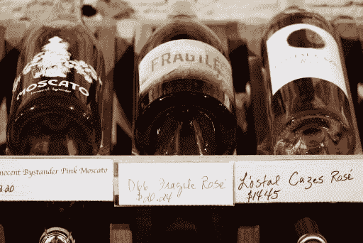
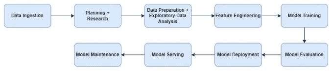
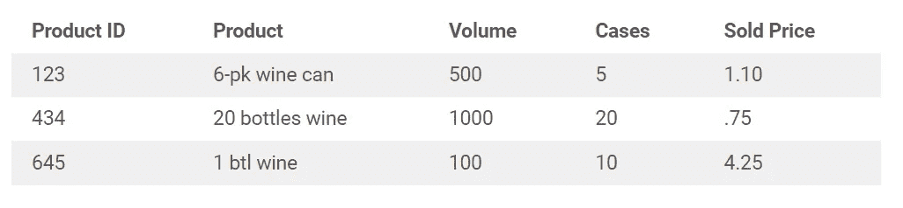
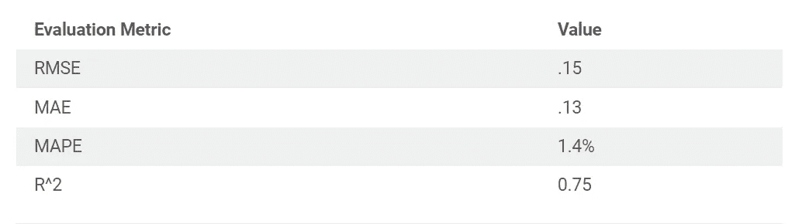

# 使用机器学习估计价格弹性

> 原文：<https://towardsdatascience.com/using-machine-learning-to-estimate-price-elasticity-47a2ba71bdb0>



丽贝卡·马修斯在 [Unsplash](https://unsplash.com/s/photos/wine-prices?utm_source=unsplash&utm_medium=referral&utm_content=creditCopyText) 上拍摄的照片

在我研究生院分析项目的最后一个学期，我的任务是估算葡萄酒的价格弹性。乍一看，这似乎是一个简单的目标。在经济学中，我学到价格弹性是给定价格变化百分比时需求变化的百分比。你所要做的就是查看每个价格下的购买数量，以确定价格弹性。为什么你甚至需要机器学习来解决这类问题？

为了理解这种简单化的方法有多大的缺陷，让我们考虑以下问题:

价格是影响你是否购买产品或服务的唯一变量吗？

如果你回答“不”，那么你可以想象经济理论和现实之间的潜在差距。为了估计价格弹性，除了产品或服务的价格之外，你可能还需要考虑许多变量。否则，您的弹性模型可能会受到预测性能不佳的影响。



带有一些个人修改的典型机器学习开发过程。在数据准备阶段增加了“规划+研究”部分以及“探索性数据分析”文本。作者开发的图像。

# 规划+研究

因为我从未试图在简单的财务分析之外评估弹性，这个问题需要一些研究。当我向一位有很强物理学背景的同事描述这个问题时，这导致了我有过的最刺激的对话之一。在为他定义了价格弹性之后，我们试图用微积分中的导数(即测量变化)的基本原理来解决这个问题。这个讨论，再加上来自 UW 大学“定量分析”课程的[帖子](https://uw.pressbooks.pub/quantbusiness/chapter/multiple-linear-regression/)，促使我使用对数转换的多元线性回归来解决我的问题。对数转换变量的解释反映了变量之间的百分比变化，这是期望的结果。

估算葡萄酒价格弹性以及每个所需维度所需的算法如下:

1.  筛选与您正在评估弹性的维度相关的销售数据的特定子集(例如，如果评估红酒的价格弹性，则仅筛选红酒销售)
2.  对*未来*销售目标变量和当前价格特征执行对数转换
3.  训练一个线性回归模型来准确预测*未来*的销售额
4.  价格弹性估计将是对数转换的系数，价格特征
5.  对每个弹性评估重复步骤 1-4

# 数据准备

建立高层次计划后，我开始准备数据。这通常是任何模型开发过程中最耗时的部分。目标是在进行任何分析之前，识别并执行必要的步骤来预处理和转换数据。虽然数据很容易获得，但数据库文档还有许多不足之处。表之间的关系不明显，主键也不明显。此外，数据定义留下的问题多于答案。为了说明这种模糊性，让我们想象下面的模拟产品表。你认为下表中的销售价格是什么意思？



没有清晰的文档，我不得不思考以下问题:

销售价格是每单位、每产品或每箱的价格吗？

所有饮料的标准单位是什么？

“售价”是否含税？

用如此多的未知数来估计弹性不仅不准确，而且不道德。为了填补这一知识空白，我需要向我们的利益相关者问几十个问题。一些例子包括:

*   为什么有的价格为零？
*   当出现等价的栏目时，哪一个*应该是*最靠谱？
*   为什么“X”列中似乎缺少这么多信息？
*   为什么这个“ID”列不都是唯一值？
*   在弹性估计之前，可以过滤掉哪些记录？

获取该领域和特定于数据库的知识的过程是数据专业人员经常忽视的技能。数据准备过程中的一个失误或误算的假设会导致下游的错误结论。

PS:这就是为什么许多数据科学团队越来越多地嵌入业务职能部门，而不是像 IT 部门那样独立的部门。

# 探索性数据分析

在这个准备阶段，我也在探索数据。为了建立一个可解释的模型，你需要了解数据的分布，各种模式，并找到可以解释弹性的特征。在这一步中，可视化是数据专家最好的朋友。

使用直方图，我能够了解消费者在美国不同州、年份、账户(如酿酒厂)、品种(如梅洛)、价格区间(如每瓶 10-15 美元)、销售渠道(如在线)等方面的购买行为。对于提供给我的数据切片，它是一个跨越几个维度的不平衡数据集。消费者购买的很大一部分是在加利福尼亚，并且大多数购买都来自一个账户。此外，各年间账户数量不一致，因为随着时间的推移增加了一些账户。

观察多年来的购买时间序列表明，消费者的购买行为可能存在一定的季节性。这一观察极大地影响了我在机器学习开发周期下一步的特征工程决策。

也许最有趣的观察结果是通过在线渠道购买的比例增加，以及在 COVID 影响的年份中销售额的急剧下降和上升。购买行为的这些重大变化塑造了我们后来的一些建模决策，例如排除 2016 年之前的数据。

# 特征工程

数据准备和特征工程之间的界限可能有点模糊。在对数据表中的数据进行预处理之后，我将相关记录转换成“模型可读”的格式。对于 python 中流行的机器学习库 scikit-learn 来说，这需要将所有特征转换成数值。诸如购买地点(如加利福尼亚)等特征必须转换成具有二进制值的“虚拟列”(即 1 表示是，0 表示否)。这个虚拟变量创建过程被应用于所有感兴趣的分类列，并且可以使用 pandas 库中的“get_dummies”方法轻松应用。请参见下面的代码示例。

```
import pandas as pd
dummy_variable_columns = ['Day_of_week', 'Month', 'Status']
sales_dataframe_new = pd.get_dummies(sales_dataframe_old, columns=dummy_variable_columns)
```

一个最常见的，也是最令人沮丧的特征工程步骤包括日期维度的修改。我从订单日期中提取了不同的时间段(例如，月、周、日、年),以测试不同时间间隔内消费者行为的季节性。销售的时间序列看起来非常像一个正弦图，以至于我回想起了高中三角函数课。这启发了我去研究和创建时间的正弦和余弦变换，作为模型中的特性进行测试。

由于销售额呈现为正弦曲线，我决定在不同的周期长度内测试数据框架的聚合(即特征向量和销售额)。这个有点复杂的任务很容易完成，这要归功于熊猫的另一种方法，叫做“重新取样”。这个方法转换了 dataframe，这样每一列都可以在我需要的任何时间段(例如，每 45 天)进行聚合。请参见下面的代码示例。

```
sales_dataframe_new_45daycycle = sales_dataframe_new.resample('45D', on='Order_Date', origin='start', label='right', closed='right').sum()
```

上面代码片段的结果是，我现在可以看到 45 天周期内每条记录的总销售额，而不是特定日期的订单。我看到的不是同一种红酒的 5 个不同订单，而是总销售额、总销量、总订单数、每个月的总订单数等。每 45 天一个周期。将所有列转换为数字格式是此重新聚合的必要先决条件。

现在数据框架已经有了新的结构，我计算了每条记录的每卷平均价格，并对这个值和总销售量进行了对数转换。因为我们需要估计未来的需求，所以我必须创建一个列，它是未来对数转换后的销售量。这得益于熊猫的“转换”方法。请参见下面的代码示例。

```
sales_dataframe_new_45daycycle['log_quantity_sold_future'] = sales_dataframe_new_45daycycle['log_quantity_sold_current'].shift(periods=-1)
```

运行这段代码后，我们的数据框架中的每条记录都有当前价格和未来时期的销售额。这种设置是训练逻辑模型所必需的，因此当前价格(一个已知的特性)被用来解释未来的需求量——一个未知的目标，因为你无法*知道*未来的销售额。

*有读者记得 SOHCAHTOA 吗，这个有趣的首字母缩写词有助于记住不同的三角函数？

# 模特培训

在向非技术观众传达模型训练阶段时，很容易呈现复杂任务的假象。实际上，由于现在有成熟的机器学习库可用，训练模型通常是开发周期中比较容易的步骤之一。下面的代码反映了我在创建训练和测试集、标准化数据、训练逻辑回归模型以及将模型拟合到缩放的特征向量(即，对数转换价格、时间维度等)时所做的工作。)以及目标向量(即对数转换后的未来需求)。

```
import numpy as np
import sklearn# Set up the train and test sets
train_x, test_x, train_y, test_y = train_test_split(sales_dataframe_new_45daycycle.loc[:, sales_dataframe_new_45daycycle.columns != 'log_quantity_sold_future'].to_numpy(),
                                                 sales_dataframe_new_45daycycle['log_quantity_sold_future'].to_numpy(),
test_size=0.20,
 random_state=20)#Standardize the feature vector and target vector
scaler = preprocessing.StandardScaler().fit(train_x)
train_x_scaled = scaler.transform(train_x)
test_x_scaled = scaler.transform(test_x)# Build and fit the linear regression model
lr = LinearRegression()
lr.fit(train_x_scaled, train_y)
```

上面的代码片段省略了特征选择/正则化过程。特征选择过程主要是通过排除与未来需求相关性差的特征来驱动的。

# 模型评估

虽然 R 平方和均方根误差(RMSE)是学校教授的最常见的评估指标，但我经常发现平均绝对误差(MAE)和平均绝对百分比误差(MAPE)是更容易解释的评估指标。后一种度量提供了实际值和预测值之间的距离的更直观的度量。

对于其中一个多元线性回归模型，模型评估指标如下:



使用 MAPE，我能够与利益相关者沟通，我们模型的预测与实际销售值相比平均相差 1.4%。此外，特征向量解释了未来需求中 75%的偏差。这个模型在可解释性方面是成功的，在预测方面也非常准确。

# 结论

总的来说，我的结论是葡萄酒是一种缺乏弹性的商品；然而，消费者的行为因葡萄酒的每个子集而异(即不同的销售渠道、品种等)。).假设消费者在所有情况下都缺乏弹性，并且在未来仍将缺乏弹性，这将是一个错误。此外，有一些数据子集的样本量太小，对它们各自的弹性估计值没有信心。为了改进这一分析，我将把替代产品价格(如啤酒)纳入特征向量，并研究估计弹性的替代方法。用更有弹性的商品(如快餐)重复这一过程会很有意思，看看估计揭示了什么。

~ [数据通才](https://thedatageneralist.com/about/)

注意:所有文本、数据和代码均经过修改，以隐藏任何敏感信息。