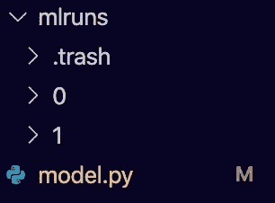
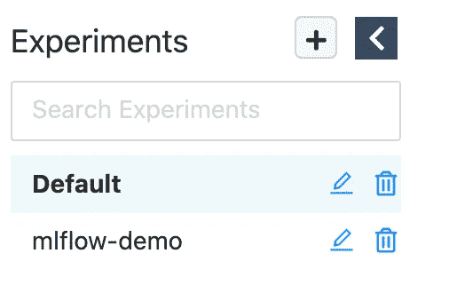
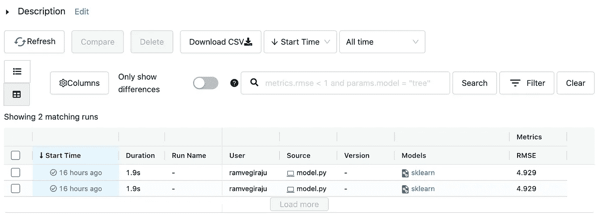

# 使用 MLflow 跟踪机器学习实验

> 原文：<https://towardsdatascience.com/using-mlflow-to-track-machine-learning-experiments-adbf27e9d36c>

## 物流跟踪简介

图片来自 [Unsplash](https://unsplash.com/photos/6TKVyi11oCM)

机器学习生命周期有各种各样的步骤，需要在生产的道路上加以考虑。简而言之，这绝不像训练您的模型一次，然后直接投入部署那么简单。 **ML 是一个迭代的过程**，你将需要许多周期的训练和所有的组件来获得你的用例的最佳模型。

[MLflow](https://mlflow.org/) 是一个开源平台，通过四个主要组件帮助端到端地管理这个 ML 生命周期: [MLflow 跟踪](https://mlflow.org/docs/latest/tracking.html)、 [MLflow 项目](https://mlflow.org/docs/latest/projects.html)、 [MLflow 模型](https://mlflow.org/docs/latest/models.html)和[模型注册](https://mlflow.org/docs/latest/model-registry.html)。**在本文**中，我们将具体了解如何使用 **MLflow Tracking** 管理/监控**模型训练**的不同迭代。我们将通过一个简单的 Sklearn 线性回归示例来了解波士顿住房数据集。如果你想直接跳到代码，这里是 [Github 库](https://github.com/RamVegiraju/mlflow-tracking)。

# 目录

1.  安装/设置
2.  MLflow 跟踪示例
3.  其他资源和结论

# 安装/设置

这里的设置非常简单，因为 MLflow 是一个开源包，您可以使用它。

安装 MLflow

如果您想获得 MLflow [文档](https://www.mlflow.org/docs/latest/quickstart.html)的完整访问权限，请从他们的[库](https://github.com/mlflow/mlflow)开始，其中还附带了一大组[示例](https://github.com/mlflow/mlflow/tree/master/examples)，涵盖了我们讨论过的所有主要组件。

要开始使用我们的模型，请创建一个示例 Python 文件，并在您的环境中添加以下包(如果没有安装的话)。

例如包装

# MLflow 跟踪示例

我们现在可以开始构建将由 MLflow 跟踪的模型。在开始我们的模型构建之前，我们将创建一个主函数来捕获我们的模型和 MLflow 跟踪。在这个函数中，我们需要首先创建一个将被跟踪的 MLflow 实验。这可以通过对 MLflow 库使用 [set_experiment](https://www.mlflow.org/docs/latest/python_api/mlflow.html#mlflow.set_experiment) 调用来完成。

创建 MLflow 实验

这里我们设置一个活动的实验来跟踪，如果这个实验不存在它是为我们创建的。现在，我们可以构建我们的模型，我们将使用 MLflow 进行跟踪。对于 Boston Housing 数据集，我们将使用 Sklearn 构建一个简单的[线性回归](https://scikit-learn.org/stable/modules/generated/sklearn.linear_model.LinearRegression.html)模型。

模特培训

在模型训练之后，我们可以捕获一个样本度量，例如 [RMSE](https://www.statisticshowto.com/probability-and-statistics/regression-analysis/rmse-root-mean-square-error/#:~:text=Root%20Mean%20Square%20Error%20(RMSE)%20is%20the%20standard%20deviation%20of,the%20line%20of%20best%20fit.) ，我们可能希望根据我们脚本的不同迭代来监控/跟踪它。

RMSE 公制

然后，我们可以通过使用 [log_metric](https://www.mlflow.org/docs/latest/python_api/mlflow.html#mlflow.log_metric) API 调用，使用特定的 MLflow 来跟踪这个指标。这里，我们将 RMSE 指定给 log_metric 调用，以便 MLflow 在模型的迭代中进行跟踪。

使用 MLflow 跟踪指标

这里没有涉及的另一个关键特性是，您**可以指定您希望 MLflow 跨实验跟踪的超参数**。这可以通过在 [log_param](https://www.mlflow.org/docs/latest/python_api/mlflow.html#mlflow.log_param) 中的类似调用来完成。这对于更复杂的算法尤其有用，当您在实验中对不同的超参数进行基准测试/比较时也是如此。

现在我们可以使用模型注册中心来记录我们的模型。MLflow 附带了一个专门为 Sklearn 模型制作的 API [调用](https://mlflow.org/docs/latest/model-registry.html#adding-an-mlflow-model-to-the-model-registry)。

将模型记录到模型注册表中

现在，如果我们运行这个 Python 文件几次，我们应该会看到一个 RMSE 显示。与此同时，运行将被捕获到一个名为 **mlruns** 的目录中，该目录将在执行 Python 文件时创建。

mlruns 目录已创建(作者截图)

MLflow 的真正力量来自简单的 UI 界面，您可以利用它来可视化这些不同的实验。**在与 Python 文件相同的目录中，在终端中运行下面的命令**,您应该能够访问 UI。

打开 UI 后，您应该能够在侧面板上看到我们创建的实验。

实验已创建(作者截图)

如果我们点击这个实验，我们应该看到我们执行模型训练的不同运行/次数。我们还应该看到我们在 RMSE 记录的指标。

实验运行(作者截图)

随着实验变得越来越复杂，您可以添加更多的指标、参数，并轻松过滤这些运行，以获得最佳性能的模型。为了进行进一步的查询或可视化，您还可以下载一个 CSV 文件，使用 Pandas、Matplotlib 等库进行比较。

# 其他资源和结论

MLflow 是一个非常强大的工具，可以轻松跟踪您的大规模 ML 实验。当试图将你的 ML 生命周期推向生产时，考虑这样的工具是必要的。每一步都需要监控和维护，MLflow 使这一过程非常直观和易于使用。

我希望这是对 MLflow 和 MLOps 入门的有用介绍。在以后的文章中，我们将探索更复杂的例子和 MLflow 的其他特性，比如模型托管。

*如果你喜欢这篇文章，请在* [*LinkedIn*](https://www.linkedin.com/in/ram-vegiraju-81272b162/) *上与我联系，并订阅我的媒体* [*简讯*](https://ram-vegiraju.medium.com/subscribe) *。如果你是新手，使用我的* [*会员推荐*](https://ram-vegiraju.medium.com/membership) *报名。*