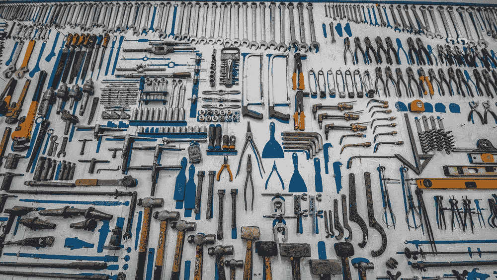
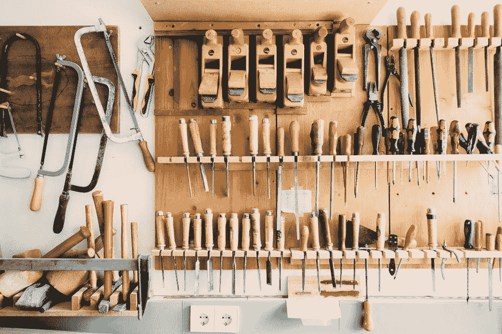

# 使用多阶段构建将您的 docker 映像缩小 10 倍

> 原文：<https://towardsdatascience.com/using-multi-stage-builds-to-make-your-docker-image-almost-10x-smaller-239068cb6fb0>

## 留下不必要的工具，清理你的 Docker 图片



如果你完成了建造，你需要清理你的工具

在这篇短文中，我们分多个阶段构建图像，以显著减小 docker 图像的大小。最终，我们会得到一个图像，做完全相同的事情，但是尺寸却小了 10 倍！我们这样做的方法是留下我们用来建立图像的工具。

首先，我们将创建一个 docker 文件，用于以“常规”方式构建图像。然后我们升级这个文件，利用一个额外的阶段，留下我们不必要的工件。最后，我们将通过试验不同的 docker 图像来进一步优化。让我们看看我们能减掉多少脂肪；我们来编码吧！

## 开始之前

我们使用了很多终端命令。不熟悉的话可以看看 [**这篇**](https://mikehuls.medium.com/terminals-consoles-command-line-for-absolute-beginners-de7853c7f5e8) 。

# 设置

假设我们正在构建一个需要地理数据的应用程序。Open StreetMap 为我们提供了这种地理数据:通过`geofabrik.de`，我们可以以`.osm.pbf`格式下载每个国家的地理数据。接下来我们可以使用一个叫做`Osmium`的工具将这些文件合并在一起。想象一下，我们只需要将这个合并文件输入到我们的应用程序中。

总之:我们只需要使用`curl`(下载)和`osmium`(合并)一次:当我们获得合并后的文件时，我们就不再需要这些工具了。在两阶段构建中，我们在第一阶段下载这些工具，在那里使用它们，然后只将结果(合并的文件)带到下一阶段，留下工具。

在我们看到两阶段构建之前，让我们看看“正常”的方式。

# 1.普通的身材

在这一部分，我们将用最简单的方式来建立我们的形象。尽管如此，我们还是要记住一些小技巧来最小化我们的形象，详见本文[](https://mikehuls.medium.com/5-easy-to-implement-tricks-to-trim-down-your-docker-image-size-263978a6ed29)**。这是 dockerfile 文件:**

```
FROM ubuntu:20.04# BUNDLE LAYERS
RUN apt-get update -y && apt install -y --no-install-recommends \
  curl \
  osmium-tool \
 && rm -rf /var/lib/apt/lists/*RUN mkdir /osmfiles \
 && mkdir /merged \
 && curl [https://download.geofabrik.de/europe/monaco-latest.osm.pbf](https://download.geofabrik.de/europe/monaco-latest.osm.pbf) -o /osmfiles/monaco.osm.pbf \
 && curl [https://download.geofabrik.de/europe/andorra-latest.osm.pbf](https://download.geofabrik.de/europe/andorra-latest.osm.pbf) -o /osmfiles/andorra.osm.pbf \
 && osmium merge /osmfiles/monaco.osm.pbf /osmfiles/andorra.osm.pbf -o /merged/merged.osm.pbf
```

**这个 does 文件正是我们需要的:安装 curl 和 osmium，下载文件并合并它们。我们最终得到驻留在`/merged`中的合并文件。**

***注意，我们在获得合并文件后不做任何事情。出于本文的目的，我们将保持这个 docker 文件简单，并跳过对文件的实际操作。***

**让我们来看看这张图片的大小:**

```
testimg:latest        a88a8848201b   16 seconds ago       96.9MB
```

**正如你看到的图像大约是 97MB。在下一部分中，我们将使用多个阶段来升级 docker 文件。**

****

**本文清理了大量垃圾(图片由[杰里米·贝赞格](https://unsplash.com/@unarchive)在 [unsplash](https://unsplash.com/photos/u5mCQ-c5oSI) 上提供)**

# **2.实现多阶段构建**

**在前面的例子中，我们只使用了一次构建工具(curl 和 osmium)。使用后，它们会留在我们的印象中。打个比方:你买了一辆新车，但发现所有用于制造汽车的工具都还在后备箱里，占据了宝贵的空间！**

**在这一部分，我们将重点放在留下我们用来制造汽车的工具。让我们检查新的 docker 文件并检查代码。**

```
FROM ubuntu:20.04 AS final
FROM ubuntu:20.04 as build# BUNDLE LAYERS
RUN apt-get update -y && apt install -y --no-install-recommends \
  curl \
  osmium-tool \
 && rm -rf /var/lib/apt/lists/*RUN mkdir /osmfiles \
 && mkdir /merged \
 && curl [http://download.geofabrik.de/europe/monaco-latest.osm.pbf](http://download.geofabrik.de/europe/monaco-latest.osm.pbf) -o /osmfiles/monaco.osm.pbf \
 && curl [http://download.geofabrik.de/europe/andorra-latest.osm.pbf](http://download.geofabrik.de/europe/andorra-latest.osm.pbf) -o /osmfiles/andorra.osm.pbf \
 && osmium merge /osmfiles/monaco.osm.pbf /osmfiles/andorra.osm.pbf -o /merged/merged.osm.pbfFROM finalRUN mkdir /merged
COPY --from=build /merged /merged
```

**如你所见，我们使用了两个阶段:一个称为*构建*，一个称为*最终*。在我们的建造阶段安装卷曲和锇。使用它们创建合并文件，最后只需将`merged`文件夹复制到`final`阶段。**

**一旦我们输入了`FROM final`，我们就“进入”了最后一个阶段，所以`FROM final`之后的任何事情都会在那里发生。二号线的`FROM ubuntu:20.04 as build`也是如此。请注意，curl 和锇只是在我们的构建阶段安装的。一旦我们到达 docker 文件的末尾，我们只保留我们所处的阶段。因为 *final* 阶段在 dockerfile 的末尾是活动的，所以 *build* 阶段中的所有内容都会被留下。让我们来看看新容器的尺寸:**

```
testimgbetter:latest        7342ee3948e8   3 seconds ago    75.1MB
```

**我们的新形象是 **75MB** :通过留下我们不再需要的工具，我们节省了超过 **20MB** 或不到 20%的空间。这已经是非常好的改进了。让我们来看看如何进一步优化。**

# **3.具有较小最终图像的多阶段**

**在前一部分中，我们在构建和最终阶段都使用了`ubuntu:20.04`图像。对于构建阶段，这是非常合理的；在这里我们做复杂的事情:安装包，下载东西，git 克隆，在其他情况下甚至可能使用`cmake`或`make`来编译代码！然而，*最终*阶段并不需要像*构建*阶段那么智能。**

**这一部分的想法是，你需要一个大而丰富的图像，像复杂的*构建*阶段的`ubuntu:20.04`。然后，我们可以将来自*构建*阶段的结果复制到基于更简单图像的*最终*阶段。在我们的例子中，我们甚至可以使用非常小的图像，如 Alpine。让我们稍微调整一下我们的 docker 文件:**

```
FROM alpine:3.14 AS final
```

**现在，一旦构建阶段完成，我们只需将合并后的文件复制到 alpine 阶段。让我们检查一下新构建的图像的总大小:**

```
testimgbetter                                                latest        8ad3278671e1   17 minutes ago   7.95MB
```

**我们从 **75MB** 降到了略低于 **8MB:** 几乎减少了**90%！****

***请注意，使用 alpine 图像并不总是有效；本文这一部分的想法是，我们可以使用比构建阶段更小的最终图像。***

****

**整洁有序(图片由[谷仓图片](https://unsplash.com/@barnimages)在 [unsplash](https://unsplash.com/photos/t5YUoHW6zRo) 上拍摄)**

# **结论**

**在本文中，我们重点了解了 docker 构建的方式，并通过删除所有我们不再需要的工具来最小化 docker 映像。我们可以通过多个阶段非常有效地做到这一点:执行复杂的任务，如在丰富的映像中安装和构建，然后将结果复制到更精简的最终映像中，并留下构建阶段。**

**本文中的例子非常少；只留下了`curl`和`osmium`。有这样的例子，我使用了一个更大的构建阶段，并通过留下我们不再需要的工件，使**节省了超过 1.5GB** ，图像大小从 **1.8GB** **变为 0.3GB** ！**

**我希望这篇文章是清楚的，但如果你有建议/澄清，请评论，以便我可以做出改进。与此同时，看看我的 [**其他关于各种编程相关主题的文章**](http://mikehuls.com/articles) ，比如:**

*   **[面向绝对初学者的 Docker](https://mikehuls.medium.com/docker-for-absolute-beginners-what-is-docker-and-how-to-use-it-examples-3d3b11efd830)**
*   **[Docker 为绝对初学者编写](https://mikehuls.medium.com/docker-compose-for-absolute-beginners-how-does-it-work-and-how-to-use-it-examples-733ca24c5e6c)**
*   **把你的代码变成一个真正的程序:使用 Docker 打包、运行和分发脚本**
*   **[Python 为什么慢，如何加速](https://mikehuls.medium.com/why-is-python-so-slow-and-how-to-speed-it-up-485b5a84154e)**
*   **[Python 中的高级多任务处理:应用线程池和进程池并进行基准测试](https://mikehuls.medium.com/advanced-multi-tasking-in-python-applying-and-benchmarking-threadpools-and-processpools-90452e0f7d40)**
*   **[写你自己的 C 扩展来加速 Python x100](https://mikehuls.medium.com/write-your-own-c-extension-to-speed-up-python-x100-626bb9d166e7)**
*   **【Cython 入门:如何在 Python 中执行>每秒 17 亿次计算**
*   **[使用 FastAPI 用 5 行代码创建一个快速自动记录、可维护且易于使用的 Python API](https://mikehuls.medium.com/create-a-fast-auto-documented-maintainable-and-easy-to-use-python-api-in-5-lines-of-code-with-4e574c00f70e)**

**编码快乐！**

**—迈克**

**页（page 的缩写）学生:比如我正在做的事情？[跟我来](https://mikehuls.medium.com/membership)！**

**[](https://mikehuls.medium.com/membership) [## 通过我的推荐链接加入 Medium—Mike Huls

### 作为一个媒体会员，你的会员费的一部分会给你阅读的作家，你可以完全接触到每一个故事…

mikehuls.medium.com](https://mikehuls.medium.com/membership)**