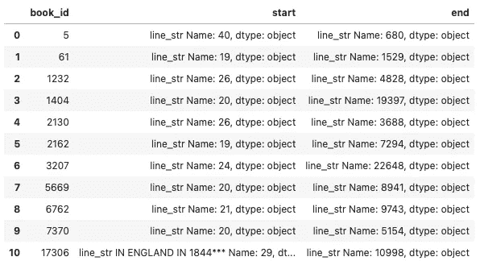
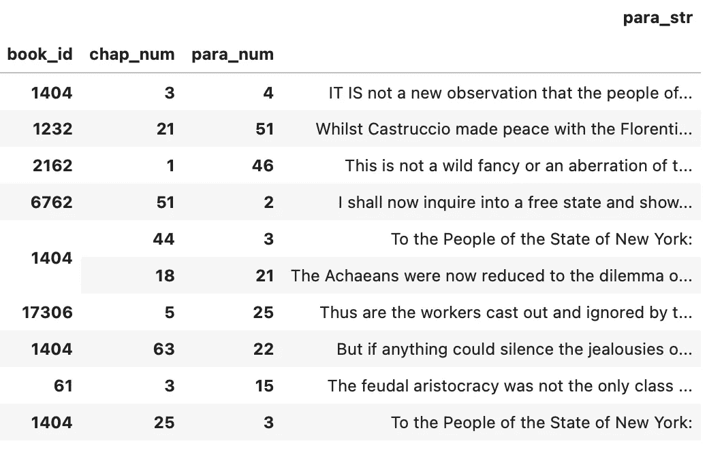
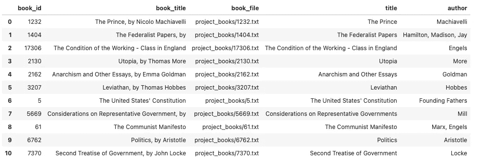
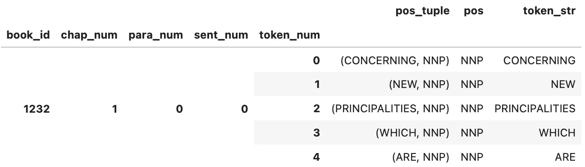
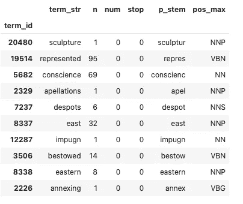
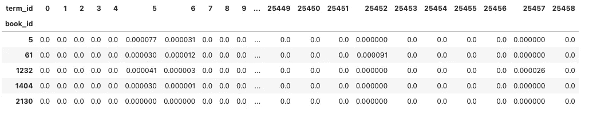
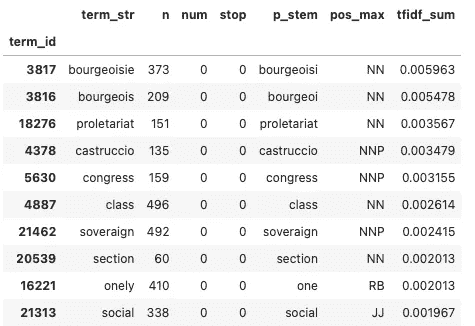

# 使用自然语言处理和文本分析对政治文本进行聚类

> 原文：<https://towardsdatascience.com/using-nlp-and-text-analytics-to-cluster-political-texts-41fdb2c3a325>

# 使用自然语言处理和文本分析对政治文本进行聚类

## NLTK 和古根海姆项目文本的 scipy

在文本分析的保护伞下，有许多 python 包可以帮助我们以产生有趣结果的方式分析当前和历史文本。在这个项目中，我试图用余弦相似性聚类法对跨越数千年的政治著作进行分类。我使用的具体标题是:

马基雅维利的《君主论》

汉密尔顿、麦迪逊和杰伊的《联邦党人文集》

恩格斯的《英国工人阶级的状况》

摩尔的《乌托邦》

戈德曼的《无政府主义和其他论文》

霍布斯的《利维坦》

《美国宪法》

密尔的《代议制政府的思考》

马克思和恩格斯的《共产党宣言》

亚里士多德的《政治学》

洛克的《政府第二论》

第一步是下载文本语料库(直接从古根海姆项目的网站下载)。然后，我需要导入文件，并在文本文件中找到每项工作的开始和结束行。* *古根海姆项目文件下载为。txt 文件，并在实际工作的上下有额外的行。**

```
*# For loop to find the start and end points of the books*
**for** i **in** book_id:
    ...
    a **=** df**.**line_str**.**str**.**match(r"\*\*\*\s*START OF (THE|THIS) PROJECT")
    b **=** df**.**line_str**.**str**.**match(r"\*\*\*\s*END OF (THE|THIS) PROJECT")
    ...
```

使用 for 循环和其他字符串操作，我匹配了它们的公共开始和结束元素。txt 文件，以便确定每个文学作品的起点和终点。



作者图片

**Doc&Library Tables:**
下面的 regex 部分搜索每本书以分离出章节，从而开始创建 OCHO(内容对象的有序层次结构)样式表。

```
 OHCO **=** ['book_id', 'chap_num', 'para_num', 'sent_num', 'token_num']roman **=** '[IVXLCM]+'
caps **=** "[A-Z';, -]+"
chap_pats **=** {
    5: {
        'start_line': 40,
        'end_line': 680,
        'chapter': re**.**compile("^ARTICLE\s+{}$"**.**format(roman))
    },
    61: {
        'start_line': 19,
        'end_line': 1529,
        'chapter': re**.**compile("^\s*Chapter\s+{}.*$"**.**format(roman))
    },
    1232: {
        'start_line': 1000, *# This was mannually found through trial and error becuase the previous start had issues*
        'end_line': 4828,
        'chapter': re**.**compile("^\s*CHAPTER\s+{}\."**.**format(roman))
    },
    ...
}
```

现在我们已经有了 book_id 和章节的分类，我们可以填充每个文本层次结构的其余部分。我们按照熊猫和字符串操作将每一章分解成段落。生成的表称为 Doc 表，将在后续步骤中使用。我们还能够分离出标题和作者来完成库表。

在下面的图片中，我们可以看到一个显示图书 id、章节、段落编号和字符串的 doc 表示例。以及完整的库表。



作者图片



作者图片

**Token & Vocab 表**
为了进一步分解 Doc 表，我们需要定义每个单独的术语。下面的函数接收我们的 Doc 表，将每个段落的字符串解析成句子，然后将这些句子解析成单独的术语。这个操作主要是通过 nltk 包使用 nltk.sent_tokenize、nltk.pos_tag、NLTK 来完成的。WhitespaceTokenizer 和 nltk.word_tokenize。

```
*# Tokenize doc table to derive TOKEN table*
**def** tokenize(doc_df, OHCO**=**OHCO, remove_pos_tuple**=False**, ws**=False**):

    *# Paragraphs to Sentences*
    df **=** doc_df**.**para_str\
        **.**apply(**lambda** x: pd**.**Series(nltk**.**sent_tokenize(x)))\
        **.**stack()\
        **.**to_frame()\
        **.**rename(columns**=**{0:'sent_str'})

    *# Sentences to Tokens*
    *# Local function to pick tokenizer*
    **def** word_tokenize(x):
        **if** ws:
            s **=** pd**.**Series(nltk**.**pos_tag(nltk**.**WhitespaceTokenizer()**.**tokenize(x)))
        **else**:
            s **=** pd**.**Series(nltk**.**pos_tag(nltk**.**word_tokenize(x)))
        **return** s

    df **=** df**.**sent_str\
        **.**apply(word_tokenize)\
        **.**stack()\
        **.**to_frame()\
        **.**rename(columns**=**{0:'pos_tuple'})

    *# Grab info from tuple*
    df['pos'] **=** df**.**pos_tuple**.**apply(**lambda** x: x[1])
    df['token_str'] **=** df**.**pos_tuple**.**apply(**lambda** x: x[0])
    **if** remove_pos_tuple:
        df **=** df**.**drop('pos_tuple', 1)

    *# Add index*
    df**.**index**.**names **=** OHCO

    **return** dfTOKEN **=** tokenize(DOC, ws**=True**)*# Creating VOCAB table and adding columns to TOKEN data*
...
```



作者图片

上面有我们的令牌表并不意味着我们完成了。我们现在需要在这个表的基础上创建一个 Vocab 表来索引我们的文本语料库中使用的每个术语。使用字符串和矩阵操作，以及 NLTK 模块的 PorterStemmer()函数，我们进一步构建我们的令牌表并创建我们的 Vocab 表。

下面分别是令牌表和 Vocab 表的示例。从我们的令牌表中可以看出，每个术语现在都对应于一个编目的 term_id，可以使用我们新的 Vocab 表来引用它。此表提供了术语 id、术语、术语词干、在整个语料库中出现的次数、停用词区别以及最常见的词性。


作者图片



作者图片

**TFIDF 表:**
接下来，我们需要使用这些表来创建一个 TFIDF 表。TFIDF 表根据每个文本内的使用频率和语料库中文档之间的使用频率来衡量每个术语。此表的目的是为我们提供最有影响力和最有用的分析单词的结果，同时减少停用词或其他常用词的影响，否则这些词会一直使用，如“and”、“of”、“The”等。请注意，我们在代码块的开头定义了不同的包组织，这些可以用来在不同的层次元素上创建 TFIDF 表。

```
SENTS **=** OHCO[:4]
PARAS **=** OHCO[:3]
CHAPS **=** OHCO[:2]
BOOKS **=** OHCO[:1]**def** tfidf(TOKEN, bag, count_method, tf_method, idf_method):

    *#Create Bag of Words and DTCM*
    BOW **=** TOKEN**.**groupby(bag**+**['term_id'])**.**term_id**.**count()\
        **.**to_frame()**.**rename(columns**=**{'term_id':'n'})
    BOW['c'] **=** BOW**.**n**.**astype('bool')**.**astype('int')
    DTCM **=** BOW[count_method]**.**unstack()**.**fillna(0)**.**astype('int')

    *# TF calculations, will comment out all but 'sum' given that will be what I use*
    **if** tf_method **==** 'sum':
        TF **=** DTCM**.**T **/** DTCM**.**T**.**sum()

    TF **=** TF**.**T
    DF **=** DTCM[DTCM **>** 0]**.**count()
    N **=** DTCM**.**shape[0]

    *# IDF calculations, will comment out all but 'standard' given that will be what I use*
    **if** idf_method **==** 'standard':
        IDF **=** np**.**log10(N **/** DF)

    *# create TFIDF table*
    TFIDF **=** TF ***** IDF
    **return** TFIDFTFIDF **=** tfidf(TOKEN, BOOKS, 'n', 'sum', 'standard')*# Add tfidf_sum column to Vocab table*
VOCAB['tfidf_sum'] **=** TFIDF**.**sum()
```

正如我们在下面的 TFIDF 表的图像中所看到的，我们得到了一个非常稀疏的结果，因为我们当前包含了在语料库中找到的每个单词。在尝试最终的聚类分析之前，我们需要进一步减少这种情况。



作者图片

此外，在将该 TFIDF 表的求和原则添加到 Vocab 表，并对最高 tfidf_sum 值的结果进行排序之后，我们得到了具有最具影响力的单词的表:



作者图片

不出所料，最有影响力的词与政治术语有关，这符合我们的预期，因为语料库由各种政治著作组成，像“and”或“the”这样的正常使用的词可能无关紧要。

为了帮助简化我们的 TFIDF 表，我们将把 number 列减少到最常见的 4000，这是由上面的 Vocab 表中的 tfidf_sum 列排序的。

**聚类:**
现在我们已经得到了最终的表，我们可以开始聚类过程并查看我们的结果。下一个代码块在每个作品之间创建配对，比较它们的距离和相似性度量，将文档聚类为最相似/最近的距离。出于本文的目的，我将只展示余弦相似性集群，但是您也可以运行这个代码块中包含的其他测试(cityblock、euclidean、jaccard、dice、correlation 和 jensenshannon)。实际的相似性/距离计算是使用 scipy 的空间距离模块和 pdist 函数运行的。

```
*# Normalize the TFIDF table, create PAIRS and lists for PAIRS testing*
**def** tab_doc_tab(TFIDF_table, Doc_table):
    L0 **=** TFIDF_table**.**astype('bool')**.**astype('int')
    L1 **=** TFIDF_table**.**apply(**lambda** x: x **/** x**.**sum(), 1)
    L2 **=** TFIDF_table**.**apply(**lambda** x: x **/** norm(x), 1)
    PAIRS **=** pd**.**DataFrame(index**=**pd**.**MultiIndex**.**from_product([Doc_table**.**index**.**tolist(), Doc_table**.**index**.**tolist()]))**.**reset_index()
    PAIRS **=** PAIRS[PAIRS**.**level_0 **<** PAIRS**.**level_1]**.**set_index(['level_0','level_1'])
    PAIRS**.**index**.**names **=** ['doc_a', 'doc_b']
    tfidf_list **=** ['cityblock', 'euclidean', 'cosine']
    l0_list **=** ['jaccard', 'dice','correlation']
    l1_list **=** ['jensenshannon']
    **for** i **in** tfidf_list:
        PAIRS[i] **=** pdist(TFIDF_table, i)
    **for** i **in** l0_list:
        PAIRS[i] **=** pdist(L0, i)
    **for** i **in** l1_list:
        PAIRS[i] **=** pdist(L1, i)
    **return** PAIRSPAIRS **=** tab_doc_tab(TFIDF_cluster, DOC)
```

最后，我们运行聚类函数并显示余弦相似性测试的结果。我们使用 scipy 模块的 scipy.cluster.hierarchy 函数来创建我们的聚类图的框架，并使用 matplotlib 来显示下面的实际聚类。

```
*# Create Clusters*
**def** hca(sims, linkage_method**=**'ward', color_thresh**=**.3, figsize**=**(10, 10)):
    tree **=** sch**.**linkage(sims, method**=**linkage_method)
    labels **=** list(DOC**.**title**.**values)
    plt**.**figure()
    fig, axes **=** plt**.**subplots(figsize**=**figsize)
    dendrogram **=** sch**.**dendrogram(tree, 
                                labels**=**labels, 
                                orientation**=**"left", 
                                count_sort**=True**,
                                distance_sort**=True**,
                                above_threshold_color**=**'.75',
                                color_threshold**=**color_thresh
                               )
    plt**.**tick_params(axis**=**'both', which**=**'major', labelsize**=**14)hca(PAIRS**.**cosine, color_thresh**=**1)
```


作者图片

上面的图片是我们看到每个作品的聚类以及每个作品之间的紧密联系的结果。基于我们的结果，我们可以看到余弦相似性聚类提供了相当准确的结果。有三大类，我称之为西方政治哲学、美国政治哲学和共产主义政治哲学。每个文本都与相似的文本适当地聚集在一起，来自相同作者的一些文本更紧密地聚集在一起，例如恩格斯的文本。

**结论:
我们从。txt 文件，创建了各种文本表，如 Library、Token、Vocab 和 TFIDF 表。一旦我们得到了我们需要的所有表格，我们运行余弦相似性度量，并根据相似的作品对文本进行聚类。这个项目最终能够找到我们所期望的三个集群，给定我们对作者的了解，以及每个政治文本的主题。**

**这个项目的完整代码可以在我的 GitHub 页面上找到:**[https://GitHub . com/nbehe/NLP _ texts/blob/main/Beheshti _ project _ code . ipynb](https://github.com/nbehe/NLP_texts/blob/main/Beheshti_project_code.ipynb)

*这个项目是我的文本分析课程的一个大项目的一小部分。我将为该项目的其他部分撰写额外的文章，其中我们将研究其他非监督模型，如主成分分析、主题建模和情感分析。与文本分析一样，尤其是本文，大部分代码都致力于创建运行这些模型所需的表。我选择保留所有代码，而不是只保留一部分，这样其他人就可以看到我的所有步骤。来自这个项目的代码是我自己写的，由讲师提供的，以及通过课程材料提供的作品的混合物。*