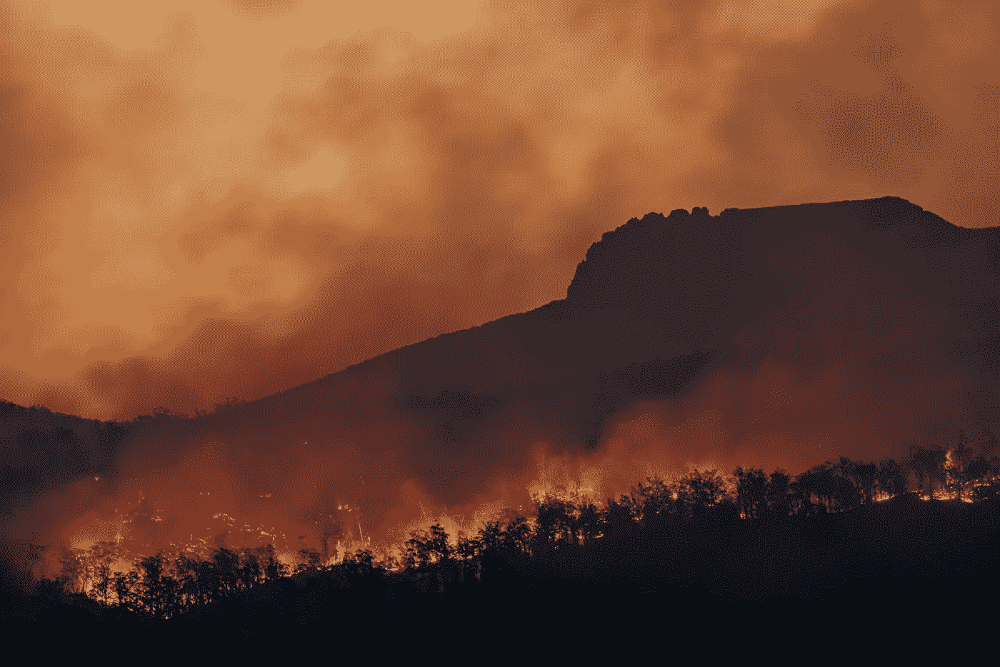
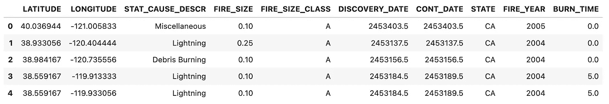
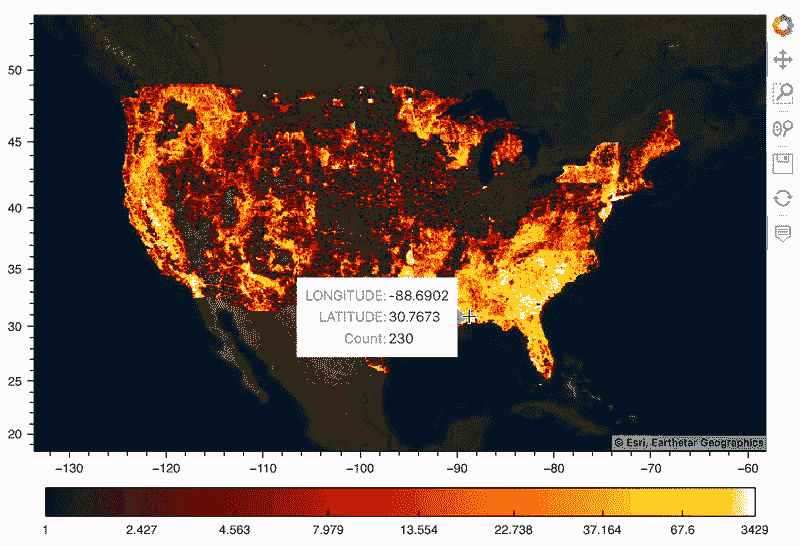
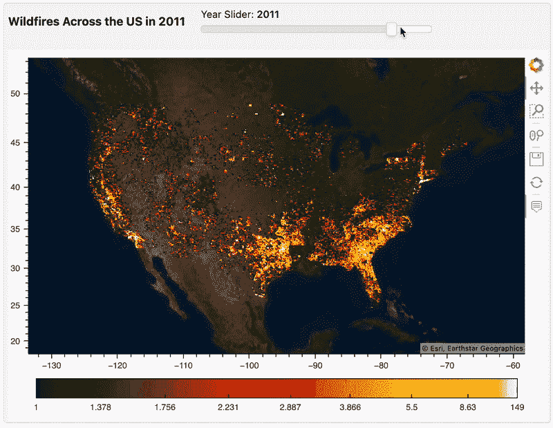
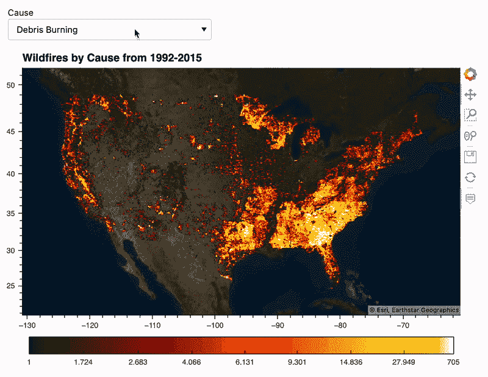
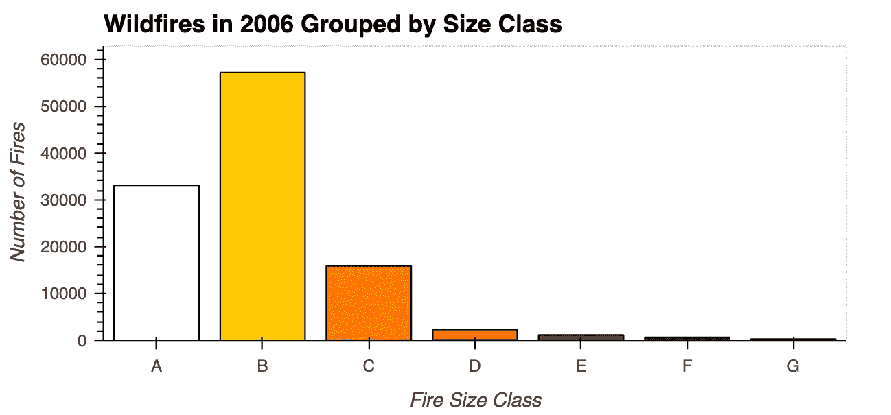
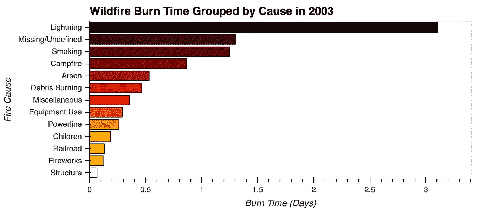
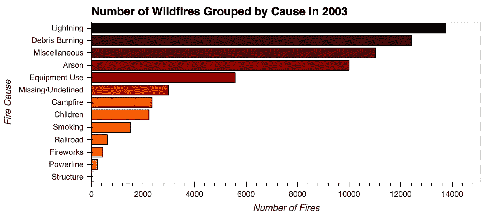
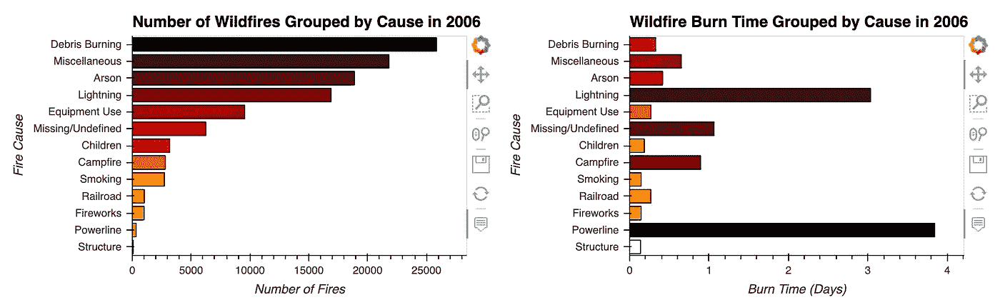
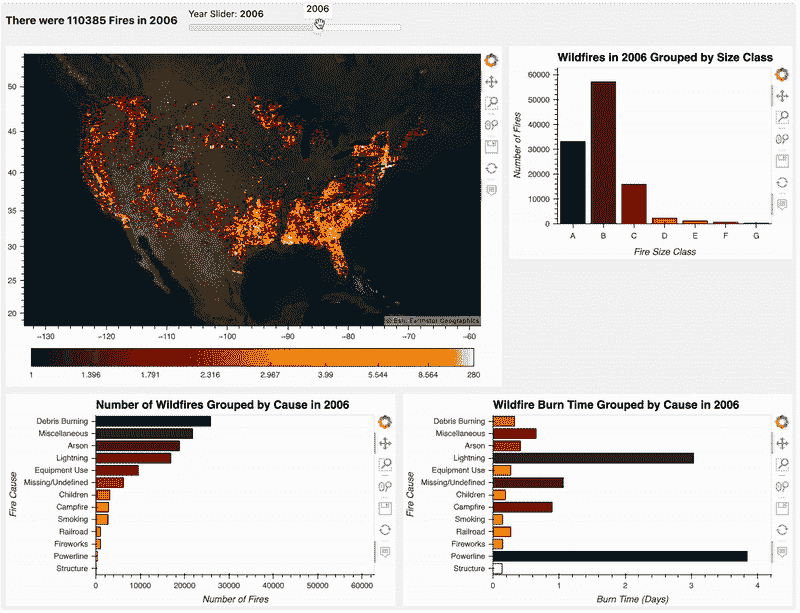

# 使用 Panel 和 hvPlot 可视化几十年的野火

> 原文：<https://towardsdatascience.com/using-panel-and-hvplot-to-visualize-decades-of-wildfires-2ac8d6f5db25>

## 让我们建立一个仪表板，使用 Holoviz 工具了解更多关于 1992 年至 2015 年期间发生的数百万起野火的信息

[马特·帕尔默](https://unsplash.com/@mattpalmer?utm_source=unsplash&utm_medium=referral&utm_content=creditCopyText)在 [Unsplash](https://unsplash.com/s/photos/fires?utm_source=unsplash&utm_medium=referral&utm_content=creditCopyText) 上拍照

我最近写了一篇关于使用 Python 库 Panel 制作数据仪表板的文章。我们创建了一个简单的仪表板，允许我们可视化数据集每年的各种汇总图。在这篇文章中，我想在这些技能的基础上，使用 Panel 制作一个仪表板来查看美国野火记录的时间序列。

我们的数据集包括 1992 年至 2015 年间发生在美国的超过 180 万起野火。我们的目标是构建一个数据仪表板，帮助我们更好地了解这些野火的原因、发生地点等。

# 数据准备

由作者创建

导入我们的数据非常简单。我们可以使用`sqlite3`连接到我们的 SQLite 数据库，并查询我们想要处理的信息。这些信息被存储在一个熊猫数据框中，这样我们就可以删除阿拉斯加和夏威夷，使绘图更容易。最后，我们可以通过从火灾数据中减去发现火灾的日期来计算燃烧时间。

# 绘制野火地图

让我们从绘制所有火灾的地图开始，这样我们就可以看到空间分布。我们可以使用 hvPlot 轻松做到这一点，因为它利用了 Datashader 来光栅化我们的 180 万个点，这使得它们更易于渲染。

由作者创建

你可以使用[贴在这里](https://nbviewer.org/github/wino6687/Medium_Notebooks/blob/main/wildfires_panel_examples.ipynb)的互动笔记本与这些情节互动。令人印象深刻的是，使用 hvPlot 创建高质量的空间可视化是多么容易。由于它利用了其他 Holoviz 库——holo views、Geoviews、Datashader 和 Colorcet——它简化了创建交互式地图所需的许多常规步骤，该地图仍然可以响应大型数据集。

# 带有时间滑块的简单仪表板

用静态图来可视化时间序列数据可能会很烦人，然而，Panel 的小部件让我们可以使用各种方法来操作和子集化我们的数据，比如选择年份的滑块。

制作带面板的仪表板有三个步骤:

1.  定义一个小部件，比如选择年份的整数滑块或下拉列表。
2.  定义一个绘图函数，将滑块中的年份值作为输入。
3.  布局和渲染我们的仪表板。

由作者创建

## 制作简单仪表板的快速方法

当我们只有一个图和一个小部件要显示时，布置仪表板似乎需要很多额外的代码。对于这样一个简单的仪表板，我们可以使用`.interactive`来制作数据帧和/或数据管道的交互式副本。

要了解这是如何工作的，让我们看看是否可以制作一个小部件，让我们选择火灾的原因，并让地图只显示这些火灾。

由作者创建

令人高兴的是，我们不必担心我们的仪表板的布局，而是可以定义我们的小部件和附带的绘图。在这篇文章中，我们不会关注交互式数据框架，但是，我认为在创建这些不太复杂的仪表板时提到它们是有好处的。

# 构建我们的仪表板

我们有了基本的地图，但仪表板最强大的部分之一是能够一次看到我们数据的多个方面。让我们创建一些地块来配合我们的地图，然后使用面板将它们连接在一起。

**火灾规模**

我们可以从绘制每个尺寸等级发生的火灾数量开始；野火按燃烧面积大小分类，A 级最小，G 级最大。

由作者创建

我们所有的绘图函数都将年份作为参数，这样当滑块值改变时，它们可以对数据进行子集化。这里，我们可以使用子集化的数据按照大小分类对数据帧进行分组，并使用`.size()`来计算每组中的火灾数量。

**按原因划分的燃烧时间**

我们接下来的两个图都将着眼于野火的原因；野火有许多原因，其发生频率和潜在危险有很大差异。让我们先来看看 2003 年每场野火的平均燃烧时间。

由作者创建

**按原因划分的火灾数量**

现在，不考虑燃烧时间，让我们简单地看看 2003 年各组引起的火灾数量。

由作者创建

我们可以看到两个图之间的一些有趣的差异，比如吸烟是如何导致第二长的野火，而它在引起的野火总数中排名第九。除了闪电，燃烧时间最长的火灾并不是最频繁发生的。

当我们思考是什么让野火难以扑灭时，这是有意义的；如果火灾发生在更偏远的地方，那么很难在早期控制住火势。闪电、吸烟和营火都有可能在这类地区引发火灾，这些地区有大量的木材可以燃烧，周围很少有人报告烟雾的最初迹象。

也有一些年份可能看起来很不一样，比如 2006 年，少量的输电线故障导致了平均持续几天的大火灾。让我们来看看:

由作者创建

这里需要注意的是 Panel 和 hvPlot 如何识别这两个图共享相同的 y 轴，并重新组织第二个图以匹配第一个图。尽管我对两个数据帧都进行了排序，所有这一切还是发生了，所以如果你想避免这种情况，就在你的图中添加`.opts(axiswise=True)`。

## 把它放在一起

现在，我们已经有了小部件和一些要在我们的时间序列中探索的图，我们可以继续创建我们的仪表板了！

由作者创建

就这样，我们有了一个工作仪表板！我知道 gif 并不理想，所以一定要检查一下[互动笔记本](https://nbviewer.org/github/wino6687/Medium_Notebooks/blob/main/wildfires_panel_examples.ipynb)，这样你就可以自己摆弄这些情节了。撇开 gif 不谈，考虑到我们这么快就把它组合在一起，这是一个相当不错的仪表盘。

## 改进的余地

我确信我们可以通过简化绘图函数中运行的代码来提高响应速度。对于那些我不想解释每一行代码是做什么的文章，我会尽量让代码片段可读性更好。

例如，当通过`year`对数据帧进行子集化时，会有很多重复；我们可能会在每次`year`值改变时对数据帧进行一次子集化，然后将子集化后的数据传递给每个绘图函数。

# 包扎

除了制作实际的情节之外，我们几乎不需要付出任何努力，当谈到将我们的情节“链接”在一起时，hvPlot 和 Panel 可以为我们做的事情非常酷。

Holoviz 工具有时会让人感到有些畏惧，因为它们已经创建了一个庞大且相互关联的生态系统，有许多方法可以产生类似的可视化效果。在 Python 中使用数据可视化时，需要记住的一件关键事情是，总有许多工具和方法可以实现您的目标。有些可能比其他人有优势，但重要的是开始尝试它们。

# 资源:

*   [剧情互动笔记本](https://nbviewer.org/github/wino6687/Medium_Notebooks/blob/main/wildfires_panel_examples.ipynb)
*   [将纬度/经度转换为纬度/经度](https://holoviews.org/reference_manual/holoviews.util.html#holoviews.util.transform.lon_lat_to_easting_northing) (Holoview 文档)
*   [在平铺地图上覆盖数据](https://holoviz.org/tutorial/Composing_Plots.html#overlay-with-a-tiled-map) (hvPlot 文档)

***注:*** *如果您喜欢在 Medium 上阅读我和其他人的内容，请考虑使用下面的链接订阅，以支持这样的内容创建，并解锁无限的故事！*

<https://medium.com/@willmnorris/membership>  

# 引文

数据集:[野火](https://www.kaggle.com/datasets/rtatman/188-million-us-wildfires?datasetId=2478&searchQuery=wildfire)(公共领域 CC0)

短，凯伦 C. 2017。美国 1992–2015 年的空间野火发生数据[FPA *FOD* 20170508]。第四版。柯林斯堡，CO:林务局研究数据档案。【https://doi.org/10.2737/RDS-2013-0009.4 