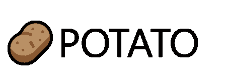
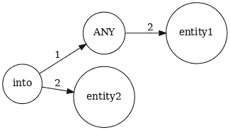
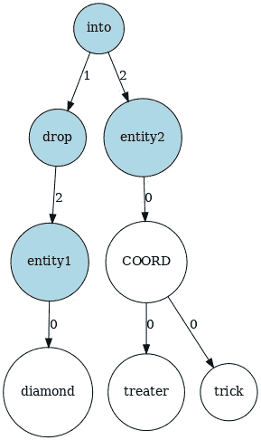
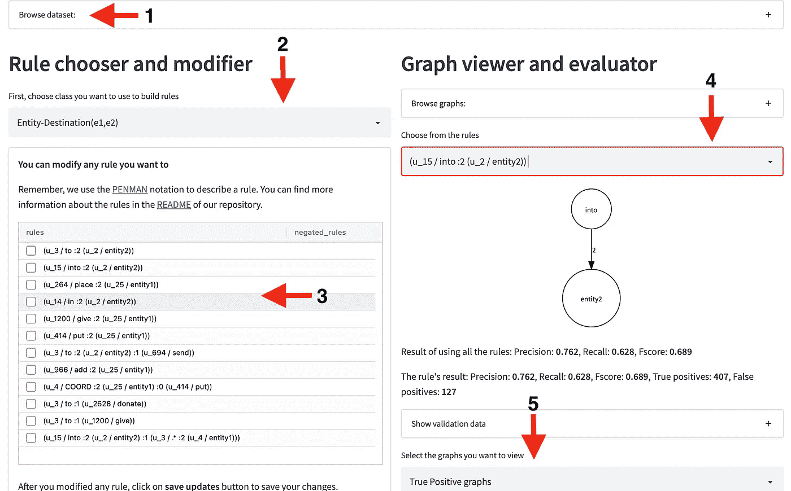
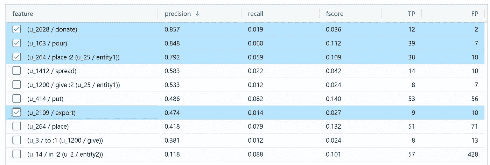

# 利用马铃薯提取可解释信息

> 原文：<https://towardsdatascience.com/using-potato-for-interpretable-information-extraction-f2081a717eb7>



作者图片

# 关于

本文是对**土豆**库的介绍。POTATO 是一个独立于语言的人在回路 XAI(可解释的人工智能)框架，用于提取和评估自然语言处理(NLP)中任何分类问题的可解释图特征。

该文章包括:

*   基于规则的文本分类方法简介
*   马铃薯图形模式定义简介
*   自动学习模式
*   人在回路(HITL)框架

# 介绍

目前，文本处理任务(和许多其他领域一样)由机器学习模型主导。但随着这些模型的参数呈指数增长，可解释性降低了。

其中可解释的模型具有以下特征[1]:

*   **公平性**——**无偏预测**
*   **隐私** —更少的信息泄露
*   **可靠性** — 输入的微小变化不会严重影响输出
*   信任、可审计性——我们知道是什么导致了这些预测
*   **可调试** —如果生产中出现错误，我们可以更改型号

最近的 NLP 解决方案在公共基准上取得了最先进的结果，这些解决方案依赖于具有数百万参数的深度学习(DL)模型(例如 BERT [2])。这些模型需要大量的训练数据，很难解释它们的决策[3]。此外，深度学习模型带来了从数据集学习非预期偏差的风险[4]。基于规则的系统可以提供准确和透明的解决方案，但构建和维护起来可能会很费时费力。POTATO 是一个快速原型框架，支持创建基于规则的文本分类器。在 POTATO 中，我们不是使用机器学习模型来直接学习任务，而是学习规则系统。使用这种方法，最终模型保持完全透明。

## 基于规则的系统

**优点**

*   基于规则的系统通过设计是可以解释和说明的
*   在“真实世界”的应用中很受欢迎，并且不需要大量的前期投资(不需要 GPU)
*   完全可定制，可调试

**缺点**

*   难以维护
*   基准测试的性能较差(基准测试主要由 DL 方法决定)
*   需要领域专业知识
*   维护和开发非常耗时

在 POTATO 中，我们试图通过结合机器学习和规则系统来解决基于规则的模型的一些缺点:学习规则！

为了演示规则系统，我们将使用来自 [Semeval 2010 关系提取](https://github.com/sahitya0000/Relation-Classification)数据集的一个例子。关系抽取是从文本中抽取实体间语义关系的任务。通常在两个实体之间定义。关系具有语义类别(例如，*目的地、成分、被使用、被建立等)..*)，任务是将关系分类到正确的类别中。

我们将只使用**实体-目的地**标签。该类的一个示例:

*   钻石**戒指(entity1)** 被丢进不给糖就捣蛋的人的**袋子(entity2)** 。

要定义规则，我们可以只使用一个简单的正则表达式:

```
r”entity1 .* dropped into .* entity2"
```

但是只使用正则表达式是一种幼稚的方法，因为我们对文本的结构一无所知(标记、语法类别等)..).我们可以使用更高级的 python 包，比如 spaCy 的 TokenMatcher 或 Holmes Extractor。有了它们，我们将能够定义一个更复杂的规则，将词性(POS)标签(单词的语法类别)考虑在内:

```
pattern = [{‘POS’: ‘VERB’},{‘LOWER’: ‘into’},{‘TEXT’: {‘REGEX’: ‘.*’}},{‘LOWER’: ‘entity2’}]
```

但是我们可以在图表上写规则，而不是在文本的符号上写规则，这可以利用文本的潜在图表结构。在 POTATO 中，我们使用 [networkx](https://networkx.org/) python 包来表示图形。有了 networkx，我们为图形表示提供了统一的接口，用户可以在任意图形上书写图形模式。在土豆中，目前我们支持三种类型的图形:*AMR*【5】， *UD* (使用节包【6】)和*4 lang*【7】。在图 1 和图 2 中可以看到一个示例模式，我们可以看到上面定义的示例的 *4lang* 图(*钻石* ***戒指*** *被放入不给糖就捣蛋的人的* ***袋子*** )和应用的模式。



图 1:图形上定义的模式示例，ANY 节点意味着我们匹配该节点中的任何字符串(图片由作者提供)



图 2:从文本和应用特征构建的 4lang [7]语义图(图片由作者提供)

与简单的正则表达式模式相反，这种模式也与以下示例相匹配:

```
The man placed the **entity1** into the **entity2**.
Industries have pushed **entity1** into fragile marine **entity2**.
I am putting the **entity1** into a MySQL **entity2**.
The **entity1** were released into the **entity2**.
```

# 使用和设置

POTATO 是一个用 python 编写的人在回路的 XAI 框架，它提供:

*   用于多个图形库(4lang、stanza、AMR)的统一 networkx 接口
*   一个 python 包，用于**学习和评估作为规则的可解释图形特征**
*   内置于[的人在回路(HITL) UI 框架简化了](https://streamlit.io)
*   REST-API 在生产模式下使用提取的特性进行推理

我们所有的组件都是在 MIT 许可下开源的，可以用 pip 安装。

该工具严重依赖于 [tuw-nlp](https://github.com/recski/tuw-nlp) 库来构建图表和匹配特征。您可以使用 pip 安装 tuw-nlp:

```
pip install **tuw-nlp**
```

然后按照[指令](https://github.com/recski/tuw-nlp)安装软件包。

然后从 pip 安装 POTATO:

```
pip install **xpotato**
```

土豆的第一个进口包装:

```
**from** xpotato.dataset.dataset **import** Dataset
**from** xpotato.models.trainer **import** GraphTrainer
```

我们将从 Semeval 数据集[8]中手动选取几个句子来展示 POTATO 的能力。

表 1:来自 [Semeval 2010 关系抽取](https://github.com/sahitya0000/Relation-Classification)数据集的例句[8]

**注意，我们用 *XXX* 和 *YYY* 替换了有问题的两个实体。**

然后，下一步是初始化数据集并提供标签编码。然后将句子解析成图形，为此我们可以使用 *parse_graphs()* 方法(也需要选择图形格式)。目前我们提供三种类型的图形: *ud* 、 *fourlang* 、 *amr* 。您还需要提供想要解析的语言。目前我们支持*英语(en)* 和*德语(de)* 。

我们将使用表 1 中的例子(我们将引用在第一列中指定了 id 的样本)。用 python 初始化的例子可以用下面的代码完成:

```
dataset = Dataset(sentences, label_vocab={"Other":0, "Entity-Destination(e1,e2)": 1})
dataset.set_graphs(dataset.parse_graphs(graph_format="fourlang"))
```

检查数据集:

```
df = dataset.to_dataframe()
```

我们还可以检查任何被解析的图形

```
**from** xpotato.models.utils **import** to_dot
**from** graphviz **import** SourceSource(to_dot(dataset.graphs[0]))
```


作者图片

# 用土豆写规则

如果数据集准备好了，图形也解析好了，我们就可以编写规则来匹配标签。我们可以手动编写规则，也可以自动提取规则(POTATO 也提供了一个两者都做的前端)。

最简单的规则就是图中的一个节点(本例中是从*到*):

```
# The syntax of the rules
# List[List[rules that we want to match]
# List[rules that shouldn't be in the matched graphs]
# Label of the rule
rule_to_match = [[["(u_1 / into)"], [], "Entity-Destination(e1,e2)"]]
```

初始化规则匹配器:

```
**from** xpotato.graph_extractor.extract **import** FeatureEvaluator
evaluator = FeatureEvaluator()
```

匹配数据集中的规则:

```
*# The function will return a dataframe with the matched instances:* evaluator.match_features(df, rule_to_match)
```

该函数将返回带有匹配示例的数据帧。该规则将匹配任何包含节点*到*的句子。在我们的例子中，我们将匹配表 1 中编号为 *0、1、2、3、4、5、6、9、14* 的例子(例如，*科学家将 XXX 倒入品脱 YYY 中。)*

我们工具的核心特性之一是我们也能够匹配子图。为了描述一个图形，我们使用[彭曼](https://github.com/goodmami/penman)符号。

例如，字符串 *(u_1 / into :1 (u_3 / pour))* 将描述一个具有两个节点(*“into”*和*“pour”*)以及它们之间带有标签“1”的单个有向边的图。用字符串*(u _ 1/into:1(u _ 2/pour):2(u _ 3/YYY))*描述一个子图，当我们只有单个节点作为特征时，只会返回 3 个例子而不是 9 个。

```
*#match a simple graph feature* evaluator.match_features(df, [[[“(u_1 / into :1 (u_2 / pour) :2 (u_3 / YYY))”], [], “Entity-Destination(e1,e2)”]])
```

*此功能将在示例 0、1、9 上匹配。*

我们还可以添加我们不想匹配的否定特征(这不会匹配存在‘pour’的第一行):

```
*# match a simple graph feature with a negated feature. 
#The negated features go into the second parameter.* evaluator.match_features(df, [[[“(u_1 / into :2 (u_3 / YYY))”], [“(u_2 / pour)”], “Entity-Destination(e1,e2)”]])
```

*匹配例 2、3、5、6。*

如果我们不想指定节点，regex 也可以用来代替节点和边名:

```
*# regex can be used to match any node (this will match instances 
# where ‘into’ is connected to any node with ‘1’ edge)* evaluator.match_features(df, [[[“(u_1 / into :1 (u_2 / .*) :2 (u_3 / YYY))”], [], “Entity-Destination(e1,e2)”]])
```

我们还可以从训练数据中*提炼*正则表达式规则，这将自动替换正则表达式。* '具有高精度的节点。

```
evaluator.train_feature("Entity-Destination(e1,e2)", "(u_1 / into :1 (u_2 / .*) :2 (u_3 / YYY))", df)
```

*这个返回****(u _ 1/into:1(u _ 2/push | pour):2(u _ 3/YYY))****【替换掉了】。* "用* ***推*******倒*** *)**

# *人在回路规则学习*

*土豆的想法是:*

*   *使用子图作为训练简单分类器(LogReg，Random Forest 等)的特征。)*
*   *仅生成特定边数的子图(以避免大量特征)*
*   *基于功能重要性向用户建议规则*
*   *通过 UI，用户可以接受、拒绝、编辑、组合模式*
*   *子图可以将正则表达式作为节点或边标签*
*   *可以细化未指定的子图*

*要从已标记的数据集中自动提取规则，请使用图表要素训练数据集，并根据相关性对其进行排序:*

```
***from** sklearn.model_selection **import** train_test_splittrain, val = train_test_split(df, test_size=0.2, random_state=1234)trainer = GraphTrainer(train)features = trainer.prepare_and_train(min_edge=1)*
```

*特征变量将包含自动提取的规则:*

```
*(u_15 / into :1 (u_26 / push))
(u_15 / into :1 (u_19 / pour :2 (u_0 / xxx)))
(u_15 / into :1 (u_19 / pour))
(u_19 / pour :2 (u_0 / xxx))
(u_15 / into :2 (u_3 / yyy))*
```

## *用户界面*

*除了前面介绍的后端，POTATO 还提供了一个 HITL 用户界面，允许用户从数据集中提取规则。为了启动 HITL 用户界面，我们需要加载一个数据集，作为一组带标签或不带标签的图形。除了我们预定义的格式( *ud，4lang，amr* )之外，任何有向图都可以加载。建议和评估规则需要基础事实标签(使用上一节描述的特征学习方法)，如果这些不可用，可以在*高级*模式下启动 UI，使用规则引导和注释标签。一旦加载了数据集，就可以启动 HITL 前端，用户将看到图 3 所示的界面，该界面是使用 [streamlit](https://streamlit.io/) 库构建的。*

*图 3 所示的前端提供:*

*   ***1 —** 数据集浏览器，允许用户查看数据集所有行的文本、图形和标签。查看器使用 [graphviz](https://graphviz.org/) 库呈现图形，并且还提供 PENMAN 符号，用户可以复制该符号来快速编辑规则。*
*   ***2 —** 用户可以选择要处理的类(如果处理多标签分类，则为数不多)。*
*   ***3 —** 为每个类构建的规则列表保存在一个列表中，它们可以被修改、删除或添加新的特性。*
*   ***4 —** 可以在训练和验证数据集上查看和评估规则。*
*   ***5 —** 可以通过查看真阳性、假阳性或假阴性示例来分析每个规则的预测。*
*   ***6 —** 按钮 suggest new rules 返回一个建议图表的列表以及它们在训练数据上的表现，允许用户选择那些应该添加到规则列表中的图表，这个界面如图 4 所示。对于包含正则表达式的规则， *Refine* 按钮将用高精度标签的析取来替换正则表达式。这个函数是使用上一节描述的方法实现的。*

**

*图 3:土豆的主页面允许用户 **1** 浏览数据集并查看处理后的图形， **2** 选择您想要在其上构建基于规则的系统的类， **3** 修改、删除、添加新规则并获得建议， **4** 查看所选规则的结果， **5** 查看每个规则的示例预测(图片由作者提供)*

**

*图 POTATO 建议的模式，按精度排序(图片由作者提供)*

*如上所述，前端是一个 streamlit 应用程序，我们可以从训练和验证数据集开始。首先用下面的代码保存它们:*

```
*train.to_pickle(“train_dataset.pickle”)
train.to_pickle(“val_dataset.pickle”)*
```

*然后，可以通过一行命令行启动 streamlit 应用程序:*

```
*streamlit run frontend/app.py -- -t train_dataset.pickle -v val_dataset.pickle*
```

*每个类的规则都以 JSON 格式自动保存到磁盘上，这个文件可以被加载用于进一步的编辑或推理。*

```
*streamlit run frontend/app.py -- -t notebooks/train_dataset -v notebooks/val_dataset -hr features.json*
```

## *高级模式*

*如果标签没有提供或者只是部分提供，前端也可以在*高级*模式下启动，用户可以在开始*注释*几个例子，然后系统根据提供的例子逐渐提供规则。*

*然后，可以启动前端:*

```
*streamlit run frontend/app.py -- -t unsupervised_dataset -m advanced*
```

## *评价*

*如果您已经准备好了特性，并且想要在测试集上评估它们，您可以运行:*

```
*python scripts/evaluate.py -d test_dataset.pickle -f features.json*
```

*结果将是一个带有标签和匹配规则的 *csv* 文件。*

## *服务*

*如果您已经准备好提取的特性，并希望在生产中使用我们的包进行推理(为句子生成预测)，我们还提供了一个构建在 POTATO 上的 REST API(基于 [fastapi](https://github.com/tiangolo/fastapi) )。*

*首先安装 FastAPI 和[uvicon](https://www.uvicorn.org/)*

```
*pip install fastapi
pip install "uvicorn[standard]"*
```

*要启动服务，您需要为服务设置*语言*、*图形 _ 类型*和*特性*。这可以通过环境变量来完成。*

*示例:*

```
*export FEATURE_PATH=/home/adaamko/projects/POTATO/features/semeval/test_features.json
export GRAPH_FORMAT=ud
export LANG=en*
```

*然后，启动 REST API:*

```
*python services/main.py*
```

*它将在端口 *8000* 上启动运行在 *localhost* 上的服务(它还将初始化正确的模型)。*

*然后，您可以使用任何客户端发出 post 请求:*

```
*curl -X POST localhost:8000 -H 'Content-Type: application/json' -d '{"text":"The suspect pushed the XXX into a deep YYY.\nSparky Anderson is making progress in his XXX from YYY and could return to managing the Detroit Tigers within a week."}'*
```

*答案将是一个带有预测标签的列表(如果没有匹配的规则，它将返回“无”):*

```
*["Entity-Destination(e1,e2)","NONE"]*
```

*streamlit 前端也有一个*推理*模式，可以使用实现的规则系统进行推理。可以从以下方面入手:*

```
*streamlit run frontend/app.py -- -hr features/semeval/test_features.json -m inference*
```

# *结论*

*POTATO 能够快速构建基于规则的系统，并为 NLP 任务的深度学习模型提供透明、可解释和可审计的替代解决方案。如果你想阅读更多关于这个框架的内容，或者想尝试一下，你可以查看以下资源:*

*   *你可以查看我们题为[土豆:可解释的信息提取框架](https://arxiv.org/pdf/2201.13230.pdf)的论文*
*   *该框架的代码可以在 GitHub 上获得，使用麻省理工学院的许可:[https://github.com/adaamko/POTATO](https://github.com/adaamko/POTATO)，你也可以查看知识库，获得更多的例子和多个任务的预建规则系统*
*   *关于这个框架的研讨会的幻灯片也可以得到*
*   *查看我们关于该工具的快速演示(约 2 分钟)视频:[https://youtu.be/PkQ71wUSeNU](https://youtu.be/PkQ71wUSeNU)*
*   *更长的版本有详细的方法描述和背景研究(约 1 小时):[https://youtu.be/6R_V1WfIjsU](https://youtu.be/6R_V1WfIjsU)*

# *参考*

*[1] Doshivelez 等人，迈向可解释机器学习的严格科学，(2019)*

*[2] Devlin 等人，[用于语言理解的深度双向转换器的预训练](https://aclanthology.org/N19-1423)，(2019)*

*[3] Serrano 等人，[注意是可解释的吗？](https://aclanthology.org/P19-1282)，(2019)*

*[4] Bender 等人，[论随机鹦鹉的危险:语言模型会不会太大？](https://doi.org/10.1145/3442188.3445922,)(2021)*

*[5]巴纳雷斯库等，【Sembanking 的抽象意义表示，(2013)*

*[6]齐等， [Stanza:面向多种人类语言的 Python 自然语言处理工具包](https://www.aclweb.org/anthology/2020.acl-demos.14)，(2020)*

*[7]科尔奈等著，[语义学](http://kornai.com/Drafts/sem.pdf) (2019)*

*[8] Hendrix 等， [SemEval-2010 任务 8:名词对之间语义关系的多向分类](https://aclanthology.org/S10-1006.pdf) (2010)*