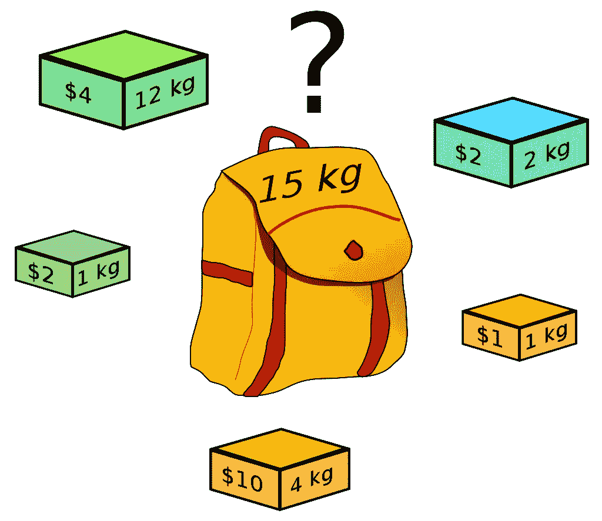
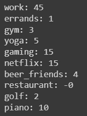

# 使用 Python 和运筹学优化你的快乐

> 原文：<https://towardsdatascience.com/using-python-and-operational-research-to-optimize-your-happiness-d96ab12bfb7b>

## 使用 Gurobi 和背包问题寻找最优解

来源:https://unsplash.com/photos/u0vgcIOQG08

在不知道的情况下，人们不断地试图优化他们的生活。例如，通过去度假，你决定这次旅行是值得的，即使会有经济上的损失。

可悲的是，你不能把所有的时间都花在寻找快乐上。大多数人也必须考虑他们的长期福祉。

事实上，在一个特定的早晨，一个人可能更喜欢去跳伞而不是去工作。然而，最终，如果这个人从不去工作，而是去跳伞，他将很快花光所有的钱，失去工作，再也负担不起去跳伞了。

工作和娱乐之间的平衡很难找到。为了最大化我的幸福，我如何决定采取哪些行动？

这听起来很像经典运筹学中的背包问题。

> 背包问题是一个组合优化问题，你有一组物品，它们有一定的价值和体积，你想把它们放进背包里。考虑到背包容量有限，你要决定哪些物品放在包里才能实现价值最大化。

来源:https://en.wikipedia.org/wiki/Knapsack_problem

# 问题是

在我们的例子中，我们可以从活动、它们带来的快乐和它们的成本(时间和金钱)来考虑，而不是物体、价值和体积(就像背包问题)。

在下面的例子中，我将展示一个**虚构的例子**，关于一个人如何决定他的周计划来最大化他的幸福和快乐。

本文还将向您展示如何使用 Python 解决运筹学问题。我将使用 Gurobi(特别是 Gurobi Optimizer)，这是一款令人惊叹的产品，可以让您轻松地建模和解决所有类型的运筹学问题。

## 1.变量

问题的第一步是确定需要做什么活动。对于每项活动，您还需要指定:

1.  做这件事的成本(在这个例子中是 1 小时)
2.  它带来的快乐(从 1 到 10 分)
3.  这对你的健康有多大好处(财务、身体、精神等)。).再从 1 到 10 打分。
4.  你能在这个特定活动上花费的最少和最多的时间。
5.  你的总预算，也就是你每周可以在“活动”上花多少钱。
6.  你有多少时间，除去睡眠，交通等等。

例如，这个人不太喜欢去健身房(快乐= 1)。然而，它被认为对整体健康非常有益。另一方面，游戏是令人愉快的，但对健康没有太大的帮助。

当然，这里的挑战是填写所有这些。一项活动能带来多大的乐趣？对你有多好？这很主观，很难量化。只有实践的人才知道什么是正确的价值观！这取决于你在生活中想要什么，你的目标是什么等等。

## 2.制约因素

一旦我们有了变量，我们就可以向模型添加约束。这是我们确保我们的最终解决方案将遵守前面指定的规则的地方。

*   第 4 行:我们指定变量是整数，也就是数字
*   第 7 行:花费的总金额必须低于或等于我们的预算
*   第 10 行和第 13 行:我们必须考虑每个变量的最小值和最大值。换句话说，如果一个人说他必须工作 35 到 45 个小时，那么他必须得到尊重
*   第 16 行:花在我们所有不同活动上的时间总和必须等于指定的时间

## 3.目标函数

现在，是时候优化我们的目标了。这个目标因人而异！有的只是想尽可能的享受生活。其他人想要更多的工作来获得晋升。其他人想要一个完美的平衡。每个人的函数都不一样，因为每个人对幸福的定义都不一样。

这是本例中使用的目标函数。

如你所见，这里的目标是最大化快乐和幸福的总和。然而，快乐比幸福更重要，因为后者乘以 0.75。

## 4.解决方案

我们终于可以优化我们的问题，得到我们的最优解！

这是结果。

所以下面这个人，为了优化他的目标函数(以及他的幸福)，必须每周工作 45 小时，打 2 小时高尔夫，看 15 分钟网飞，等等。

基于这个人所指定的一切，这将优化他的目标函数并使他最快乐！

# 外卖食品

首先，这是一个非常普遍的问题，但是你总是可以添加更多的约束、变量等。让它更复杂，更能代表真实世界。我举了一周的例子，但也可能是一个月，一年…随你怎么想！Gurobi 使得这样做非常容易。看这里！[https://www.gurobi.com/documentation/9.5/refman/refman.html](https://www.gurobi.com/documentation/9.5/refman/refman.html)

第二，我在这篇文章中展示的整个解决问题的方法显然是非常主观的，而且远非完美。然而，我在这样做的时候意识到，这实际上是一次伟大的自省练习。对你来说什么是重要的？你如何评价你所做的事情，它们对你生活的影响？

花时间思考并确定你的目标函数是什么，一项特定的活动能给你带来多少快乐，等等。可能会让你意识到你所做的活动和你花在这些活动上的时间并不能真正帮助你实现你想要的。

非常感谢你的阅读，我希望你喜欢它！如果你有任何问题，不要犹豫。

要成为会员并无限制地访问更多像这样的精彩内容，请点击这里:[https://francoisstamant.medium.com/membership](https://francoisstamant.medium.com/membership)