# 使用 Python Argparse 开发命令行界面程序

> 原文：<https://towardsdatascience.com/using-python-argparse-to-develop-a-command-line-interfaced-program-73040940ca94>


图片来自 [Pixabay](https://pixabay.com/?utm_source=link-attribution&utm_medium=referral&utm_campaign=image&utm_content=6574455) 的[赫尔维·拉格朗日](https://pixabay.com/users/lagrangeherv%C3%A9-22927133/?utm_source=link-attribution&utm_medium=referral&utm_campaign=image&utm_content=6574455)

## 开发 Linux 系统程序的方法

每个人都喜欢 GUI(图形用户界面),因为它简化了人和计算机之间的交互。但是，有时(CLI)命令行界面可能更方便。这可能是因为我们只想做一个简单的任务，或者我们正在使用一个基于 Linux 的操作系统，而没有安装 GUI。

当我们开发一个 CLI 程序时，在大多数情况下，我们必须提供参数，以便程序能够根据传入的参数以不同的方式做出反应。

你知道 Python 内置了这个特性吗？在本文中，我将介绍 Python 的 Argparse 模块。我们甚至可以使用 Python 开发一个类似`ls`的 CLI 程序。

# 1.位置参数


图片来自 [Pixabay](https://pixabay.com/?utm_source=link-attribution&utm_medium=referral&utm_campaign=image&utm_content=2979107) 的 [Gino Crescoli](https://pixabay.com/users/absolutvision-6158753/?utm_source=link-attribution&utm_medium=referral&utm_campaign=image&utm_content=2979107)

有时，我们只需要一个或几个参数，这些参数对程序来说是强制性的。在这种情况下，位置参数可能是一个不错的选择。

假设我们正在开发一个 CLI 程序，它需要用户的名字，然后打印一条问候消息。代码可以如下所示。

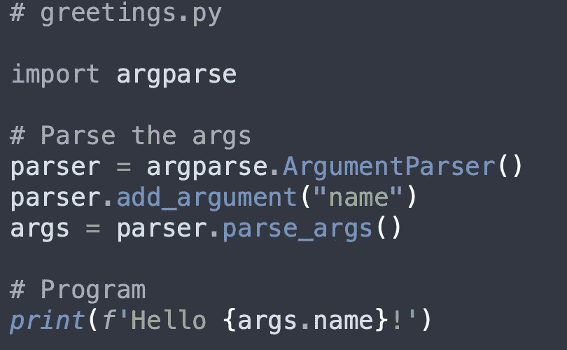

```
# content of greetings.pyimport argparse# Parse the args
parser = argparse.ArgumentParser()
parser.add_argument("name")
args = parser.parse_args()# Program
print(f'Hello {args.name}!')
```

我们编写了这个 Python 脚本，并将其命名为`greeting.py`。在脚本文件中，我们需要导入 Argparse。然后，我们可以使用`ArgumentParser`类来实例化解析器。之后，我们可以使用`add_argument()`函数添加一个参数。`"name"`将是参数的名称，稍后将用作获取参数值的关键。

然后，让我们保存文件并在命令行中运行它进行测试！

```
$ python greeting.py Chris
```

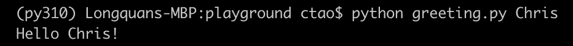

如果我们忘记传递参数，Argparse 会很聪明地告诉我们错误，如下所示。

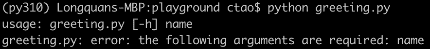

# 2.帮助说明


图片由 [Sid74](https://pixabay.com/users/sid74-4893366/?utm_source=link-attribution&utm_medium=referral&utm_campaign=image&utm_content=3273337) 发自 [Pixabay](https://pixabay.com/?utm_source=link-attribution&utm_medium=referral&utm_campaign=image&utm_content=3273337)

我们可能想把我们的程序分发给更多的用户。或者，有时我们可能会忘记论点。因此，总是建议在所有参数中添加一些帮助说明。

默认情况下，Argparse 具有“帮助”特性。如果我们用`-h`标志运行程序，将会显示帮助指令。

```
$ python greeting.py -h
```

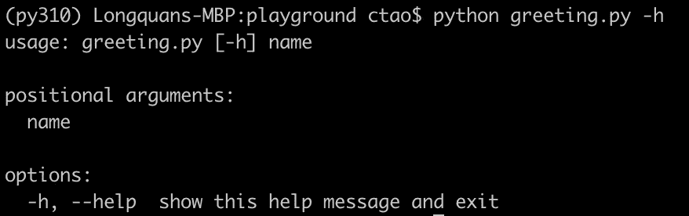

然而，它并没有显示出我们所定义的论点。我们可以在`add_argument()`函数中添加帮助消息，如下所示。

```
parser.add_argument("name", help='Enter your name')
```

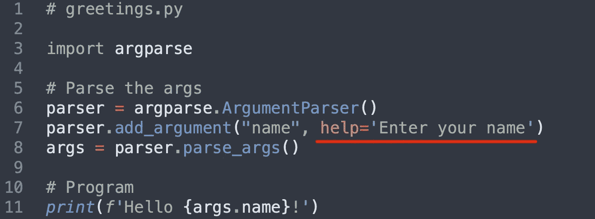

现在，如果我们再次显示帮助说明，将会有关于该参数的帮助。

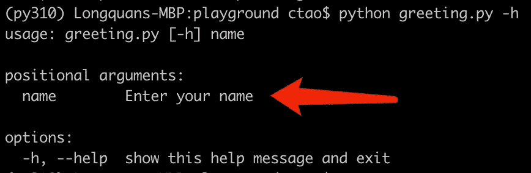

# 3.自变量类型指示器


图片来自 [Pixabay](https://pixabay.com/?utm_source=link-attribution&utm_medium=referral&utm_campaign=image&utm_content=4014181) 的 [_Alicja_](https://pixabay.com/users/_alicja_-5975425/?utm_source=link-attribution&utm_medium=referral&utm_campaign=image&utm_content=4014181)

有时我们可能需要获得不同类型的信息。例如，我们希望用户输入他们的年龄，然后计算他们出生的年份。`greeting.py`增加了一个参数，代码如下。

```
# greetings.pyimport argparse# Parse the args
parser = argparse.ArgumentParser()
parser.add_argument("name", help='Enter your name')
parser.add_argument("age", help='Enter your age', type=int)
args = parser.parse_args()# Program
born_year = 2022 - args.age
print(f'Hello {args.name}! You were borned in {born_year}.')
```

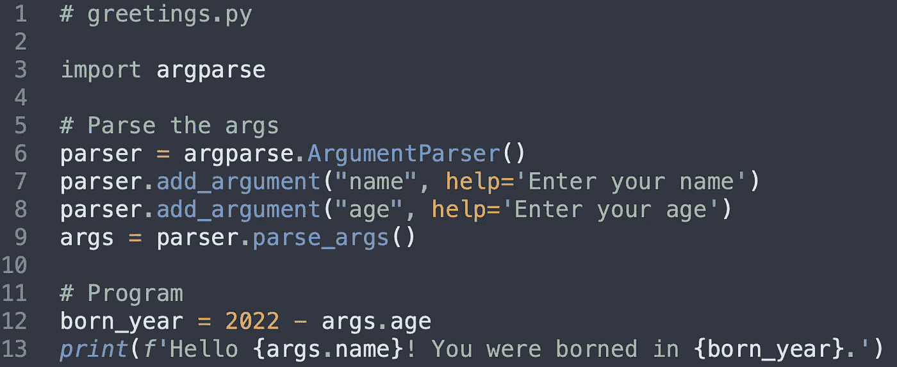

现在，如果我们在命令行中运行程序，我们将会因为类型问题而得到一个错误。

```
$ python greeting.py Chris 34
```

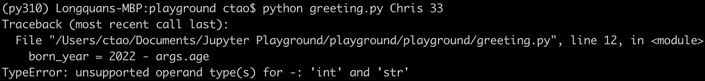

为了解决这个问题，我们可以在`add_argument()`函数中添加一个类型指示器。

```
parser.add_argument("age", help='Enter your age', type=int)
```

现在，我们可以再次测试程序。

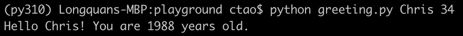

当然，即使我们传入的参数默认是字符串，我们仍然可以在运行时转换类型。但是，我们需要手动处理异常。在这里使用类型指示器的好处在于，它会在程序启动之前做一个简单的检查。

```
$ python greeting.py Chris "thirty four"
```

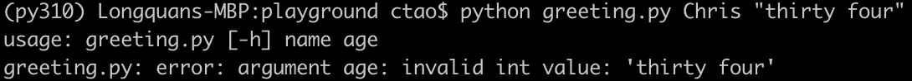

# 4.可选参数


图片来自 [Pixabay](https://pixabay.com/?utm_source=link-attribution&utm_medium=referral&utm_campaign=image&utm_content=265131) 的[沃纳·莫泽](https://pixabay.com/users/pixelcreatures-127599/?utm_source=link-attribution&utm_medium=referral&utm_campaign=image&utm_content=265131)

有时候，我们可能需要一些可选参数。例如，在程序的典型使用中它们不是必需的，但是如果用户想要一些定制的行为，他们将需要指定它们。

假设我们想给`greeting.py`程序添加一些详细的日志。当启用 verbose 时，将输出计算结果用于调试。因此，我们可以添加如下可选参数。

```
parser.add_argument("--verbose", help='Display verbose logs', type=bool)
```

请注意，Python Argparse 将理解当我们在参数名前面加双破折号`--`时，这个参数将是可选的。

现在，如果启用了 verbose，我们将输出如下内容。

```
if args.verbose:
    print(f'2022 - {args.age} = {born_year}')
```

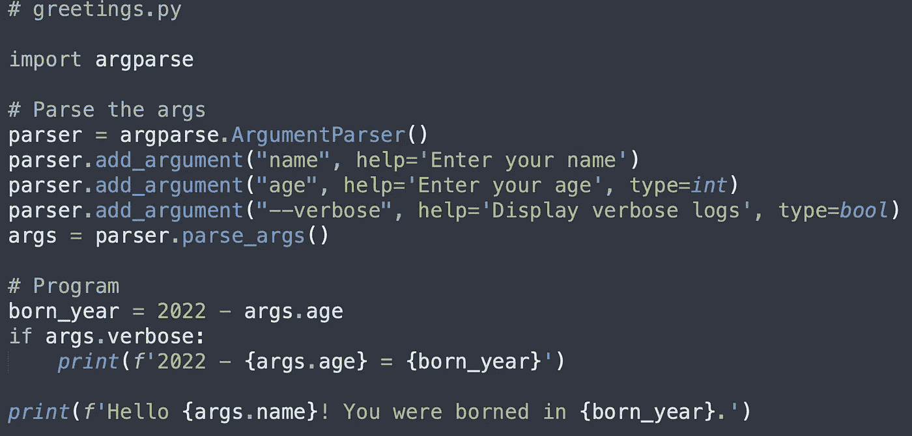

现在，我们可以运行程序来测试。


## 布尔类型参数

它可以工作，但是有点奇怪。也就是说，如果参数是 bool 类型，我们就不需要向它传递`True`值。在 Argparse 中，如果要实现这样的特性，需要在参数中加入`action="store_true"`。

```
parser.add_argument("--verbose", help='Display verbose logs', action="store_true")
```

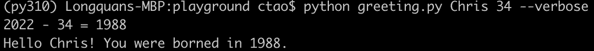

如果指定了选项，将值`True`分配给`args.verbose`。不指定它意味着`False`。

还是不完美。如果您是 Linux 用户，您一定知道为了方便起见，选项标志应该有一个简短的版本。为了实现这一点，我们需要在完整的参数名称前面传递简短的版本。

```
parser.add_argument("-v", "--verbose", help='Display verbose logs', action="store_true")
```

现在，我们不必键入整个单词“verbose”。

```
$ python greeting.py Chris 34 -v
```

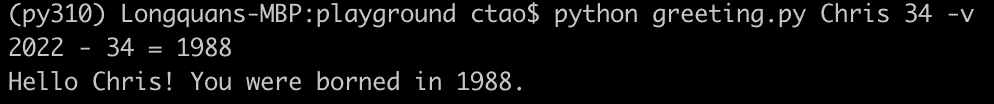

## 组合位置参数和可选参数

我们现在既有位置参数，也有可选参数。如果我们调用帮助消息，它将如下。

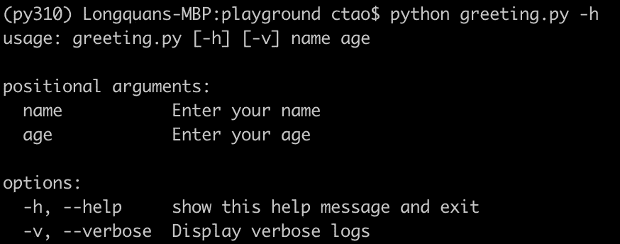

顾名思义，位置参数必须按照定义的顺序。但是，可选参数可以放在任何地方。

```
$ python greeting.py -v Chris 34
$ python greeting.py Chris -v 34
$ python greeting.py Chris 34 -v
```

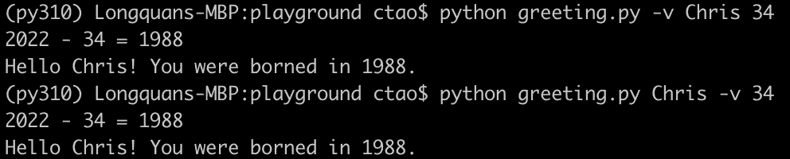

如果我们有多个可选参数，那么顺序也没有关系，因为可选参数需要指定参数名称以避免任何歧义。

# 5.Argparse 的缺点


图片来自 [Pixabay](https://pixabay.com/?utm_source=link-attribution&utm_medium=referral&utm_campaign=image&utm_content=6110175)

Argparse 有很多优点。比如它是一个 Python 内置模块，不需要下载安装。但是，弊端也很明显。

1.它有一种内在的行为来猜测某件事是一个论点还是一个选项。当处理不完整的命令行时，这就成了一个问题。这意味着在不完全了解命令行的情况下，行为可能是不可预测的。

2.当我们需要一些更高级的特性，比如参数值的复杂验证时，它不是很容易使用。

因此，许多令人惊叹的第三方开源库试图掩盖 Argparse 的这些缺点。点击库就是其中之一。

 [## 欢迎使用点击-点击文档(8.0.x)

### Click 是一个 Python 包，可以用最少的代码以可组合的方式创建漂亮的命令行界面…

click.palletsprojects.com](https://click.palletsprojects.com/en/8.0.x/) 

如果你对这个库感兴趣，请关注我的帖子。我将很快发表另一篇关于这个图书馆的文章！

# 摘要


图片由来自 [Pixabay](https://pixabay.com/?utm_source=link-attribution&utm_medium=referral&utm_campaign=image&utm_content=502973) 的 [Michael Schwarzenberger](https://pixabay.com/users/blickpixel-52945/?utm_source=link-attribution&utm_medium=referral&utm_campaign=image&utm_content=502973) 拍摄

在本文中，我介绍了 Python 内置模块之一 Argparse。它允许我们非常容易地开发命令行界面工具。我们可以用它来定义位置参数和可选参数。它也有现成的帮助说明，所以我们只需要为每个参数写一个字符串。

然而，当我们有一些更复杂的需求时，它也有一些缺点。这些缺点可以通过一些第三方库来消除，以后我的帖子会重点介绍。

[](https://medium.com/@qiuyujx/membership) [## 通过我的推荐链接加入灵媒-陶

### 作为一个媒体会员，你的会员费的一部分会给你阅读的作家，你可以完全接触到每一个故事…

medium.com](https://medium.com/@qiuyujx/membership) 

**如果你觉得我的文章有帮助，请考虑加入灵媒会员来支持我和成千上万的其他作家！(点击上面的链接)**