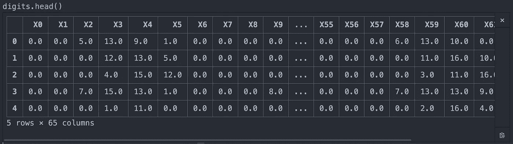
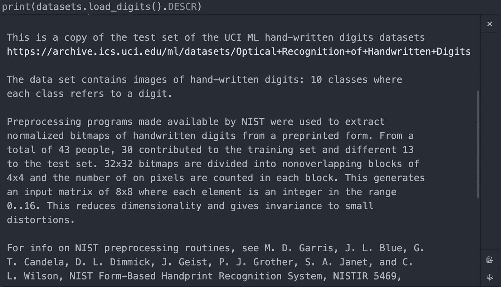
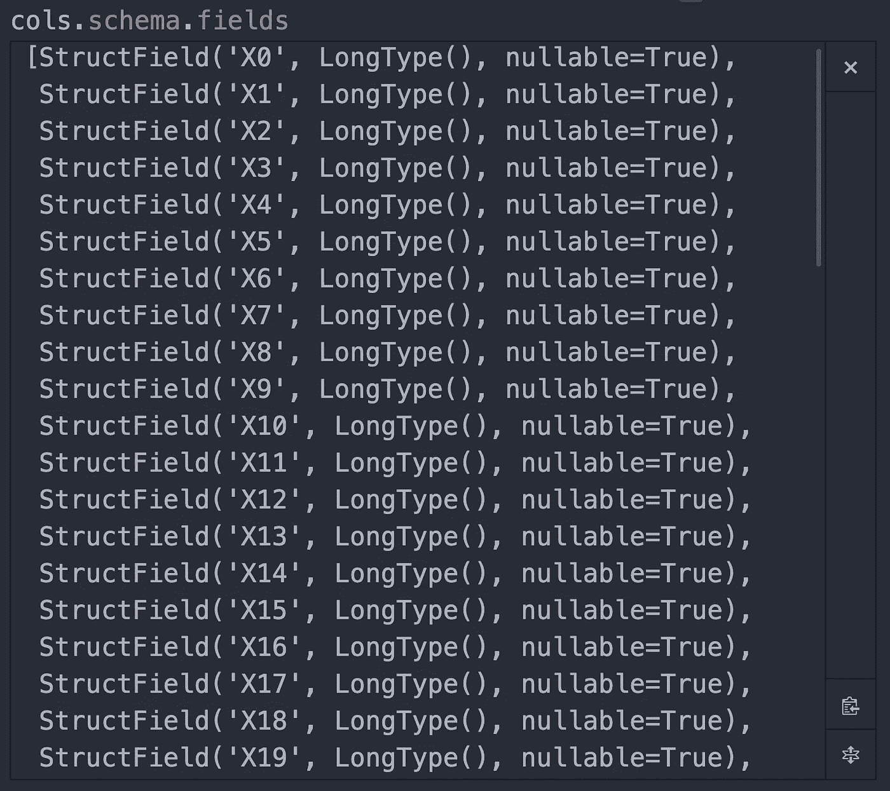
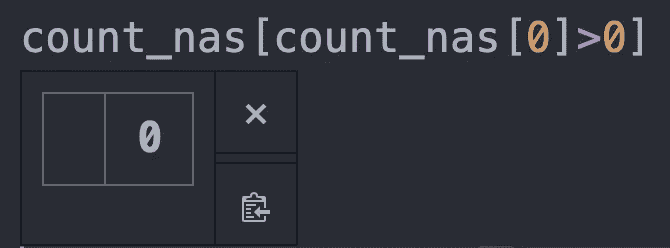
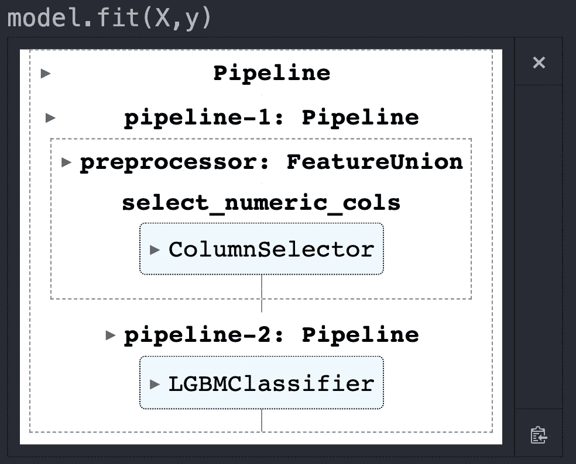
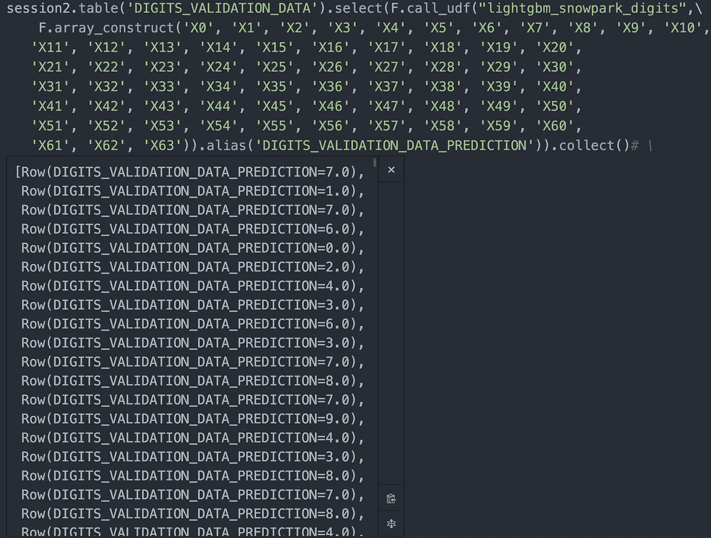

# 使用 Python UDF 和 Snowflake 的 Snowpark 构建和部署机器学习模型，第 1 部分

> 原文：<https://towardsdatascience.com/using-python-udfs-and-snowflake-s-snowpark-to-build-and-deploy-machine-learning-models-a3c160c06d85>


照片来自[阿莱西奥·索格蒂](https://unsplash.com/@asoggetti)通过 [Unsplash](https://unsplash.com/)

本指南将向您展示如何将雪花的 Snowpark 与 Python UDF 的结合使用，以利用雪花的计算能力来运行使用 Python 的机器学习模型。

**导入库**

```
import snowflake.connector
import pandas as pd
import numpy as np
from sqlalchemy import create_engine
from snowflake.sqlalchemy import URLfrom snowflake.connector.pandas_tools import write_pandas
from snowflake.snowpark.functions import udf
from snowflake.snowpark.types import IntegerType, StringType, StructType, FloatType
from snowflake.snowpark.session import Session
from snowflake.snowpark import Session
import snowflake.snowpark.functions as F
from snowflake.snowpark import types as T
from snowflake.snowpark import Window
from snowflake.snowpark.functions import udf, max, min, count, avg, sum, col, lit, listagg
import mlxtend
from mlxtend.feature_selection import ColumnSelectorimport lightgbm as lgb
from sklearn.model_selection import GridSearchCV, train_test_split
from sklearn.preprocessing import MultiLabelBinarizer, OneHotEncoder, FunctionTransformer
from sklearn.pipeline import make_pipeline, Pipeline, FeatureUnion
from sklearn.compose import ColumnTransformer
from sklearn.ensemble import GradientBoostingClassifier, RandomForestClassifier
from sklearn.feature_extraction.text import CountVectorizer, TfidfVectorizer
from sklearn.metrics import balanced_accuracy_score
from sklearn import datasets
```

**数据**

我们将使用来自 sklearn 数据集(Alpaydin，E. & Kaynak，C)的[数字](https://archive-beta.ics.uci.edu/ml/datasets/optical+recognition+of+handwritten+digits)数据集。这个数据集是在[知识共享署名 4.0 国际](https://creativecommons.org/licenses/by/4.0/legalcode) (CC BY 4.0)许可下许可的。

这允许为任何目的共享和改编数据集，只要给予适当的信任。

```
digits = pd.DataFrame(datasets.load_digits().data)
digits['target'] = datasets.load_digits().target
digits.head()
```



作者图片

```
print(datasets.load_digits().DESCR)
```



作者图片

让我们将数字数据分成训练和测试，并将它们作为单独的表保存在雪花中。我们稍后可以使用 Snowpark 连接到这些:

```
#Set up the snowflake connection
ctx = snowflake.connector.connect(
    user='<user>',
    password='<password>',
    account='<account-identifier>',
    database='<database>',
    warehouse='<warehouse>',
    role='<role>',
    schema='<schema>'
    )#Create column names for the tables 
cols1=['X' + str(x) for x in range(0,64)]
cols1.append('TARGET')digits.columns=cols1
X=digits.drop(columns='TARGET')
y=digits['TARGET']
X_train, X_valid, y_train, y_valid = train_test_split(X, y, random_state=1234, test_size=.33)#Create the DataFrame with the features and target for the validation data set
train=pd.concat([X_train,y_train], axis=1)
valid=pd.concat([X_valid,y_valid], axis=1)#Match the snowflake table column names to the Digits data column names
snowflake_cols=['X' + str(x) + ' integer' for x in range(0,64)]
s = ', '.join(snowflake_cols)#Create the training table in snowflake from the csv
ctx.cursor().execute(
"""CREATE OR REPLACE TABLE
DIGITS_TRAINING_DATA(""" + s + """, target integer)""")#Copy the table into snowflake
write_pandas(ctx, train, 'DIGITS_TRAINING_DATA')#Create the validation table in snowflake from the csv
ctx.cursor().execute(
"""CREATE OR REPLACE TABLE
DIGITS_VALIDATION_DATA(""" + s + """, target integer)""")#Copy the table into snowflake
write_pandas(ctx, valid, 'DIGITS_VALIDATION_DATA')
```

**建模**

连接到 Snowpark 中的数据:

```
#Create snowpark session to connect to saved tables. 
def create_session_object():
   connection_parameters = {
      "account": "<account-identifier>",
      "user": "<user>",
      "password": "<password>",
      "role": "<role>",
      "warehouse": "<warehouse>",
      "database": "<database>",
      "schema": "<schema>"
   }
   session = Session.builder.configs(connection_parameters).create()
   print(session.sql('select current_warehouse(), current_database(), current_schema()').collect())
   return session#Create two sessions, one for pulling the initial data, and one for pushing the udf to snowpark. I've found it tends to fail if I use just one session
session=create_session_object()
session2=create_session_object()cols=session.table('DIGITS_TRAINING_DATA')
cols.schema.fields
```



作者图片

将数据从雪花带到我们的本地环境:

```
tbl=pd.DataFrame(cols.collect())
```

检查缺少的值:

```
count_nas=pd.DataFrame(tbl.isna().sum())
count_nas[count_nas[0]>0]
```



作者图片

如果有缺失值，我们可以用以下内容来填充它们:

```
tbl=tbl.fillna(0)
```

分为特征和响应变量:

```
#This is already our training set so no need to use train_test_split here. 
X=tbl.drop(columns='TARGET')
y=tbl['TARGET']
```

为所有功能构建一个管道预处理器:

```
numeric_features=['X0', 'X1', 'X2', 'X3', 'X4', 'X5', 'X6', 'X7', 'X8', 'X9', 'X10',
       'X11', 'X12', 'X13', 'X14', 'X15', 'X16', 'X17', 'X18', 'X19', 'X20',
       'X21', 'X22', 'X23', 'X24', 'X25', 'X26', 'X27', 'X28', 'X29', 'X30',
       'X31', 'X32', 'X33', 'X34', 'X35', 'X36', 'X37', 'X38', 'X39', 'X40',
       'X41', 'X42', 'X43', 'X44', 'X45', 'X46', 'X47', 'X48', 'X49', 'X50',
       'X51', 'X52', 'X53', 'X54', 'X55', 'X56', 'X57', 'X58', 'X59', 'X60',
       'X61', 'X62', 'X63']numeric_cols = Pipeline(steps=[
    ('selector', ColumnSelector(numeric_features))])# Combine categorical and numerical pipeline with FeatureUnion
preprocessor = FeatureUnion([
    ('select_numeric_cols',numeric_cols)
])pipe_feat_un = Pipeline(steps=[('preprocessor', preprocessor)])
```

如果您在建模之前有一些变量转换要做，那么您可以使用管道来实现它们，它们将与 udf 中的模型一起打包。

将轻型 gbm 模型添加到管线中:

```
clf = make_pipeline(lgb.LGBMClassifier())
model = make_pipeline(pipe_feat_un, clf)
```

根据训练数据拟合模型:

```
model.fit(X,y)
```



作者图片

在雪花中将模型保存为 udf

```
session2.clear_packages() #Clear out all existing packagessession2.clear_imports() #Clear out all existing importssession2.add_import('/opt/anaconda3/lib/python3.8/site-packages/mlxtend') #Add mlxtend as an import, since it is not available within Snowparksession2.add_packages('scikit-learn','lightgbm','pandas') #Add these packages to the udf, which exist in Snowpark session2.sql('create stage if not exists MODELSTAGE').collect() #Create a model stage if it does not already exist. 
```


作者图片

我想调用 add_import 函数。如果 Snowpark 中没有您需要的库，您可以很容易地添加它们。这增加了使用 Snowpark 的灵活性。

创建 Python udf:

```
[@udf](http://twitter.com/udf)(name='lightgbm_snowpark_digits',is_permanent = True, stage_location = '[@MODELSTAGE](http://twitter.com/MODELSTAGE)', replace=True, session=session2)def predict_digits(args: list) -> float:
    row = pd.DataFrame([args], columns=['X0', 'X1', 'X2', 'X3', 'X4', 'X5', 'X6', 'X7', 'X8', 'X9', 'X10',
       'X11', 'X12', 'X13', 'X14', 'X15', 'X16', 'X17', 'X18', 'X19', 'X20',
       'X21', 'X22', 'X23', 'X24', 'X25', 'X26', 'X27', 'X28', 'X29', 'X30',
       'X31', 'X32', 'X33', 'X34', 'X35', 'X36', 'X37', 'X38', 'X39', 'X40',
       'X41', 'X42', 'X43', 'X44', 'X45', 'X46', 'X47', 'X48', 'X49', 'X50',
       'X51', 'X52', 'X53', 'X54', 'X55', 'X56', 'X57', 'X58', 'X59', 'X60',
       'X61', 'X62', 'X63'])
    return model.predict(row)
```

预测的三个选项:

1.  使用 Snowpark 使用我们保存的 udf 进行预测，并将数据带回本地环境:

```
session2.table('DIGITS_VALIDATION_DATA').select(F.call_udf("lightgbm_snowpark_digits",\
    F.array_construct('X0', 'X1', 'X2', 'X3', 'X4', 'X5', 'X6', 'X7', 'X8', 'X9', 'X10',
   'X11', 'X12', 'X13', 'X14', 'X15', 'X16', 'X17', 'X18', 'X19', 'X20',
   'X21', 'X22', 'X23', 'X24', 'X25', 'X26', 'X27', 'X28', 'X29', 'X30',
   'X31', 'X32', 'X33', 'X34', 'X35', 'X36', 'X37', 'X38', 'X39', 'X40',
   'X41', 'X42', 'X43', 'X44', 'X45', 'X46', 'X47', 'X48', 'X49', 'X50',
   'X51', 'X52', 'X53', 'X54', 'X55', 'X56', 'X57', 'X58', 'X59', 'X60',
   'X61', 'X62', 'X63')).alias('DIGITS_VALIDATION_DATA_PREDICTION')).collect()
```



作者图片

2.使用 Snowpark 使用我们保存的 udf 进行预测，并将输出保存为雪花中的一个表:

```
session2.table('DIGITS_VALIDATION_DATA').select(F.call_udf("lightgbm_snowpark_digits",\
    F.array_construct('X0', 'X1', 'X2', 'X3', 'X4', 'X5', 'X6', 'X7', 'X8', 'X9', 'X10',
   'X11', 'X12', 'X13', 'X14', 'X15', 'X16', 'X17', 'X18', 'X19', 'X20',
   'X21', 'X22', 'X23', 'X24', 'X25', 'X26', 'X27', 'X28', 'X29', 'X30',
   'X31', 'X32', 'X33', 'X34', 'X35', 'X36', 'X37', 'X38', 'X39', 'X40',
   'X41', 'X42', 'X43', 'X44', 'X45', 'X46', 'X47', 'X48', 'X49', 'X50',
   'X51', 'X52', 'X53', 'X54', 'X55', 'X56', 'X57', 'X58', 'X59', 'X60',
   'X61', 'X62', 'X63')).alias('DIGITS_VALIDATION_DATA_PREDICTION')).write.mode('overwrite').saveAsTable('light_gbm_snowpark_digits_validation')#The array construct is how Snowflake passes in the data to the udf as a single column array of all the data, similar to Spark's feature vector format. 
```

在 Snowpark 中连接到的仓库、数据库和模式中，您现在可以在 Snowflake 中看到保存的表。

3.在雪花中使用 sql 代码调用 udf，然后在雪花中对表中的数据进行预测:

```
select lightgbm_snowpark_digits(array_construct(X0, X1, X2, X3, X4, X5, X6, X7, X8, X9, X10,
 X11, X12, X13, X14, X15, X16, X17, X18, X19, X20,
 X21, X22, X23, X24, X25, X26, X27, X28, X29, X30,
 X31, X32, X33, X34, X35, X36, X37, X38, X39, X40,
 X41, X42, X43, X44, X45, X46, X47, X48, X49, X50,
 X51, X52, X53, X54, X55, X56, X57, X58, X59, X60,
 X61, X62, X63)) from ”DIGITS_VALIDATION_DATA”;
```

我希望您喜欢这篇快速指南，它讲述了如何训练一个本地模型，将其打包成一个 udf，使用 Snowpark 将该 udf 上传到 Snowflake，然后使用 Snowpark 或 Snowflake 对该数据进行预测。

**参考文献:**

阿尔帕丁和凯纳克..(1998).手写数字的光学识别。UCI 机器学习知识库。