# 使用 Python UDF 和 Snowflake 的 Snowpark 构建和部署机器学习模型，第 2 部分

> 原文：<https://towardsdatascience.com/using-python-udfs-and-snowflake-s-snowpark-to-build-and-deploy-machine-learning-models-part-2-2fe40d382ae7>

## 如何训练和预测所有上传到 Snowpark 的 UDF


图片来自 [Anthi K](https://unsplash.com/@anthi98) 通过 [Unsplash](https://unsplash.com)

**********

**更新:**在与雪花交谈后，我在这里尝试复制的这个方法是为了一次训练多个模型，每个模型高达 16mb 的数据。同样，使用雪花进行计算，最大文件大小为 5GB。所以任何大数据还是需要在 Spark 这样的东西里做。他们有一个更大文件的私人预览，但目前还没有对公众开放。

我认为 python 存储过程或第 1 部分是使用雪花构建和部署机器学习模型的最佳选择。

**********

在[第 1 部分](https://medium.com/@chriskuchar/using-python-udfs-and-snowflake-s-snowpark-to-build-and-deploy-machine-learning-models-a3c160c06d85)中，我展示了如何训练一个本地模型，将其包装在 Python udf 中，使用 Snowpark 将其推送到雪花，并使用 Snowpark 或雪花 Sql 使用该 udf 进行预测。

另一方面，本指南将向您展示如何使用 Snowpark 和 Snowflake compute 创建一个 Python udf 来构建、训练和预测模型。我们将在这里使用回归，而第 1 部分使用分类。

本文还将强调我在使用 Snowpark 和 Python udf 时发现的一些局限性。

我使用了 Github 上的 [snowflake's guide 中的这个指南来获得构建它的主要框架。](https://github.com/Snowflake-Labs/sfguide-citibike-ml-snowpark-python/blob/main/03_ML_Engineering.ipynb)

**导入库**

```
import snowflake.connector
import pandas as pd
import numpy as np
from sqlalchemy import create_engine
from snowflake.sqlalchemy import URLfrom snowflake.connector.pandas_tools import write_pandas
from snowflake.snowpark.functions import udf
from snowflake.snowpark.types import IntegerType, StringType, StructType, FloatType
from snowflake.snowpark.session import Session
from snowflake.snowpark import Session
import snowflake.snowpark.functions as F
from snowflake.snowpark import types as T
from snowflake.snowpark import Window
from snowflake.snowpark.functions import udf, max, min, count, avg, sum, col, lit, listagg
import mlxtend
from mlxtend.feature_selection import ColumnSelectorimport lightgbm as lgb
from sklearn.model_selection import GridSearchCV, train_test_split
from sklearn.pipeline import make_pipeline, Pipeline, FeatureUnion
from sklearn import datasets
```

**数据**

我们将解决一个回归问题，使用来自 sklearn 数据集的[糖尿病](https://www4.stat.ncsu.edu/~boos/var.select/diabetes.html)数据集。阿尔 2004 年)。这个数据集是在[知识共享署名 4.0 国际](https://creativecommons.org/licenses/by/4.0/legalcode) (CC BY 4.0)许可下许可的。

这允许为任何目的共享和改编数据集，只要给予适当的信任。

```
#Load the features
db = pd.DataFrame(datasets.load_diabetes().data, columns=datasets.load_diabetes().feature_names)#Load the response variable
db['target'] = datasets.load_diabetes().target#Convert to upper for preparation for uploading to Snowflake columnnames=[x.upper() for x in db.columns] 
db.columns=columnnames
db.head()
```

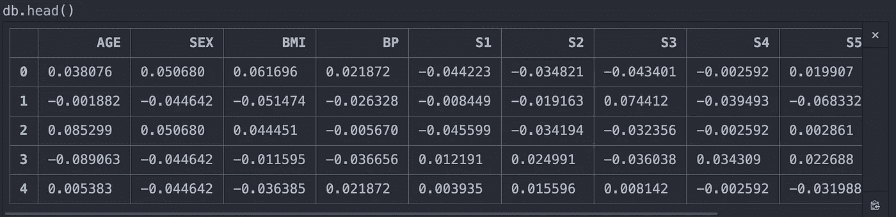

作者图片

```
print(datasets.load_diabetes().DESCR)
```

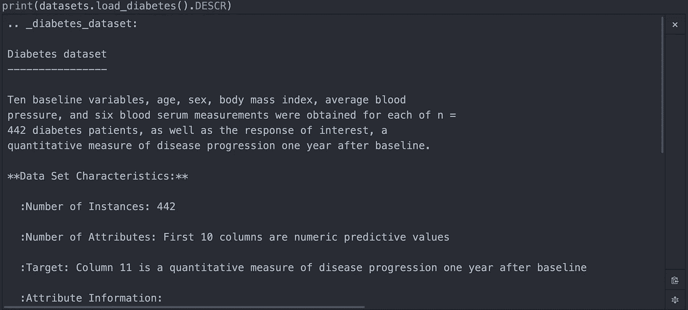

作者图片


作者图片

让我们将糖尿病数据保存为雪花中的一个表。我们稍后可以使用 Snowpark 连接到它:

```
#Set up the snowflake connection
ctx = snowflake.connector.connect(
    user='<user>',
    password='<password>',
    account='<account-identifier>',
    database='<database>',
    warehouse='<warehouse>',
    role='<role>',
    schema='<schema>'
    )#Create the input string for the diabetes data 
snowflake_cols=[str(x) + ' float' for x in db.columns]
s = ', '.join(snowflake_cols)#Create the empty table in Snowflake
ctx.cursor().execute(
"""CREATE OR REPLACE TABLE
DIABETES_DATA(""" + s + """)""")#Copy the table into snowflake
write_pandas(ctx, db, 'DIABETES_DATA')
```

连接到 Snowpark 中的数据:

```
#Create snowpark session to connect to saved table. 
def create_session_object():
   connection_parameters = {
      "account": "<account-identifier>",
      "user": "<user>",
      "password": "<password>",
      "role": "<role>",
      "warehouse": "<warehouse>",
      "database": "<database>",
      "schema": "<schema>"
   }
   session = Session.builder.configs(connection_parameters).create()
   print(session.sql('select current_warehouse(), current_database(), current_schema()').collect())
   return session#Create two sessions, one for doing initial testing, and one for pushing the udf to snowpark. I've found the session tends to fail if I use just one session for both. session=create_session_object()session2=create_session_object()cols=session.table('DIABETES_DATA')
cols.schema.fields
```


作者图片

**造型**

在我看来，构建 udf 时要记住的一件重要事情是，数据必须作为 array_construct()或所有特性的单个列传入。这类似于 Spark 中的 features 列输入。

因此，为了准备我们的 udf，让我们看看是否可以使用 Snowpark array_construct 作为输入来构建一个本地模型。这样我们就能知道我们的代码是否能在我们上传到 Snowpark 的 udf 中工作。

```
columns_list=['AGE', 'SEX', 'BMI', 'BP', 'S1', 'S2', 'S3', 'S4', 'S5', 'S6','TARGET']#Connect to the table in Snowflake and create an array construct of the data to be used for modeling. digits=session2.table('DIABETES_DATA').select(F.array_construct(*columns_list).alias('INPUT_DATA'))#Collect the data from Snowpark
tbl=pd.DataFrame(digits.collect())tbl.head()
```

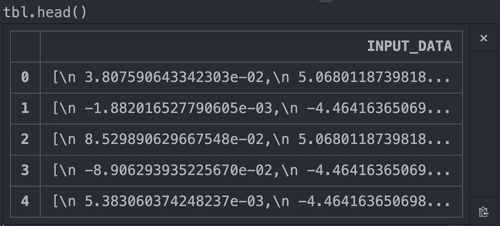

作者图片

您可以看到，将它读入我们的本地环境并尝试将其转换为数据帧是行不通的。它仍然将它保存为一列。让我们使用 Python 中的 str.split 方法将数据分离出来。

```
tbl=tbl['INPUT_DATA'].str.split(',\n', expand=True)
tbl.head()
```

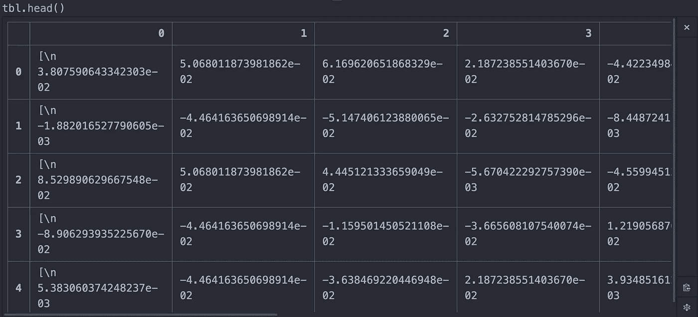

作者图片

我们仍然有一些时髦的新的行字符和括号，所以让我们去掉它们。

```
tbl[0]=[x.replace('\n','').replace('[  ','').replace(']','') for x in tbl[0]]tbl[10]=[x.replace('\n','').replace('[  ','').replace(']','') for x in tbl[10]]tbl.head()
```

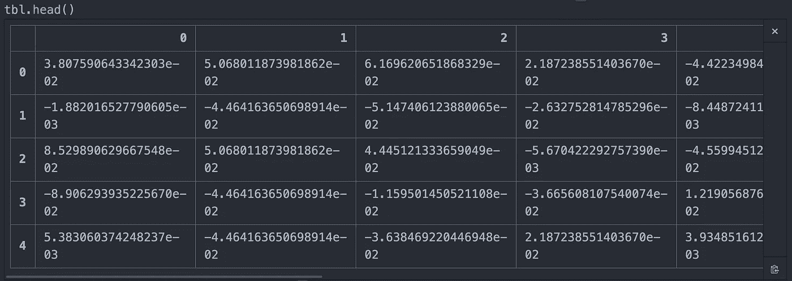

我们的数据现在看起来不错，让我们看看能否构建一个模型:

```
#Check NAs
count_nas=pd.DataFrame(tbl.isna().sum())
count_nas[count_nas[0]>0]#Fill in NAs if there were any 
tbl=tbl.fillna(0)#Set the column names to what our original table in Snowflake has 
tbl.columns=columns_list#Split into features, target, training and validation
X=tbl.drop(columns='TARGET')
y=tbl['TARGET']
X_train, X_valid, y_train, y_valid = train_test_split(X, y, random_state=1234, test_size=.33)#Build a pipeline 
numeric_features=['AGE', 'SEX', 'BMI', 'BP', 'S1', 'S2', 'S3', 'S4', 'S5', 'S6']numeric_cols = Pipeline(steps=[
    ('selector', ColumnSelector(numeric_features))])# Combine categorical and numerical pipeline with FeatureUnion
preprocessor = FeatureUnion([
    ('select_numeric_cols',numeric_cols)
])pipe_feat_un = Pipeline(steps=[('preprocessor', preprocessor)])#Light gbm
clf = make_pipeline(lgb.LGBMRegressor())#Add the model to the pipeline
model = make_pipeline(pipe_feat_un, clf)#Fit on the training data
model.fit(X_train,y_train)#Predict on the validation data
preds=model.predict(X_valid)#Look at the predictions
preds
```

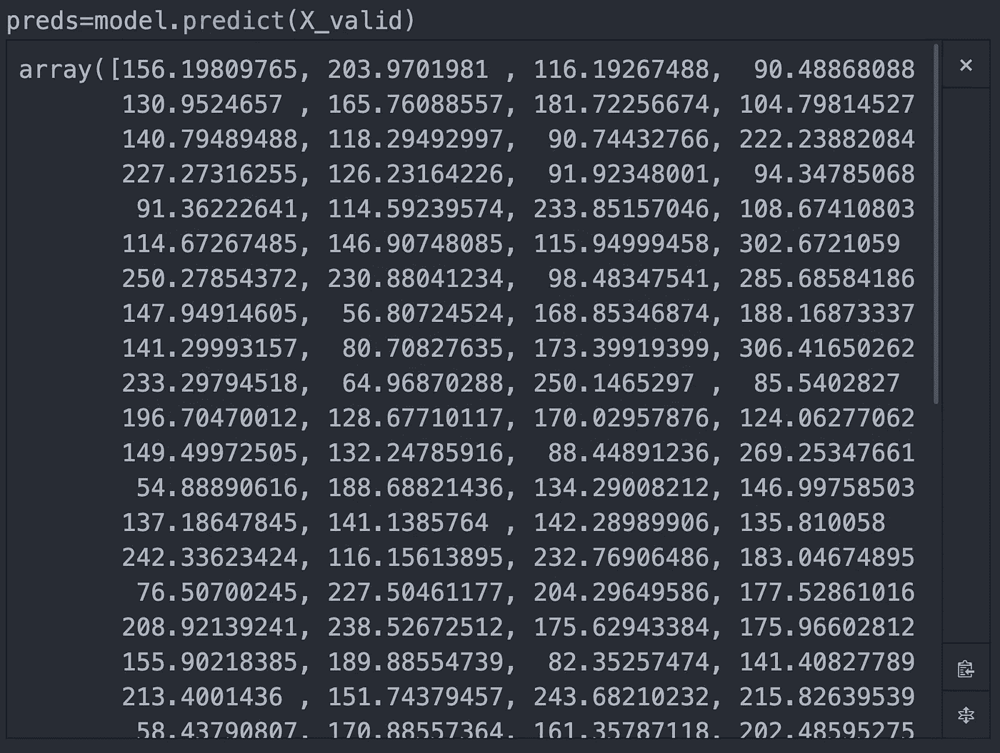

作者图片

这些是我们所期望的，连续范围内的预测。

现在，让我们把它包装成一个函数，这样我们就可以把它作为一个 udf 上传:

```
def lightgbm_train_predict_udf(db, columns_list):
    import pandas as pd
    import numpy as np
    from lightgbm import LGBMRegressor
    from sklearn.pipeline import make_pipeline, Pipeline, FeatureUnion
    from mlxtend.feature_selection import ColumnSelector
    import mlxtend #Read in the data 
    tbl=pd.DataFrame(db, columns=['INPUT_DATA'])
    tbl=tbl['INPUT_DATA'].str.split(',\n', expand=True)
    tbl[0]=[x.replace('\n','').replace('[  ','').replace(']','') for x in tbl[0]]
    tbl[10]=[x.replace('\n','').replace('[  ','').replace(']','') for x in tbl[10]] #Fill in NAs if there are any
    tbl=tbl.fillna(0) #Change the column names to what our table in Snowflake has
    tbl.columns=columns_list #Split into features, target, training and validation
    X=tbl.drop(columns='TARGET')
    y=tbl['TARGET']
    X_train, X_valid, y_train, y_valid = train_test_split(X, y, random_state=1234, test_size=.33) #Build a pipeline
    numeric_features=['AGE', 'SEX', 'BMI', 'BP', 'S1', 'S2', 'S3', 'S4', 'S5', 'S6']
    numeric_cols = Pipeline(steps=[
        ('selector', ColumnSelector(numeric_features))]) # Combine categorical and numerical pipeline with FeatureUnion
    preprocessor = FeatureUnion([
        ('select_numeric_cols',numeric_cols)
    ])
    pipe_feat_un = Pipeline(steps=[('preprocessor', preprocessor)]) #Light gbm
    clf = make_pipeline(lgb.LGBMRegressor()) #Add the model to the pipeline
    model = make_pipeline(pipe_feat_un, clf) #Fit on the training data
    model.fit(X_train,y_train) #Predict on the validation data
    preds=model.predict(X_valid)
    return(preds)
```

现在让我们将它上传为一个 udf:

```
dep_imports=['/opt/anaconda3/lib/python3.8/site-packages/mlxtend']lightgbm_train_predict_udf = session2.udf.register(lightgbm_train_predict_udf, name="lightgbm_train_predict_udf",is_permanent=True,                      stage_location='MODELSTAGE', packages=['numpy','scikit-learn','lightgbm','pandas'], imports=dep_imports, input_types [T.ArrayType(), T.ArrayType()],return_type=T.ArrayType(), replace=True)
```

我想调出 session.udf.register 函数的导入参数。如果 Snowpark 中没有您需要的库，您可以很容易地添加它们。这增加了使用 Snowpark 的灵活性。在本例中，我正在导入 mlxtend，这允许我在管道中使用 ColumnSelector 函数。

这里需要注意的另一个要点是，我们只能使用在 [Snowpark 类型文档](https://docs.snowflake.com/en/developer-guide/snowpark/reference/python/_autosummary/snowflake.snowpark.types.html#module-snowflake.snowpark.types)中列出的类型。具体来说，我们必须使用数组构造作为 udf 的输入。

现在，让我们测试我们上传的 udf:

```
columns_list=['AGE', 'SEX', 'BMI', 'BP', 'S1', 'S2', 'S3', 'S4', 'S5', 'S6','TARGET']#Connect to the table in Snowflake and create an array construct for input into the udf diabetes=session2.table('DIABETES_DATA').select(F.array_construct(*columns_list).alias('INPUT_DATA'))#Create an array construct of the column names to be fed in the function 
input_column_names = F.array_construct(*[F.lit(x) for x in columns_list])#Call the udf and look at the results output=diabetes.select(F.call_udf('lightgbm_train_predict_udf', F.col('INPUT_DATA'), input_column_names).alias('ALL_ONE_UDF_PREDICTED')).collect()output
```

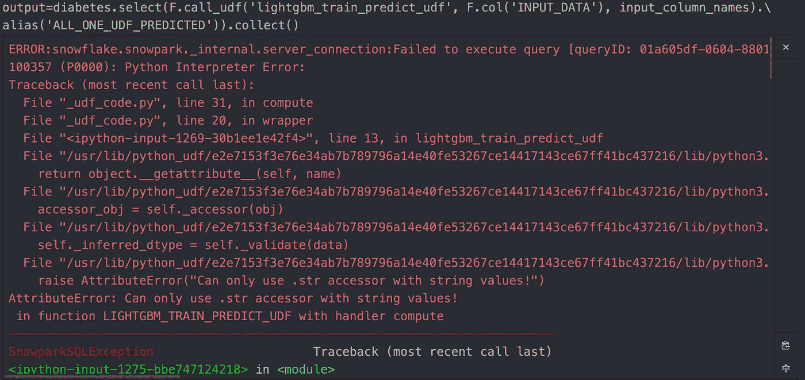

作者图片

此代码在' TBL = TBL[' INPUT _ DATA ']. str . split('，\n '，expand=True)处失败。这是没有意义的，因为第一次测试时，它在我们的本地环境中工作。

```
def lightgbm_train_predict_udf(db, columns_list):
    tbl=pd.DataFrame(db, columns=['INPUT_DATA'])
    tbl=tbl['INPUT_DATA'].str.split(',\n', expand=True)
```

让我们对此进行调整，并再次测试 udf，看看第一次运行' tbl=pd 时它会返回什么。DataFrame(db，columns=['INPUT_DATA'])'。由于我们只能根据 Snowpark 的文档返回数据类型，所以我找到的最简单的方法是 np.array()。这与 Snowpark ArrayType()无缝地相互转换。返回 DataFrame 不起作用，也不受支持。

```
def lightgbm_train_predict(diabetes, columns_list):
    import pandas as pd
    import numpy as np
    from lightgbm import LGBMRegressor
    from sklearn.pipeline import make_pipeline, Pipeline, FeatureUnion
    from mlxtend.feature_selection import ColumnSelector
    import mlxtend
    tbl=pd.DataFrame(diabetes, columns=['INPUT_DATA'])
    return(np.array(tbl))

dep_imports=['/opt/anaconda3/lib/python3.8/site-packages/mlxtend']#Register the udf to Snowflake/Snowpark
lightgbm_train_predict_udf = session2.udf.register(lightgbm_train_predict, name="lightgbm_train_predict_udf", is_permanent=True, stage_location='MODELSTAGE', 
packages=['numpy','scikit-learn','lightgbm','pandas'], 
imports=dep_imports, input_types=[T.ArrayType(), T.ArrayType()],
return_type=T.ArrayType(), replace=True) columns_list=['AGE', 'SEX', 'BMI', 'BP', 'S1', 'S2', 'S3', 'S4', 'S5', 'S6','TARGET']#Connect to the table in Snowflake and create an array construct for input into the udf diabetes=session2.table('DIABETES_DATA').select(F.array_construct(*columns_list).alias('INPUT_DATA'))#Create an array construct of the column names to be fed in the function 
input_column_names = F.array_construct(*[F.lit(x) for x in columns_list])#Call the udf and look at the results output=diabetes.select(F.call_udf('lightgbm_train_predict_udf', F.col('INPUT_DATA'), input_column_names).alias('ALL_ONE_UDF_PREDICTED')).collect()
output
```

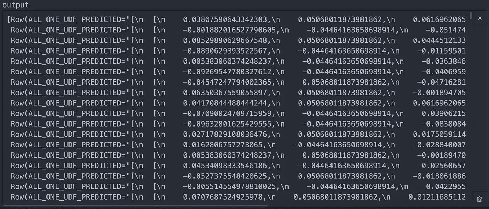

这将返回我们所期望的结果。但是这意味着我们的 split 方法在 udf 中不起作用。这让我相信 Snowpark 中有一些我无法理解的数据类型变化。我的假设是，这与让 Python 在雪花上运行的约束有关。

为前面的另一个示例做准备，让我们使用以下内容对此数组进行子集划分:

```
output[0:1]
```

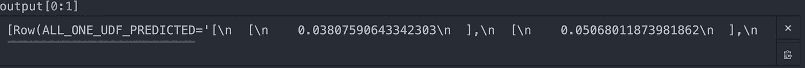

作者图片

output[0:1]返回数组的第一行。

接下来，下面是我想到的最好的解决方法，可以让 udf 在读入数据和格式化数据以进行建模时工作。

```
def lightgbm_train_predict(db, columns_list):
    db=np.array(db)
    objects=[pd.DataFrame(db[i:i+1]) for i in range(0,11)]
    tbl=pd.concat(objects, axis=1) #Fill in NAs if there are any
    tbl=tbl.fillna(0) #Change the column names to what our table in Snowflake has
    tbl.columns=columns_list
    return(np.array(tbl))dep_imports=['/opt/anaconda3/lib/python3.8/site-packages/mlxtend']#Register the udf to Snowpark/Snowflake
lightgbm_train_predict_udf = session2.udf.register(lightgbm_train_predict, name="lightgbm_train_predict_udf", is_permanent=True, stage_location='MODELSTAGE', packages=['numpy','scikit-learn','lightgbm','pandas'], imports=dep_imports, input_types=[T.ArrayType(), T.ArrayType()], return_type=T.ArrayType(), replace=True)columns_list=['AGE', 'SEX', 'BMI', 'BP', 'S1', 'S2', 'S3', 'S4', 'S5', 'S6','TARGET']#Connect to the table in Snowflake and create an array construct for input into the udf diabetes=session2.table('DIABETES_DATA').select(F.array_construct(*columns_list).alias('INPUT_DATA'))#Create an array construct of the column names to be fed in the function 
input_column_names = F.array_construct(*[F.lit(x) for x in columns_list])#Call the udf and look at the results output=diabetes.select(F.call_udf('lightgbm_train_predict_udf', F.col('INPUT_DATA'), input_column_names).alias('ALL_ONE_UDF_PREDICTED')).collect()output
```


作者图片

因为这返回了我们所有数据的数组，所以我们可以知道将它转换为 DataFrame 并重命名所有列是有效的。否则，它就会出错。

我想指出的上面代码中最大的标注是这三行代码:

```
def lightgbm_train_predict(diabetes, columns_list):
    diabetes=np.array(diabetes)
    objects=[pd.DataFrame(diabetes[i:i+1]) for i in range(0,11)]
```

一旦我们将它转换成一个 np.array，使用 digits[0:1]对它进行子集化会返回第一个*列*，而当我们将它作为子集输出[0:1]带到本地环境时，它会返回第一个*行。*我真的不确定为什么 Snowpark 的 Python 实例会这样，但我希望它不会这样。找出这种差异就像戴上眼罩，试图根据颜色的感觉来解开魔方。我不推荐这样做，也不想再做了。

让我们尝试重新注册 udf 并构建模型:

```
def lightgbm_train_predict(db, columns_list):
    import pandas as pd
    import numpy as np
    from lightgbm import LGBMRegressor
    from sklearn.pipeline import make_pipeline, Pipeline, FeatureUnion
    from mlxtend.feature_selection import ColumnSelector
    import mlxtend #Read in the data 
    db=np.array(db)
    objects=[pd.DataFrame(db[i:i+1]) for i in range(0,11)]
    tbl=pd.concat(objects, axis=1) #Fill in NAs if there are any
    tbl=tbl.fillna(0) #Change the column names to what our table in Snowflake has
    tbl.columns=columns_list #Split into features, target, training and validation
    X=tbl.drop(columns='TARGET')
    y=tbl['TARGET']
    X_train, X_valid, y_train, y_valid = train_test_split(X, y, random_state=1234, test_size=.33) #Build a pipeline
    numeric_features=['AGE', 'SEX', 'BMI', 'BP', 'S1', 'S2', 'S3', 'S4', 'S5', 'S6']
    numeric_cols = Pipeline(steps=[
        ('selector', ColumnSelector(numeric_features))]) # Combine categorical and numerical pipeline with FeatureUnion
    preprocessor = FeatureUnion([
        ('select_numeric_cols',numeric_cols)
    ])
    pipe_feat_un = Pipeline(steps=[('preprocessor', preprocessor)]) #Light gbm
    clf = make_pipeline(lgb.LGBMRegressor()) #Add the model to the pipeline
    model = make_pipeline(pipe_feat_un, clf) #Fit on the training data
    model.fit(X_train,y_train) #Predict on the validation data
    preds=model.predict(X_valid)
    return(preds)dep_imports=['/opt/anaconda3/lib/python3.8/site-packages/mlxtend']#Register the udf to Snowpark/Snowflake
lightgbm_train_predict_udf = session2.udf.register(lightgbm_train_predict, name="lightgbm_train_predict_udf", is_permanent=True, stage_location='MODELSTAGE', packages=['numpy','scikit-learn','lightgbm','pandas'], imports=dep_imports, input_types=[T.ArrayType(), T.ArrayType()], return_type=T.ArrayType(), replace=True)columns_list=['AGE', 'SEX', 'BMI', 'BP', 'S1', 'S2', 'S3', 'S4', 'S5', 'S6','TARGET']#Connect to the table in Snowflake and create an array construct for input into the udf diabetes=session2.table('DIABETES_DATA').select(F.array_construct(*columns_list).alias('INPUT_DATA'))#Create an array construct of the column names to be fed in the function 
input_column_names = F.array_construct(*[F.lit(x) for x in columns_list])#Call the udf and look at the results output=diabetes.select(F.call_udf('lightgbm_train_predict_udf', F.col('INPUT_DATA'), input_column_names).alias('ALL_ONE_UDF_PREDICTED')).collect()output
```

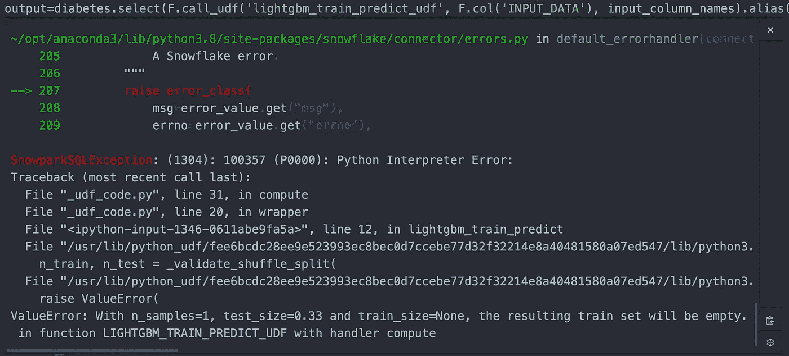

作者图片

耶，又一个错误。这个错误是 sklearn train_test_split 函数。不管是什么原因，sklearn 的 train_test_split 在 Snowpark 内部是行不通的。此外，使用 light gbm 时出现错误。但是我将跳过这个例子。

我修复这些错误的方法是使用 np.random.rand 和 xgboost 手动分成训练和测试。这是我的最终解决方案，我甚至不确定这是否正确。尽管如此，它确实完成了整个过程，并且预测没有显示错误。

```
def xgboost_train_predict(db, columns_list):
    import pandas as pd
    import numpy as np
    from xgboost import XGBRegressor
    from sklearn.model_selection import GridSearchCV, train_test_split
    from sklearn.preprocessing import MultiLabelBinarizer, OneHotEncoder, FunctionTransformer
    from sklearn.pipeline import make_pipeline, Pipeline, FeatureUnion
    from sklearn.compose import ColumnTransformer
    from mlxtend.feature_selection import ColumnSelector
    import mlxtend #Read in the data
    db=np.array(db)
    objects=[pd.DataFrame(db[i:i+1]) for i in range(0,11)]
    tbl=pd.concat(objects, axis=1) #Fill in NAs if there are any
    tbl=tbl.fillna(1) #Change the column names to what our table in Snowflake has
    tbl.columns=columns_list

    # #Split into training and validation
    tbl['prob'] = np.random.rand(len(tbl))
    tbl['counter'] = [1 if x <= .65 else 0 for x in tbl['prob']]
    # return(np.array(tbl))
    training_data = tbl.loc[tbl['counter']==1,].reset_index(drop=True)
    testing_data = tbl.loc[tbl['counter']==0,].reset_index(drop=True)
    X_train=training_data.drop(columns=['TARGET','prob','counter'])
    y_train=training_data['TARGET']
    X_valid=testing_data.drop(columns=['TARGET','prob','counter'])
    y_valid=testing_data['TARGET'] #Build a pipeline
    numeric_features=['AGE', 'SEX', 'BMI', 'BP', 'S1', 'S2', 'S3', 'S4', 'S5', 'S6']
    numeric_cols = Pipeline(steps=[
        ('selector', ColumnSelector(numeric_features))])
    # Combine categorical and numerical pipeline with FeatureUnion
    preprocessor = FeatureUnion([
        ('select_numeric_cols',numeric_cols)
    ])
    pipe_feat_un = Pipeline(steps=[('preprocessor', preprocessor)]) #Light gbm
    clf = make_pipeline(XGBRegressor(n_estimators=5)) #Add the model to the pipeline
    model = make_pipeline(pipe_feat_un, clf) #Fit on the training data
    model.fit(X_train, y_train) #Predict on the validation data
    preds=model.predict(X_valid)
    return(preds)dep_imports=['/opt/anaconda3/lib/python3.8/site-packages/mlxtend']xgboost_train_predict_udf = session2.udf.register(xgboost_train_predict,name="xgboost_train_predict_udf",is_permanent=True,stage_location='MODELSTAGE',packages=['numpy','scikit-learn','xgboost','pandas'], imports=dep_imports, input_types=[T.ArrayType(),T.ArrayType()], return_type=T.ArrayType(),replace=True)columns_list=['AGE', 'SEX', 'BMI', 'BP', 'S1', 'S2', 'S3', 'S4', 'S5', 'S6','TARGET']#Connect to the table in Snowflake and create an array construct for input into the udf diabetes=session2.table('DIABETES_DATA').select(F.array_construct(*columns_list).alias('INPUT_DATA'))#Create an array construct of the column names to be fed in the function 
input_column_names = F.array_construct(*[F.lit(x) for x in columns_list])#Call the udf and look at the results output=diabetes.select(F.call_udf('xgboost_train_predict_udf', F.col('INPUT_DATA'), input_column_names).alias('ALL_ONE_UDF_PREDICTED')).collect()output
```

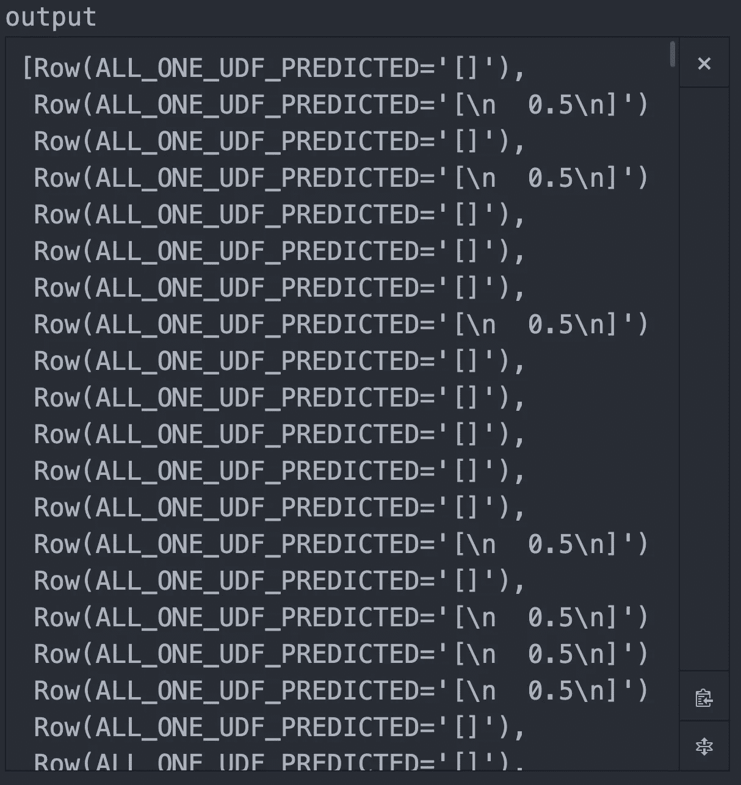

作者图片

看看这些结果，Snowpark 处理模型的方式有明显的错误。首先，并不是所有的预测都应该是 0.5。当我们在本地建立模型时，它应该在一个连续的范围内。其次，它带来了空数组，因为 Snowpark 不会在训练和测试分割期间使用 data frame . reset _ index(drop = True)重新索引数据帧或数组。请参见下面的代码:

```
training_data = tbl.loc[tbl['counter']==1,].reset_index(drop=True)
testing_data = tbl.loc[tbl['counter']==0,].reset_index(drop=True)
```

**结论:**

我认为最好在本地构建一个模型，然后像我们在本系列第 1 部分中所做的那样，将它作为 udf 发送到雪花的 Snowpark。我的观点是，Snowpark 的 Python 仍然处于早期阶段，还不具备使用本地环境的 Python 所具备的许多功能的能力。

**在 Snowpark 的 Python 中引入错误的函数，这些函数在我的本地环境中使用相同的进程和数据:**

1.  相同的数组子集/维度数组。例如，上例中的 output[0:1]返回本地环境中的第一行，以及 Snowpark 中的第一列
2.  从 Snowpark 阵列或数据帧转换到 pandas 数据帧
3.  Sklearn 的 train_test_split()
4.  Lightgbm
5.  重新索引数据帧或数组
6.  Tfidf()和 countvectorizer()

**我希望 Snowpark 中的 udf 具有的功能:**

1.  可以选择返回数据帧作为上传 udf 的结果
2.  将模型作为上传的 udf 的输出返回

总的来说，我看到了 Snowpark 的可用性，我对即将到来的变化和改进感到兴奋。如果雪花修复了这些错误，我将发布一个更新的指南和一个工作实例。

**参考文献:**

Bradley Efron，Trevor Hastie，Iain Johnstone 和 Robert Tibshirani (2004)“最小角度回归”，统计年鉴(附讨论)，407–499。(https://web . Stanford . edu/~ hastie/Papers/LARS/leas tangle _ 2002 . pdf)