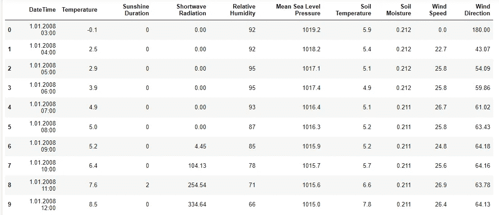
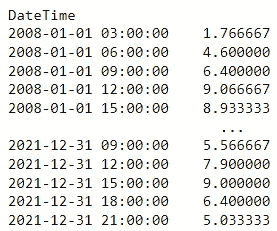
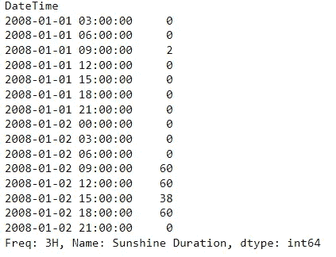
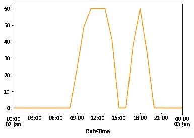
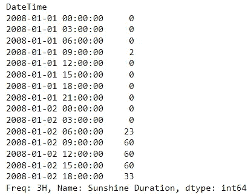
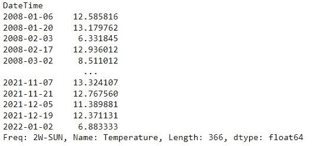
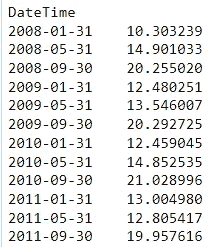
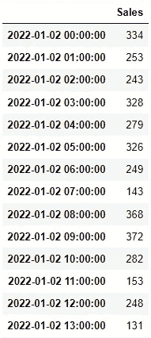
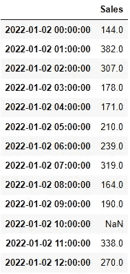
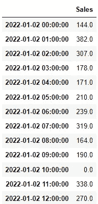

# 在熊猫中使用重采样

> 原文：<https://towardsdatascience.com/using-resample-in-pandas-14e5483593aa>

## *学习如何使用熊猫重采样方法，这是一种处理基于时间的数据的很酷的方法*


马库斯·斯皮斯克的照片

基于时间的数据是最常见的数据格式之一，作为数据科学家，您可能会遇到这种情况。无论是历史特征(例如，客户数据)还是时间序列数据，都经常需要处理数据管道中的时间戳列。

如果你在 2022 年是一名数据科学家，你必须知道如何使用`pandas`，这是最强大的 Python 库之一，可以处理数据。`pandas`以其定期更新和新方法而闻名，适用于许多关于数据争论和操纵的任务。

它最著名的方法之一是`resample`方法，可以让你平稳地处理基于时间的数据。简而言之，`resample`包含几个特性，可以帮助您以一种非常流畅的方式处理基于时间的分组和聚合，从而提高处理 datetime 列的速度和简单性。在过去，你可能不得不构造复杂的(甚至是错误的)函数，这将会很难维护。有了`resample`,这种情况完全消失了，你可以更轻松地在`pandas`数据框中摆弄日期。

在本帖中，我们将探索关于这种方法的一些很酷的事情，以及应用它有多容易——特别是当我们想要为我们的数据科学算法创建基于时间的功能时。

# 读取数据

首先，我将从加载一个时间序列数据集开始，该数据集由土耳其加利波利[2008 年至 2021 年间的每小时天气数据组成——该数据集属于](https://www.kaggle.com/datasets/vivovinco/hourly-weather-data-in-gallipoli-20082021) [Meteoblue](https://www.meteoblue.com/) 。

让我从将这个数据集加载到 Python 开始:

```
gallipoli_data = pd.read_csv(‘../Hourly Weather Data in Gallipoli (2008–2021).csv’)
```

让我们看看数据集的前 10 行:



Gallipoli 数据集的先睹为快—图片由作者提供

要使用`resample`，我们的数据必须满足两个条件:

*   我们将用来表示时间的列必须是`datetime`数据类型。
*   该列必须放入数据帧的索引中。

首先将`DateTime`列转换为日期时间类型:

```
gallipoli_data[‘DateTime’] = pd.to_datetime(gallipoli_data[‘DateTime’])
```

并将我们的列传递到数据帧的索引中:

```
gallipoli_data.index = gallipoli_data[‘DateTime’]
```

我们的数据框准备好了！让我们也加载跟随这篇博文所需的库:

```
import pandas as pdimport numpy as np
```

一切都准备好了，让我们开始处理我们的`resample`方法吧！

# 使用重采样

让我们从一个简单的用例开始:假设我们希望获得 Gallipoli 每 3 小时的平均温度。虽然简单，但如果我们试图用基本 Python 或定制的`pandas`代码来做这件事，就会有点麻烦，因为我们必须:

*   创建某种类型的每 3 小时增加一次的列；
*   对该列使用 group by

虽然这可以用几行代码来管理，但是一行代码会更好，对吗？如果一个班轮也能够推广到其他时间框架(几周，几个月，几个季度甚至几分钟)呢？这正是`resample`的作用！我们可以非常快速地对数据执行基于时间的快速聚合:

```
gallipoli_data.Temperature.resample(rule = ‘3h’).mean()
```

下面是上面代码的输出:



使用 3h 作为时间范围进行重新取样—图片由作者提供

多酷？`resample`方法包含一堆我们可以调节的旋钮，比如我们正在使用的规则或聚合函数。如果我们想检查 3 小时间隔内日照时间的最大值，你能猜到我们需要调整什么吗？我们只要把`mean()`换成`max()`！

```
gallipoli_data[‘Sunshine Duration’].resample(rule = ‘3h’).max()
```



使用 3h 作为时间帧，但使用最大值函数重新取样-作者提供的图像

为了让这一点在`resample`的引擎盖下更加清晰和突出，让我们来看看 1 月 2 日在加利波利举行的`Sunshine Duration`的演变:

```
(
    gallipoli_data.loc[
        (gallipoli_data.DateTime >= '2008-01-02') 
        & 
        (gallipoli_data.DateTime <= '2008-01-03')
    ]
)['Sunshine Duration'].plot(color='darkorange')
```



2008 年 1 月 2 日的日照时间—图片由作者提供

`resample`所做的是通过应用以下内容对每三个小时的数据进行分组:

*   从上午 9 点到 12 点，最大`Sunshine Duration`是 60。
*   中午到下午 15 点，最大`Sunshine Duration`60。
*   从下午 15 点到 18 点，最大值`Sunshine Duration`为 38。

这反映在我们上面看到的表格中—再次检查:


使用最大值功能以 3 小时为时间范围进行重新取样—图片由作者提供

请注意，间隔在左侧是闭合的。这意味着与`2008-01-02 09:00:00`相关的行聚集了从上午 09:00:00 到上午 11:59:59 的全部数据。如果我们想要改变这种行为，我们需要向`resample`传递一个新的参数`closed`:

```
gallipoli_data['Sunshine Duration'].resample(rule = '3h', closed= 'right').max()
```



使用 3h 作为时间帧重新取样，使用 Max 和 Closed = 'Right'—图片由作者提供

在这种情况下，同一行`2008-01-02 09:00:00`汇总从上午 09:00:01 到上午 12:00:00 的所有数据

拧动`resample`旋钮非常容易。我们可能想要调整的另一个常见论点是时间框架聚合——例如，按周或月聚合我们的数据。这可能吗？让我们看看，下一个。

# 修改规则参数

使用`rule`参数，我们不仅仅局限于每小时的聚合！这是`resample`功能最酷的特性之一。例如，如果我们想要两周一次的汇总，我们可以:

```
gallipoli_data.Temperature.resample(rule = ‘2w’).mean()
```



两周一次的温度汇总-图片由作者提供

`w`前的数字定义了我们想要分组的实例数量，而`w`定义了我们想要一周的时间范围。

你能猜出我们需要传递什么参数来聚合每 4 个月的数据吗？

```
gallipoli_data.Temperature.resample(rule = ‘4m’).mean()
```



4 个月聚合示例—按作者分类的图像

总之，`rule`控制我们想要分组的时间间隔。您可以使用的一些最著名的`rule`参数是:

*   `s`为秒
*   `t`持续分钟
*   `h`数小时
*   `w`为周
*   `m`持续数月
*   `q`为季度

# 填补空白

`resample`的另一个重要特性是，它可以帮助您通过理解数据中的缺口来创建更完整的数据框架。例如，假设我们有一个商店的每小时销售数据集:

```
date_range = pd.date_range('1/2/2022', periods=24, freq='H')
sales = np.random.randint(100, 400, size=24)sales_data = pd.DataFrame(
    sales,
    index = date_range,
    columns = ['Sales']
)
```



sales_data 数据框架的标题—按作者分类的图像

让我们删除上午 10 点的销售行。(想象这是真实发生的事情，并且在此期间该商店没有销售):

```
sales_data = sales_data.drop(sales_data.iloc[10].name)
```


上午 10 点没有销售的销售数据数据框架的标题—作者图片

如果我们将一个`resample`应用到这个数据帧，将会出现一个带有`NaN`的新行:

```
pd.DataFrame(
    sales_data.Sales.resample('h').mean()
)
```



重新取样后上午 10 点没有销售额的 sales_data 数据帧的标题-作者图片

这在很多基于时间的场景中非常方便。通常情况下，如果我们的时间序列数据中有一个缺口，我们希望有一行来表示这个缺口，而`resample`为我们提供了一个快速实现它的方法。在上面的例子中，我们甚至可以添加一个`fillna(0)`来使我们上午 10 点的“缺乏销售”场景更加明显:



重新取样后上午 10 点没有销售额的 sales_data 数据帧的标题-作者图片

填补空白是我们在处理基于时间的数据时经常要做的事情。不仅仅是在创建特性的时候，也是在我们的数据管道中捕捉主要错误的一种方式。

感谢你花时间阅读这篇文章！

如果你使用基于时间的数据，并且以前从未使用过`resample`,我真的建议你彻底学习这种方法，因为它将在你的数据转换过程中为你省去很多麻烦。

无论是当我们构建基于时间的特性还是操作时序数据时，使用`resample`会使我们的代码更加高效和简洁。正如我们已经讨论过的，这种方法对于捕捉基于时间的数据中的一些意外缺口也很方便，所以我希望您可以在未来的数据管道中使用本文中的知识！

*本帖使用的数据集在 CC BY 4.0 下，属于*[*Meteoblue*](https://www.meteoblue.com/)*。*

[](https://medium.com/membership/@ivopbernardo) [## 通过我的推荐链接加入 Medium-Ivo Bernardo

### 阅读我在 Medium 上的所有故事，了解更多关于数据科学和分析的信息。加入中级会员，您将…

medium.com](https://medium.com/membership/@ivopbernardo)