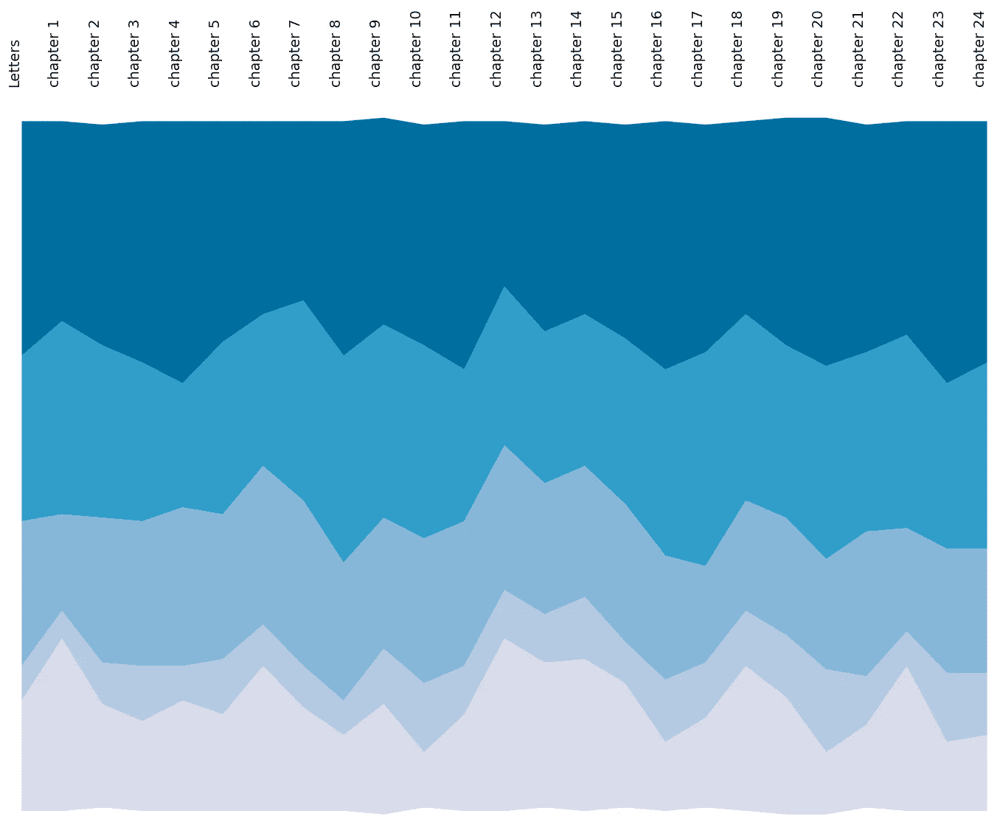
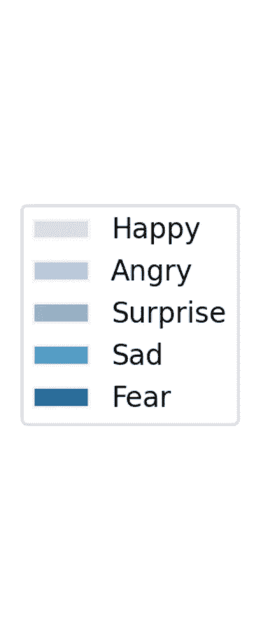

# 使用情感分析探索文本中的情感

> 原文：<https://towardsdatascience.com/using-sentiment-analysis-to-explore-emotions-within-text-ae48e3e93999>

## 应用 2 自然语言处理技术来比较玛丽·雪莱的《弗兰肯斯坦》中的情感与 TF-IDF 的每章关键词分析。


照片由 [Neven Krcmarek](https://unsplash.com/@nevenkrcmarek?utm_source=medium&utm_medium=referral) 在 [Unsplash](https://unsplash.com?utm_source=medium&utm_medium=referral) 上拍摄

# 前提

玛丽·雪莱的《弗兰肯斯坦》不仅因其在流行文化中的突出地位而闻名(例如[https://www . national theatre . org . uk/shows/nt-at-home-Frankenstein](https://www.nationaltheatre.org.uk/shows/nt-at-home-frankenstein))，还因其在文学经典中的地位而闻名。这部小说充斥着(当时)新奇的想法，再加上情感的大起大落——这一点在这本书的形式中得到了反映。这样一个故事的丰富和复杂的结构使它成为情感分析的完美候选。

## 数据集

数据集是从古腾堡项目提供的在线书籍中提取的。

## 关键词分析

为了验证，我们将每章的情感立场与使用 TF-IDF 算法提取的摘要关键词进行比较。这将在下面描述，并被发现可靠地代表了我之前的作品所展示的弗兰肯斯坦的叙事:

[](/using-tf-idf-to-form-descriptive-chapter-summaries-via-keyword-extraction-4e6fd857d190) [## 使用 TF-IDF 通过关键词提取形成描述性章节摘要。

### 使用 TF-IDF 获取玛丽·雪莱的《弗兰肯斯坦》中每一章的描述性关键词。

towardsdatascience.com](/using-tf-idf-to-form-descriptive-chapter-summaries-via-keyword-extraction-4e6fd857d190) 

## 内容

在本文中，我们主要关注两个支持情感分析的 python NLP 库。这些是:

*   `TextBlob`
*   `Text2Emotion`

我们将依次把这些应用到《弗兰肯斯坦》的文本中，并利用这种类型的分析向我们揭示的任何洞见。

# TextBlob:简化文本处理

我们使用的第一个 NLP 库叫做`textblob`，可以使用`pip install textblob`安装。这是一个一体化的自然语言处理 API，允许我们提取关于文本情感或极性的信息。

## 使用

我们首先将我们的章节文本转换成一个 blob，然后可以查询它以获得总体统计数据。

```
from textblob import TextBlobblob = TextBlob(chapter)
```

这将返回一个具有几个属性的已处理对象，这将在下面讨论。

# 感情

由于我们主要对情感分析感兴趣，我们可以提取文本的主观性和极性:

```
blob.sentiment# Sentiment(polarity=0.11179997960976226, subjectivity=0.48238807327937727)
```

在这里，我们的文本内容被赋予两个分数:

*   *主观性*:这是排名[0–1]，其中 1 是主观的，0 是客观的
*   *极性:*文本音调的等级，其中+1 为正，-1 为负。接近 0 的值表示中性。

## 极性

结合前面工作中的关键词分析，我们可以使用它们的极性对章节进行排序。虽然这里所有的值都大于零，但分数越低的章节出现在怪物被追捕或胜利者哀悼死亡的地方。

```
chapter 16         [cottage, hidingplace, towards, felix, wood]chapter 10                    [thy, thou, ice, thee, mountains]chapter 17             [shall, consent, swear, demand, portion]chapter 8     [innocence, justine, elizabeth, judges, confes...chapter 24                  [yet, ice, vengeance, shall, still]chapter 7            [william, poor, ernest, murderer, justine]
```

相反，更快乐的篇章是在维克多·弗兰肯斯坦的青年时代，那时他对科学和医学的热情和兴趣仍然驱动着他所有的意图。同样地，我们也受到怪物的教育和崇拜，尽管他观察了菲利克斯和林中老人(第 12-15 章)。然而，当他新收养的家庭回避他时，这很快就被并置了(第 16 章)。

```
chapter 15             [protectors, cottage, admire, old, read]chapter 12                 [cottagers, felix, found, day, wood]chapter 2           [agrippa, studies, spirit, things, natural]chapter 4               [pursuit, study, life, one, corruption]
```

## 主观性

同样，我们可以看看哪些章节更主观。我们再次看到与科学和发现有一个更客观的方向有关的章节:

```
chapter 3     [science, natural, professor, philosophy, modern]chapter 11                  [cottage, found, fire, wood, light]chapter 4               [pursuit, study, life, one, corruption]
```

而那些关注情感和感觉的人更主观:

```
chapter 7            [william, poor, ernest, murderer, justine]chapter 8     [innocence, justine, elizabeth, judges, confes...chapter 10                    [thy, thou, ice, thee, mountains]
```

## 单字分析

我们可以通过查看对每个极性和主观性得分有贡献的单词来进一步分析。我们可以通过以下方式访问它:

```
blob.sentiment_assessments.assessments
```

例如，如果我们想在最后一章看到哪些单词是正面的，哪些是负面的(以及它们各自的权重)，我们可以使用:

```
In [127]: assesments[-1].sort_values('polarity')Out[127]: polarity  subjectivityevil           -1.00           1.0
pathetic       -1.00           1.0
miserable      -1.00           1.0
horrible       -1.00           1.0
miserable      -1.00           1.0
...              ...           ...
incredible      0.90           0.9
consummate      0.95           1.0
exquisite       1.00           1.0
excellent       1.00           1.0
wonderful       1.00           1.0
```

## 名词短语

另一种分析情感的有用方法是使用名词短语。这些允许我们查看与正在讨论的相关的*上下文。要访问这些，我们可以使用:*

```
blob.noun_phrases
```

这里我们选择了一些短语，它们为角色和物体的互动设置了场景。例如，即使没有阅读最后一章，我们也能从下面有限的片段中得出结论。

```
WordList(['present situation', '**fury revenge**', '**hateful i**', 'life i', 'vast portion', '**barbarous countries**', 'alive i', '**fiendish enemy**', 'hours round', 'path i', 'william elizabeth', 'deep grief', 'i knelt', 'i kneel', '**eternal grief**', 'i swear', 'thee o night', 'mortal conflict', 'purpose i', 'dear revenge', 'green herbage', 
...
'**miserable frame**', '**vanish i**', 'cheeks light feeling', 'world affords', '**bitterest remorse**', 'death farewell i', 'behold farewell frankenstein', '**thou wert**', '**thou didst**', '**thou hadst**', '**thou wouldst**', 'thou wert', 'solemn enthusiasm i', '**extinct i**', 'funeral pile', 'ice raft'])
```

# 文本 2 情感:从文本中识别情感

这是我们要看的两个库的第二个。Text2Emotion 专注于表现消息中的潜在情绪，而不是简单地对其极性进行评分(如情绪分析)。这里，我们将剧本分为以下几组，而不是一个等级:

*   幸福的
*   愤怒的
*   惊喜
*   悲哀的
*   害怕

## 装置

```
pip install text2emotion
```

## 使用

使用非常简单，只需导入库，然后使用`get_emotion`函数:

```
import text2emotion as teemotion = te.get_emotion(chapter)
```

将此应用于我们语料库中的每一章，允许我们比较文本中存在的情感类型:



堆积面积图显示每个章节中的不同情绪。来源:丹尼尔·埃利斯

堆积面积图让我们看到了小说所经历的周期性动荡。例如，在第 12-14 章中出现了明显的快乐高峰，怪物在森林里观察费利克斯，在故事的乞讨部分，维克多仍然对医学的奇迹和他的发现感兴趣。然而，这些时期紧接着是恐惧和悲伤的篇章(死亡和私刑)。利用这一点，我们能够将更多的信息归因于上面情感分析中提供的积极/消极。

# 结论

我们已经成功地执行了从情感到情感分析的一系列自然语言处理任务，并将其与由 TF-IDF 提取的章节内容和关键词进行了比较。

乍一看，似乎每个算法对小说的描述都多少反映了小说中的结构和事件。这表明对大量数据的自动分析在诸如新分类的任务中可以证明是非常宝贵的。

不管怎样，为什么不自己尝试一下，看看你的想法呢？

*(显然我的博士论文充满恐惧* \_(ツ)_/ *)*

## 额外资源

[](https://github.com/wolfiex/SentimentAnalysis-Frankenstein) [## GitHub-wolf iex/sentiment analysis-Frankenstein:比较玛丽的情感过山车…

github.com](https://github.com/wolfiex/SentimentAnalysis-Frankenstein)