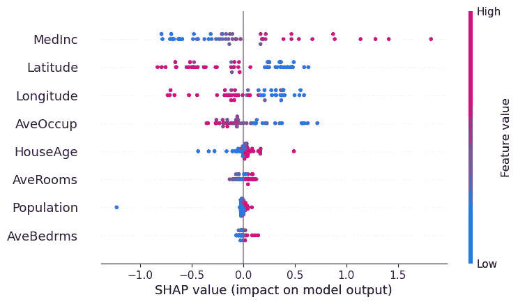
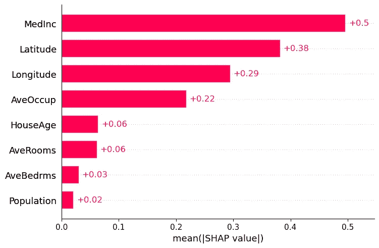
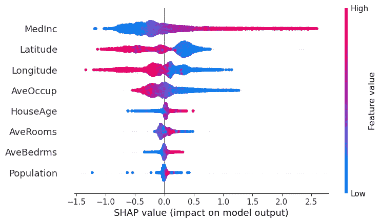
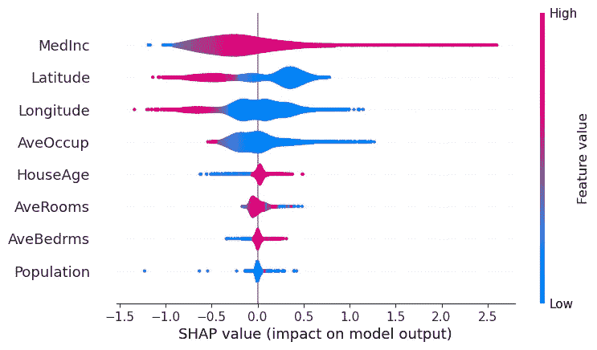
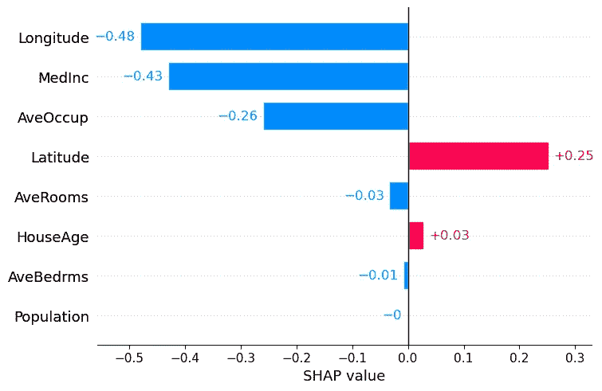
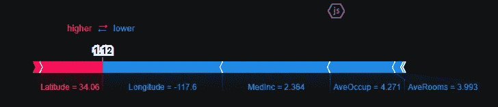

# 用 SHAP 值来解释你的机器学习模型是如何工作的

> 原文：<https://towardsdatascience.com/using-shap-values-to-explain-how-your-machine-learning-model-works-732b3f40e137>

## 学习使用工具来显示每个特征如何影响模型的每个预测


改编自 [Unsplash](https://unsplash.com/) 上的 [Chad Kirchoff](https://unsplash.com/@cakirchoff)

机器学习模型通常是黑盒，这使得它们的解释很困难。为了理解影响模型输出的主要特征是什么，我们需要可解释的机器学习技术来揭示其中的一些方面。

其中一种技术是 SHAP 方法，用于解释每个特征如何影响模型，并允许对数据集和手头的问题进行局部和全局分析。

# SHAP 价值观

SHAP 值(**SH**apley**A**additive ex**P**lanations)是一种基于合作博弈论的方法，用于增加机器学习模型的透明度和可解释性。

例如，线性模型可以使用它们的系数作为每个特征的整体重要性的度量，但是它们随变量本身的比例而缩放，这可能会导致扭曲和误解。此外，该系数不能说明特征的*局部*重要性，以及它如何随着更低或更高的值而变化。基于树的模型的特征重要性也是如此，这就是为什么 SHAP 对于模型的可解释性是有用的。

> 重要提示:虽然 SHAP 显示了每个特征对模型预测的贡献或重要性，但它并不评估预测本身的质量。

考虑一个合作游戏，玩家数量与游戏特征的名称相同。对于每个例子或观察，SHAP 将披露每个参与者(或特征)对模型输出的贡献。

给定加州住房数据集[1，2](可从 [scikit-learn 库](https://scikit-learn.org/stable/datasets/real_world.html#california-housing-dataset)获得)，我们可以分离出一个单独的观察值，并计算该单独数据点的 SHAP 值:

```
shap.plots.waterfall(shap_values[x])
```


作者图片

在上面的瀑布中，x 轴表示目标(因变量)变量的值，即房价。x 是选择的观测值，f(x)是模型的预测值，给定输入 x，E[f(x)]是目标变量的期望值，或者换句话说，所有预测的平均值(`mean(model.predict(X))`)。

该观测中每个特征的 SHAP 值由条形的长度给出。在上面的示例中，经度的 SHAP 值为-0.48，纬度的 SHAP 值为+0.25，依此类推。所有 SHAP 值的总和将等于 E[f(x)]-f(x)。

绝对 SHAP 值向我们展示了单个要素对预测的影响程度，因此经度的影响最大，其次是中纬度，平均值占第三位，人口是对预测影响最小的要素。

注意，这些 SHAP 值仅对 ***有效，本次观察仅*** 。随着其他数据点的 SHAP 值 ***将*** 改变。为了理解特征对于整个数据集的重要性或贡献，可以使用另一个图，蜂群图:

```
shap.plots.beeswarm(shap_values)
```



作者图片

例如，纬度变量的高值对预测有很大的负面影响，而低值则有很大的正面影响。

MedInc 变量在其值较高时具有非常高的正贡献，而在低值时具有低的负贡献。无论其值是高还是低，特征总体对预测几乎没有贡献。

所有变量按照全局特征重要性的顺序显示，第一个最重要，最后一个最不重要。

实际上，SHAP 可以通过使用特征重要性向我们展示全局贡献，以及通过蜂群图的散布展示问题的每个实例的局部特征贡献。

# 在 Python 中使用 SHAP 值

我在 github 上提供了这一部分的代码。看看这个:

[](https://github.com/vinyluis/Articles/tree/main/Boruta%20SHAP) [## 文章/博鲁塔 SHAP 在主要乙烯/文章

### 第 1 篇:用 SHAP 价值观解释你的机器学习模型是如何工作的(TBD) [EN]什么是 SHAP 价值观，如何…

github.com](https://github.com/vinyluis/Articles/tree/main/Boruta%20SHAP) 

要在 Python 中使用 SHAP，我们需要安装 SHAP 模块:

```
pip install shap
```

然后，我们需要训练我们的模型。在示例中，我们可以直接从 sklearn 库中导入 California Housing 数据集，并训练任何模型，例如随机森林回归量

```
import shap
import pandas as pd
from sklearn.datasets import fetch_california_housing
from sklearn.model_selection import train_test_split
from sklearn.ensemble import RandomForestRegressor# California Housing Prices
dataset = fetch_california_housing(as_frame = True)
X = dataset['data']
y = dataset['target']
X_train, X_test, y_train, y_test = train_test_split(X, y, test_size = 0.2)# Prepares a default instance of the random forest regressor
model = RandomForestRegressor()# Fits the model on the data
model.fit(X_train, y_train)
```

为了计算模型的 SHAP 值，我们需要创建一个 Explainer 对象，并使用它来评估样本或整个数据集:

```
# Fits the explainer
explainer = shap.Explainer(model.predict, X_test)
# Calculates the SHAP values - It takes some time
shap_values = explainer(X_test)
```

shap_values 变量将有三个属性:`.values`、`.base_values`和`.data`。

`.data`属性只是输入数据的副本，`.base_values`是目标的期望值，或者所有训练数据的平均目标值，`.values`是每个例子的 SHAP 值。

如果我们只对 SHAP 值感兴趣，我们可以使用`explainer.shap_values()`方法:

```
# Evaluate SHAP values
shap_values = explainer.shap_values(X)
```

如果我们只是想要 SHAP 算法确定的特征重要性，我们需要取每个特征的平均值。

# SHAP 图书馆的一些情节

也可以使用 SHAP 库来绘制瀑布图或蜂群图，或者部分依赖图。

为了分析这些特征的整体效果，我们可以使用下面的图。

**柱状图**

```
shap.plots.bar(shap_values)
```



作者图片

在这里，特征从对预测的影响最高到最低排序。它考虑了绝对 SHAP 值，因此要素对预测的影响是积极的还是消极的并不重要。

**概要剧情:蜂群**

```
shap.summary_plot(shap_values)
# or 
shap.plots.beeswarm(shap_values)
```



作者图片

在 beeswarm 上，特征也根据它们对预测的影响进行排序，但是我们也可以看到特征的较高和较低值将如何影响结果。

图上所有的小点代表一次观察。水平轴代表 SHAP 值，而点的颜色向我们显示该观察值与其他观察值相比是高还是低。

在本例中，较高的纬度和经度对预测有负面影响，而较低的值则有正面影响。

**概要剧情:小提琴**

查看蜂群信息的另一种方法是使用小提琴图:

```
shap.summary_plot(shap_values, plot_type='violin')
```



作者图片

为了分析局部的、实例式的影响，我们可以在单个观察值上使用下面的图(在下面的例子中，我使用了`shap_values[0]`)。

**本地条形图**

```
shap.plots.bar(shap_values[0])
```



作者图片

该图向我们展示了影响单次观测预测的主要特征，以及每个特征的 SHAP 值的大小。

**瀑布图**

```
shap.plots.waterfall(shap_values[0])
```


作者图片

瀑布图具有相同的信息，但以不同的方式表示。这里我们可以看到所有 SHAP 值之和等于预测值 f(x)和期望值 E[f(x)]之差。

**力图**

```
shap.plots.force(shap_test[0])
```



作者图片

对于给定的观察，力图是查看每个特征对预测的影响的另一种方式。在该图中，正的 SHAP 值显示在左侧，负的显示在右侧，就像相互竞争一样。突出显示的值是该观察的预测值。

我希望这篇文章能帮助你更好地理解如何使用 SHAP 价值观来解释你的模型是如何工作的。这是每个数据科学家都应该拥有的工具，我们应该将它用于每个模型。

记得查看这篇文章的笔记本:

[](https://github.com/vinyluis/Articles/tree/main/Boruta%20SHAP) [## 文章/博鲁塔 SHAP 在主要乙烯/文章

### 第一篇:用 SHAP 价值观解释你的机器学习模型是如何工作的(TBD) [EN]什么是 SHAP 价值观，如何…

github.com](https://github.com/vinyluis/Articles/tree/main/Boruta%20SHAP) 

# 如果你喜欢这个帖子…

支持我一杯咖啡！

[](https://www.buymeacoffee.com/vinitrevisan)

给我买杯咖啡！

看看这个很棒的帖子

[](/boruta-shap-an-amazing-tool-for-feature-selection-every-data-scientist-should-know-33a5f01285c0) [## 博鲁塔·SHAP:每个数据科学家都应该知道的惊人的特征选择工具

### 我们如何使用博鲁塔和 SHAP 构建一个惊人的特征选择过程——以 python 为例

towardsdatascience.com](/boruta-shap-an-amazing-tool-for-feature-selection-every-data-scientist-should-know-33a5f01285c0) 

# 参考资料:

[1] Pace，R. Kelley 和 Ronald Barry,《稀疏空间自回归，统计和概率快报》, 33(1997)291–297

[2]sci kit-学习开发者。[真实世界数据集:加州住房数据集](https://scikit-learn.org/stable/datasets/real_world.html#california-housing-dataset)。最后一次访问是在 2022 年 1 月。(BSD 许可证)