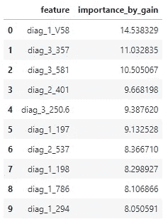
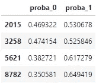
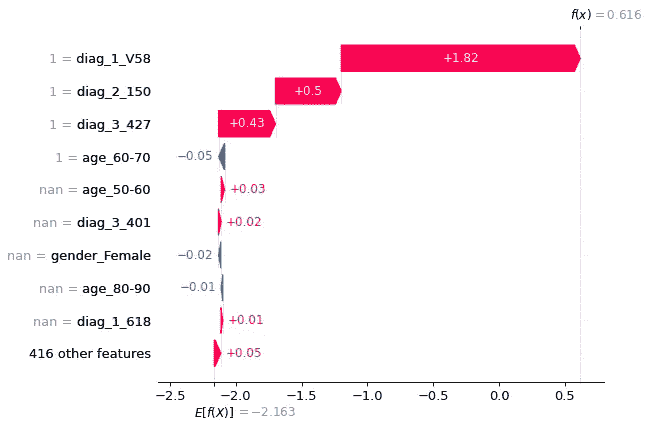

# 在 XGBoost 中使用稀疏矩阵

> 原文：<https://towardsdatascience.com/using-sparse-matrices-in-xgboost-2c2112f362f8>

## 处理高基数的另一种方法


空白的空间是一个机会。美国宇航局在 [Unsplash](https://unsplash.com/photos/Yj1M5riCKk4) 拍摄的照片

在听说 XGBoost 算法之前，你不必很早就参与数据科学，包括它已经用于的所有 Kaggle 比赛，并取得了巨大的成功。关于如何开始使用这种算法，网上也不乏很棒的教程([包括《走向数据科学》](/a-beginners-guide-to-xgboost-87f5d4c30ed7))。然而，XGBoost 有一个令人惊讶的特性经常被忽略，并且在大多数教程中都很遗憾地缺失了:XGBoost 接受稀疏矩阵作为输入的能力。如果您不熟悉这种数据结构，为什么它如此有用，或者如何在 XGBoost 中使用它，那么您来对地方了！使用稀疏矩阵一开始可能会令人生畏，但在本文的结尾，我将向您展示它是多么简单。我相信您很快就会在自己的数据科学项目中使用它们，尤其是如果您有高基数的数据集。

## 什么是稀疏矩阵？

一个[稀疏矩阵](https://en.wikipedia.org/wiki/Sparse_matrix)是一种数据结构，在存储表格信息时非常有效，其中许多列包含空值(您将看到其他定义说稀疏矩阵主要由 0 组成，这是通常的定义，但在本文中，我在技术上创建的矩阵具有空值或缺失值)。乍一看，这似乎很奇怪。毕竟，为什么首先要使用包含大量空值的数据集呢？这都归结到高基数分类变量，以及在使用 XGBoost 之前我们必须如何转换它们。

[基数](/dealing-with-features-that-have-high-cardinality-1c9212d7ff1b)是一个 [$10 单词](https://en.wiktionary.org/wiki/ten-dollar_word#:~:text=Noun,the%20intent%20to%20appear%20sophisticated.)，它描述了一个分类(非数字)数据特征，该特征有许多可能的值。假设您有关于人们居住地的数据，包括他们的邮政编码。尽管在美国邮政编码包含 5 位数字，但这实际上是一个分类数据特征(例如，73301 并不是因为邮政编码本身的值而“小于”73302)。有成千上万个不同的邮政编码，所以这确实是一个高基数数据特性。让 XGBoost(只接受数字特性)读取这个特性的一个策略是[一次性编码](https://machinelearningmastery.com/why-one-hot-encode-data-in-machine-learning/)它。在这里，您可以为每个可能的邮政编码创建一个指示器变量(例如，一个名为 *lives_in_73301* 的列，另一个名为 *lives_in_73302* 的列，等等)。)，并用 1 或 0 填充这些列，其中 1 表示一个人居住在该邮政编码。您很快就会意识到，这会导致数据结构中主要填充 0。对其他几个高基数的列重复这个练习，现在您应该意识到您的数据很快就会变得非常稀疏。

但是，如果您试图将这种稀疏数据存储在 pandas 数据框中(或者任何其他类型的密集表格结构)，您可能会很快遇到内存问题。如此之快，它会让你想要重新开始，并试图找出一种方法来减少列的基数。但是不要放弃！可能有非常有价值的信息嵌入在那些您为了减少基数和内存使用而丢弃的列中。不要误会，熊猫数据框很棒，我在自己的工作中也经常使用它们。然而，它们不擅长存储稀疏数据，尤其是当所讨论的数据集相当大或者有很多特征时。

进入稀疏矩阵数据结构。具体来说，CSR 矩阵，代表“压缩稀疏行”(还有其他方法对矩阵进行稀疏编码，但下面的管道使用 CSR 结构)。这种数据结构利用了矩阵的大部分将具有缺失信息的事实。它的工作原理是只存储非空元素及其位置。当矩阵中的大部分信息丢失时，CSR 矩阵结构将使用比其密集对应物少得多的存储器，其中也存储丢失的值及其位置。

应该注意的是，使用稀疏矩阵也有缺点，主要的一个缺点是它们不像其他数据结构那样容易使用，例如用于探索性数据分析的 pandas 数据框。它们的主要目的是高效地存储稀疏数据。因此，我的建议是依靠其他工具来探索和理解您的数据集。当您准备好构建模型管道时，如果合适的话，可以过渡到使用稀疏矩阵。

## 高基数数据集的用例


不是这种红衣主教。[帕特里斯·布沙尔](https://unsplash.com/@patriceb)在 [Unsplash](https://unsplash.com/photos/Yu_ejF2s_dI)

在本练习中，我们将使用“[糖尿病 130 家美国医院 1999-2008 年数据集](https://archive.ics.uci.edu/ml/datasets/diabetes+130-us+hospitals+for+years+1999-2008)”，我们将建立一个模型来预测 30 天内的再入院。您也可以自己下载这个数据集，并执行下面的 Python 代码(如果您还没有安装必要的包，那么在安装完必要的包之后)。这个数据集中的许多字段都有潜在的用处，但是我们在这里主要关注一些高基数的字段。具体来说，我们将包括:

*   *encounter_id* (为每次入院唯一标识)
*   *重新接纳*(用于开发目标变量)
*   *性别*(诚然基数低，但性别往往是很多医疗状况的优秀预测指标，所以我们会保留)。
*   *年龄*(患者的 10 岁年龄段，基数也很低，但与性别一样，年龄通常是医疗状况的良好预测因素)。
*   *diag_1* (初步诊断)。
*   *诊断 _2* (二级诊断，如适用)。
*   *诊断 _3* (三级诊断，如适用)

毫无疑问，最高的基数特性将是诊断数据。即使你不熟悉诊断代码，只要想一想医疗专业人员在访问期间可以诊断你的所有方法，你很快就会意识到这个领域有很多可能性。由于诊断代码有三个字段，我们将有三个必须处理的高基数特性。

尽管如此，本文中使用的数据集并不是特别大，您可能可以使用可靠的旧 pandas 数据框架和您的常用方法将所有这些数据放入内存中。然而，这不是本教程的重点。我有意使用一个较小的、易于处理的数据集，以便以后当您处理一个包含大量高基数列、需要很长时间才能运行的非常大的数据集时，您可以轻松地使用稀疏矩阵数据结构。稍后，当您的其他同事正在努力使他们的模型在内存限制内工作，或者为了减少内存开销而减少有价值的特性时，如果您使用这种数据结构，将会一帆风顺，获得其他模型所缺少的洞察力。

现在，让我们导入数据，只保留我们在本练习中需要的列。

```
import pandas as pd, xgboost as xgb
from scipy.sparse import csr_matrix
from pandas.api.types import CategoricalDtype
from sklearn.model_selection import train_test_split
from xgboost.sklearn import XGBClassifier
import shapdf = pd.read_csv('diabetic_data.csv', low_memory = False)
ex_df = df[[
    'encounter_id'
    ,'readmitted'
    ,'gender'
    ,'age'
    ,'diag_1'
    ,'diag_2'
    ,'diag_3'
]]
ex_df.readmitted.unique()
```

研究*重新接纳的*列，我们看到有三个可能的值: *NO* 、*30*和 *< 30* ，分别表示没有重新接纳、30 天后重新接纳和 30 天前重新接纳(我不清楚这个数据集如何处理恰好在 30 天发生重新接纳的情况，但是我们将忽略这个场景并继续讨论)。我们将创建一个名为 *_admit_lt_30days* 的新列，这是一个指示变量，如果患者在出院后 30 天内入院，则填充 1，否则填充 0。

```
ex_df = ex_df.assign(_admit_lt_30days = 0)
ex_df.loc[ex_df.readmitted == '<30','_admit_lt_30days'] = 1
ex_df = ex_df.drop('readmitted', axis = 1)
```

变量名 *_admit_lt_30days* 前面为什么加下划线？我们很快就会实现的，我保证！

## 将数据转换为高格式


很快，您将创建比这更高的数据集。[杰夫·图马勒](https://unsplash.com/@jeff_tumale)在 [Unsplash](https://unsplash.com/photos/rbdQHqcu-yo)

接下来，我们将组织我们的数据，这似乎是朝着错误的方向迈出了一步。我们将以高格式重新构建我们的数据，其中数据由三列表示:

*   *遭遇 id* (遭遇或入场 id)。
*   *变量*(正在存储的变量的名称)。
*   *值*(所讨论的变量的值)。

例如，对于性别列，我们将创建两个变量， *gender_f* 和 *gender_m* 。如果入院时患者是女性或男性，这些列的值将分别为 1。

这似乎与你所了解的基于结构化数据的机器学习算法背道而驰。毕竟，不是应该为每个观察值保留一行吗？使用高格式的数据，我们将为每次遭遇提供五个变量。然而，这只是一个中间步骤，有助于我们稍后生成一个宽而稀疏的矩阵，其中每一个准入确实将由一个单独的行来表示。

目前，我们利用 pandas 内置的 *melt* 函数，以这种高格式构建数据。

```
numeric_df = ex_df[[
    'encounter_id', '_admit_lt_30days'
]].melt(id_vars = 'encounter_id')text_df = ex_df[[
    'encounter_id', 'gender', 'age', 'diag_1', 'diag_2', 'diag_3'
]].melt(id_vars = 'encounter_id')text_df.variable = text_df.variable + '_' + text_df.value
#Remove special characters from variable names
text_df.variable = \
    text_df.variable.str.replace('\[|\)', '', regex = True)
text_df = text_df.assign(value = 1)tall_df = numeric_df.append(text_df)
```

## 将数据转换为宽而稀疏的矩阵

通过首先创建一个高的数据框，我们可以更容易地在以后构建一个宽而稀疏的矩阵。相反，如果我们试图在 pandas 中创建一个宽的数据集，然后将其转换为稀疏矩阵，pandas 中宽而密的数据集将会耗尽大量内存，这就违背了稀疏矩阵数据结构的初衷。

为了将高数据转换成宽而稀疏的数据，我们将对高数据集应用一个非常类似于 pandas 中的 [*枢轴*函数](https://www.w3resource.com/pandas/dataframe/dataframe-pivot.php)的转换，尽管我们将把结果转换成 CSR 矩阵数据结构。*变量*列中的每个条目将成为它自己单独的一列。CSR 矩阵中每个元素的值将是*值*列和*遭遇 id* 行中的数字。数据集中的最后一列是*encount _ id*，每个 ID 占一行。注意，对于*encount _ id*和*变量*的一些组合，在新的稀疏矩阵内将没有对应的*值*。对于涉及诊断代码的列尤其如此。在这些情况下，CSR 矩阵中的值本质上是一个空值，尽管实际上 CSR 矩阵中根本没有存储任何东西。在这个转换之后，每个观察都将有一个单独的行，并且数据将为 XGBoost 算法做好准备。

```
encounter_c = \
    CategoricalDtype(sorted(tall_df.encounter_id.unique()), ordered=True)
var_c = \
    CategoricalDtype(sorted(tall_df.variable.unique()), ordered=True)
row = \
    tall_df.encounter_id.astype(encounter_c).cat.codes
col = \
    tall_df.variable.astype(var_c).cat.codes
sparse_matrix = \
    csr_matrix(
        ( tall_df["value"], (row, col) )
        , shape = ( encounter_c.categories.size, var_c.categories.size )
    )#Everything after the first column is a feature
X = sparse_matrix[:,1:]
#The first column is the target variable
Y = pd.DataFrame(sparse_matrix[:,0].astype(int).todense())X_train, X_test, Y_train, Y_test = \
    train_test_split(X,Y, test_size=0.2, random_state=888)
```

注意，当创建 *var_c* 时，我们在应用 *CategoricalDtype* 函数之前对列进行排序。这具有按字母顺序排列所有变量名的效果。回想一下，我们在目标变量前面放了一个下划线，下划线排在任何小写字母之前。因此，稀疏矩阵的第一列包含我们的目标变量，矩阵的其余部分包含我们的特征。这就是为什么我们在目标变量前面加了一个下划线，这样当我们在一个稀疏矩阵(即 CSR 矩阵的第一列)中转换数据时，即使我们后来在模型中添加或删除了其他特性，我们也能立即知道在哪里寻找它。

## 构建 XGBoost 模型

我们现在已经准备好构建 XGBoost 模型了。我们将跳过超参数调优，直接进入模型构建，因为重点只是开始使用 XGBoost 中的稀疏矩阵。

```
xgb_model = \
    xgb.XGBClassifier(
        objective='binary:logistic'
        ,booster='gbtree'
        ,tree_method='auto'
        ,eval_metric='logloss'
        ,n_jobs=4
        ,max_delta_step=0
        ,random_state=888
        ,verbosity=1
    )
xgb_model.fit(X_train, Y_train)
```

我们也可以通过[增益](/be-careful-when-interpreting-your-features-importance-in-xgboost-6e16132588e7)得到特征重要性。我们看到，对于某些类型的诊断，增益相当高。也就是说，当预测再入院的概率时，这些特征被认为是非常重要的。

```
#Get the feature importance by gain and sort
#This has "dummy" names like f0, f1, etc. that have little meaning
#However, we will update them with meaningful names later.d2 = xgb_model.get_booster().get_score(importance_type='gain')
feature_by_gain_noname = \
    pd.DataFrame(
        data=list(d2.items())
        ,columns=['feature','importance_by_gain']
    ).sort_values('importance_by_gain', ascending = False)#Get the index values of the featuresto_index = \
    feature_by_gain_noname['feature'].str.slice(1,).astype(int).tolist()#Create a data frame with the feature names and sortnames_in_order = var_c.categories[1:][to_index].to_frame()
names_in_order.columns = ['feature']
names_in_order.index = range(len(names_in_order.index))#Create a data frame that does not have the dummy name columnby_gain = feature_by_gain_noname['importance_by_gain'].to_frame()
by_gain.columns = ['importance_by_gain']
by_gain.index = range(len(by_gain.index))#Join the data frame with names to the gain valuesfeature_by_gain = names_in_order.join(by_gain)feature_by_gain.head(10)
```



按增益排列的前 10 个变量

## 从使用 SHAP 值的模型中获得的见解

虽然增益是一个有价值的指标，但它不能告诉我们该变量是正预测值还是负预测值。例如，初步诊断 V58 会增加还是减少再次入院的可能性？仅仅使用增益度量是不可能的。

通过使用 [SHAP](/shap-explain-any-machine-learning-model-in-python-24207127cad7) 软件包，我们可以看看哪些变量对预测 30 天再入院最有影响。缺点是 SHAP 不能将稀疏矩阵作为输入(还记得我说过熊猫数据框通常更容易处理吗？).作为一种变通方法，我们可以通过只包含那些使用稀疏矩阵实现选择的特征来减少原始数据集中的维数。对于更大的数据集，可以考虑的另一个选择是将 SHAP 分析限制在数据的一个子集。

假设我们想要计算维持数据的 SHAP 值。我们可以通过限制我们的高数据集来做到这一点，只包括在训练数据集上拟合我们的模型时保留的那些列。然后，我们将新数据转换为密集的 pandas 数据帧(请注意，我们通过删除 XGBoost 在第一轮模型创建期间没有选择的不必要的列来减少内存开销)，使用旧的训练数据重新调整模型，最后计算维持数据的 SHAP 值。

```
filter_df = \
    tall_df.loc[
        tall_df.variable.isin(feature_by_gain.feature)|(tall_df.variable == '_admit_lt_30days'),
    ]
filter_df_pivot = \
    filter_df.pivot_table(
        index='encounter_id'
        ,columns='variable'
        ,values='value'
    ).rename_axis(None, axis=1)df = filter_df_pivot.reset_index()
df = df.drop(columns='encounter_id')
feature_final = \
    list(df.columns[~df.columns.isin(['_admit_lt_30days'])])X = df.loc[:,feature_final]
Y = df.loc[:,'_admit_lt_30days']X_train, X_test, Y_train, Y_test = \
    train_test_split(X,Y, test_size=0.1, random_state=652)model = xgb_model.fit(X_train, Y_train)explainer = shap.Explainer(model, X_test)
shap_values = explainer(X_test)
```

一个非常自然和常见的问题是解释为什么模型以一种特定的方式给某些观察评分。例如，让我们看看根据模型，有超过 50%的再入院概率的患者。我们可能想知道为什么这个模型赋予这些入院者如此高的再入院概率。

```
score_pred_score = xgb_model.predict_proba(X_test)
score_pred_score_df = \
    pd.DataFrame(score_pred_score, columns=['proba_0', 'proba_1'])
score_pred_score_df.loc[score_pred_score_df.proba_1 > .5,]
```



再入院概率> 50%的患者

根据我们的模型，再入院概率最高的观察指标值为 8782，再入院的几率约为 65%。我们可以看看 SHAP 瀑布图，了解一下为什么录取分数是这样的。



解释高再入院概率计算的 SHAP 瀑布图

根据上面的 SHAP 图，由于存在以下三种情况，这种特殊的观察结果有很高的再入院概率:

*   [v 58](http://www.icd9data.com/2015/Volume1/V01-V91/V50-V59/V58/default.htm)的诊断(遇到其他未指明的程序和善后处理)。
*   [150](http://www.icd9data.com/2015/Volume1/140-239/150-159/150/default.htm)的诊断(消化器官和腹膜的恶性肿瘤)。
*   [427](http://www.icd9data.com/2015/Volume1/390-459/420-429/427/default.htm)(心律失常)的诊断。

由于使用了稀疏矩阵数据结构，我们能够获得一些有价值的洞察力，否则这将是非常困难的。我们现在可以看到哪些诊断在特定入院中驱动更高或更低的再入院概率，如果我们减少诊断数据的基数，这些信息将会丢失。该模型可以进一步分析，以帮助确定哪些诊断倾向于表明再入院的高概率，它甚至可以用作开发预测模型的框架，以在不干预的情况下识别有再入院风险的患者。有了这些信息，医院或健康计划可以制定一个计划来帮助预防患有某些诊断的糖尿病患者再次入院。

## 进一步的步骤和其他提示


轮到你了，你赢了！[Ashkan Forouzani](https://unsplash.com/@ashkfor121)on[Unsplash](https://unsplash.com/photos/eCT-INlK2MM)

为了本教程的缘故，我故意保持这个例子简单。通过使用这个管道或对它的一些修改，您将能够以一种独特的方式使用高基数字段，这种方式在不丢失信息的情况下减少了内存开销。但这仅仅触及了这项技术威力的表面。

假设您想在这个模型中包含医疗专业特性，看看这是否有助于预测再入院。幸运的是，这很容易做到！只需转到将数据转换为高格式的部分，使用现有代码作为模板，将医疗专业添加到包含的变量列表中。这个新项目将流经模型的其余部分，一直到在 XGBoost 中拟合模型并创建 SHAP 输出。假设您想要基于诊断代码的前三个字符创建一个变量(它将相似的诊断分组在一起，但是请注意，所使用的样本数据集可能已经为非糖尿病诊断完成了这一任务)。同样，非常简单！您只需要转到将数据转换为高格式的部分，并根据诊断代码的前三个字符创建一个列。一般来说，在这个管道中添加新的特性或者从管道中删除不必要的特性是很简单的。您只需要确定一个观察索引(本文中的 *encounter_id* )、一个变量名和一个要输入的值。然后，将这些新信息添加到现有的高数据框中，剩下的信息就从这里开始了。

最后一点，回想一下我们对这个例子的诊断信息进行了一次性编码。但是，除了 1 之外，您可以随意将其他值放入*值*列。比方说，我们知道患者在过去一年中接受诊断的次数，而不是该数据集中可供我们使用的有限信息。如果患者在过去的一年中被诊断为诊断代码 250.8 十次，则*值*将被填充为 10 而不是 1。你可以在这里包括你认为可能具有预测性的各种数值，从花费的美元，到诊断后的天数，到就诊次数，等等。通过这样做，您可以将有价值的信息嵌入到您的稀疏矩阵中，然后 XGBoost 可以使用这些信息来构建更好的模型(例如，可能频繁接受某项诊断的患者更有可能再次入院，并且模型可能会发现这种模式，等等)。).

我希望这对您有所帮助，并祝您在将稀疏矩阵融入您自己的模型时好运！