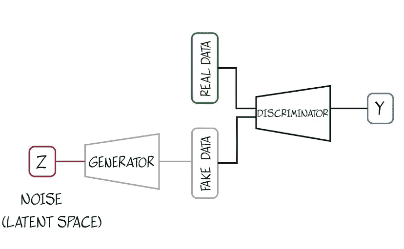
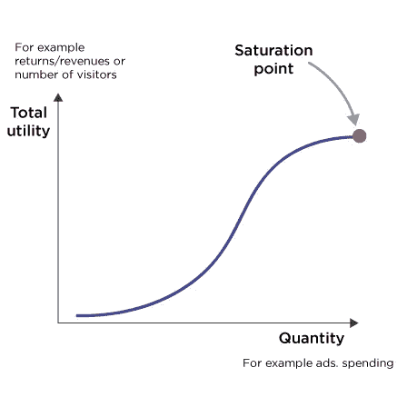
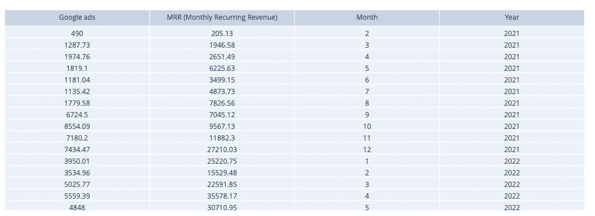
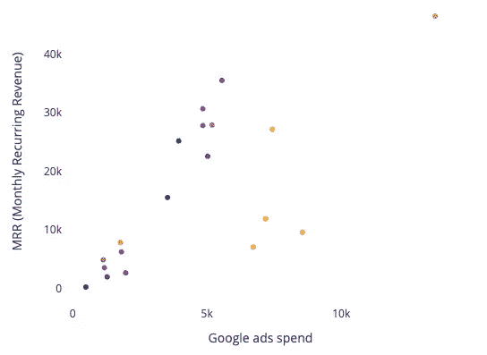
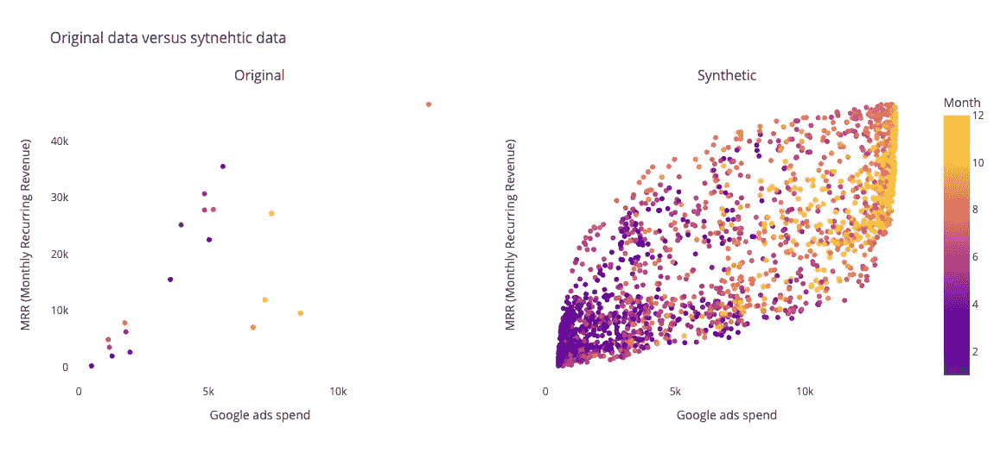
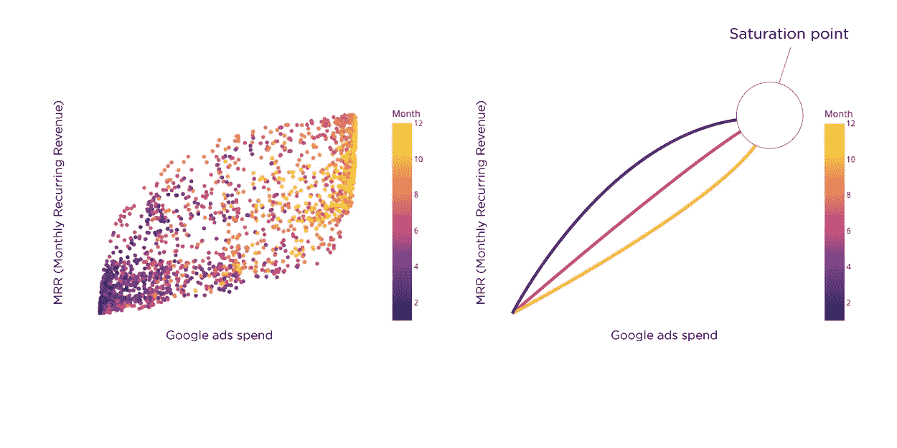
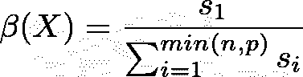

# 在数字营销中使用合成数据

> 原文：<https://towardsdatascience.com/using-synthetic-data-in-digital-marketing-c972b96e5c>

## 品牌和营销机构的新机遇


图片由来自 [Pixabay](https://pixabay.com/es//?utm_source=link-attribution&utm_medium=referral&utm_campaign=image&utm_content=3846597) 的 [Gordon Johnson](https://pixabay.com/es/users/gdj-1086657/?utm_source=link-attribution&utm_medium=referral&utm_campaign=image&utm_content=3846597) 拍摄。

在这篇文章中，我们提出了一个在数字营销人员和品牌战略家非常普遍的问题中的合成数据生成的用例。因为活动是在快速变化的环境中发起的，我们不能指望从他们那里收集详细的数据。我们展示了如何使用合成生成的数据来生成大型数据集，可以增加低样本量收集数据的价值。

# 数字营销的挑战

随着数字营销的不断创新，每隔几个月就会出现新的趋势，营销人员和品牌战略家只是被宠坏了。对品牌来说，在合适的时间以合适的成本将相关内容送达合适的受众仍然是一个巨大的挑战。为了回答这个问题，“我应该把我的下一美元投资到哪里？”，数据是品牌最好的朋友。但并非所有品牌或活动都有大量数据。数字营销是一门实证学科。

> 营销人员必须不断适应新的、引人入胜的内容创作、隐私问题、快速变化的全渠道策略等等。他们收集了大量数据，但这些数据并不总是统计相关的。

最终，他们将拥有小型或中型数据集来研究特定问题。当我们只有一年的数据时，很难预测活动的成功，因为这种方法在两年前并不存在。在这种情况下，合成数据可以成为从现有数据中提取价值和应对新挑战的新工具。

# 表格合成数据:被遗忘的数据

当今最令人兴奋的技术之一是合成数据。每个人似乎都在谈论 DALL-E 或其他图像或文本生成工具。表格数据没有像图像或文本数据那样取得长足的进步。表格合成数据只与少数数据科学和机器学习专家相关。也很难向非专家传达使用它的好处。我们都熟悉如何让照片看起来更好。图像处理技术帮助我们提高图像的分辨率，以更好地识别原始图像中不清晰的一些细节。这个改进的图像可以被认为是从原始图像生成的“合成数据集”。然而，我们能改进表格数据集吗？能不能提高它的“分辨率”看更多细节？答案是肯定的，有可能，但是把握起来并不像我们用图像看到的那么简单。

# 生成对抗网络

生成对抗网络(GANs)是机器学习中最具创新性的技术之一。Ian Goodfellow 在 2014 年开创了 GANs[1]。这个想法是制造两个不同的神经网络，让它们互相对抗。第一个神经网络(生成器)生成在统计上与输入数据相似的新数据。第二个神经网络(鉴别器)的任务是识别哪些数据是人工创建的，哪些不是。我们可以想象一个游戏，第一个网络试图欺骗第二个网络，第二个网络必须猜测第一个网络在做什么。这个游戏让这个组合非常强大。要了解更多关于这些网络的信息，你可以阅读这篇[文章](/synthetic-tabular-data-generation-34eb94a992ed)，其中我们介绍了我们将在这项工作中使用的 Python 开源库。



图 GAN 网络示意图。图片作者。

# 数字营销中的 S 曲线

我们可以从 Gossen 的边际价值递减定律[2]中看出，超支可能会对营销策略构成威胁。这种想法也被称为边际效用递减理论，在市场营销中，广告 S 曲线或递减曲线[3]。递减曲线模拟了广告支出和销售或市场份额之间的关系，并假设在某个点之后，广告支出不会导致销售(或收入或市场份额)的增加。这种关系有一个“S 形”:它既不是线性的，也不是对称的，有一个饱和点。



图二。戈森的边际效用第一定律。图片作者。

营销人员和品牌战略家充分意识到了曲线递减。在某一点之后，再多的广告努力也无法增加收入。我们需要数量一致的数据来绘制这条 S 形曲线；否则，我们将看到线性关系，或者在最坏的情况下，根本没有关系。这也是大多数营销人员很难正确估计饱和点的原因。因为一些品牌和机构同时进行大量的活动，对这一点的不精确计算意味着浪费大量的金钱。此外，这些曲线是非常有趣的定量工具，可用于比较不同的活动和模拟未来战略。

# 实际案例

我们接触了一个两年前推出的新奇品牌。从那以后，他们一直在投资不同的活动(谷歌、脸书、Linkedin 等)。).他们收集了数量有限的数据，并要求我们给这些数据一些意义，以便改进他们的广告策略。作为成本最高的活动的总体结果，他们构建了下表(图 3)。



图 3。前两年运行结果数据表。图片作者。

该表包括 4 列和 19 行(它们已经运行的月份)。他们想知道他们是否仍处于饱和点，以便计划他们的下一个战略步骤。在图 4 中，我们可以看到绘制“总效用”的结果，在这种情况下，每月经常性收入(MRR)和“数量”(花费在广告上的金额)。



图 4。品牌收集的原始数据。图片作者。

我们应该能够计算出一个饱和点，但是根据这个图，这似乎是不可行的。我们有几个样本，有几种可能性来画一条曲线。此外，平稳性的影响是显著的(关系中一年中的月份的影响)。我们想探索合成数据集是否能帮助他们解决这个问题。

## **生成合成数据**

为了生成合成数据，我们将使用开源 python 库 [nbsyntehtic](https://github.com/NextBrain-ml/nbsynthetic) 。我们最近发布了这个库[，](/synthetic-tabular-data-generation-34eb94a992ed)，我们已经包含了新的包来解决这个问题。我们使用了无条件的 Wasserstein 生成对抗网络。据其创造者称，wGANS 提高了学习的稳定性，消除了模式崩溃等问题，并提供了对调试和超参数搜索有用的有意义的学习曲线[4]。本文无意深入探究这些技术基础。详细信息请参见 [4](https://proceedings.mlr.press/v70/arjovsky17a.html) 。

# 结果

我们从最初的 19 个样本的表数据中生成了一个 2000 个样本的合成数据集。代码可以在[这里](https://github.com/NextBrain-ml/nbsynthetic/blob/master/tutorials/nbWGAN_ROI.ipynb)找到。在图 5 中，我们可以看到两个数据集的比较。



图 5。原始数据和合成数据的比较。图片作者。

可以评估合成数据是否确实“相似”，或者在进行预测时是否可以用真实数据代替。当涉及到创建合成表格数据时，这不是一个简单的问题。如前所述，处理合成图像时，一切都变得简单多了。当我们比较原始图像和合成图像(例如，为了提高分辨率)时，每个人都同意这是相同的图像。但是当我们创建一个合成数据集时，这种关联是不可见的。有几种方法可以检查数据的相似性。即便如此，“相似性”的概念仍然是一个非常复杂的数学概念。最常见的方法是视觉比较，使用机器学习模型、统计测试和拓扑数据分析。在我们的分析中，我们将使用视觉比较和机器学习模型的使用。在 [Github repo 中，](https://github.com/NextBrain-ml/nbsynthetic)读者还可以使用统计测试和拓扑数据分析找到比较。此外，我们将介绍一种基于流形学习方法的新方法。

**视觉对比**

如果可能的话，这是检查数据相似性的最简单、最直接的方法。当我们有多维数据时，我们可以在二维或三维图中比较特征。例如，如果我们有 20 个特征，我们必须绘制大量的图来检查所有可能的特征组合。从实践的角度来看，这可能很难实现。在图 5 中，我们可以看到我们的问题的直接表示。图 6 让我们了解了饱和点在哪里。我们还看到曲线强烈地依赖于一年中的月份。当然，这种视觉信息对做决定很有用。



图 6。饱和点。图片作者。

**与机器学习模型的比较**

为了测试两个数据集的“互换性”，我们可以在一个机器学习问题中使用它们。在我们的案例中，我们使用随机森林回归[5]来预测 MMR 变量。然后，我们使用相同的算法在合成数据集上进行相同的预测。最后，我们使用合成数据训练的算法来预测 MMR 使用原始数据值。结果如下表所示。

```
Original data
-------------
Score without cross validation = 0.32
Scores with cross validation = [ 0.19254948 -7.0973158   0.1455913   0.18710539 -0.14113018]

Synthetic data
--------------
Score without cross validation = 0.80
Scores with cross validation = [0.8009446  0.81271862 0.79139598 0.81252436 0.83137774]

Check algorithm with original data
----------------------------------
Score with cross validation prediction = 0.71
```

正如我们所看到的，在原始数据集中进行预测会导致相当不稳定的准确性，这取决于我们如何分割用于训练和测试的数据。当我们应用交叉验证策略进行训练时，我们观察到结果高度分散，但预测精度相当适中。

当我们使用合成数据训练系统时，我们获得了更稳定的准确度和更好的结果。总之，在合成数据集中进行预测比在原始数据(有限的样本大小)中进行预测更有意义，并且会产生有趣的准确性。最后，我们使用合成数据训练算法来预测原始数据。我们还采用交叉验证策略。结果表明，虽然精确度略低于通过合成数据训练获得的精确度，但它显然比通过训练原始数据获得的精确度更稳健和更有吸引力。

## **使用流形学习的不同方法**

流形学习是一种非线性降维技术。
许多数据集被认为具有人工高维度，所有信息都可以从嵌入数据空间的低维流形中提取出来。直观地说，对于每个高维数据空间，都有一个等价的低维数据空间。这有助于简化操作，因为它消除了分析高维数据空间时出现的所有挑战[9，10，11，12]。高维数据的挑战，比如维度的诅咒和维度的祝福，完全消失了。

> 方差集中率(VCR)是一种用于量化数据的严格且可解释的指标(Han 等人，2021)

方差集中率( *VCR* )是一个严谨且可解释的量化数据的指标【13】。为了更好地检验流形学习对高维和低维数据的解释能力，可以采用方差集中比( *VCR* )度量。它最初是由韩等人 2021 [13]提出的，用来度量高频交易数据，并对高、低维数据进行量化。

首先我们必须回忆一下奇异值分解的概念—*SVD*【14】。奇异值分解寻求将秩 *R* 矩阵转换为秩 *K* 矩阵。这意味着我们可以将一列 *R* 唯一向量近似为 *K* 唯一向量的线性组合。

> 奇异值可以被认为是在两个子系统(两个矩阵)之间提供了一座“桥梁”。它们是它们之间存在多少相互作用的量度。[资料来源:Math3ma](https://www.math3ma.com/blog/understanding-entanglement-with-svd)

奇异值分解是降维和流形学习的常用技术。

给定具有 *n* 个观测值和𝑝变量的数据集𝑋，方差集中定义为:



*VCR* 定义为数据集的最大奇异值与所有奇异值的总和之比。它回答了这个问题:

**集中在第一个奇异值方向的数据方差百分比是多少？**

这种度量的直觉可能如下:我们认为在数据空间中嵌入了与高维空间等价的低维流形。这个流形也有几个维度。我们可以认为第一维度是最重要的。然后，我们测量数据变化(方差)如何反映在这个第一维度。当比较原始数据和合成数据时，我们必须首先比较低维流形的维度是否相等，然后比较在第一个流形维度上是否有相同的数据变化集中。

我们可以看到从原始的 19 个样本的表数据和 2000 个样本生成的合成数据集获得的结果。我们包括与随机生成的数据集的比较，该数据集具有与合成数据集相同的实例数量。

```
Singular values             
---------------             
Singular values for original dataset:   [1.0, 0.114, 0.051, 0.0]             Singular values for synthetic dataset:  [1.0, 0.110, 0.046, 0.0]             Singular values for random dataset:     [1.0, 0.184, 0.027, 0.0] Variance concentration ratio (VCR)
----------------------------------             
Variance concentration ratio original data = 85.85%             Variance concentration ratio synthetic data = 86.49%             Variance concentration ratio random data = 82.56%
```

我们的实证结果显示了以下规律:

*   原始数据集和合成数据集的奇异值必须相似。
*   合成数据集的方差集中率 VCR 必须等于或高于原始数据的 VCR。

# 结论

我们看到了许多品牌和代理商在准备新活动时面临的一个共同问题。他们希望根据可用数据做出决策，但这些数据通常不允许他们突出相关的可操作见解。我们已经看到，通过使用合成数据，他们可以评估可用数据的价值。此外，我们介绍了几种方法来证明合成生成的数据在决策过程中使用时与真实数据“相似”且“可互换”。

# 最终注释

*   *nbsynthetic* 是由 [NextBrain.ai](https://nextbrain.ml/) 推出的开源项目
*   我们要感谢 [Atomic 212](http://We would like to thank to Atomic 212 for its guidance in helping us understand marketing concepts and the requirements for data-driven solutions in digital marketing.) 的指导，帮助我们理解营销概念和数字营销中数据驱动解决方案的要求。
*   本文的代码可以在[这里](https://github.com/NextBrain-ml/nbsynthetic)找到。

## 参考

1.  *Goodfellow，I .、Pouget-Abadie，j .、Mirza，m .、Xu，b .、Warde-Farley，d .、Ozair，s .、& Bengio，y .等人(2014 年)。生成对抗网络。神经信息处理系统进展，27。*
2.  戈森(1854 年)。人类关系的法则和由此衍生的人类行为的规则。(1983).麻省剑桥:麻省理工学院出版社。
3.  约翰逊，J. K. (1979)。广告与 S 曲线:一种新方法。市场研究杂志，16(3)，346–354 页。[](https://doi.org/10.1177/002224377901600307)
4.  *阿尔乔夫斯基，m .，钦塔拉，s .&amp；博图湖..(2017).沃瑟斯坦生成对抗网络。第 34 届国际机器学习会议论文集，机器学习研究论文集 70:214–223。*
5.  **Pedregosa 等人(2012 年)。*[*Scikit-learn:Python 中的机器学习*](http://jmlr.csail.mit.edu/papers/v12/pedregosa11a.html) *，JMLR 12，第 2825–2830 页。**
6.  **Ilya Tolstikhin、Bharath K. Sriperumbudur 和 Bernhard schlkopf(2016 年)。径向核下最大平均偏差的极小极大估计。《第 30 届国际神经信息处理系统会议录》(NIPS'16)。1938-1946 年，美国纽约州红钩镇柯伦联合公司。**
7.  *Arthur Gretton，Karsten M. Borgwardt，Malte J. Rasch，Bernhard schlkopf 和 Alexander Smola。2012.核双样本检验。j .马赫。学习。第 13 号决议，无效(2012 年 1 月 3 日)，第 723-773 号决议。*
8.  *大卫·多诺霍。(2000).高维数据分析:维度的诅咒与祝福。AMS 数学挑战讲座。1–32.*
9.  **阿加尔瓦尔，c .，欣内堡，a .，凯米特区(2002 年)。高维空间中距离度量的惊人行为。第一次出版。数据库理论，ICDT 200，第八届国际会议，英国伦敦，2001 年 1 月 4-6 日/ Jan Van den Bussche …(编辑。).柏林:施普林格出版社，2001 年，第 420-434 页**
10.  *K. S .拜尔、j .戈尔茨坦、r .罗摩克里希南和 u .肖特。(1999).「最近邻」什么时候有意义？进行中。第七国际。糖膏剂数据库理论，第 217-235 页。*
11.  *亚历山大·欣内堡、查鲁·阿加尔瓦尔和丹尼尔·凯米。(2000).高维空间中最近邻是什么？第 26 届超大型数据库国际会议论文集(VLDB '00)。美国加利福尼亚州旧金山摩根考夫曼出版公司，邮编:506–515。*
12.  **弗朗索瓦·德·沃茨诉韦莱森(2007 年)。分数距离的集中。IEEE 知识与数据工程汇刊，19，873–886。**
13.  **韩、亨利&腾、杰&夏、君若&王、&郭、李子豪&李德清。(2021).通过流形学习预测高频交易标记。基于知识的系统。213.106662.10.1016/j . kno sys . 2020.106662 .**
14.  *特里费森，L. N .，&鲍尔三世，D. (1997 年)。*数值线性代数*(第 50 卷)。暹罗。*