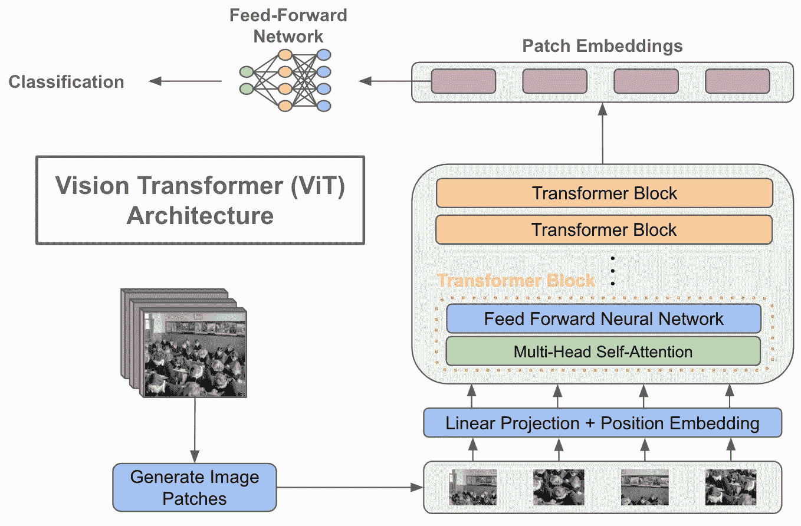
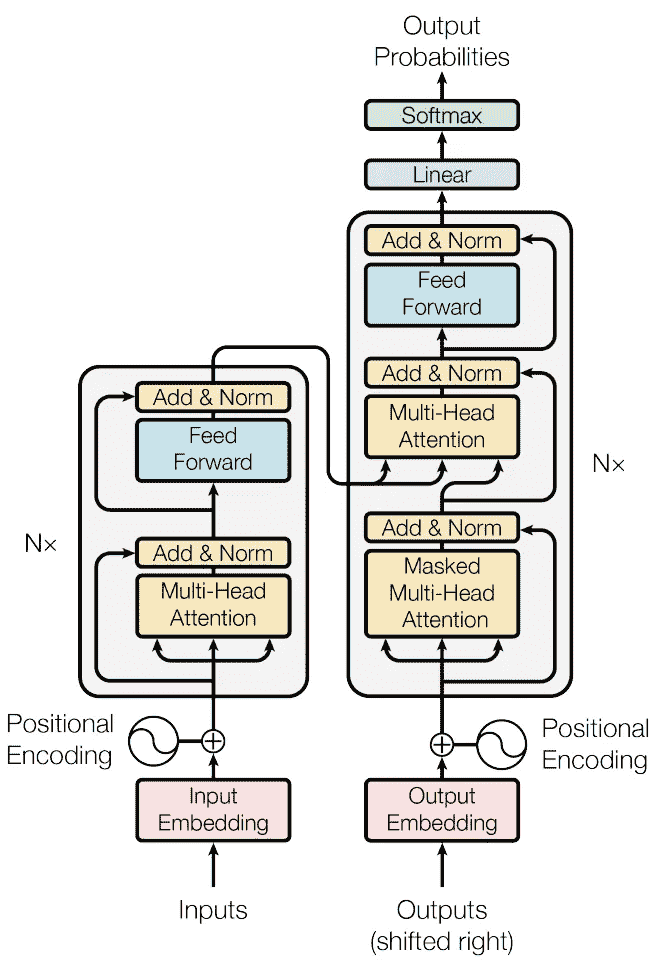
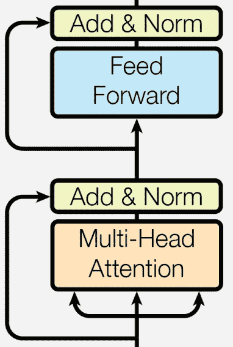
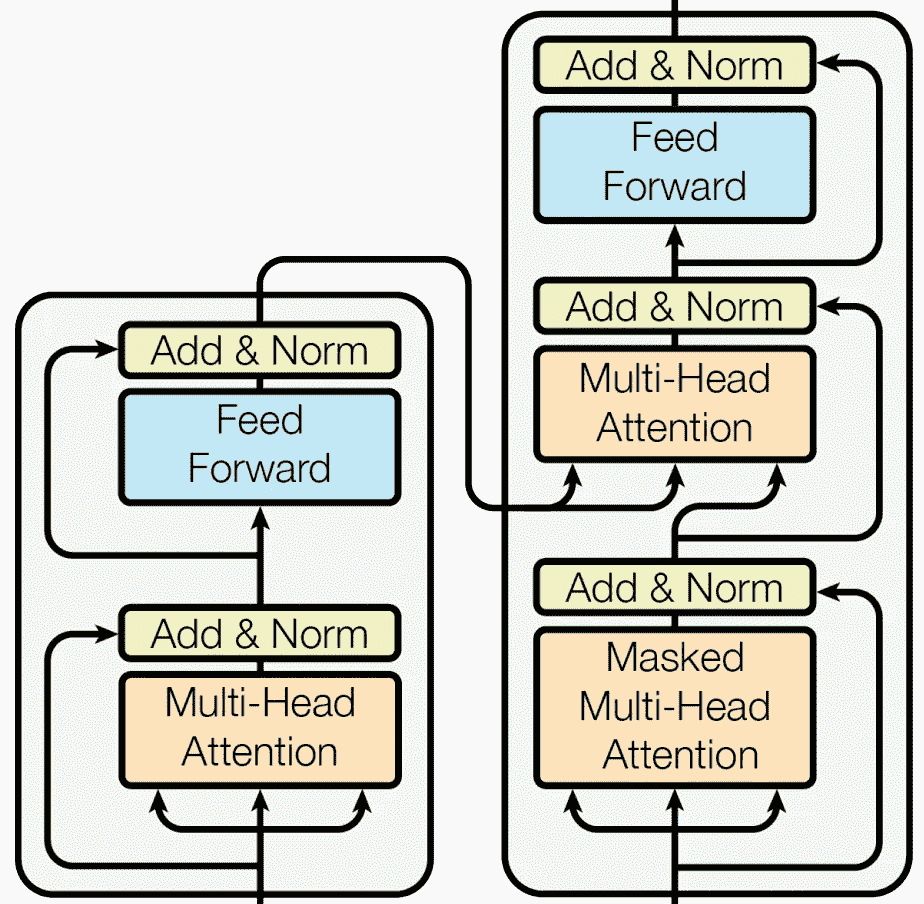
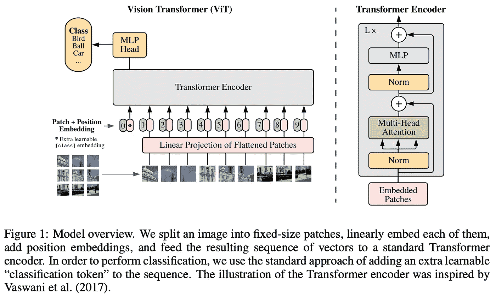
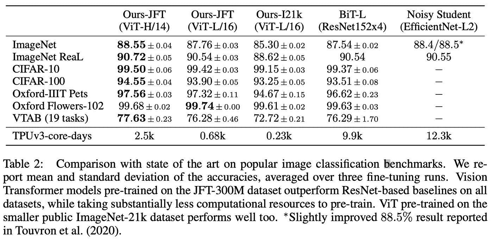
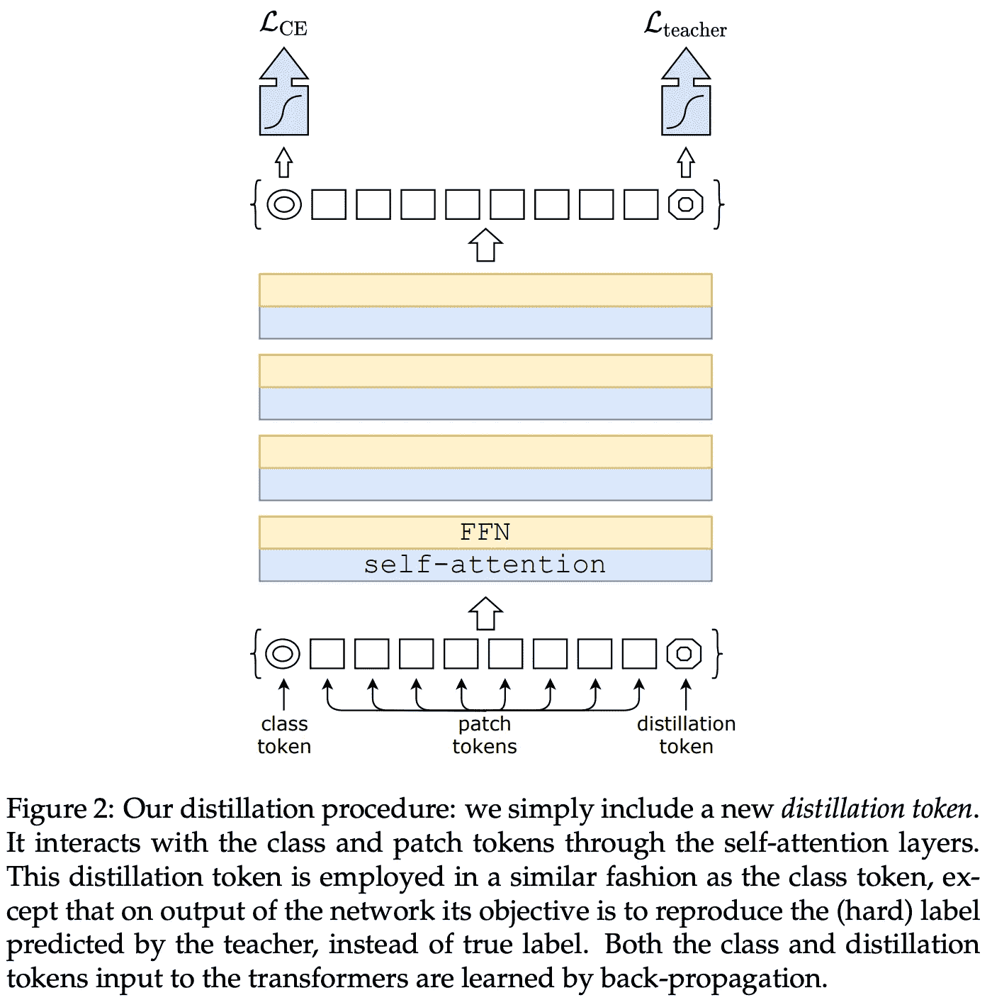
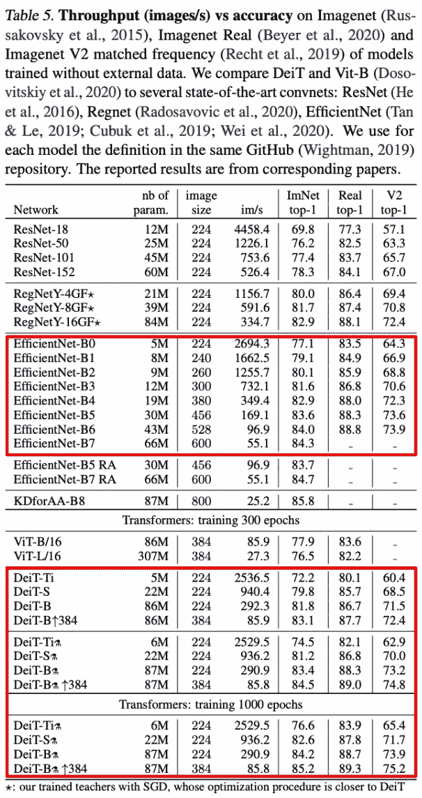
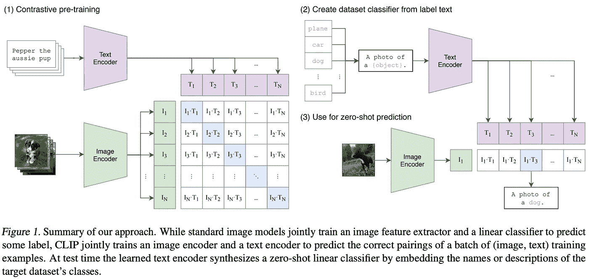

# 将变形金刚用于计算机视觉

> 原文：<https://towardsdatascience.com/using-transformers-for-computer-vision-6f764c5a078b>

## 视觉变形金刚真的有用吗？

视觉转换器架构的基本描述(由作者创建)

# 什么是视觉变形金刚？

Transformers 是一种深度学习架构，主要基于自我关注模块，最初是为序列到序列任务(例如，将句子从一种语言翻译成另一种语言)而提出的。最近的深度学习研究通过将这种架构应用于计算机视觉任务，如图像分类，取得了令人印象深刻的成果。应用于这一领域的变压器通常被称为(不足为奇)视觉变压器。

等等…语言翻译模型怎么能用于图像分类？好问题。虽然这篇文章将深入探讨这个话题，但基本思想是:

1.  将图像转换为一系列拼合的图像面片
2.  将图像补片序列传递给变压器模型
3.  获取转换器输出序列的第一个元素，并将其传递给分类模块

与广泛使用的卷积神经网络(CNN)模型相比，视觉转换器缺乏有用的归纳偏差(例如，平移不变性和局部性)。尽管如此，这些模型被发现在图像分类任务上相对于流行的 CNN 变体表现得相当好，最近的进展使它们的效率——在所需的数据量和计算量方面——更加合理。因此，视觉变压器现在是深度学习实践者的可行和有用的工具。

# 背景

## 自我关注

transformer 架构由两个主要组件组成:前馈网络和自我关注。虽然大多数人都熟悉前馈网络，但我发现自我关注往往不太为人所理解。网上有许多关于自我关注的详尽描述，但为了完整起见，我将在这里提供一个概念的简要概述。

**什么是自我关注？**自关注以 *n* 个元素(或令牌)为输入，进行转换，返回 *n* 个令牌作为输出。它是一个序列到序列模块，对于每个输入令牌，它执行以下操作:

*   将该标记与序列中的所有其他标记进行比较
*   为每一对计算关注分数
*   将当前标记设置为所有输入标记的加权平均值，其中权重由关注分数给出

这种过程通过查看完整的输入序列，识别其中最重要的记号，并基于最相关的记号调整每个记号的表示，来调整输入序列中的每个记号。换句话说，它提出了这样一个问题:“哪些令牌值得关注？”(因此得名自我关注)。

**多头自我关注。**大多数变压器中使用的注意力变量与上述描述略有不同。也就是说，变形金刚经常利用“多头”版本的自我关注。虽然这听起来很复杂，但一点也不……多头自我关注只是并行地使用多个不同的自我关注模块(例如，八个)。然后，这些自我关注模型的输出被连接或平均，以将它们的输出融合在一起。

**这是哪里来的？**尽管在变形金刚中使用了自我关注，但这个想法早于变形金刚的架构。它被大量用于[递归神经网络](https://colah.github.io/posts/2015-08-Understanding-LSTMs/) (RNN)架构【6】。然而，在这些应用中，自我注意通常被用来聚集 RNN 隐藏状态，而不是执行序列到序列的转换。

## 变压器架构

视觉变压器架构与[4]中提出的原始变压器架构非常相似。因此，对转换器架构(尤其是编码器组件)的基本了解有助于理解视觉转换器。在这一节中，我将描述变压器的核心组件，如下图所示。尽管该描述假设使用文本数据，但是也可以使用不同的输入形式(例如，如在视觉变形器中的扁平图像补片)。

变压器架构(来自[4])

**构建输入。**转换器接受一系列标记作为输入。这些记号是通过将文本数据(例如，一个或几个句子)通过[记号赋予器](https://neptune.ai/blog/tokenization-in-nlp)而生成的，记号赋予器将文本数据划分为单独的记号。然后，通过基于记号 ID 索引可学习的嵌入矩阵，将这些记号(每个记号与唯一的整数 ID 相关联)转换成它们相应的嵌入向量，形成输入数据的(`N x d)` 矩阵(即`N`个记号，每个记号用维度为`d`的向量表示)。

通常情况下，一整批`(B x N x d)`，其中`B`是批量，被一次传送到变压器。为了避免不同序列具有不同长度的问题，所有序列都被填充(即使用零或随机值)为相同长度`N`。填充区域被自我关注所忽略。

一旦输入被标记化和嵌入，必须执行最后一步——向每个输入标记添加位置嵌入。自我关注没有位置的概念——无论位置如何，所有的表征都被同等看待。因此，必须向每个输入标记添加可学习的位置嵌入，以将位置信息注入到变换器中。

变压器编码器架构(来自[4])

**编码器。**变压器的编码器部分有许多相同结构的重复层。具体而言，每一层都包含以下模块:

*   多头自我关注
*   前馈神经网络

这些模块中的每一个都跟随着[层标准化](https://leimao.github.io/blog/Layer-Normalization/)和[剩余连接](https://medium.com/towards-data-science/what-is-residual-connection-efb07cab0d55)。通过将输入序列传递通过这些层，每个标记的表示被转换为:

1.  序列中其他相关记号的表示
2.  一种经过学习的多层神经网络，实现每个单独令牌的非线性转换

当一行中应用了几个这样的层时，这些转换会产生一个长度相同的最终输出序列，每个令牌都有上下文感知的表示。

变压器解码器架构(来自[4])

**解码器。**解码器与视觉变压器无关，视觉变压器仅支持编码器架构。然而，为了完整起见，我们将简要概述一下解码器架构。与编码器类似，变压器的解码器包含多层，每层包含以下模块:

*   掩蔽的多头注意力
*   多头编码器-解码器注意
*   前馈神经网络

掩蔽自我注意类似于正常/双向自我注意，但它防止在输入序列中“向前看”(即，这对于像语言翻译这样的序列到序列任务是必要的)。每个标记只能根据输入序列中在它之前的标记进行调整。编码器-解码器自我注意也非常类似于正常的自我注意，但是来自编码器的表示也被用作输入，允许来自编码器和解码器的信息被融合。然后，该计算的结果再次通过前馈神经网络。

**不同的架构变体。**除了本节描述的序列间变压器模型之外，还有许多利用相同基本组件的架构变体。例如，通常在语言理解任务中使用的仅编码器转换器架构完全丢弃了转换器的解码器部分，而仅解码器转换器架构通常用于语言生成。Vision transformer 通常利用仅编码器的 transformer 架构，因为没有需要使用掩蔽自我关注的生成组件。

## 自我监督预培训

虽然 transformers 最初是为序列到序列的任务而提出的，但随着该架构后来被应用于文本生成和句子分类等问题，它的受欢迎程度急剧上升。《变形金刚》获得广泛成功的主要原因之一是使用了[自我监督的预训练技术](https://jalammar.github.io/illustrated-bert/)。

自我监督的任务(例如，预测屏蔽词；见上图)可以被构造用于在原始的、未标记的文本数据上训练转换器。由于这种数据可以广泛获得，变压器可以在大量文本数据的基础上进行预训练，然后在监督任务中进行微调。伯特[7]推广了这样的想法，这在自然语言理解方面取得了令人震惊的进步。然而，这种方法被许多后来的变压器应用所采用(例如 GPT-3 [9])。

有趣的是，尽管自我监督学习在自然语言应用中产生了巨大的影响，但这种方法在视觉变形金刚中并不成功，尽管许多作品都尝试了这种想法[11，12]。

## 一些革命性的变压器应用…

对 transformer 架构有了基本的了解后，就可以正确看待这种架构对深度学习研究的巨大影响。最初，transformer 架构因其在语言翻译方面的成功而流行起来[4]。然而，这种架构继续在深度学习研究的许多领域进行变革。下面列出了一些值得注意的变压器应用(按时间顺序排列):

*   BERT 使用自我监督的预训练来学习高质量的语言表示[ [论文](https://arxiv.org/abs/1810.04805) ][ [代码](https://huggingface.co/blog/pretraining-bert) ]
*   GPT-2/3 利用仅支持解码器的变压器架构来革新生成式语言建模[ [博客](https://jalammar.github.io/illustrated-gpt2/) ][ [论文](https://arxiv.org/abs/2005.14165)
*   AlphaFold2 使用了一种变压器架构来解决长期存在的蛋白质折叠问题[ [论文](https://www.nature.com/articles/s41586-021-03819-2) ][ [代码](https://github.com/deepmind/alphafold) ]
*   DALLE-2 利用剪辑潜伏(和扩散)在多模态生成中实现令人震惊的结果[ [博客](https://openai.com/dall-e-2/) ][ [论文](https://arxiv.org/abs/2204.06125) ]

虽然变形金刚的应用范围很广，但我想强调的要点很简单:*变形金刚在解决各种不同的任务方面极其有效*。

# 出版物

## 一幅图像相当于 16x16 个字:用于大规模图像识别的变形金刚[1]

尽管 transformer 架构对自然语言处理领域产生了巨大的影响，但是将这种架构扩展到计算机视觉领域需要时间。最初的尝试将流行的 CNN 架构与自我关注模块融合在一起，以创建一种混合方法，但这些技术被基于 ResNet 的 CNN 架构超越。

除了将类似变压器的组件集成到 CNN 架构中，在[1]中提出了直接利用变压器架构的图像分类模型。Vision Transformer (ViT)模型将底层图像分成一组面片，每个面片都被展平并投影(线性)到一个固定的维度。然后，向每个图像块添加位置嵌入，指示每个块在图像中的位置。与任何其他 transformer 架构类似，模型的输入只是一系列向量；见下文。

(来自[1])

作者采用 BERT base 和 large [7](即只有编码器的转换器架构)作为其架构，然后通过将监督分类头附加到模型输出中的第一个令牌来训练该架构。对于训练，遵循两步预训练和微调程序。JFT-300M(非常大)、ImageNet-21K(大)或 ImageNet-1K(中等)数据集用于监督预训练。然后，在一些目标数据集(例如，Oxford Flowers 或 CIFAR-100)上对模型进行微调，之后测量最终性能。

在没有对足够数据进行预训练的情况下，所提出的模型不匹配或超过最先进的 CNN 性能。这种趋势可能是由于这样一个事实，即虽然 CNN 对于像平移和位置这样的模式是自然不变的，但是变压器没有这样的归纳偏差，并且必须从数据中学习这些不变性。然而，随着模型在更多数据上被预训练，性能显著提高，最终超过基于 CNN 的基线的准确性，即使预训练成本较低；请看下面的结果。

(来自[1])

## 训练数据高效的图像转换器&通过注意力进行提炼[2]

尽管在以前的工作中，视觉变形器被证明对于图像分类是有效的，但是这样的结果依赖于对外部数据集的大量预训练。例如，在对模型进行微调和评估下游任务之前，最好的 ViT 模型对包含 3 亿幅图像的 JFT-300M 数据集进行了预训练。

虽然之前的工作声称大量的预训练程序是必要的，但作者在[3]中提供了一个替代方案，称为数据高效图像转换器(DeiT)，它利用一个精心策划的[知识提炼](https://neptune.ai/blog/knowledge-distillation#:~:text=Knowledge%20distillation%20refers%20to%20the,deployed%20under%20real%2Dworld%20constraints.)程序来训练视觉转换器达到高 Top-1 精度，而无需任何外部数据或预训练。事实上，整个培训过程可以在一台计算机上用三天时间完成。

本研究中使用的视觉转换器架构与 ViT 模型几乎相同。然而，输入序列中增加了一个额外的标记，称为提取标记；见下图。

(来自[2])

该令牌与其他令牌被同等对待。但是，在离开变压器的最后一层之后，它被用来对网络损耗应用蒸馏分量。特别地，采用硬蒸馏(即，与[软蒸馏](https://arxiv.org/abs/1503.02531)相反)损失来训练视觉转换器复制某个教师网络(通常是 CNN)的 argmax 输出。

在测试时，类的令牌输出和提取令牌被融合在一起，并用于预测网络的最终输出。DeiT 模型优于之前在大型外部数据集上预先训练的几个 ViT 变体。当在 ImageNet 上进行预训练并在下游任务上进行微调时，DeiT 实现了有竞争力的性能。换句话说，*它在不利用外部培训数据的情况下实现了引人注目的绩效。*

除了令人印象深刻的准确性之外，DeiT 中改进的学习策略也非常有效。考虑到各种不同图像分类模型的吞吐量(即模型每秒处理的图像)，DeiT 实现了吞吐量和准确性之间的平衡，这与广泛使用的 EfficientNet [4]模型类似；见下图。

(来自[2])

## 从自然语言监督中学习可转移的视觉模型[3]

(来自[3])

对比语言-图像预训练模型(CLIP)——最近因其在 DALLE-2 中的使用而再次流行——首次表明大量有噪声的图像-字幕对可以用于学习高质量的图像和文本表示。由于使用了制作不良的预训练任务，以前的工作很难恰当地利用这种弱监督数据；例如，使用语言模型直接预测字幕的每个单词。CLIP 提供了一个更简单的预训练任务——将图像与一组潜在标题中的正确标题进行匹配。这个简化的任务为模型提供了更好的训练信号，使得能够在预训练期间学习高质量的图像和文本表示。

CLIP 中使用的模型有两个主要组件——一个图像编码器和一个文本编码器；见上图。图像编码器被实现为 CNN 或视觉转换器模型。然而，作者发现 CLIP 的视觉转换器变体在预训练期间实现了改进的计算效率。文本编码器是一个简单的仅支持解码器的转换器架构，这意味着在转换器的层中使用了屏蔽的自我关注。作者选择使用掩蔽的自我注意，以便 CLIP 的文本组件可以在未来扩展到语言建模应用程序。

使用该模型，预训练任务通过分别编码图像和字幕来实现，然后应用[归一化的、温度缩放的交叉熵损失](https://paperswithcode.com/method/nt-xent)来将图像表示与其相关联的字幕表示相匹配。由此产生的 CLIP 模型彻底改变了图像分类的零镜头性能，将 ImageNet 上的零镜头测试精度从 11.5%提高到 76.2%。为了执行零射击分类，作者简单地:

*   使用文本编码器对每个类的名称进行编码
*   使用图像编码器对图像进行编码
*   选择与图像编码最大化余弦相似性的类别

上图中描述了这样一个过程。关于 CLIP 的更多信息，请参见我的[之前的](https://cameronrwolfe.substack.com/p/using-clip-to-classify-images-without-any-labels-b255bb7205de)车型概述。

## 维生素有用……但是它们实用吗？

就个人而言，我最初对使用视觉变形金刚持怀疑态度，尽管我知道它们令人印象深刻的性能。训练过程似乎计算量太大。然而，训练视觉变形器的大部分计算成本与预训练相关联。在[2]中，作者消除了大量预训练的需要，并直接证明了视觉变压器的训练吞吐量可与 EfficientNet 等高效 CNN 架构相媲美。因此，视觉变压器是一种可行和实用的深度学习工具，因为它们的开销不会明显超过普通 CNN。

# 外卖食品

虽然 transformer 在自然语言处理方面取得了广泛的成功，但是这篇综述应该(希望)传达这样一个事实，即它们对于计算机视觉任务也是有用的。CNN 是一个难以超越的基线，因为它们在数据和计算方面都以高效的方式实现了令人印象深刻的性能水平。然而，最近对视觉变压器架构的修改(如[2]所述)表明，视觉变压器的性能优于 CNN，实际上相当高效。

代码中的视觉变形金刚。对于那些对实施和/或尝试视觉转换器架构感兴趣的人，我建议从这里开始。本教程允许您【T4(I)】下载预先训练的 ViT 参数，并 *(ii)* 在下游视觉任务中微调这些参数。我发现本教程中的代码很容易理解。人们可以很容易地将这些代码扩展到不同的应用程序，甚至可以实现一些在[2]或其他工作中概述的更复杂的训练程序。

**未来要读的论文。**虽然这篇文章概述了我最喜欢的几个视觉转换器作品，但这个主题很受欢迎，还有数百篇其他论文。我(其他)个人最喜欢的几个是:

*   金字塔视觉转换器:无卷积密集预测的通用主干
*   Token-to-Token ViT:在 ImageNet [ [paper](https://arxiv.org/abs/2101.11986) ]上从头开始训练视觉变形人
*   Mlp-mixer:面向视觉的全 Mlp 架构[ [论文](https://arxiv.org/abs/2105.01601)

## 结论

非常感谢你阅读这篇文章。如果你喜欢它，请关注我的[深度(学习)焦点时事通讯](https://cameronrwolfe.substack.com/)，在那里我挑选了一个关于深度学习研究的单个两周一次的主题，提供了对相关背景信息的理解，然后概述了一些关于该主题的流行论文。我是 [Cameron R. Wolfe](https://cameronrwolfe.me/) ，是 [Alegion](https://www.alegion.com/) 的研究科学家，也是莱斯大学的博士生，研究深度学习的经验和理论基础。你也可以看看我在 medium 上的[其他作品](https://medium.com/@wolfecameron)！

# 文献学

[1] Dosovitskiy，Alexey 等，“一幅图像相当于 16x16 个字:大规模图像识别的变形金刚。” *arXiv 预印本 arXiv:2010.11929* (2020)。

[2] Touvron，Hugo，等，“训练数据有效的图像转换器&通过注意力进行提炼。”*机器学习国际会议*。PMLR，2021 年。

[3]拉德福德、亚历克等，“从自然语言监督中学习可转移的视觉模型。”*机器学习国际会议*。PMLR，2021 年。

[4]瓦斯瓦尼、阿希什等人，“你所需要的只是注意力。”*神经信息处理系统进展* 30 (2017)。

[5]谭、明星和郭乐。"效率网:重新思考卷积神经网络的模型缩放."*机器学习国际会议*。PMLR，2019。

[6]林，，等.“一个结构化的自注意句嵌入” *arXiv 预印本 arXiv:1703.03130* (2017)。

[7] Devlin，Jacob 等《Bert:用于语言理解的深度双向转换器的预训练》 *arXiv 预印本 arXiv:1810.04805* (2018)。

[8]拉德福德、亚历克等人，“语言模型是无人监督的多任务学习者。” *OpenAI 博客* 1.8 (2019): 9。

[9]布朗、汤姆等人，“语言模型是一次性学习者。”*神经信息处理系统的进展*33(2020):1877–1901。

[10] Ramesh，Aditya 等人，“具有剪辑潜在性的分层文本条件图像生成” *arXiv 预印本 arXiv:2204.06125* (2022)。

[11]陈，，谢赛宁，，何."训练自我监督视觉转换者的实证研究."IEEE/CVF 国际计算机视觉会议论文集。2021.

[12]卡隆，玛蒂尔德等，“自我监督的视觉变形金刚的新兴特性”*IEEE/CVF 计算机视觉国际会议论文集*。2021.