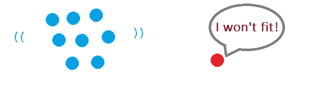
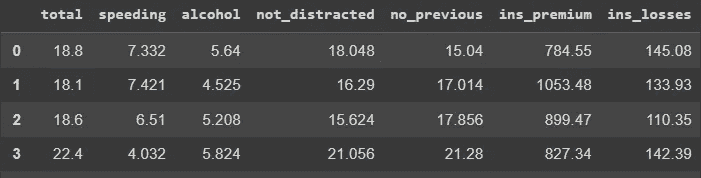
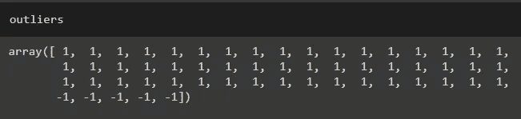
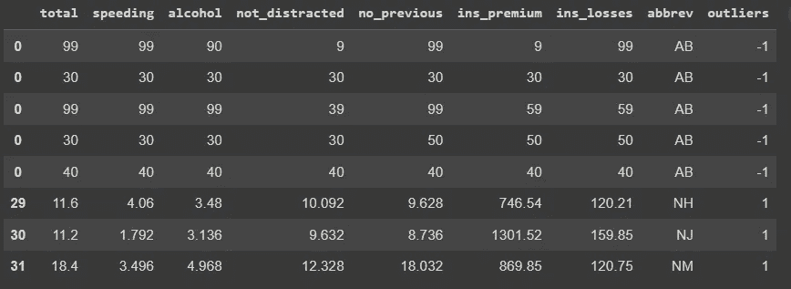
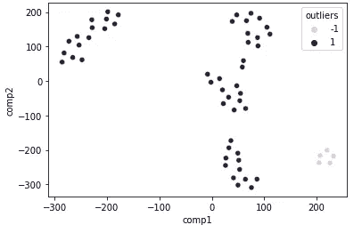
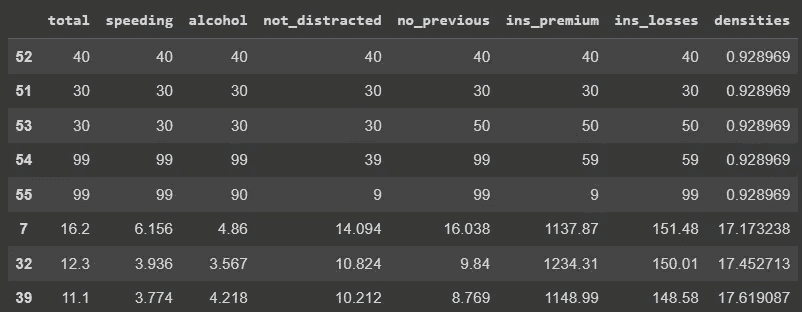

# 使用无监督学习发现异常值

> 原文：<https://towardsdatascience.com/using-unsupervised-learning-to-find-outliers-670e07396599>

## 两种选择:局部异常因子和高斯混合模型


照片由[塔里克·阿贾利亚金](https://unsplash.com/es/@tareq_aj?utm_source=unsplash&utm_medium=referral&utm_content=creditCopyText)在 [Unsplash](https://unsplash.com/s/photos/points?utm_source=unsplash&utm_medium=referral&utm_content=creditCopyText) 拍摄

# 介绍

离群值是许多数据科学论坛和博客中经常讨论的话题。这可能是因为这些数据点会扭曲我们的分析，并影响建模，如果我们使用的算法对这些异常不稳健的话。

一个数据集，很多时候，会把大部分的观察值放在一定的数值范围内，遵循一些模式，离“群体”不太远。这些是*内联器*。但是也有一些观察不适合任何地方，远离数据的标准，不遵循这种模式。那些是异常值，离群值。

受异常值影响很大的算法是传统的线性回归。如果您的观察值过于偏离中心值，将会扭曲回归计算，使模型表现更差。



离群值。图片由作者提供。

让我们学习两种使用无监督学习算法查找异常值的快速方法:带有局部异常值因子的 KNN 和高斯混合，这两种方法都来自 Scikit-Learn。

# 本地异常因素[LOF]

这个算法在 sklearn.neighbors 模块中有，可以用`from sklearn.neighbors import [LocalOutlierFactor](https://scikit-learn.org/stable/modules/generated/sklearn.neighbors.LocalOutlierFactor.html)`导入。它依赖于 K-最近邻算法，有趣的是，LOF 有超参数`contamination`来帮助我们确定离群值的阈值。所以，如果你使用`contamination= 0.1`，这意味着你想把 10%的数据作为异常值。

> 数据集的污染量，即数据集中异常值的比例。(sklearn 文档)

接下来是应用该算法的编码。我们将使用 Python 中 seaborn 包自带的' [*car_crashes*](https://github.com/mwaskom/seaborn-data/blob/master/car_crashes.csv) '数据集。

```
# Dataset
df = sns.load_dataset('car_crashes')
```

我将在这里添加一些奇怪的数据，它们将是我们的异常值。请注意，我希望它非常不同，以确保它是一个异常值，这样我就可以演示异常值检测器的运行。

```
# Creating very odd observations = OUTLIERS
s1 = pd.DataFrame([30,30,30,30,30,30,30,'AB']).T
s2 = pd.DataFrame([40,40,40,40,40,40,40,'AB']).T
s3 = pd.DataFrame([30,30,30,30,50,50,50,'AB']).T
s4 = pd.DataFrame([99,99,99,39,99,59,59,'AB']).T
s5 = pd.DataFrame([99,99,90,9,99,9,99,'AB']).T
s1.columns = s2.columns = s3.columns = s4.columns = s5.columns= df.columns# Adding them to the dataset
df=pd.concat([df,s1, s2, s3, s4, s5], axis=0)# X
X = df.drop('abbrev', axis=1)
```



数据集 car_crashes 的头。图片由作者提供。

接下来，我们可以导入`Pipeline`、`StandardScaler`并创建这个简单的管道来缩放数据，将其放入相同的范围，然后运行 LOF 算法。请注意，我们使用 9%的污染率，因为数据有 51 个观察值，我们知道有 5 个异常值(5/51 = 9.8%)。

```
# Let's create a Pipeline to scale the data and find outliers using KNN Classifiersteps = [
('scale', StandardScaler()),
('LOF', LocalOutlierFactor(contamination=0.09))
]# Fit and predict
outliers = Pipeline(steps).fit_predict(X)
```

如果您调用输出`outliers`，您将会看到这个结果。



LOF 将异常值标注为-1。图片由作者提供。

完成后，我们可以将数据添加到原始数据集并查看它。

```
# Add column
df['outliers'] = outliers# Look at the top 8
df.sort_values(by='outliers').head(8)
```



LOF 算法检测到的异常值。图片由作者提供。

非常好。我们能够找到先前创建的异常值。如果我们使用 t-SNE 来创建这个数据集的 2D 图，下面是我们将看到的内容(**这个图的代码可以在文章*末尾的 GitHub 链接中找到)。*

**

*数据集的 2D 图。图片由作者提供。*

*回顾刚刚发生的事情:LOF 使用 KNN，这是一个分类器，它根据数据点之间的距离和相似性来聚类数据点。自然，由于创建的数据不同于其他数据，它们被标记为异常。*

# *高斯混合模型*

*可以找到的另一种算法是高斯混合模型(GMM)。这个将查看数据，并将其分成 *n* 组。为了将每个观察值添加到一个组中，算法会计算并创建 *n* 个高斯分布，然后检查数据点在这些高斯分布中的哪个位置更适合(概率更高)。*

*sklearn 的 GMM 根据每个点在该空间中的密度来计算观察值。因此，密度较高的区域中的点不太可能是异常值，反之亦然，因此低密度区域就是异常值所在的位置。*

*我们编码吧。首先，导入模块。*

```
*from sklearn.mixture import GaussianMixture*
```

*接下来，我们可以拟合 GMM。我们使用 3 个分量，这意味着该数据被*分成*3 个高斯分布。`n_init= 10`是 GMM 运行 10 次迭代以找到最佳拟合。*

```
*gm = GaussianMixture(n_components=3, n_init=10)
gm.fit(X)*
```

*好了，现在我们必须计算分数。*

```
*# Finding densities
density_scores = gm.score_samples(X)*
```

*如果我们打印它，在这种情况下，我们只会看到负数。所以，我只取它们的绝对值，这样更容易计算百分位数。*

```
*density_scores= abs(density_scores)*
```

*现在我们可以计算我们想要的百分比作为阈值，或者要查找的离群值的数量。让我们用同样的 9%来工作*

```
*# Define threshold
threshold = np.percentile(density_scores, 9)# Finding outliers
X[density_scores< threshold]X['densities'] = density_scores*
```

*阈值是`16.36102`。我们可以看到，它找到了相同的结果，即低于该数字的所有数据(我们的假异常值)。*

**

*使用 GMM 检测到的异常值是前 5 行，小于 16.36。图片由作者提供。*

*它像预期的那样工作。*

# *在你走之前*

*发现异常值是一项可以通过多种方式执行的任务。还有其他好的算法，比如隔离森林。还有其他的方法，比如 Z 值法、IQR 法……还有很多选择。*

*我想展示这两个，因为我发现它们非常容易应用。*

*对于 LOF，只需使用:*

*`LocalOutlierFactor(contamination= n)`。*

*对于 GMM，请使用:*

```
*scores = gm.score_samples(X)threshold = np.percentile(scores, 9)
X[scores< threshold]*
```

*这里是 GitHub 中的[完整代码。](https://github.com/gurezende/Studying/blob/master/Python/sklearn/Outliers.ipynb)*

*如果你喜欢这个内容，请关注我的博客。*

*[](http://gustavorsantos.medium.com/) [## 古斯塔沃·桑托斯-中等

### 阅读古斯塔夫·桑托斯在媒介上的作品。数据科学家。我从数据中提取见解，以帮助个人和公司…

gustavorsantos.medium.com](http://gustavorsantos.medium.com/) 

在 LinkedIn 上找到我。如果你正在考虑加入 Medium，[这里有一个推荐链接](https://medium.com/subscribe/@gustavorsantos)。

# 参考

Aurélien Géron，2019。 [*用 Scikit-Learn 动手机器学习，Keras & TensorFlow*](https://tinyurl.com/2s3tsh9x) 。第二版，奥赖利。

迈克尔·沃克，2022 年。 [*用机器学习进行数据清洗和探索。*](https://www.amazon.com/Data-Cleaning-Exploration-Machine-Learning/dp/1803241675) 1ed。Packt 出版物。

[](https://scikit-learn.org/stable/modules/generated/sklearn.neighbors.LocalOutlierFactor.html) [## sk learn . neighbors . localooutlierfactor

### 使用局部异常因子(LOF)的无监督异常检测。每个样本的异常值称为…

scikit-learn.org](https://scikit-learn.org/stable/modules/generated/sklearn.neighbors.LocalOutlierFactor.html) [](https://scikit-learn.org/stable/modules/generated/sklearn.mixture.GaussianMixture.html) [## sklearn . mixture . Gaussian mixture

### 高斯混合。高斯混合模型概率分布的表示。这个类允许估计…

scikit-learn.org](https://scikit-learn.org/stable/modules/generated/sklearn.mixture.GaussianMixture.html)*