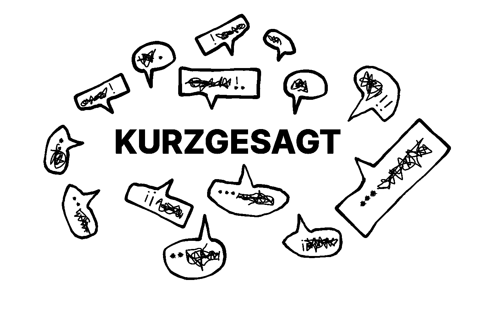
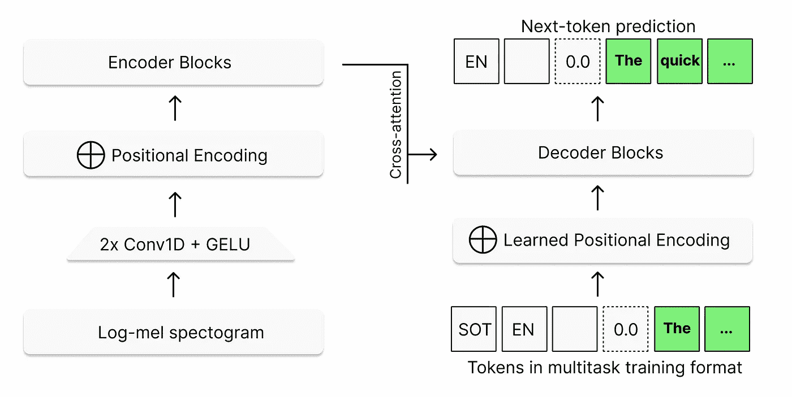
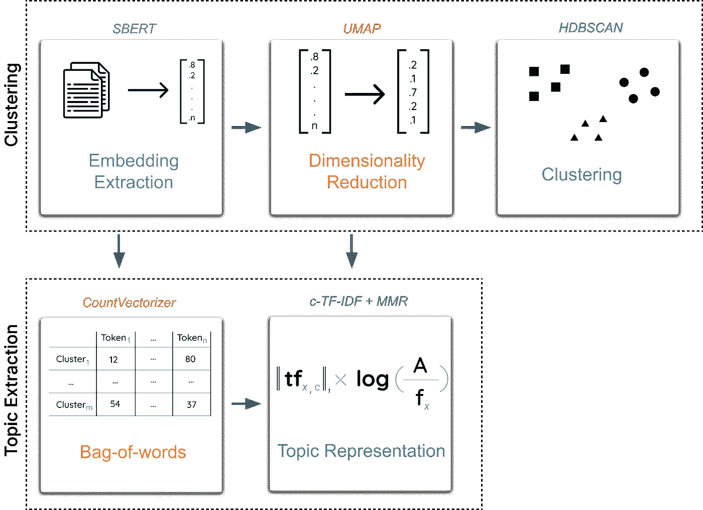
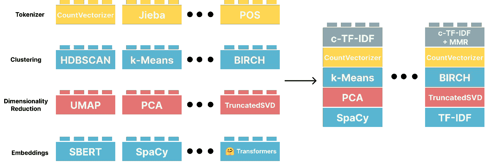
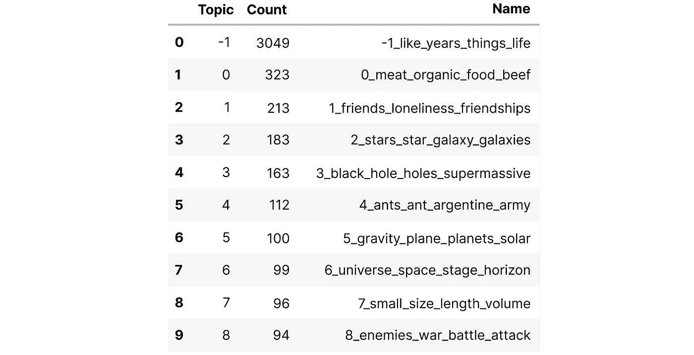
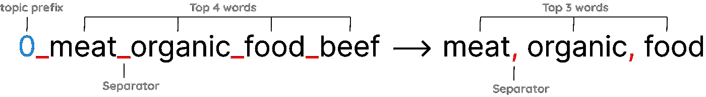
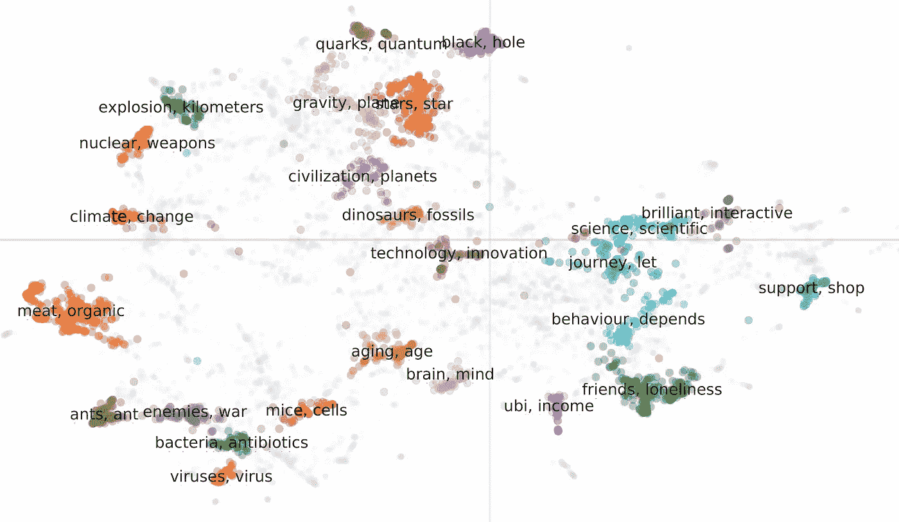
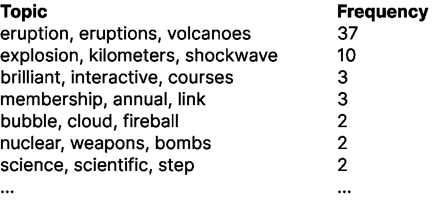
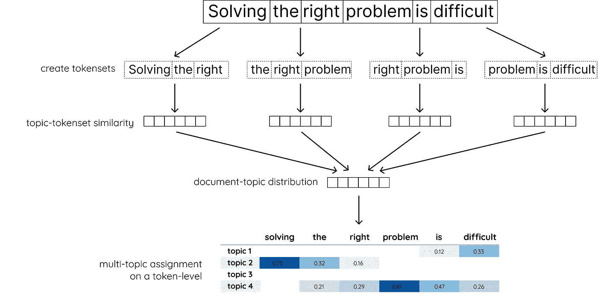
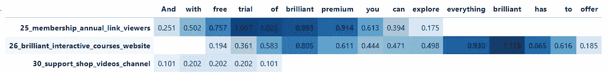

# 使用 Whisper 和 BERTopic 对 Kurzgesagt 的视频进行建模

> 原文：<https://towardsdatascience.com/using-whisper-and-bertopic-to-model-kurzgesagts-videos-7d8a63139bdf>

## 我们可以在 Kurzgesagt 的视频中找到哪些主题？



一个多月前，OpenAI 发布了一个名为 [Whisper](https://openai.com/blog/whisper/) 的英语语音识别神经网络。由于它的准确性、易用性，最重要的是因为他们开源了它，它在过去的几周里变得相当受欢迎！

有了这些版本，我迫不及待地想要得到这样一个模型，并尝试一下。然而，我喜欢有一个有趣的用例来实际使用它。

所以我想，为什么不用它来制作一个我一直喜欢看的频道，Kurzgesagt！

这是一个令人惊叹的频道，有着令人难以置信的精心解释的视频，侧重于动画教育内容，从气候变化和恐龙到黑洞和地球工程。

我决定不仅仅做一些文字记录。相反，让我们使用 BERTopic 来看看我们是否可以提取 Kurzgesagt 视频中的主要主题。

因此，本文是一篇关于使用 Whisper 和 BERTopic 从 Youtube 视频中提取脚本并在其上使用主题建模的教程。

# 1.装置

在进入实际代码之前，我们首先需要安装几个包，分别是[耳语](https://github.com/openai/whisper)、 [BERTopic](https://github.com/MaartenGr/BERTopic) 和 [Pytube](https://github.com/pytube/pytube) 。

```
pip install --upgrade git+https://github.com/openai/whisper.git 
pip install git+https://github.com/pytube/pytube.git@refs/pull/1409/merge
pip install bertopic
```

我们有目的地在 Pytube 中选择一个特定的 pull 请求，因为它修复了空通道的问题。

在最后一步，我将简要介绍 BERTopic 的一个即将推出的特性，您已经可以安装该特性了:

```
pip install git+https://github.com/MaartenGr/BERTopic.git@refs/pull/840/merge
```

# 2.Pytube

我们需要从 Kurzgesagt 的 YouTube 频道中提取我们需要的每一个元数据。使用 Pytube，我们可以创建一个`Channel`对象，允许我们提取他们视频的 URL 和标题。

```
# Extract all video_urls
from pytube import YouTube, Channel
c = Channel('https://www.youtube.com/c/inanutshell/videos/')
video_urls = c.video_urls
video_titles = [video.title for video in c.videos]
```

我们还提取了标题，因为当我们稍后可视化主题时，它们可能会派上用场。

# 3.低语

当我们有了我们的网址，我们就可以开始下载视频和提取文字记录。为了创建这些抄本，我们使用了最近发布的 Whisper。



耳语的管道。更多信息，请看他们的博客。

对于新用户来说，该模型可能会令人望而生畏，但它本质上是一个序列到序列转换器模型，已经在几个不同的语音处理任务上进行了训练。这些任务被输入到 Transformer 模型的编码器-解码器结构中，这使得 Whisper 可以取代传统语音处理管道的几个阶段。

换句话说，因为它专注于联合表示多个任务，所以它可以在一个模型中学习各种不同的处理步骤！

这很好，因为我们现在可以使用一个模型来完成所有必要的处理。下面，我们将导入我们的 Whisper 模型:

```
# Just two lines of code to load in a Whisper model!
import whisper
whisper_model = whisper.load_model("tiny")
```

然后，我们迭代我们的 YouTube URLs，下载音频，最后通过我们的 Whisper 模型传递它们，以便生成转录:

```
# Infer all texts
texts = []
for url in video_urls[:100]:
    path = YouTube(url).streams.filter(only_audio=True)[0].download(filename="audio.mp4")
    transcription = whisper_model.transcribe(path)
    texts.append(transcription["text"])
```

就是这样！我们现在有 Kurzgesagt 的 100 个视频的转录本。

**注意**:我选择了`tiny`型号，因为它的速度和准确性，但是还有[更准确的型号](https://github.com/openai/whisper#available-models-and-languages)，你可以在 Whisper 中使用，值得一试。

# 4.抄本处理

BERTopic 将主题建模作为一项集群任务，结果是将单个文档分配给单个主题。为了避免这一点，我们可以将我们的抄本分成句子，并在这些句子上运行 BERTopic:

```
from nltk.tokenize import sent_tokenize

# Sentencize the transcripts and track their titles
docs = []
titles = []
for text, title in zip(texts, video_titles):
    sentences = sent_tokenize(text)
    docs.extend(sentences)
    titles.extend([title] * len(sentences))
```

我们不仅有更多的数据来训练，而且还可以创建更精确的主题表示。

**注意**:在 BERTopic 中可能会有也可能没有主题发布的特性…

# 5.贝尔托皮奇

BERTopic 是一种主题建模技术，它专注于模块化、透明性和人工评估。它是一个框架，允许用户在一定范围内构建自己的定制主题模型。

BERTopic 的工作原理是遵循聚类和主题提取的线性管道:



SBERT -> UMAP -> HDBSCAN ->计数矢量器-> c-TF-IDF-->(可选)MMR

在流水线的每一步，它对之前的所有步骤几乎不做任何假设。例如，c-TF-IDF 表示不关心使用哪个输入嵌入。BERTopic 的这一指导思想允许子组件被轻松地替换掉。因此，您可以随心所欲地构建您的模型:



通过定义嵌入模型、降维算法、聚类模型以及 c-TF-IDF 提取，构建您自己的主题模型。

尽管我们只需要几行代码就可以使用 BERTopic，但生成我们的嵌入是值得的，这样我们就可以在以后需要重新生成它们时多次使用它们:

```
from sentence_transformers import SentenceTransformer

# Create embeddings from the documents
sentence_model = SentenceTransformer("paraphrase-multilingual-mpnet-base-v2")
embeddings = sentence_model.encode(docs)
```

虽然 Kurzgesagt 的内容是英文的，但可能会有一些非英文术语，所以我选择了多语言句子转换器模型。

生成嵌入后，我想稍微调整一下子模型，以便更好地适应我们的数据:

```
from bertopic import BERTopic
from umap import UMAP
from hdbscan import HDBSCAN
from sklearn.feature_extraction.text import CountVectorizer

# Define sub-models
vectorizer = CountVectorizer(stop_words="english")
umap_model = UMAP(n_neighbors=15, n_components=5, min_dist=0.0, metric='cosine', random_state=42)
hdbscan_model = HDBSCAN(min_cluster_size=20, min_samples=2, metric='euclidean', cluster_selection_method='eom')

# Train our topic model with BERTopic
topic_model = BERTopic(
    embedding_model=sentence_model,
    umap_model=umap_model,
    hdbscan_model=hdbscan_model,
    vectorizer_model=vectorizer
).fit(docs, embeddings)
```

现在我们已经拟合了 BERTopic 模型，让我们来看看它的一些主题。为此，我们运行`topic_model.get_topic_info().head(10)`来获得最常见主题的数据框架:



我们可以看到关于食物、细胞、星系和更多的话题！

# 6.可视化主题

尽管该模型发现了一些有趣的主题，但手动浏览这些主题似乎需要大量的工作。相反，我们可以使用一些可视化技术，使它变得简单一些。

首先，生成一些更好看的标签可能是值得的。为此，我们将使用`generate_topic_labels`生成我们的主题标签。



使用“generate_topic_labels ”,你可以为你的用例生成更好看的标签。

我们想要的是前 3 个单词，带一个`,`分隔符，我们对主题前缀不太感兴趣。

```
# Generate nicer looking labels and set them in our model
topic_labels = topic_model.generate_topic_labels(nr_words=3,
                                                 topic_prefix=False,
                                                 word_length=15,
                                                 separator=", ")
topic_model.set_topic_labels(topic_labels)
```

现在，我们准备执行一些有趣的可视化。第一关，`.visualize_documents`！该方法旨在在 2D 空间中交互地可视化文档及其对应的文档:

```
# Manually selected some interesting topics to prevent information overload
topics_of_interest = [33, 1, 8, 9, 0, 30, 27, 19, 16, 
                      28, 44, 11, 21, 23, 26, 2, 37, 34, 3, 4, 5,
                      15, 17, 22, 38]

# I added the title to the documents themselves for easier interactivity
adjusted_docs = ["<b>" + title + "</b><br>" + doc[:100] + "..." 
                 for doc, title in zip(docs, titles)]

# Visualize documents
topic_model.visualize_documents(
    adjusted_docs, 
    embeddings=embeddings, 
    hide_annotations=False, 
    topics=topics_of_interest,
    custom_labels=True
)
```



我们可以在 Kurzgesagt 的视频中找到一些主题。

从上面的图像中可以看出，我们有很多不同的话题，从恐龙和气候变化到细菌甚至蚂蚁！

# 7.每个视频的主题

因为我们已经将每个视频分成句子，所以我们可以对每个视频的主题分布进行建模。我最近看到一个视频，叫做

**“如果超级火山爆发会发生什么？”**

让我们来看看视频中有哪些主题:

```
# Topic frequency in ""What Happens if a Supervolcano Blows Up?""
video_topics = [topic_model.custom_labels_[topic+1] 
                for topic, title in zip(topic_model.topics_, titles) 
                if title == "What Happens if a Supervolcano Blows Up?" 
                and topic != -1]
counts = pd.DataFrame({"Topic": video_topics}).value_counts(); countstopics_per_class = topic_model.topics_per_class(docs, classes=classes)
```



正如所料，它似乎主要与火山爆发有关，但也涉及一般的爆炸。

# 8.主题分布

在即将到来的 [BERTopic v0.13 版本](https://github.com/MaartenGr/BERTopic/pull/840)中，有可能近似任何文档的主题分布，而不管其大小如何。

该方法的工作原理是在文档上创建一个滑动窗口，并计算每个主题的窗口相似度:



在令牌级别生成多主题分配的过程。

我们可以为所有文档生成这些分布，方法是运行以下代码，并确保我们在令牌级别上计算分布:

```
# We need to calculate the topic distributions on a token level
(topic_distr, 
topic_token_distr) = topic_model.approximate_distribution(
                                      docs, calculate_tokens=True
)
```

现在我们需要选择一段文本来为主题建模。为此，我认为探索模型如何处理 Kurzgesagt 结尾的 Brilliant 广告会很有趣:

> 通过免费试用 brilliant premium，您可以探索 brilliant 提供的一切。

我们输入文档并运行我们可视化:

```
# Create a visualization using a styled dataframe if Jinja2 is installed
df = topic_model.visualize_approximate_distribution(docs[100], topic_token_distr[100]); df
```



正如我们所看到的，它似乎选择了关于[辉煌](https://brilliant.org/s/partners/nutshell/)和会员资格的话题，这在这种情况下似乎是有意义的。

有趣的是，使用这种方法，我们可以考虑到不仅每个文档有多个主题，甚至每个标记有多个主题！

# 感谢您的阅读！

如果你和我一样，对人工智能、数据科学或心理学充满热情，请随时在 [**LinkedIn**](https://www.linkedin.com/in/mgrootendorst/) 上添加我，或者在 [**Twitter**](https://twitter.com/MaartenGr) 上关注我。你也可以在我的 [**个人网站**](https://maartengrootendorst.com/) 上找到我的一些内容。这几天在试 [**乳齿象**](https://fosstodon.org/@maartengr) 如果有兴趣转行。

*所有未注明出处的图片均由作者*创作