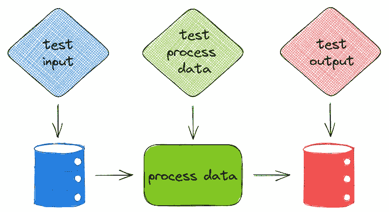
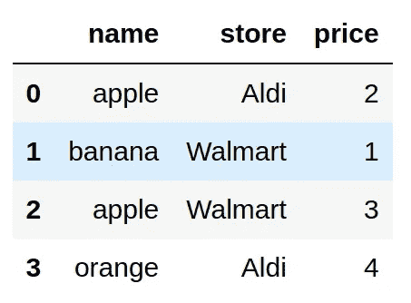

# 用 Pandera 验证你的熊猫数据框架

> 原文：<https://towardsdatascience.com/validate-your-pandas-dataframe-with-pandera-2995910e564>

## 确保您的数据符合您的期望

# 动机

在数据科学项目中，不仅测试您的功能很重要，测试您的数据以确保它们按照您的预期工作也很重要。



作者图片

在上一篇文章中，我展示了如何使用极大期望来验证您的数据。

[](/great-expectations-always-know-what-to-expect-from-your-data-51214866c24) [## 远大的期望:永远知道从你的数据中可以期待什么

### 使用 Python 确保数据按预期工作

towardsdatascience.com](/great-expectations-always-know-what-to-expect-from-your-data-51214866c24) 

尽管远大的期望提供了许多有用的工具，但是用远大的期望创建一个验证套件还是很复杂的。对于一个小型的数据科学项目来说，使用高期望值可能有些过头了。

这就是为什么在这篇文章中，我们将学习 Pandera，一个简单的 Python 库，用于验证 pandas 数据帧。

要安装 Pandera，请键入:

```
pip install pandera
```

# 介绍

为了了解 Pandera 是如何工作的，让我们从创建一个简单的数据集开始:



作者图片

想象一下这个场景。你的经理告诉你，数据集中只能有某些水果和商店，价格必须小于 4。

为了确保您的数据符合这些条件，手动检查您的数据会花费太多时间，尤其是当您的数据很大时。有没有一种方法可以自动化这个过程？

这就是潘德拉派上用场的时候。具体来说，我们:

*   使用`DataFrameSchema`为整个数据集创建多个测试
*   使用`Column`为每一列创建多个测试
*   使用`Check`指定测试类型

```
SchemaError: <Schema Column(name=price, type=DataType(int64))> failed element-wise validator 0:
<Check less_than: less_than(4)>
failure cases:
   index  failure_case
0      3             4
```

在上面的代码中:

*   `"name": Column(str, Check.isin(available_fruits))`检查列`name`是否是字符串类型，以及列`name`的所有值是否在指定的列表中。
*   `"price": Column(int, Check.less_than(4))`检查列`price`中的所有值是否都属于类型`int`并且都小于 4。
*   因为列`price`中的值并非都小于 4，所以测试失败。

在这里找到其他内置`Checks`方法[。](https://pandera.readthedocs.io/en/stable/reference/generated/pandera.checks.Check.html#pandera-checks-check)

## 海关支票

我们还可以使用`lambda`创建自定义检查。在下面的代码中，`Check(lambda price: sum(price) < 20)`检查列`price`的总和是否小于 20。

# 模式模型

当我们的测试很复杂时，使用 dataclass 可以使我们的测试看起来比使用字典干净得多。幸运的是，Pandera 还允许我们使用数据类而不是字典来创建测试。

# 验证装饰器

## 检查输入

现在我们知道了如何为我们的数据创建测试，我们如何使用它来测试我们函数的输入呢？一种简单的方法是在函数中添加`schema.validate(input)`。

然而，这种方法使我们很难测试我们的功能。由于`get_total_price`的参数既是`fruits`又是`schema`，我们需要在测试中包含这两个参数:

`test_get_total_price`测试数据和函数。因为一个单元测试应该只测试一件事，在函数内部包含数据验证是不理想的。

Pandera 用`check_input`装饰器为此提供了一个解决方案。这个装饰器的参数用于验证函数的输入。

如果输入无效，Pandera 将在函数处理输入之前引发一个错误:

```
SchemaError: error in check_input decorator of function 'get_total_price': expected series 'price' to have type int64, got object
```

在处理之前验证数据非常好，因为它**防止**用户**在处理数据**上浪费大量时间。

## 检查输出

我们还可以使用 Pandera 的`check_output`装饰器来检查函数的输出:

## 检查输入和输出

现在你可能想知道，有没有一种方法可以同时检查输入和输出？我们可以使用装饰器`check_io`来实现:

# 列验证的其他参数

## 处理空值

默认情况下，如果我们测试的列中有空值，Pandera 将会抛出一个错误。如果空值是可接受的，将`nullable=True`添加到我们的`Column`类中:

## 处理重复

默认情况下，重复是可以接受的。要在有重复项时引发错误，请使用`allow_duplicates=False`:

```
SchemaError: series 'store' contains duplicate values: {2: 'Walmart'}
```

## 转换数据类型

`coerce=True`更改列的数据类型。如果强制是不可能的，Pandera 会引发一个错误。

在下面的代码中，价格的数据类型从整数更改为字符串。

```
name     object
store    object
price    object
dtype: object
```

# 匹配模式

如果我们想改变所有以单词`store`开头的列，该怎么办？

Pandera 允许我们通过添加`regex=True`对共享特定模式的多个列应用相同的检查:

# 从 YAML 文件中导出和加载

## 出口到 YAML

使用 YAML 文件是向不懂 Python 的同事展示您的测试的好方法。我们可以使用`schema.to_yaml()`在 YAML 文件中保存所有验证的记录:

`schema.yml`应该如下图所示:

# 从 YAML 装货

要从 YAML 文件加载，只需使用`pa.io.from_yaml(yaml_schema)`:

# 结论

恭喜你！您刚刚学习了如何使用 Pandera 来验证数据集。由于数据是数据科学项目的一个重要方面，验证函数的输入和输出将减少后续的错误。

随意发挥，并在这里叉这篇文章的源代码:

[](https://github.com/khuyentran1401/Data-science/blob/master/data_science_tools/pandera_example/pandera.ipynb) [## 数据科学/pandera . ipynb at master khuyentran 1401/数据科学

### 收集有用的数据科学主题以及代码和文章-Data-science/pandera . ipynb at master…

github.com](https://github.com/khuyentran1401/Data-science/blob/master/data_science_tools/pandera_example/pandera.ipynb) 

我喜欢写一些基本的数据科学概念，并尝试不同的数据科学工具。你可以通过 [LinkedIn](https://www.linkedin.com/in/khuyen-tran-1401/) 和 [Twitter](https://twitter.com/KhuyenTran16) 与我联系。

如果你想查看我写的所有文章的代码，请点击这里。在 Medium 上关注我，了解我的最新数据科学文章，例如:

[](/bentoml-create-an-ml-powered-prediction-service-in-minutes-23d135d6ca76) [## BentoML:在几分钟内创建一个 ML 驱动的预测服务

### 用 Python 封装和部署您的 ML 模型

towardsdatascience.com](/bentoml-create-an-ml-powered-prediction-service-in-minutes-23d135d6ca76) [](/4-pre-commit-plugins-to-automate-code-reviewing-and-formatting-in-python-c80c6d2e9f5) [## 4 个预提交插件，用于在 Python 中自动检查和格式化代码

### 使用 black、flake8、isort 和 interrogate 编写高质量的代码

towardsdatascience.com](/4-pre-commit-plugins-to-automate-code-reviewing-and-formatting-in-python-c80c6d2e9f5) [](/orchestrate-a-data-science-project-in-python-with-prefect-e69c61a49074) [## 用 Prefect 编制 Python 中的数据科学项目

### 用几行代码优化您的数据科学工作流程

towardsdatascience.com](/orchestrate-a-data-science-project-in-python-with-prefect-e69c61a49074) [](/introduction-to-dvc-data-version-control-tool-for-machine-learning-projects-7cb49c229fe0) [## DVC 介绍:机器学习项目的数据版本控制工具

### 就像 Git 一样，但是有数据！

towardsdatascience.com](/introduction-to-dvc-data-version-control-tool-for-machine-learning-projects-7cb49c229fe0)