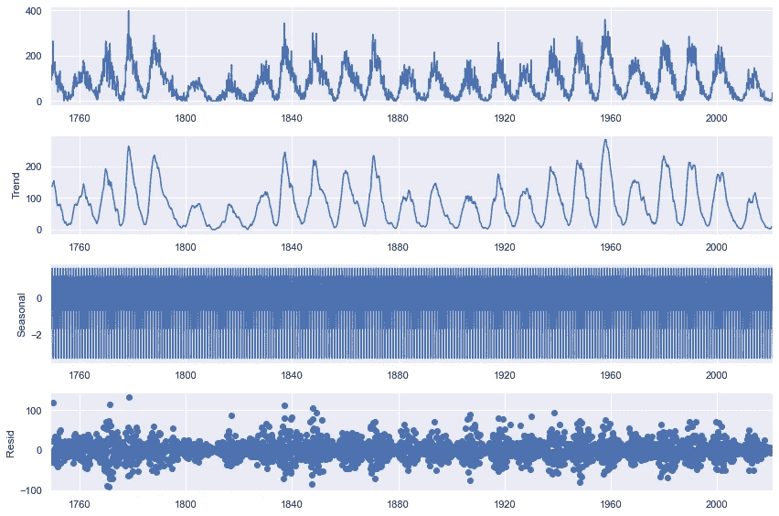
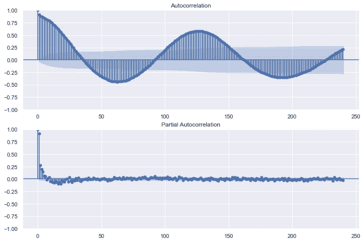
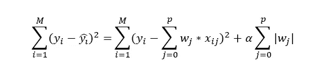
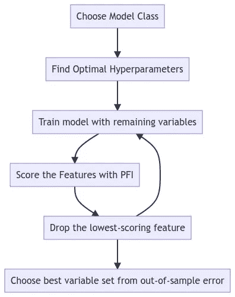
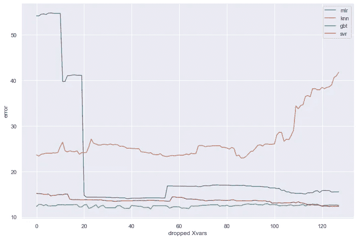
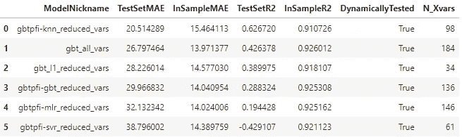
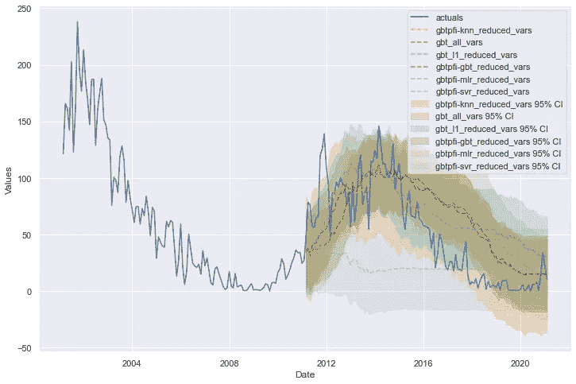

# 时间序列的变量缩减技术

> 原文：<https://towardsdatascience.com/variable-reduction-techniques-for-time-series-646743f726d4>

## L1 惩罚和置换特征分数


照片由[李宗盛](https://unsplash.com/@sarahleejs?utm_source=medium&utm_medium=referral)在 [Unsplash](https://unsplash.com?utm_source=medium&utm_medium=referral) 上拍摄

在预测建模中，结果取决于添加到模型中的输入。在时间序列中，选择模型输入的主要问题是如何最好地表示一个序列的历史来预测它的未来。我们可以将一个序列分解成它的基本组成部分:趋势、季节性和残差，但是对于复杂的数据集，这可能很难做到完全正确。以太阳黑子数据集为例，该数据集可以在 [Kaggle](https://www.kaggle.com/datasets/robervalt/sunspots) 上通过公共领域许可获得。它测量自 18 世纪以来每月观察到的太阳黑子，当线性分解成上述成分时，看起来像这样:



作者图片

上面的图表显示了原始系列，这很好。然而，下面的第二张图显示了它的“趋势”，但它看起来不像是我见过的趋势，也不像是一个很容易建模的趋势。第三张图更糟糕，以一种几乎无法解释的方式显示了“季节性”。诚然，这是一个大系列，更复杂的分解可能更合适，但问题仍然是:当试图预测这个系列时，不容易决定纳入哪些因素。

一种选择是添加我们认为可能相关的任何内容，然后，使用 L1 正则化或类似于[递归特征消除](/feature-selection-in-python-recursive-feature-elimination-19f1c39b8d15)的技术，我们将变量缩小到最重要的子集。这就是这个例子中所做的，你可以在 [Github](https://github.com/mikekeith52/scalecast-examples/blob/main/misc/feature-selection/feature_selection.ipynb) 或[Read Docs](https://scalecast-examples.readthedocs.io/en/latest/misc/feature-selection/feature_selection.html)上找到。我们将使用 [scalecast](https://scalecast.readthedocs.io/en/latest/) 包来做时序分析。如果你觉得有趣，请在 GitHub 上给它一颗星。 [ELI5](https://github.com/eli5-org/eli5) 包也用于特性重要性评分，而 [scikit-learn](https://scikit-learn.org/stable/) 用于建模。

# 准备和添加变量

首先，安装 scalecast 软件包:

```
pip install scalecast
```

然后，我们创建预测器对象，这是一个模型包装器和结果容器:

```
df **=** pd**.**read_csv(
  'Sunspots.csv',
  index_col**=**0,
  names**=**['Date','Target'],
  header**=**0,
)
f **=** Forecaster(y**=**df['Target'],current_dates**=**df['Date'])
```

## 自回归项

在时间序列中，最有效的变量通常是序列本身的过去值(滞后)。为了评估在序列的历史中我们可以找到多少具有统计意义的滞后，通常使用自相关函数和偏自相关函数图。



作者图片

这些有趣的图表也揭示了数据集的循环性质。他们揭示了在过去 15 年或更长的时间里，统计意义上的术语可能存在。让我们添加前 120 个(10 年)期限，以及过去 20 年中间隔一年的期限。

```
f.add_ar_terms(120)     *# lags 1-120*
f.add_AR_terms((20,12)) *# yearly lags up to 20 years*
```

## 季节性周期

通常，月度间隔数据的季节性包括月度和季度波动。然而，在这个例子中，我们试图预测一种不符合我们日常生活中公历的自然现象。这个系列展示的周期非常不规则，也不一致。根据维基百科的说法，“太阳周期通常持续大约 11 年，从不到 10 年到超过 12 年不等。”

尽管如此，我们仍然可以添加月度和季度季节性，以及每 1 年到 20 年的周期。这当然是矫枉过正，但这就是为什么我们将使用变量缩减技术来过滤这些附加特征中哪些可能是噪声，哪些是信号。所有这些季节术语都使用傅立叶变换。

```
f.add_seasonal_regressors('month','quarter',raw=False,sincos=True)
*# 12-month cycles from 12 to 288 months*    
for i in np.arange(12,289,12):
    f.add_cycle(i)
```

## 趋势

对于趋势，我们可以保持简单。我们添加了年份变量，以及一个名为“t”的变量，它将从 1 开始计数，直到每次观测的序列长度，也称为时间趋势。

```
f**.**add_time_trend()
f**.**add_seasonal_regressors('year')
```

在加上所有这些变量后，我们剩下 184 个预测因子。数据集的大小是 3，265。有时，目标变量的数量是数据集大小的平方根(在本例中约为 57)，但这方面没有硬性规定。无论哪种方式，我们添加的所有功能都不可能有助于预测(很难确切知道哪些功能会有帮助，哪些不会)。在其他条件相同的情况下，更节俭的模型、投入更少的模型更受青睐。

# 消除变量

## 使用 L1 正则化消除

我们探索的第一个技术是一个简单和常见的:L1 正则化与套索回归模型。L1 正则化向线性模型中的回归量添加了惩罚(α),因此其成本函数可以写成:



作者图片

其中 *x* 为变量， *p* 为变量总数， *w* 为给定变量的系数， *M* 为观察总数。通俗地说，每个系数的权重都是用一个因子α来改变的，这个因子是根据什么最能优化模型来进行预测而设定的。在这个框架下，线性模型中最不重要的变量被正则化掉，它们的系数取值为 0。我们在分析中运行这个模型，并检查哪些变量的系数权重为 0；不成为我们的缩减子集的变量。alpha 参数是通过对数据的验证切片进行网格搜索来设置的，默认情况下，所有输入都是按比例缩放的，这在采用这种技术时是必要的。

```
f.reduce_Xvars(
    method = 'l1',
    overwrite = False,
    dynamic_testing = False,
)
lasso_reduced_vars = f.reduced_Xvars[:]
```

在我们的数据集中，这将变量从 184 个减少到 34 个。这是一个相当戏剧性的下降！

## 消除使用排列特征的重要性

下一个消除技术更复杂，涉及到来自 ELI5 的置换特征重要性(PFI)。PFI 背后的想法是使用样本外数据对任何 scikit-learn 估计器进行训练和评分，但在每次评分迭代中，对单个特征值进行加扰，使其具有随机性。对于模型中的每个输入，这都要重复几次。然后，测量单个输入被随机化时算法的平均准确度变化，并且在特征重要性排序中，最大程度降低模型准确度的特征得分较高。它与提供给它的特定算法无关，这使得它可以推广到许多模型类。它的缺点包括，它逐个测试每个变量，因此在评估特性时，它错过了变量之间的交互。出于同样的原因，两个高度相关的变量可能会得到较低的重要性分数，即使它们对模型都很重要。这种情况在时间序列中经常发生，这就是为什么 scalecast 在决定下一个要删除的功能之前会对原始分数进行调整。参见[文档](https://scalecast.readthedocs.io/en/latest/Forecaster/Forecaster.html#src.scalecast.Forecaster.Forecaster.reduce_Xvars)。

结合 PFI 进行特征消除，我们使用以下流程:

1.  使用完整的变量集训练给定的模型类，并使用样本外验证数据切片上的网格搜索来调整其超参数
2.  使用步骤 1 中的最佳超参数重新训练模型，并监控数据验证部分的错误
3.  使用 PFI 对特征进行评分
4.  删除得分最低的功能
5.  从步骤 2 开始重复，直到除了一定数量的变量之外，所有变量都被删除
6.  选择在验证数据中返回最低误差的简化变量集



作者图片

为了加速评估(因为这是一种迭代和计算昂贵的技术)，我们可以使用非动态测试过程，这意味着误差度量相当于一步预测的平均值，并且一旦除了值(57)的平方根值之外的所有值都被丢弃，就停止。在代码中，它看起来像:

```
f.reduce_Xvars(
    method = "pfi",
    estimator = "mlr",
    keep_at_least = "sqrt",
    grid_search = True,
    dynamic_testing = False,
    overwrite=False,
)
```

同样，由于 ELI5 集成的灵活性，任何 scikit-learn 估计器都可以用于此过程。上面的代码使用了多元线性回归，但是我们也探索了 k-最近邻、梯度提升树和支持向量机。如果我们选择使用，还有许多其他模型可供使用。我们可以通过检查丢弃每个变量后获得的样本外误差来绘制结果:



作者图片

对于所有这些估计量，误差开始时减小，然后随着变量的减少而增加，除了 SVR，它一直减小到最后。总的来说，GBT 和支持向量回归估计表现最好，GBT 略好于支持向量回归。每个人找到的最佳变量数量如下:

```
the mlr model chose 146 variables
the knn model chose 98 variables
the gbt model chose 136 variables
the svr model chose 61 variables
```

# 验证选择

## 这些变量子集是如何泛化的？

由于 GBT 模型类通常在数据验证集上表现最好，我们可以使用从所探索的各种技术中找到的每个变量子集来重新训练该模型类。根据这些结果，我们将基于在单独的样本外数据集(测试集)上的性能来评估我们认为是最佳缩减变量集的变量。这一次，我们对模型进行动态测试，以更好地了解它们在整个样本外期间的表现(在整个示例中，我们在验证和测试集中使用了 120 个观察值):



作者图片



作者图片

检查这些结果的主要收获是，尽管具有 GBT 的 136 个要素的缩减数据集在验证集上得分最高，但具有 98 个要素的 k-最近邻模型的缩减变量集在测试集上表现最佳，这表明可以从一个模型类中获得缩减变量子集，并成功集成到另一个模型类中。如果愿意的话，我们可以将缩减后的数据集保存起来用于未来的预测任务:

```
Xvars_df = f.export_Xvars_df()
Xvars_df.set_index("DATE",inplace=True)
reduced_dataset = Xvars_df[knn_reduced_vars]
```

## 哪些变量最常被忽略？

最后，一个有趣的练习是看看在每一个被探索的技术中，哪些变量是最常被忽略的。我们可以写一些代码来实现，这就是我们得到的结果:

最常丢弃的变量:

*   quartercos(所有 5 种技术)
*   AR86(所有 5 种技术)
*   AR46(所有 5 种技术)

我们的季度变量中有一个，但不是两个，每次都被删除，还有第 86 和第 46 系列的滞后。从这部分分析中还有许多其他有趣的见解。查看文章开头链接的笔记本，了解完整的结果。

# 结论

变量选择是时间序列模型优化的一个重要部分，但要知道在任何给定的模型中包含哪些变量是最重要的并不总是容易的。在本例中，我们向模型中添加了比我们认为必要的更多的变量，并探索了使用 lasso 估计器和 L1 正则化减少变量，以及使用四个 scikit-learn 模型类和利用置换特征重要性的迭代特征消除。在 Github 上查看 [scalecast，如果你觉得有趣就给它一颗星吧！](https://github.com/mikekeith52/scalecast)