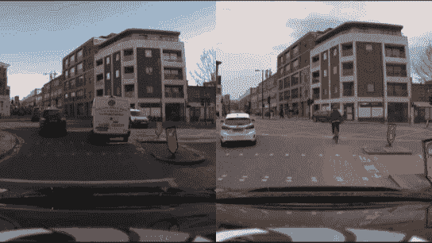
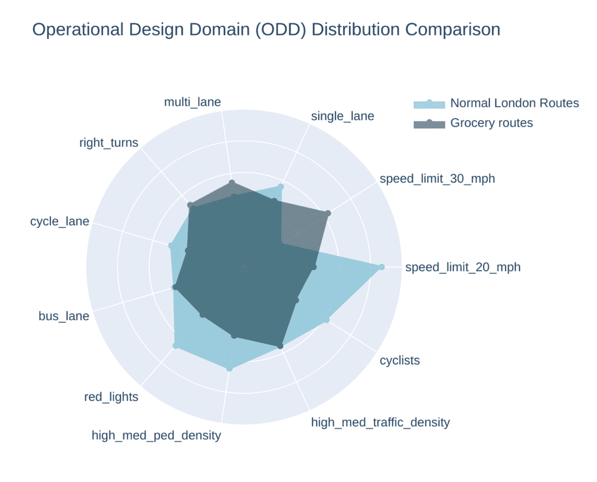
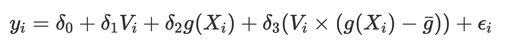
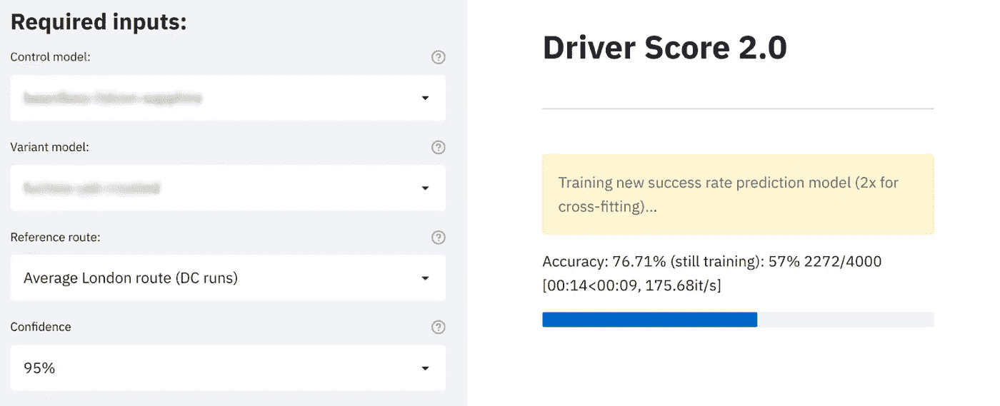

# 超越 CUPED 的升级差异减少:引入 MLRATE

> 原文：<https://towardsdatascience.com/variance-reduction-on-steroids-introducing-mlrate-be328cd71a03>

## 为了比较自动驾驶性能，Wayve 使用了 MLRATE:在实验时使用机器学习更快地达到统计幂。

假设你正在进行一项实验，你的控制群体和变异群体之间的均值确实存在差异。你会察觉吗？那要看 [**看三样东西**](/robust-experiment-design-244f835c6874) :

1.  效果的大小
2.  你收集的样本数量
3.  你测量的差异

效果的大小通常不是你能改变的。增加样本量需要更多的时间，成本也很高。所以我们只能盯着选项三:**我们怎样才能让我们的测量更少噪音**？

在 [**Wayve**](https://wayve.ai/) 我们正在使用端到端深度学习开发自动驾驶技术，因此以最快和最稳健的方式评估两种车型在道路上的真实驾驶性能的差异非常重要。一个挑战是跑步之间的条件有很大的不同:从天气到交通密度，再到乱穿马路的行人。因此，我们不是将不同的条件视为在大型实验中“平均出来”的噪声(按照传统的实验程序)，而是希望利用信号并从每次交互中学习。

由 [Wayve](https://wayve.ai/) 提供:右转差异

使用机器学习调整的治疗效果估计器(MLRATE， [Meta 2022](https://arxiv.org/abs/2106.07263) )，我们**可以利用机器学习模型可以学习的此类混淆变量和驾驶表现之间的复杂非线性关系**，并使用广义线性模型以稳健的方式实现这一点。这使得我们可以用较小的样本量达到统计显著性。例如，在 Wayve，我们发现使用 MLRATE，我们可以将达到统计显著性所需的行驶公里数减半。

# 一些背景:简单的 A/B 测试可能是非常低效的

随机对照试验(RCT)传统上是衡量改善的黄金标准。RCT 通常用于科技行业在线测试机器学习模型，通常将用户群随机分为对照组(使用旧 ML 模型的用户)和变体组(使用新 ML 模型的用户)，并观察两组之间性能指标均值的差异(A/B 测试，得出“均值差异估计值”)。这些实验经常为这个过程捕获数百万个数据点: [**大规模随机化很重要**](/robust-experiment-design-244f835c6874) 以确保我们有一个有代表性的测试样本，以促进更公平的比较，并给出更大的统计信心，即测量的改进是真实的，而不仅仅是噪音。

作者图片

但是大规模随机化对现实世界的驾驶不起作用。随机测试路线意味着驾驶模型必须导航的场景存在巨大差异，从交通岛到施工区，这种差异会使我们在没有巨大样本量的情况下得出不确定的结论，并且当我们想要快速迭代和学习时，为每个新模型收集如此多的驾驶数据是不可行的。即使在同一路线上测试两种驾驶模式(即配对测试)也无法解决这一问题。例如，我们不能控制诸如汽车或骑自行车的动态主体，或者如果一个驾驶模型全是绿灯，而另一个全是红灯。此外，限制到特定路线可能意味着对这些特定测试路线的过度优化。Wayve 希望成为第一家自主到达 100 个城市的公司:我们不能只根据我们今天行驶的道路来调整我们的测试，我们需要比较没有在相同路段行驶过的驾驶模型，利用对我们的汽车在他们以前从未行驶过的区域的表现的了解。

由 [Wayve](https://wayve.ai/) 提供:同一个环形路口的不同

# 典型的方差减少技术可以更快地达到统计显著性，但我们可以更进一步

数据科学家通常采用方差缩减技术来提高对真正改进的检测，这些改进太小而无法在较低样本量下以统计置信度进行解析。例如，人们可能会发现，当交通密度较低时，司机在环形交叉路口的表现最好。在所有级别的交通中，测量驾驶员的环岛表现会有较大的测量差异，因此我们不太确定观察到的表现差异是真实的还是偶然的。我们预计，当一名司机面临较少的交通流量时，他们会表现得更好，**因此，我们应该将这一预先存在的知识纳入我们的实验。**

减少方差的一种常用方法是通过使用预先存在的数据 (CUPED，[微软 2013](https://www.exp-platform.com/Documents/2013-02-CUPED-ImprovingSensitivityOfControlledExperiments.pdf) )的*受控实验，其中一些线性协变量(如交通密度)用于调整简单的均值差异估计值。*

***(图片由作者提供):*** *上图中，横轴代表每个样本的数值。该轴右侧更远的样本表示在实验过程中测得的更高的值。当我们忽略协变量并查看每组平均值周围的离差(如左侧图表所示)时，会出现较大的方差:直方图很宽，变量和对照之间的许多点重叠，因此我们不太确定平均值分布中是否存在真正的差异，或者只是来自采样的噪声。相比之下，当测量方差时，右边的图说明了相关的共变量(在纵轴上示出):得到的残差，即条件均值周围的离差更小，因此统计功效更高。*

这本质上相当于简单的线性回归！这有助于现在表示以后的最佳情境 MLRATE:

顶等式指无方差减少；底部包含一个线性协变量 X. ( ***图片由作者提供)***

其中:

*   ***Y*** 是每个观察样本的测量值的向量
*   ***V*** 为虚拟变量，记录采集的样本是否在变异组中
*   ***X*** 记录采集样本时相关协变量的值

因此，我们关心的是估计系数 **𝛿 *1*** (我们的度量 ***y*** 由于在变体组而不是控制组中而提高的大小)。包括一个简单的虚拟变量 ***v*** 有效地通过组平均值去平均每个样本，因此这相当于通常的 t 检验。

省略相关变量*时， **𝛿 *1*** 的合成标准误差更大，如左上图所示——包括它降低了标准误差，而因此更有可能具有统计显著性。一般来说，**协变量与 y 的相关性越高，方差减少得越多。***

**(注意，在该方案中，省略相关变量不会产生预期偏差，因为我们假设将样本分配给治疗组或对照组，* ***v，*** *独立于任何协变量* ***x*** *，即它们是正交的)。**

**

*照片由[沃洛季米尔·托卡](https://unsplash.com/@astrovol?utm_source=medium&utm_medium=referral)在 [Unsplash](https://unsplash.com?utm_source=medium&utm_medium=referral) 上拍摄*

*然而，尽管 CUPED 在减少一些线性相关变量的方差方面非常有效，但对许多具有复杂非线性关系的协变量进行调整通常不在范围之内。*

*在 Wayve，我们希望将许多影响性能的混杂变量纳入我们的测试中，例如静态场景差异(如公交专用道、人行横道)、动态因素(交通密度、骑自行车者的存在)、环境因素(如天气、亮度)，甚至安全操作人员的人为偏差(这些因素之间通常也存在复杂的非线性相互作用)。使用更复杂的机器学习模型将提供更复杂的代理来促进对这些协变量的控制。*

# *MLRATE 遵循两个步骤，以稳健的方式使用 ML 模型来减少方差*

## *步骤 1:训练和校准 ML 模型*

*为了控制所有期望的协变量，第一步包括建立一个机器学习模型，以使用相关协变量预测我们的性能指标。*

*在 Wayve，我们在一个平衡的数据集上训练一个人工神经网络(多层感知器)，使用我们在测试期间感兴趣控制的所有功能(如动态代理)。**人工神经网络往往对自己的预测过于自信，因此我们也使用保序回归进行校准，以确保我们的性能预测与实际性能线性相关**(这对第二步很重要，我们将在后面提到)。*

*对于实践中的第一步，我们将训练数据随机分为两部分:我们训练和校准两个具有相同架构的性能预测模型，每个数据集一个，然后使用未训练的模型预测每个数据集中每个样本的性能。**这种“交叉拟合”(使用样本外预测)方法对于避免衰减偏差非常重要，如果使用样本内预测，可能会因过度拟合而导致衰减偏差。***

## ***步骤 2:使用 GLM 估计 ML 调整后的治疗效果***

*与之前类似，第二步涉及运行广义线性模型，但不是使用***【X】***【线性协变量】*，****【g(X)***来显示我们如何合并来自 ML 步骤的预测。*

**

*( ***图片作者)****

*除了先前的回归，处理 ***V*** 和 ML 预测***【g(X)***之间的相互作用项被用于说明预测项对于变体可能不太相关的事实，并因此导致 ***d_1*** 上省略的相关偏差。*(注意，这些值的意义在于防止与虚拟变量的多重共线性过高，否则会使系数不稳定)。**

*MLRATE 论文使用 Huber-White 异方差校正的标准误差来导出该估计量的置信区间(确定系数是否具有统计显著性)。然而，由于我们在 Wayve 的实验设置，我们经常使用更保守的[集群标准误差](https://en.wikipedia.org/wiki/Clustered_standard_errors)。*

# *使用权重定制比较*

*在 Wayve，我们将 MLRATE 方法向前推进了一步，定制了我们的模型评估，以使比较更适合路径的特殊属性。例如，我们的模型可能主要在 20 英里/小时的高交通密度道路上进行测试，但在杂货店合作伙伴的典型路线上，我们有更多 30 英里/小时的交通密度较低的多车道道路。因此，我们可能希望提高 30 英里/小时、多车道场景的权重，并相应地这样做以匹配该目标分布，而不是运行回归，好像每个试验都同等重要。*

**

**(承蒙*[*way ve*](https://wayve.ai/)*):*使用分段标签重新加权试验*

*我们从 [**中获得灵感，对调查数据**](https://www.jstatsoft.org/article/view/v009i08) 运行广义线性模型，通常由决策科学家进行，以实现这一点。我们使用已知的性能预测功能为每个试验创建权重(类似于调查数据中的设计权重)，并运行加权回归。*

*传统上，[迭代比例拟合](https://en.wikipedia.org/wiki/Iterative_proportional_fitting)用于定义权重，以确保边际总量相同。然而，使用 IPF 意味着我们关心的特征的联合分布可能与目标有很大不同。因此，尽管探索了 IPF，但 Wayve 有意选择不这样做，因为我们知道感兴趣特征的目标联合分布，并且我们关心紧密匹配该联合分布(特别是因为一些特征不是独立的，并且它们的共现可能对性能具有倍增影响)。相反，我们导出权重来匹配特征的联合分布。*

*权重被截断，以确保很少测试的(潜在有噪声的)特征组合没有太高的权重(这是我们通过离线引导我们的测试数据来确定的)。权重也被归一化，以确保回归步骤中的自由度与未加权的 GLM 相同。*

# *自动化该分析*

*在 Wayve，我们已经在内部应用程序中实现了所有这些分析的自动化。在我们自动训练神经网络并运行广义线性模型之前，ML 研究人员可以提供特定的过滤器和他们希望定制的路线，在几分钟内产生详细的报告。这些工具有助于在任何两个模型之间进行快速而稳健的比较，使我们能够加速我们的车队学习循环，并使其充满从我们捕获的所有特征中获得的洞察力。我们将很快就此发表一篇博文！*

**

*(图片作者提供):我们的内部应用*

# *参考资料和进一步阅读:*

*           *