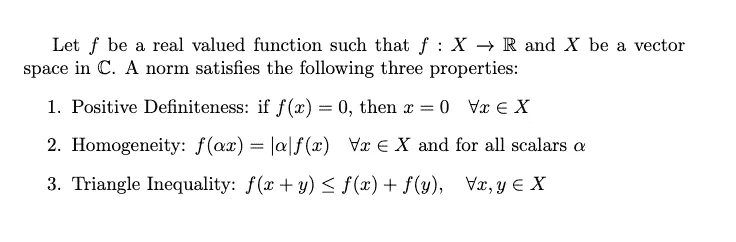
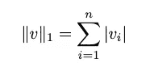
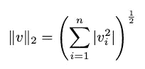
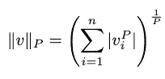
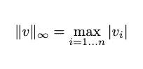
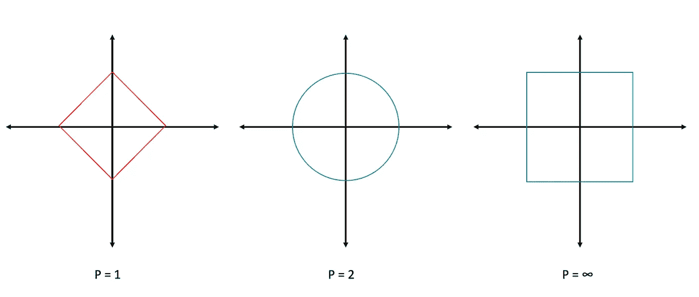
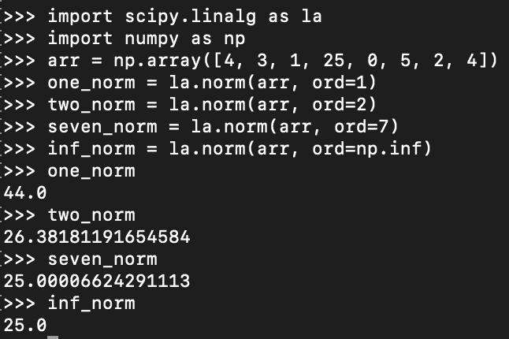

# 向量范数，已解释

> 原文：<https://towardsdatascience.com/vector-norms-explained-e72bf26e4a38>

## 揭示线性代数中一个常被误解的话题

向量范数在工程和数学的某些领域是极其重要的。然而，我认为教育系统经常以公式化的方式呈现规范，“这里是如何计算它”的方式，而不是呈现对向量规范的直观理解。让我们看看是否可以通过对向量范数更务实的讨论来补救这种情况。

## 什么是规范？

范数只是描述向量大小的一种方式，但其定义通常表示为



作者图片

数学定义乍一看似乎很复杂，但它实际上只是说范数是具有某些性质的函数。让我们把上面的定义简单一点，让它更直观。

范数是来自实数或复数向量空间的函数，具有以下性质:

1.  **正定性:**在原点只有零
2.  **同质性:**它与缩放互换(也就是说，我们可以拉出任何标量)
3.  **三角形不等式:**它服从三角形不等式使得作用于 x 和 y 之和的函数小于或等于单独作用于每个元素的函数之和。

现在你知道了！规范的代数理解。然而，让我们增加一点复杂性。规范不仅仅是一个单一的函数。可以是很多功能！

## 规范的类型

数学领域中有大量的范数。事实上，我敢打赌，你们中的许多人以前都见过一种规范，而你们甚至不知道它。让我们讨论几种类型的规范。

***1-定额***

1 范数，或 L1 范数，定义为



作者图片

这只是 1-范数的一种奇特方式，是每一项的绝对值的列和。对于 Nx1 向量，只需将每个元素的绝对值相加，就会得到 1 范数。

你通常会在机器学习应用中看到 1-Norms。它可以用作降低模型系数的技术，从而降低模型的整体复杂性。它可以用在向量的稀疏性很重要的地方，因为 1-范数只受非零元素的影响。

***2-定额***

2 范数，或 L2 范数，定义为



作者图片

它通常被称为欧几里德范数。你可能已经看到 2-范数是计算向量长度或大小的标准方法。这就是“平方和的平方根”方法。工程师和科学家通常默认欧几里德范数，因为距离在自然界中的标准尺度下遵循这一范数。

欧几里德范数最常见的应用是用它来确定向量的大小，从而确定 A 点到 b 点的距离。

**P-Norm**

1-范数和 2-范数是 P-范数，其中 P=1 和 P=2。我们选择 1 和 2 的值，因为它们在整个应用中经常使用，但是 P 可以设置为大于 1 的任何数字。P 范数定义为



作者图片

> ***你知道吗:*** *p 必须大于等于 1 是因为值大于零，但小于 1，违反了三角不等式，因此，都不是规范。*

P 值通常因应用而异。对于给定的领域和/或应用，您应该了解一些相对流行的方法。然而，由于它是特定于应用的，所以我将让您来探索适合您应用的最佳 P 值。

***∞-定额***

∞-范数被定义为，



作者图片

这是行的最大绝对值。对于 Nx1 向量,∞-范数只是向量中的最大绝对值，因为有 N 行。

∞-范数的一个应用是数值方法的误差分析。∞-范数提供了一个最大的界，这使得它成为误差界的完美估计。

## 几何解释

好，我们知道什么是向量范数，也知道向量范数的不同类型。对我来说，直到我看到了什么是规范的几何解释，我才获得了对规范的直观理解。



作者图片

我们有上述规范的几何解释。上面的形状是单位形状；也就是说，它们在一个单位之外与轴相交。从菱形(P=1)开始，P 可以增加或减少。如果它减少，钻石的边向内朝着原点塌陷。如果 P 增加，侧面开始向外弯曲，如 P=2 所示。随着 P 继续增加，边继续向外，变直，直到我们到达 P=∞，在这里它结束于一个正方形。

很容易看出，每种类型的范数在同一个向量空间中表现不同。你可以从代数上看到这一点，但几何解释有助于巩固这个概念。因此，在不同的应用中使用不同的向量范数来产生期望的结果。

## 规范和 Python

我们来看一些代码！我们将回顾如何使用一个称为 scipy 的公共 python 库来计算一个范数；具体来说，线性代数软件包。我们将看看如何计算上面列出的标准。

```
import scipy.linalg as la
import numpy as nparr = np.array([4, 3, 1, 25, 0, 5, 2, 4])
one_norm = la.norm(arr, ord=1)
two_norm = la.norm(arr, ord=2)
seven_norm = la.norm(arr, ord=7)
inf_norm = la.norm(arr, ord=np.inf)
```

在 scipy 库中，范数的计算变得很容易。我们简单地声明我们的向量并调用“norm”函数。必须指定要计算的范数，因为默认值是欧几里德范数(即 P=2)。让我们运行上面的代码。



作者图片

> *注:P=7 只是一个说明性的例子。我不知道这个值有什么相关性。*

正如我们所看到的，输出符合预期。注意，随着 P 的增加，我们收敛到∞-范数的值。通过软件计算标准通常比手工计算容易得多。我经常在迭代技术的错误分析中使用 python。

## 结论

向量范数在数学和工程中极其常见。这里的大部分讨论可以从向量外推到诱导矩阵范数上。希望这有助于您对矩阵范数以及我们如何使用软件计算它们有一个更直观的理解。