# 机器学习中的向量范数

> 原文：<https://towardsdatascience.com/vector-norms-in-machine-learning-5b8381a5130c>

## p-规范指南。

马库斯·温克勒在 [Unsplash](https://unsplash.com?utm_source=medium&utm_medium=referral) 上的照片

如果你正在阅读这篇文章，很可能你已经知道向量是什么，以及它们在机器学习中不可或缺的位置。概括地说，向量是特定长度的数字的一维数组。如下所示:

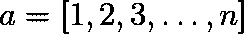

包含 n 个元素的向量。(图片由作者提供)

向量的元素以特定的顺序排列，元素的位置通常具有固有的含义。我们可以使用位置(或索引)来访问单个元素。

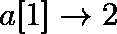

使用索引访问向量的元素。(图片由作者提供)

我们也可以认为向量代表空间中的一个点。如果向量的长度是 *n* ，则称该点在一个 *n 维空间*中。例如，如果向量的大小为 2，这可以表示二维空间中相对于原点的点，如下所示:

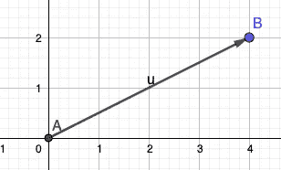

显示点(4，2)的向量的 2D 图。(图片由作者提供)

# **向量规范**

向量范数被定义为一组函数，这些函数以一个向量作为输入，输出一个**正值**与之相对。这被称为矢量的*大小*。根据我们用来计算大小的函数的类型，我们可以得到同一个向量的不同长度。

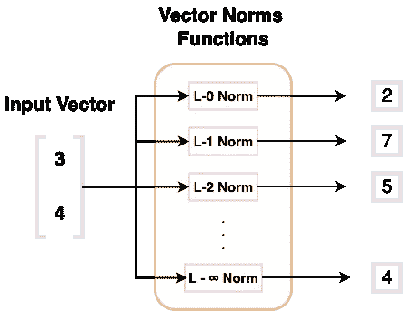

显示向量范数函数族及其输出的图。(图片由作者提供)

虽然经常被忽视，但规范是训练机器学习模型的核心。实际上，就在每次反向传播迭代之前，您要计算一个标量损失值(正值)，它是预测值和地面真实值的平方之差的平均值。这个定标器损失值只不过是一个范数函数的输出。我们计算损失的方法如下所示:

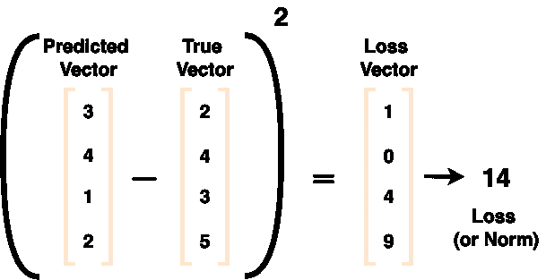

显示使用预测值和真实值计算损失的图表。(图片由作者提供)

# 标准范数方程—P-范数

所有的范数函数都来源于一个标准的范数方程，称为 p-范数。对于参数 p 的不同值(p 应该是大于或等于 1 的实数)，我们得到不同的范数函数。然而，通用的等式如下所示:

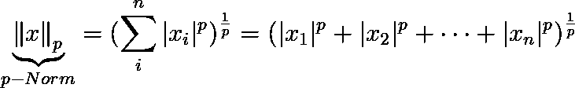

p-范数方程。(图片由作者提供)

这需要一个 n 维向量 *x* 并计算每个元素的 *p 次方*次幂。然后，我们将得到的所有元素求和，取 p 次根，得到向量的 p 范数，也就是它的大小。现在，通过参数 *p* 的不同值，我们将获得不同的范数函数。下面我们就来一一讨论一下。

# L0 标准:

虽然 *p=0* 位于 p-范数函数的域之外，但是在上面的等式中代入 *p=0* 会得到各个向量元素的 0 次幂，也就是 1(假设数字不为零)。此外，我们在方程中还有一个 p 次根，它不是为 p=0 定义的。为了解决这个问题，定义 L0 范数的标准方法是计算给定向量中非零元素的数量。下图显示了给定向量的 L-0 范数函数的输出:

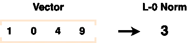

该图显示了 L0 范数的值。(图片由作者提供)

# L1 标准:

在 p-范数的标准方程中代入 *p=1* ，我们得到如下:

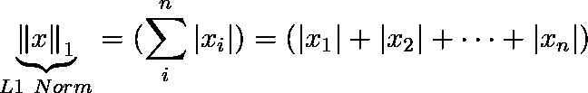

L1 范数的方程。((图片作者提供)

*   当用于计算损失时，L1 范数也被称为平均绝对误差*。*
*   无论是远离还是靠近原点，L1 范数在所有位置都呈线性变化。

下图显示了给定向量的 L1 范数函数的输出:

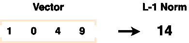

显示 L1 范数值的图像。(图片由作者提供)

# L2 标准:

在所有的范数函数中，最常见和最重要的是 L2 范数。在我们上面讨论的 p 范数的标准方程中代入 *p=2* ，我们得到 L2 范数的以下方程:

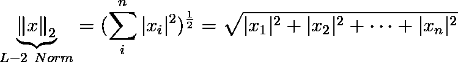

L2 范数的方程。((图片作者提供)

*   当用于计算误差时，上述等式通常被称为*均方根误差*。
*   L2 范数度量从原点的距离，也称为欧几里德距离。

下图显示了给定向量的 L2 范数函数的输出:

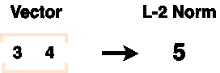

显示 L2 范数值的图像。(图片由作者提供)

# 平方 L2 范数:

顾名思义，L2 范数的平方与 L2 范数相同，只是平方不同。

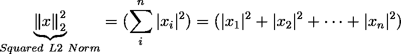

平方 L2 范数的方程。((图片作者提供)

*   当用于计算机器学习中的误差时，上述等式通常被称为*均方误差*。

与 L2 范数相比，平方 L2 范数在计算上相对便宜。这是因为:

1.  它缺少平方根。
2.  在机器学习应用中，平方 L2 范数的导数更容易计算和存储。平方 L2 范数中元素的导数需要元素本身。然而，在 L2 范数的情况下，需要整个向量。

# 最大范数(或 L-∞范数):

由于无穷是数学中的一个抽象概念，我们不能仅仅在标准的 p-范数方程中代入 p=∞。然而，当 p 接近无穷大时，我们可以用极限来研究函数的行为。最大范数方程的简单推导可以在[这里](https://math.stackexchange.com/questions/109615/understanding-the-proof-that-l-infty-norm-is-equal-to-max-fx-i)找到。

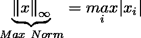

最大范数方程。(图片由作者提供)

Max norm 返回最大幅度元素的绝对值。下图显示了给定向量的最大范数函数的输出:

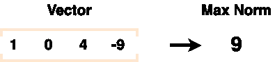

显示最大范数值的图像。(图片由作者提供)

# 结论说明:

1.  向量范数是以一个向量为输入，输出一个正值的函数。
2.  所有的范数函数都可以从一个方程中导出。范数函数族被称为 p-范数。
3.  L1 范数也被称为*平均绝对误差*。
4.  L2 范数也被称为*均方根误差*。
5.  平方 L2 范数也被称为*均方误差*。