# 产品的矢量表示 Prod2Vec:如何去除大量嵌入

> 原文：<https://towardsdatascience.com/vector-representation-of-products-prod2vec-how-to-get-rid-of-a-lot-of-embeddings-26265361457c>

你好！我叫 Alex，在 Ozon 的产品匹配团队工作。Ozon 是一家电子商务公司，为客户提供从不同卖家购买商品的服务。我们每天都要处理数十万件产品，我们的任务是识别和比较我们网站上的类似报价(查找匹配)，以便将不同卖家的报价收集到一个产品卡中。

每个产品都有以下信息:图片、标题、描述和附加属性。我们希望检索和处理所有这些信息，以处理不同的任务，而这对产品匹配团队尤为重要。

为了从产品中提取特征，我们使用不同的文本模型(fastText，transformers)为描述和标题创建向量表示(嵌入)，并使用大量的卷积神经网络(ResNet，Effnet，NFNet)为图像创建向量表示。这些向量进一步用于特征生成和产品匹配。

Ozon 上每天有数百万的更新，这就是为什么统计所有模型的嵌入变得具有挑战性。通常每个向量描述产品的不同部分。如果我们不这样做，而是一次只获得一个产品范围的向量，会怎么样？听起来不错，但是如何正确实施呢…

图片由作者提供，灵感来自电影《宿醉》

要创建产品的矢量表示，我们可以使用:

1.内容—图像信息、文本、产品名称和属性。

2.用户会话—用户查看/购买产品的历史记录。

让我们谈谈我们是如何应用第一种方法(使用内容)解决这个问题的。

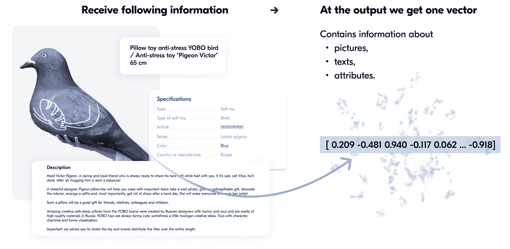

作者图片

**方案**

除了这种架构可以用于推荐、搜索和匹配的事实之外，它允许将关于产品的所有信息(图像、标题、描述和属性)统一到单个向量中，因此简化了一些管道(排序、搜索和候选产品的选择)。

**建筑**

使用度量学习方法来完成这项任务是合乎逻辑的:最小化相似产品之间的距离，并使用例如三重损失来迫使不相似的产品彼此分开。有许多有趣的问题(负采样，这里什么被认为是正例，如何正确地建立数据集)。由于我们已经有了一些这种类型的模型，我们决定使用监督学习方法来解决这个问题——预测类别树中最低级别的类别。

每个产品都属于一个特定的类别树，从高层次(衣服、书籍、电子产品)到低层次(短裤、杯子、智能手机外壳)。我们有几千个这样的低级类别。

例如，**电子产品(第一类)→手机、平板电脑(第二类)→苹果智能手机(第三类)。**

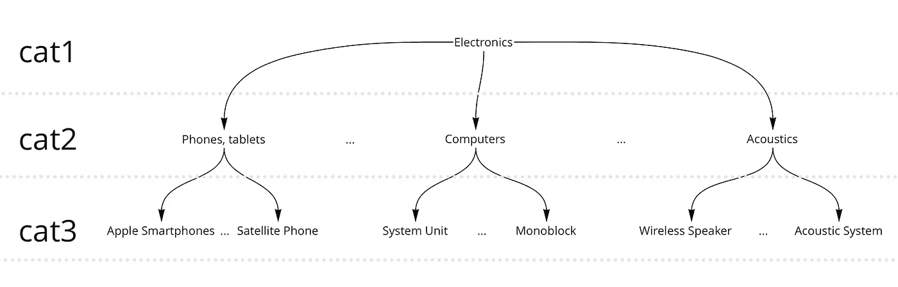

作者图片

为了对如此大量的类别进行分类，而不是通常的 Softmax(它没有显示出令人满意的结果)，我们决定尝试使用另一种方法，这种方法最初是为人脸识别任务提出的— [ArcFace](https://arxiv.org/abs/1801.07698) 。

经典的 Softmax 并不直接影响一个类内的学习嵌入的接近度和不同类中的远离度。ArcFace 就是为此而专门设计的:通过选择*边缘惩罚 m* 参数，我们可以调整相同或不同类的嵌入闭合/距离。

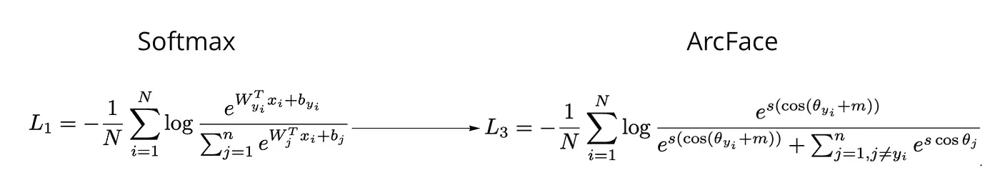

作者图片

模型架构的第一个版本如下所示:

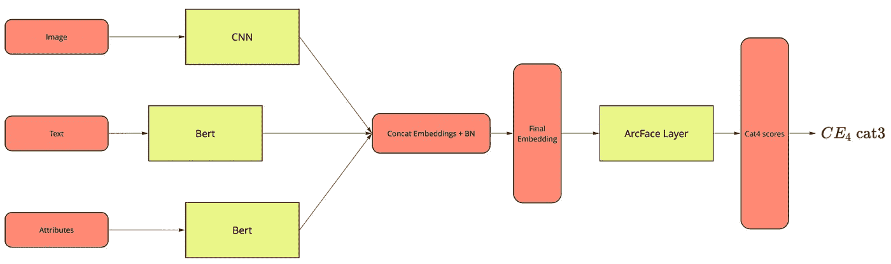

作者图片

对于模型来说，立即区分类别 3 被证明是太困难了:我们试图在每次迭代中根据类别 3 的最终交叉熵损失来训练图像、文本和属性模型。这导致他们的体重会聚不良和缓慢。因此，我们决定从以下方面改进该模型:

1.从每个编码器中，我们获得中间层输出— cat1(高级类别)预测。

2.总损失是所有损失的加权总和，首先，我们给予第 1 类损失更大的权重，然后逐渐向第 3 类损失转移。

因此，我们有以下架构:

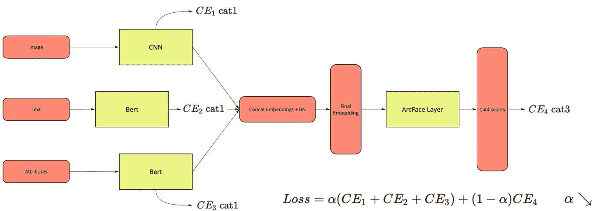

作者图片

我们采用通常的指数函数作为加权系数:

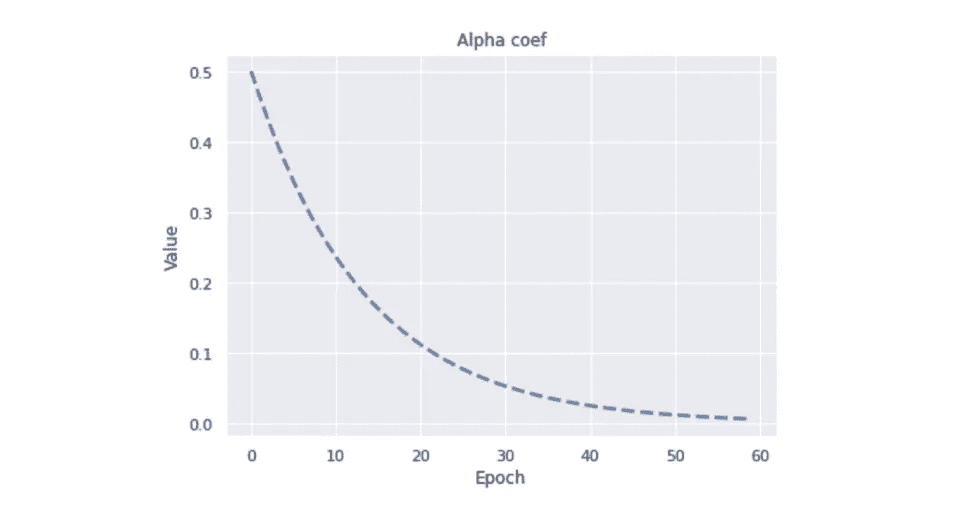

作者图片

在推断过程中，我们不再对 cat3 预测感兴趣，而是对产品的矢量表示感兴趣，因此我们将图层的输出带到 ArcFace 这是我们需要的嵌入。

**准备数据**

如果我们只统计所有产品的类别，我们会得到大约 6000 个，其中一些非常相似(维生素和矿物质复合物和膳食补充剂)，而另一些则相互嵌入(咖啡和咖啡胶囊)，还有一些包含的产品示例太少(理疗机)。

这就是为什么将原始类别作为目标不是一个选项的原因——我们必须执行相当多的预处理来合并相似的类别。结果，我们得到了一个数据集，包括大约 500 万个项目，1300 个类别，每个类别至少有 500 个样本。

数据本身处理如下:

1.文本被转换成小写，停用词被删除。

2.使用标准方法(水平、垂直翻转、亮度和对比度变化)增强图像。

3.那些没有太大意义并且在几乎所有产品中都存在的属性(例如序列号)被删除了。我们尝试了不同的选项来处理属性:将“键-值”对分别添加到每个属性中，并将它们组合成一个字符串。最终没有太大的区别，但第二个选项在学习过程中看起来更优雅，所以我们选定了它。

**学习过程**

我们决定看看更轻的架构，因为我们有太多的数据，需要将两个文本和一个图像模型放入学习管道。我们使用 ResNet34 作为 CNN，使用两个 Rubert-Tiny 作为文本——作为标题和属性。

我们有文本和图像模型，所以我们为它们分别设置了一个优化器:AdamW——用于 BERTs 和 SGD——用于 ResNet 和 model head。总而言之，我们训练了 60 个历元:最初是 15 个学习率较高的历元，然后继续进行较小的历元，并使用 *horovod* 在 GPU 上并行化它们。

验证的结果是 85% Acc@1 和 94% Acc@5。相比之下:在标题上训练的 fastText 给出了 60%的 Acc@1 的准确率。

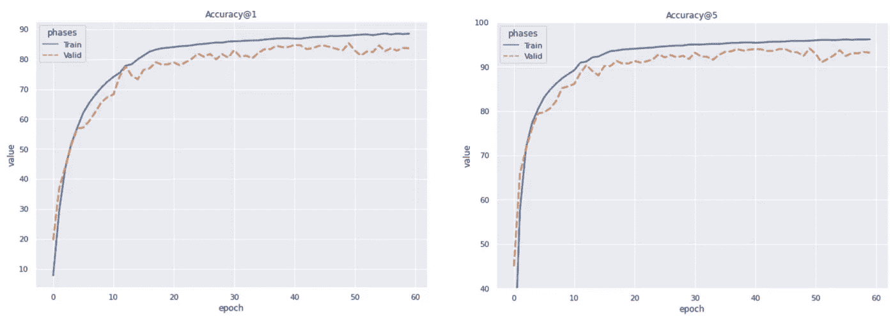

作者图片

当我们渴望了解我们是否成功地为产品生成了良好的嵌入时，类别预测的准确性是不够的。此外，我们使用了带有 3D 矢量可视化的[投影仪](https://projector.tensorflow.org):在那里你可以选择不同的降维方式，看看我们的矢量是如何投影到球体上的。

例如，这里有 t-SNE 和 UMAP 的可视化:

作者 gif

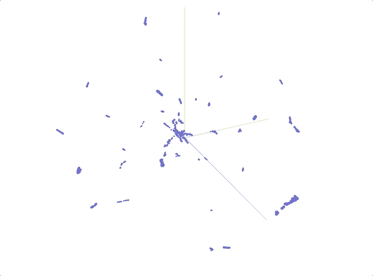

作者 gif

如果我们仔细观察，我们会发现每个聚类都包含相同类别的产品:

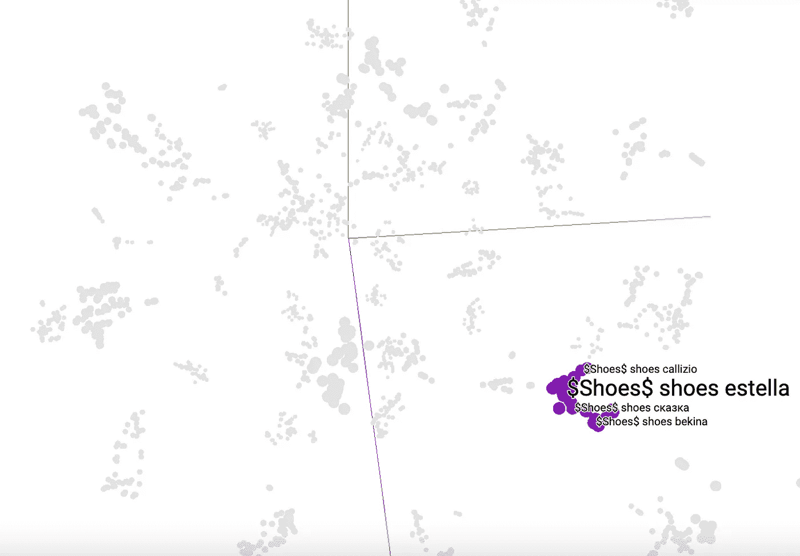

作者图片

当你观察生产管道中产品的最近邻居时，会发生这样的情况:

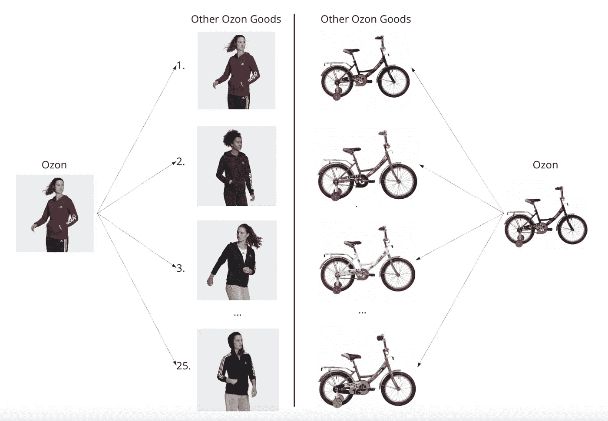

作者图片

最重要的是，排名模型的推理时间大大减少了:使用 Prod2Vec 嵌入而不是图像和文本嵌入，我们获得了超过三倍的加速:

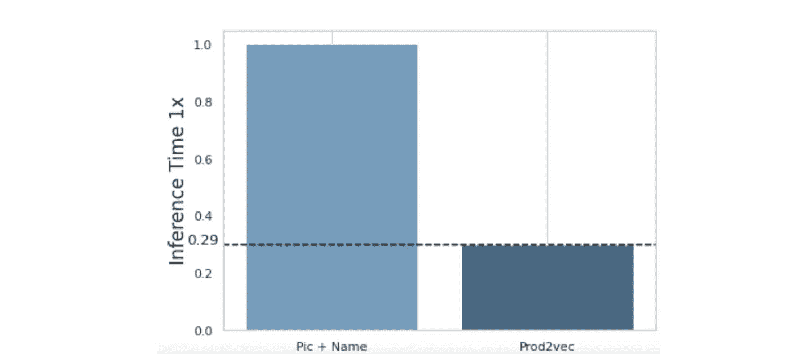

作者图片

**结果和观点**

我们对结果很满意，所以我们将完成的架构投入生产，现在每天通过 Spark 结构化流计算数百万个这样的嵌入。它们可以被进一步放入排名模型中，从而产生匹配的良好候选。

此外，嵌入可以用于我们团队中出现的许多其他任务或相关任务。

产品匹配的结果看起来是这样的:在一个产品卡片上可以看到不同的卖家。

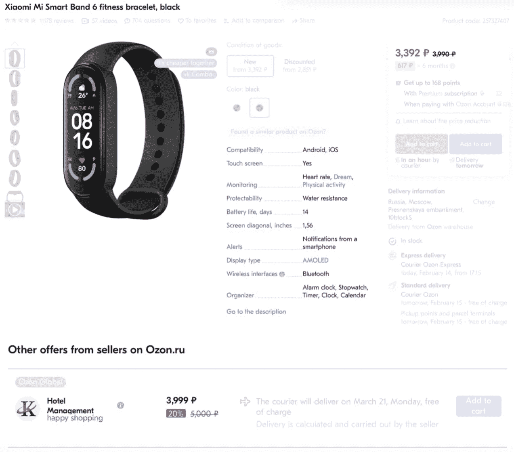

作者图片

然而，有趣的是，如果我们用度量学习来训练它，检查这个架构是否会工作得很好。这一切都有待于将来去发现。

如果你做过类似的事情，或者知道解决类似问题的其他方法，请在下面留下评论。希望你觉得这篇文章有趣，有帮助:)