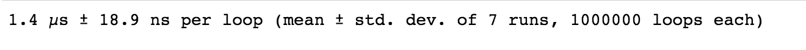
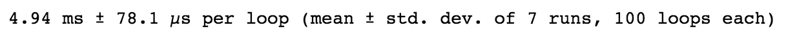
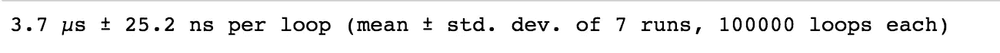

# 矢量化:将运算速度提高 100 倍的必备技术

> 原文：<https://towardsdatascience.com/vectorization-must-know-technique-to-speed-up-operations-100x-faster-50b6e89ddd45>

## 任何现代数据科学或机器学习应用程序都需要


乔伊·凯伯在 [Unsplash](https://unsplash.com?utm_source=medium&utm_medium=referral) 上的照片

# 介绍

在当前的[数据科学](https://en.wikipedia.org/wiki/Data_science)或[机器学习](https://en.wikipedia.org/wiki/Machine_learning)应用中，通常会涉及到庞大的数据集和复杂的网络。因此，在处理计算工作量时，代码效率变得非常重要。

例如，在经典的[多层感知器](https://en.wikipedia.org/wiki/Multilayer_perceptron)(又名[前馈神经网络](https://en.wikipedia.org/wiki/Feedforward_neural_network))中，网络通常包含多个线性层。假设输入层包含 64 个神经元，而第一个隐藏层包含 128 个隐藏神经元。然后，为了在给定输入的情况下计算隐藏层的输出，直接的方法是使用由 [Numpy](https://numpy.org/) 库提供的`[np.dot](https://numpy.org/doc/stable/reference/generated/numpy.dot.html)`方法:

```
import numpy as npfeat = np.ones(64)
w = np.random.rand(64,128)feat.dot(w)
```

如果我们想计算执行这个方法的时间，我们可以使用`[%timeit](https://docs.python.org/3/library/timeit.html)`:

```
%timeit feat.dot(w)
```



我们可以看到，这种方法平均需要 1.4 微秒。

然而，如果我们不使用`np.dot`，而是在仍然使用 Numpy 数组的同时，恢复到传统的 for 循环，那么您应该这样写:

```
def loop(feat, w):
    res = np.zeros(128)
    for i in range(w.shape[1]):
        s = 0
        for j in range(len(feat)):
            s += feat[j]*w[j][i]
        res[i] = s
    return resloop(feat, w)%timeit loop(feat, w)
```



正如你所看到的，像 for 循环这样直观的东西平均需要 4.94 毫秒，**比使用之前的方法**慢了 3000 倍以上。虽然这些都是很小的时间单位，但想象一下，当神经网络非常深入，数据集达到数百万或数十亿时，那么 3000 倍的差异很可能会产生影响，并决定应用程序的可行性。

*顺便提一下，我们可以检查两种方法计算出的结果是否相同(打印前十个元素来验证):*

```
feat.dot(w)[:10]
## result: array([30.80125191, 34.84418376, 29.5061941 , 33.00162298, 31.77854219,
       31.93457429, 30.25155328, 35.71776325, 35.45861881, 33.58667301])loop(feat, w)[:10]
## result: array([30.80125191, 34.84418376, 29.5061941 , 33.00162298, 31.77854219,
       31.93457429, 30.25155328, 35.71776325, 35.45861881, 33.58667301])
```

所以，让我们回到今天的主题——矢量化。什么是矢量化？ [**矢量化**](https://en.wikipedia.org/wiki/Vectorization) **是一种处理整个数组而不是单个元素的编程风格。这通常会加快计算速度。使用`np.dot`是矢量化的一个例子；这个函数由 Numpy 优化，它直接使用两个输入向量执行内积，而不需要使用 for 循环(通常是嵌套的 for 循环)手动进行乘法和求和。**

# 为什么矢量化速度更快

矢量化比 for 循环更快的一个主要原因是 Numpy 操作的底层实现。

正如你们许多人所知(如果你熟悉 [Python](https://www.python.org/) )，Python 是一种动态类型语言。当你声明一个变量时，不需要指定数据类型，因为 Python 会在运行时为你推断出来。这不同于静态类型语言，静态类型语言需要指定数据类型以便编译器检查，这些语言包括 Java 和 c。

在 Python 中，假设一个列表存储异构元素，在运行时，当执行某个操作时，必须检查列表中的每个单独元素(类型检查)。这将给常规列表增加一定的开销。另一方面，Numpy 使用的是`[ndarray](https://numpy.org/doc/stable/reference/generated/numpy.ndarray.html)`，它是存储同质元素的固定大小项目的多维数组。`ndarray`被优化，因为底层操作是使用高效的 C 操作完成的，这允许向量化。

# 矢量化的另一个例子

为了让您更好地理解矢量化，另一个例子是常见的损失函数[线性回归](https://en.wikipedia.org/wiki/Linear_regression) — [均方误差(MSE)](https://en.wikipedia.org/wiki/Mean_squared_error) 。回想一下，线性回归的 MSE 定义为数据集中预测值和实际标注值之间的均方误差，预测值是当前权重集与要素的点积。这可以使用矢量化实现，如下所示:

```
def MSE(theta, X, y):
    return ((X @ theta - y)**2).sum() / len(X)
```

*注意，除了使代码执行方式更快之外，代码也直观简单。不需要混乱的嵌套 for 循环。*

# 矢量化的条件

现在，您可能知道矢量化速度很快。但是我们可以对任何类型的函数使用矢量化吗？矢量化的条件是什么？

要使用矢量化，一个关键要求是底层的元素操作应该相互独立。例如，在 x 和 y 的点积中，`x_1 * y_1`的结果与`x_2 * y_2`无关。当不满足这个独立性标准时，我们只能回到使用 for 循环。以下给出了无法应用矢量化时的 3 种常见情况:

*   循环依赖性

```
for i in range(1, len(x1)):
    x1[i] = x1[i-1] * x2[i-1]
```

*   间接存储器访问

```
for i in range(len(x2)):
    x1[x2[i]] = x3[i] * x4[i]
```

*   代码分支

```
for i in range(len(x1)):
    if i < 8:
        i += func()
    x1[i] = x2[i] * x3[i]
```

# np .矢量化方法

如果一个方法是可向量化的(不是上面三个条件中的任何一个)，那么我们可以通过`[np.vectorize](https://numpy.org/doc/stable/reference/generated/numpy.vectorize.html)`函数注册它。举个例子，

```
def func(a, b):
    return a+1 if a >= b else a-1func_vec = np.vectorize(func)

a = np.array([1, 2, 3, 4, 5, 6])
b = 3
func_vec(a, b)
# result: array([0, 1, 4, 5, 6, 7])
```

我们可以定义自己的定制函数并将其矢量化，这很好。然而，在注册自己的矢量化函数之前，请考虑是否存在执行相同操作的多种方法。上述功能可以通过以下方式实现:

```
np.where(a>=b, a+1, a-1)
# result: array([0, 1, 4, 5, 6, 7])
```

这两种方法给出了相同的结果。哪个更快？当我们使用`%timeit`时，我们得到如下结果:

```
%timeit func_vec(a, b)
```


```
%timeit np.where(a>=b, a+1, a-1)
```



答案似乎是使用`np.where`比定义我们自己的矢量化函数快 4 倍。原因是使用预定义的 Numpy 方法利用了 Numpy 使用的底层优化 C 代码。

因此，每当您想要定义一个定制的矢量化函数时，首先要考虑是否有任何预定义的方法可以做同样的工作；否则，您可以安全地注册自己的矢量化函数。

# 矢量化思维过程

现在您已经知道了什么是矢量化，为什么要使用矢量化，以及何时使用矢量化，我想给您提供一个关于矢量化思维过程的额外提示。

有些公式可能无法直观地进行矢量化，为了帮助解决这个问题，这里有一个大纲，告诉你如何考虑如何对特定表达式进行矢量化。

## 矢量化的步骤:

*   给定一个迭代表达式，考虑等价的向量/矩阵表达式形式
*   将这个向量/矩阵分解成更小的部分
*   向量化每个组件，例如元素式操作、`XX^T`、`X^TX`等。
*   识别 Numpy 函数，例如`np.dot`、`np.sum`、`np.outer`、您自己的`np.vectorize`函数，以执行矢量化

*一个有趣的注意事项是，向量化不限于 Numpy 事实上，它也可以应用于其他数据科学和深度学习库，包括 Pandas、scikit-learn、Pytorch 等。*

# 摘要

如果你能走到这一步，恭喜你！

再次重申，矢量化是一种一次处理整个数组/矩阵而不是单个元素的编程方式。向量化的主要优势是(方式)更快的代码执行和更干净的代码。注意，并不是所有的公式或方法都可以向量化，如果可以的话，我们可以通过`np.vectorize`注册它，假设现有的 Numpy 函数没有其他的方法(例如`np.dot`、`np.where`、`np.sum`等)。

这就是这篇文章的全部内容，希望你在这篇文章中学到了一些东西！下一集再见。

请随意浏览我以前的帖子，如果有任何问题，请告诉我:

[](/build-a-song-recommendation-system-using-streamlit-and-deploy-on-heroku-375a57ce5e85) [## 使用 Streamlit 构建歌曲推荐系统并在 Heroku 上部署

### 了解如何使用 Spotify 音乐数据集的 K 近邻构建一个简单的歌曲推荐引擎

towardsdatascience.com](/build-a-song-recommendation-system-using-streamlit-and-deploy-on-heroku-375a57ce5e85) [](https://medium.datadriveninvestor.com/beginners-guide-to-web-scraping-using-beautifulsoup-and-python-999a927f20e6) [## 使用 BeautifulSoup 和 Python 的 Web 抓取初学者指南

### 简单的教程涵盖了美丽的基础知识，并举例说明了如何抓取维基百科的文章

medium.datadriveninvestor.com](https://medium.datadriveninvestor.com/beginners-guide-to-web-scraping-using-beautifulsoup-and-python-999a927f20e6) [](/beginners-guide-to-regular-expressions-in-python-d16d2fa31587) [## Python 正则表达式初学者指南

### 关于正则表达式的简单教程，涵盖了你需要知道的所有基础知识

towardsdatascience.com](/beginners-guide-to-regular-expressions-in-python-d16d2fa31587) [](https://medium.datadriveninvestor.com/top-20-masters-programs-in-ai-data-science-2021-98aadb7db409) [## 2021 年人工智能和数据科学 20 大硕士项目

### 美国最好的机器学习/数据科学项目列表

medium.datadriveninvestor.com](https://medium.datadriveninvestor.com/top-20-masters-programs-in-ai-data-science-2021-98aadb7db409) [](/top-nlp-books-to-read-2020-12012ef41dc1) [## 2020 年最佳 NLP 读物

### 这是我个人为自然语言处理推荐的书籍列表，供实践者和理论家参考

towardsdatascience.com](/top-nlp-books-to-read-2020-12012ef41dc1) 

# 参考

[矢量化](https://en.wikipedia.org/wiki/Vectorization) [(数组编程)](https://en.wikipedia.org/wiki/Vectorization) [，维基百科](https://en.wikipedia.org/wiki/Vectorization)

[Numpy 文档，Numpy](https://numpy.org/doc/)

[矢量化和广播](https://simpleprogrammer.com/vectorization-and-broadcasting/)、[简单程序员](https://simpleprogrammer.com/vectorization-and-broadcasting/)

[Numpy 优化矢量化和广播，Paperspace 博客](https://blog.paperspace.com/numpy-optimization-vectorization-and-broadcasting/)