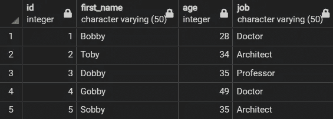
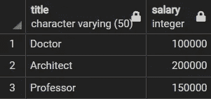
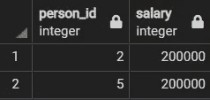
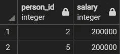
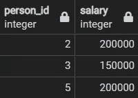
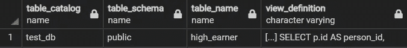

# 视图:SQL 中被低估的表的替代品

> 原文：<https://towardsdatascience.com/views-an-underrated-alternative-to-tables-in-sql-26cd6d1d8660>

## SQL 用户将从早期养成使用视图的习惯中受益匪浅

由[保罗·斯科鲁普斯卡斯](https://unsplash.com/@pawelskor?utm_source=medium&utm_medium=referral)在 [Unsplash](https://unsplash.com?utm_source=medium&utm_medium=referral) 上拍摄

视图通常被称为“虚拟表”，是许多 SQL 脚本中不可或缺的组件。

尽管如此，大多数钻研 SQL 的资源很少关注视图，而是选择更重视更高级的查询概念，如连接和 cte。

这可能是因为视图在语法方面更容易掌握，并且在编码访谈中不常见。

不管怎样，视图有巨大的效用。SQL 用户将从早期养成使用它们的习惯中受益匪浅。

## 什么是视图？

视图只是在给定数据库上运行的存储查询的输出。

它们经常被比作表格，因为它们也以行和列的形式报告数据。

然而，与表不同，视图实际上不是数据库模式的一部分。使用视图只需要运行它存储的查询。因此，它们需要内存，但不需要额外的存储空间。

## 视图的好处

视图在 SQL 中非常有用，因为它们能够简化操作和管理访问控制。

1.  **简化复杂查询**

虽然有些 SQL 查询简单易懂，但其他查询可能很复杂，需要许多行代码。

考虑已经被规范化的数据库，其结果是包含多个表。不断编写使用多个连接或 cte 来获取相同信息的查询会很麻烦。这不仅费时，而且让用户容易出错。

幸运的是，当试图重复访问相同的信息时，没有必要经历这么多麻烦。视图可以让用户以最小的努力重复查询，从而消除所有不必要的复杂性。

**2。管理访问控制**

安全性是数据库管理中的一个关键因素。理想情况下，人们应该只被授权访问符合其角色或地位的数据。

您不希望存储在表格或列中的任何个人信息或机密信息被错误的人看到。

数据库管理员可以通过创建视图并授予其他人访问这些视图的权限来规避这个问题。通过这种安排，任何外部方(例如客户)都无法看到他们不应该知道的信息。

## 在 SQL 中使用视图

由于 SQL 的用户友好语法，视图易于创建和管理。

作为视图的演示，我们有两个表，名为`People`和`Job`，我们将使用 PostgreSQL 查询它们(语法可能会因所选的 RDMBS 而异)。

代码输出(由作者创建)

代码输出(由作者创建)

假设您想要定期跟踪“高收入者”的记录，这些人的工资至少为 20 万英镑。您可以通过以下查询获得这些记录。

代码输出(由作者创建)

该查询将返回期望的输出，但是重复编写多行代码来获得相同的输出会令人厌烦。

此外，向外部客户机显示这些信息的用户可能不希望他们也能访问数据库中的`first_name`列。对于这样的场景，创建一个只存储所需列的视图，然后将这些列提供给客户机，这将是非常有益的。

1.  **创建视图**

创建视图的语法类似于创建表的语法。

上述查询可以存储在具有以下内容的视图中:

现在，我们可以像查询任何其他表一样查询视图。

代码输出(由作者创建)

**2。更新视图**

可以用`CREATE OR REPLACE`命令更新视图。

假设定义高收入者的起征点应该是 15 万，而不是 20 万。

可以修改视图来解决这一变化。

现在查询同一个视图会产生稍微不同的输出。

代码输出(由作者创建)

虽然`CREATE OR REPLACE`命令能够修改视图，但是它有自己的局限性。也就是说，它希望查询输出保留相同的列数、列名和列数据类型。因此，任何导致数据结构变化的修改都会产生错误。

**3。查看所有视图**

在 SQL 脚本上花费大量时间后，很容易失去对所有创建视图的跟踪。此外，记住存储在这些视图中的复杂查询可能会很麻烦。

对于这种情况，可以使用下面的查询找到所有创建的视图。

代码输出预览(由作者创建)

注意，包含了`WHERE`命令是为了省略 PostgreSQL 中的内置视图。

在输出中，`table_name`列显示了视图的名称，而`view_definition`列显示了视图中存储的查询。

**4。删除视图**

最后，可以用简单的一行程序删除视图。

## 结论

照片由 [Prateek Katyal](https://unsplash.com/@prateekkatyal?utm_source=medium&utm_medium=referral) 在 [Unsplash](https://unsplash.com?utm_source=medium&utm_medium=referral) 上拍摄

视图不仅使用户能够简化复杂的查询，还允许他们限制其他人对个人或机密信息的访问。

总而言之，对于那些希望在与同事或外部客户协作的同时高效地执行 SQL 数据分析的人来说，它们非常有用。

我祝你在数据科学的努力中好运！