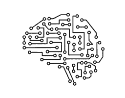
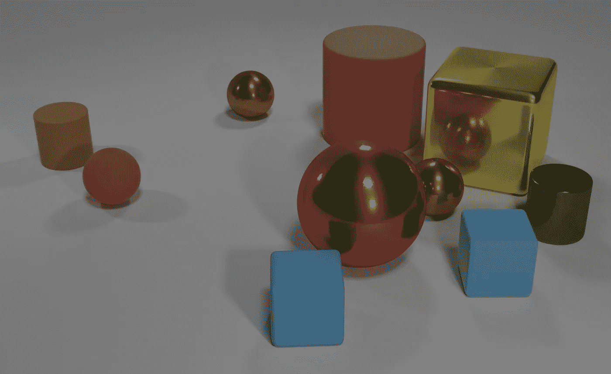
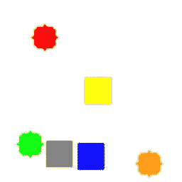
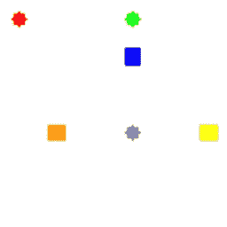
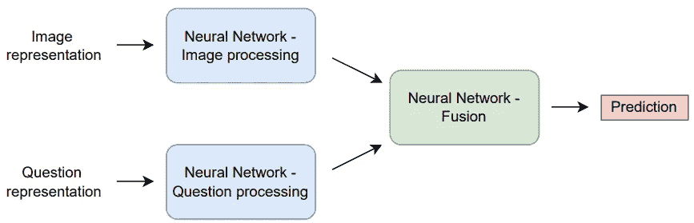
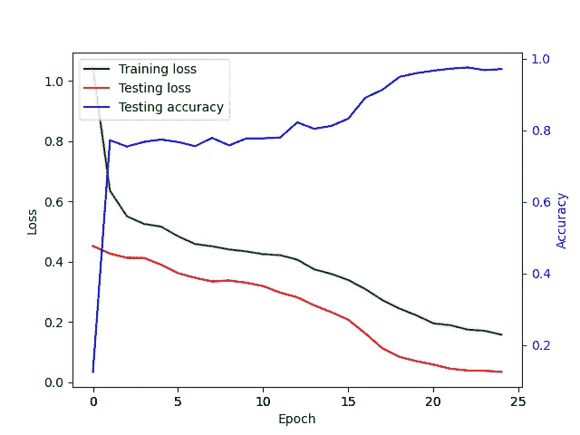
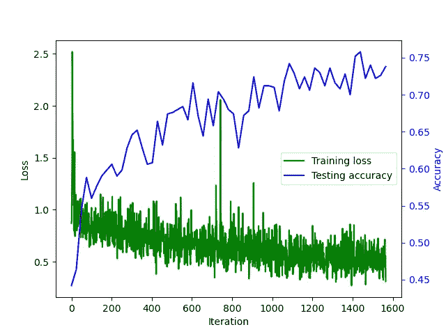
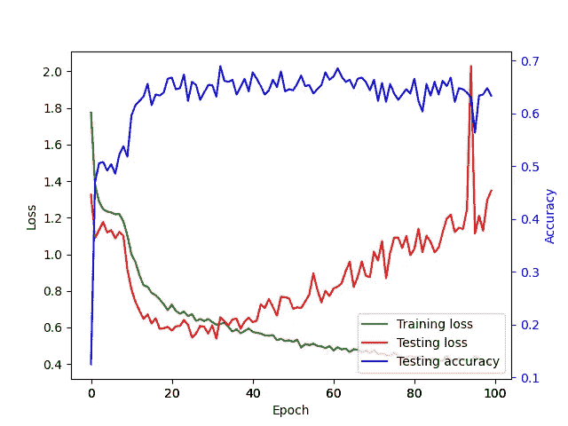
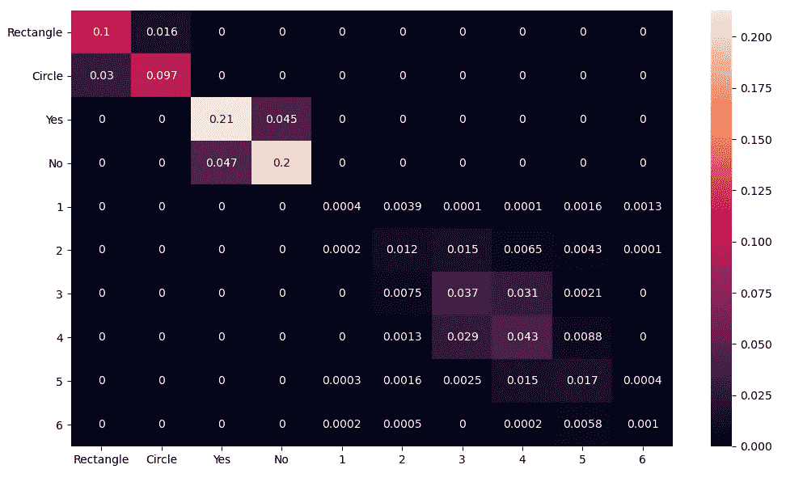
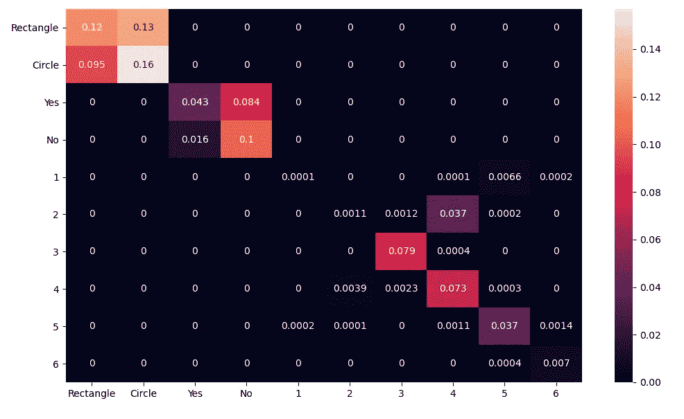

# 基于神经符号人工智能的 DeepProbLog 视觉问答

> 原文：<https://towardsdatascience.com/visual-question-answering-with-deepproblog-using-neuro-symbolic-ai-621099805bc7>

## 基于视觉问答的神经符号人工智能与纯神经网络方法的比较

本文重点关注视觉问题回答，其中将具有知识库的神经符号人工智能方法与纯粹基于神经网络的方法进行了比较。从实验中可以看出，用于神经符号人工智能方法的框架 [DeepProbLog](https://github.com/ML-KULeuven/deepproblog) 能够实现与基于纯神经网络的方法相同的准确性，而迭代次数几乎减少了 200 倍。显然，这种训练更有针对性，但也是有代价的。DeepProbLog 内部的代数运算符非常昂贵，因此实际的训练时间要慢得多。DeepProbLog 的另一个缺点是无法轻松实现加速，因为代数运算符只在 CPU 上工作(至少目前是这样)，因此无法从 GPU 等加速器中受益。

图片由 [Philipp Marquetand](https://pixabay.com/users/marquetand-3570369/?utm_source=link-attribution&utm_medium=referral&utm_campaign=image&utm_content=5076887) 来自 [Pixabay](https://pixabay.com//?utm_source=link-attribution&utm_medium=referral&utm_campaign=image&utm_content=5076887)

# 1.介绍

神经符号人工智能领域感兴趣的是在概率知识的鲁棒性和深度神经网络的众所周知的普及性和已证实的优势之间建立一座桥梁。DeepProbLog [1]通过利用**神经网络**(即系统 1，典型的潜意识任务，如视觉识别、语言处理……)的优势，以及**基于规则的概率系统**(即系统 2，缓慢、有序的思维，如证明的推导)[2]的优势，提供了这种能力。

> 本文详细阐述了一个需要使用这两个系统的应用程序，即视觉问答。需要系统 1 来理解被研究的图像，特别是它们的形状和颜色。另一方面，系统 2 将使用该提取的信息来导出对象的某些属性(例如，找到绿色对象的形状)，或者甚至用于捕捉对象之间的关系(例如，计算图像中的圆的数量)。

# 2.文学

该应用程序侧重于视觉问题回答(VQA)，其中存在巨大的数据集，以及非常复杂的方法。VQA 最著名的数据集是 CLEVR [3]，它包含 10 万张图片和 100 万个问题。下面给出了一个示例图像，而示例问题是:

*   大型物体和金属球体的数量相等吗？
*   大球体左边的棕色金属物体的左边的圆柱体有多大？
*   有多少物体不是小圆柱体就是金属的东西？

图 CLEVR 数据集的样本图像[3]

> 显然，在回答这些问题时，系统 1 和系统 2 都被积极地使用。人们可能会想，在没有明确的系统 2 编码(即，基于规则的知识库)的情况下，神经网络是否能够独自回答这些问题。直觉上，如果知道世界上的某些事实，学习会进行得更快。从优化的角度来看，在这种设置中，预测期间产生的误差可以被精确地瞄准，这使得优化过程也更有针对性，因此更有效。最后，本文还为这些说法提供了证据，因为在第 4.1 小节中，VQA 实现与 DeepProbLog 之间的比较是用一种纯粹基于神经网络的方法进行的。

本文受 CLEVR 数据集的启发，但是使用了一个更加简化的版本。本质上，它几乎就像是一个分类数据集[4]。CLEVR 分类数据集包含如图 2 所示的图像，同时提出如下问题:

*   非关系型问题:物体的形状、水平或垂直位置。
*   关系问题:离被调查物体最近/最远的物体的形状，或者具有相同形状的物体的数量。

图 2:来自分类数据集的样本图像[4]

> 如前所述，这些类型的 VQA 需要系统 1 和系统 2。

A.桑托罗等人用本文中的 Sort-of-CLEVR 数据集进行了类似的实验，他们能够在 CNN 的关系问题上达到 63%的准确率。相比之下，CNN 的关系型和非关系型问题的准确率都达到了 94%，并辅以 RN。对他们来说，用一个关系模块，比如一个 RN，来扩充模型，结果足以克服解决关系问题的障碍[4]。他们是唯一在与本文相似的数据集上进行实验的研究人员，因此是唯一的参考点。

最后，由于这个应用程序使用 DeepProbLog，所以花了相当多的时间来消化 DeepProbLog 文章[1]，以及理解代码库中提供的示例[5]。

# 3 方法

实施过程包括三个主要部分:

1.  数据的生成
2.  用纯 Python 代码链接数据和控制训练过程。
3.  用 DeepProbLog 语句创建逻辑部分。

## 3.1 数据的生成

> 如第 2 节所述，本应用程序中使用的数据基于 Sort-of-CLEVR 数据集，并进行了额外的简化。假设逻辑部分将必须决定对象是否例如位于图像的左侧，则神经网络将必须向逻辑部分传送位置信息。因此，每个离散的位置必须由神经网络的可能结果编码。因此，对象可能只位于网格中的特定位置。在本文中，将讨论 2x2 和 6x6 网格上的结果。

用于创建分类数据集的数据生成器已经过修改，以便将对象定位在上述网格位置[4]。图 3 给出了一个生成图像的例子，与图 2 的区别在于网格布局。

图 3:这个应用程序使用的数据集的样本图像

每种指定的颜色都有一个位于网格中某处的对象，其形状可以是正方形或圆形。这些图像附有一个关于随机对象的问题，可以是以下内容之一:

*   非相关—这个对象的形状是什么(正方形或圆形)？
*   非相关—该对象是否位于图像的左侧
    ？
*   非相关—该对象是否位于图像的底部
    侧？
*   相关——有多少物体与
    这个物体具有相同的形状？

这些问题以矢量编码方式进行编码，然后与预期答案一起存储在 CSV 文件中。为了使训练过程更有效，已经预先生成了训练和测试数据集。

## 3.2 控制培训过程

整个训练过程是通过 DeepProbLog 的 Python API 以及 CNN 的一般 PyTorch 实现来控制的。首先，CNN 是用 PyTorch 定义的。使用相对简单的网络，其中输入作为 100 像素宽的正方形 RGB 图像给出，由 CNN 转换成 6x6 网格的 72 个输出特征(对于 2x2 网格的例子，需要 8 个输出特征)。图像中出现的每种颜色都有其伴随的 CNN 网络，因此 72 个输出特征用该颜色编码了物体的可能位置，以及它们的形状，可以是正方形或圆形(6 6 2 = 72)。

在开始训练过程之前，最后一件事(除了逻辑规则编码之外)是数据加载器。这里最具挑战性的部分是从生成的数据到特定查询映射及其结果的转换。

## 3.3 逻辑规则编码

一旦属于特定颜色的 CNN 已经确定了该对象的位置和形状，逻辑规则就可以推断出该对象是否位于图像的左侧、底部，以及有多少对象具有相同的形状。逻辑规则程序可以在相关的 Github 中找到，链接在本文的底部。显示了一个示例片段:

# 4 次实验

> 本文的主要重点是概述使用神经符号人工智能方法(由 DeepProbLog 框架提供)的优势，而不是纯粹的基于神经网络的方法。因此，必须实施基于神经网络的方法。这里不会列出所有细节，但主要思想是图像必须与问题融合，然后才能做出预测。该网络的一般结构如图 4 所示。

图 4:纯神经网络架构的抽象表示[6]

## 4.1 与纯系统 1 方法的比较

*   实验— 2x2 网格:

图 5 和图 6 分别显示了 DeepProbLog 方法和纯神经网络方法的损耗曲线。

图 5: DeepProbLog 2x2:损耗曲线

图 6:基于纯神经网络的方法 2x2:损耗曲线

> 一个非常重要的注释是“迭代次数”和“纪元次数”之间的区别。迭代次数意味着一批(大小为 32)的向前和向后传递的次数，而时期数表示训练集的所有图像向前和向后传递的次数。在该应用中，使用了 10 000 的训练大小，因此一个时期由 312.5 次迭代组成。

从损失曲线可以清楚地看出，这两种方法似乎都达到了 100%的精度。然而，DeepProbLog 只需要大约 40 次迭代，而基于纯神经网络的方法至少需要 7 800 次迭代。这再次证明了神经符号人工智能的价值。

另一方面，我们必须考虑这些迭代的实际运行时间。DeepProbLog 需要大约 10 分钟来完成它的 160 次迭代，而纯粹基于神经网络的方法只需要大约 5 分钟来完成 7 800 次迭代。考虑到纯粹基于神经网络的方法可以被大规模加速(通过使用 GPU)，而 DeepProbLog 不能，很明显 DeepProbLog 训练**更有针对性**，但**计算量极大**(至少目前如此)。

> 请注意，DeepProbLog 提供了将 CNN 发送到 GPU 以进行更快推断的能力，但是，DeepProbLog 的算术运算符(即半环)在 CPU 上工作。这些算术运算符拥有最高的计算成本。

*   实验— 6x6 网格:

DeepProbLog 的 6x6 实验和基于神经网络的方法的损耗曲线分别如图 7 和图 8 所示。

图 7: DeepProbLog 6x6:损耗曲线

图 8:基于纯神经网络的方法 6x6:损耗曲线

在这些实验中，基于纯神经网络的方法的训练时间为 **20 分钟**(为了公平的速度估计，已经在 CPU 上进行了训练)，而 DeepProbLog 方法的训练时间略低于**八小时**。

然而，应该提到的是，每次大约有一半的时间花费在计算准确性上，因为整个测试集必须通过网络转发，而对于训练迭代来说，这只是一个批次。

> 这里最重要的观察是，纯神经网络方法很快过拟合，并且也实现了相当低的准确度(DeepProbLog 的 68%而不是 75%)。另一个重要的注意事项是，这两种方法显然不再能够达到 100%的准确度。然而，如果 DeepProbLog 网络可以训练更长时间，它将能够进一步收敛。

在图 9 和图 10 中，描述了混淆矩阵，以显示典型错误发生的位置。

图 9:来自 DeepProbLog 的 6x6 数据集的混淆矩阵

图 10:来自纯神经网络方法的 6x6 数据集的混淆矩阵

DeepProbLog 自然不会犯任何“无意义”的错误，比如对“正在研究的物体是什么形状？”这个问题回答“是”，因为可能的正确答案已编码在程序中。然而，基于纯神经网络的方法已经很好地学会了将问题的可能答案联系起来。

另一个观察结果是，DeepProbLog 在回答“正在研究的物体是什么形状？”这个问题时要好得多以及“物体是位于图像的左侧(还是底部)？”比纯粹的神经网络方法更有效。这是有意义的，因为一旦给定对象的位置(和形状)被确定，DeepProbLog 可以使用其**知识库**来导出这些属性。a .桑托罗等人[4]也观察到，基于纯神经网络的方法很难区分这些情况，在这些问题上，他们采用基于纯神经网络的方法实现了 63%的准确率。DeepProbLog 无法实现这些研究人员通过添加 RN 模块在所有问题上实现的 94%的准确性，这可能是由于代数运算符的固有培训成本，以及由于资源较少、超参数调整较少和缺少 RN 模块等许多其他未知变量。

关于关系问题:“有多少物体与被研究的物体具有相同的形状？”这两种方法都存在更多的混乱。DeepProbLog 通常能够接近正确的答案，但可能会犯一些**“一个接一个”的错误**(即一个 CNN 错误地预测了其对象的形状)。从这个角度来看，基于纯神经网络的方法也稍差一些。还有一种可能是，在这种方法中，神经网络可能已经观察到，由于概率原因，可能有三个或四个相同的对象(包括正在研究的对象)，因此更喜欢这样的答案。

# 5 个结论

神经符号人工智能领域的优势已经在视觉问题回答的背景下得到证明。通过使用 DeepProbLog，为神经符号人工智能任务选择的框架，很明显，几乎需要 **200 倍的迭代**来实现与纯粹基于神经网络的方法相同的准确性。然而，由于**昂贵的代数运算符**，与纯粹基于神经网络的方法相比，DeepProbLog 方法的总训练时间要慢得多**。**

> **值得注意的是，DeepProbLog 在非关系问题上表现得更好。这是因为知识库可以更准确地推导出这些属性，而基于纯神经网络的方法在这种推导上有更多的困难。**

**因此，尽管代数运算代价高昂，但神经符号人工智能方法仍有很多价值。特别是对于知识库非常大的任务，这些方法可以决定是否能够学习某项任务。随着时间的推移，这些代数运算符的加速可能会得到发展，这为更多的应用开辟了道路。**

# **参考**

*   **[1] R. Manhaeve，A. Kimmig，s . duman ci，T. Demeester，L. De Raedt，“Deepproblog: [神经概率逻辑编程”，载于《神经信息处理系统进展](https://arxiv.org/abs/1907.08194v2)，2018-Decem 卷，第 3749-3759 页，2018 年 7 月，doi:10.48550/arxiv.1907.08194，URL:[https://arxiv.org/abs/1907.08194v2【T10](https://arxiv.org/abs/1907.08194v2)**
*   **[2] D .卡尼曼，《思考，快与慢》，企鹅出版社，伦敦，2012 年。**
*   **[3] J. Johnson，l .飞飞，B. Hariharan，C. L. Zitnick，L. Van Der Maaten，R. Girshick，“CLEVR:一个用于组合语言和基本视觉推理的诊断数据集”，会议录-第 30 届 IEEE 计算机视觉和模式识别会议，CVPR 2017 年，第 2017 卷-Janua，第 1988-1997 页，2017 年，doi:10.1109/cvpr . 2017 . 2017 . 2017 . 2017**
*   **[4] K. Heecheol，“[kimhc 6028/Relational-Networks:py torch 实现“用于关系推理的简单神经网络模块”(Relational Networks)](https://github.com/kimhc6028/relational-networks) ，URL:【https://github.com/kimhc6028/relational-networks】，许可证:BSD 3-Clause**
*   **[5] R. Manhaeve，“[ML-KULeuven/Deepproblog:DeepProbLog 是 ProbLog 的扩展，通过引入神经谓词将概率逻辑编程与深度学习相结合。](https://github.com/ML-KULeuven/deepproblog)”，网址:[https://github.com/ML-KULeuven/deepproblog](https://github.com/ML-KULeuven/deepproblog)，许可证:Apache 2.0
    【6】c . Theodoropoulos，“信息检索与搜索引擎[H02C8b]项目视觉问答”，托莱多，第 1–5 页，2022。**

**除非另有说明，所有图片均为作者所有。**

> **属于这篇文章的代码可以在这里找到[。](https://github.com/JorritWillaert/Capita-Selecta-Neuro-Symbolic-AI/tree/master/deepproblog/src/deepproblog/examples/SORTOFCLEVR)**