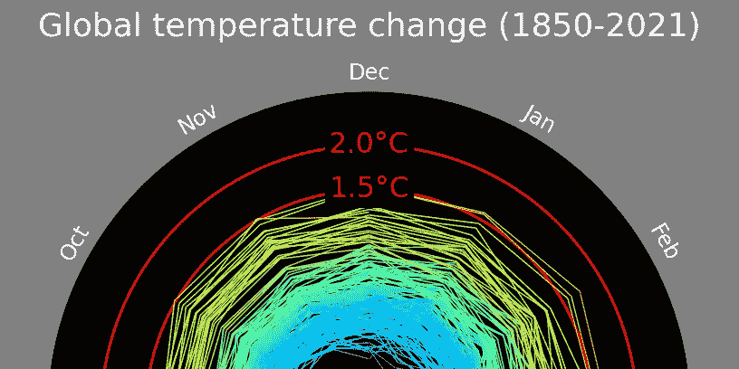
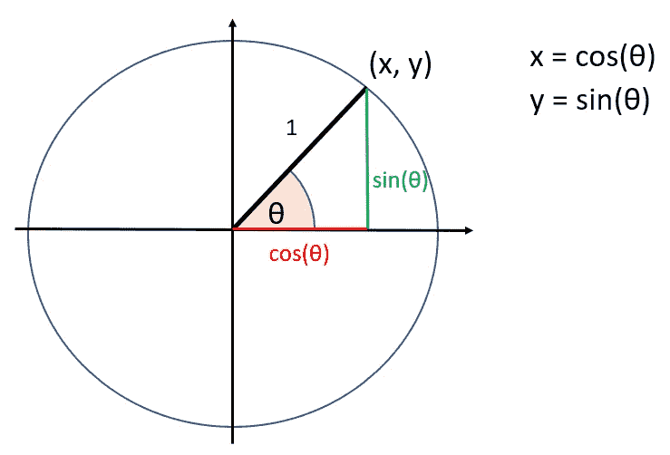
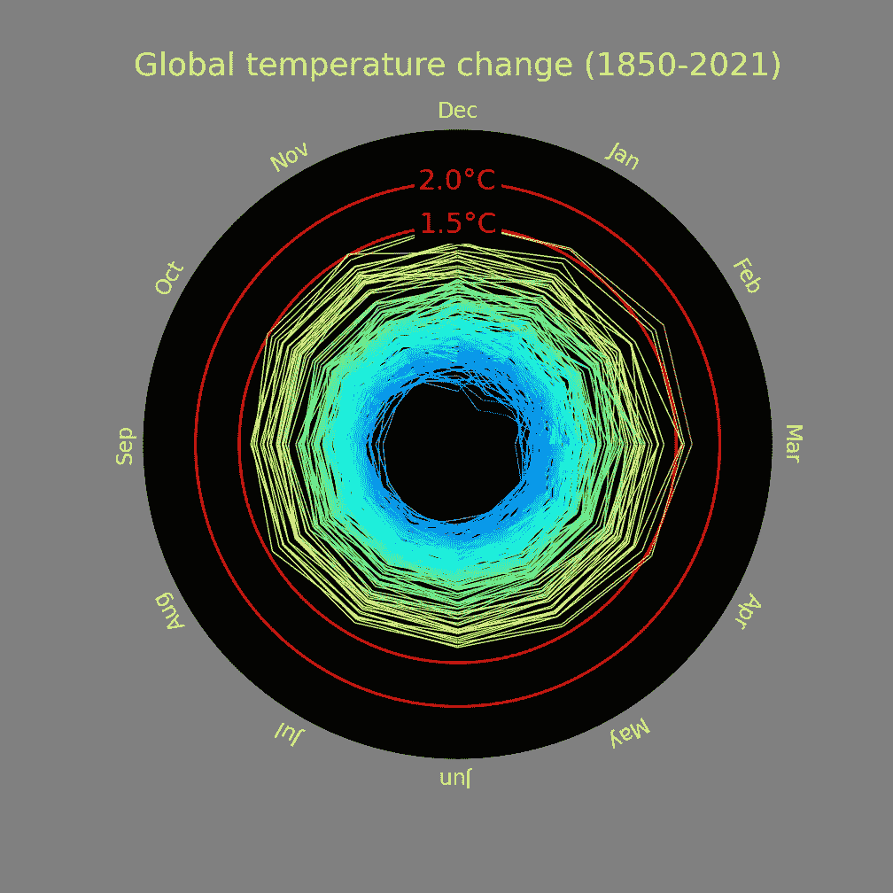

# 用螺旋线可视化时间序列数据

> 原文：<https://towardsdatascience.com/visualising-time-series-data-with-spirals-efe0cd9f4c5>

## 使用 Matplotlib 和 Python 绘制气候螺旋图

全球气温变化-作者图片

作为数据科学家，我工作的一部分是处理不同种类的时间序列数据。试图以对用户有意义的方式可视化数据中的模式和变化可能是一个相当大的挑战。因此，当我最近看到一个显示 1850 年至 2021 年全球气温变化的动画螺旋时，我认为这是一个以有影响力的方式显示时间序列数据的好方法:

  

虽然它展示的东西很吓人，但我真的很喜欢这个动画本身。当我跟踪所有链接时，我发现它是用 Javascript 实现的。我想我会尝试做同样的事情，但是使用 Python 和 Matplotlib。好消息是我能够做到，我会告诉你怎么做。我还在我的 GitHub 上提供了源代码——查看文章末尾的链接。

## 画一个圆

在这个解决方案的不同部分，我们需要能够画一个圆。特别是，这个圆圈需要分成 12 个部分——一年中的每个月一个部分。为了做到这一点，我们将使用一些标准的三角。

[单位圆](https://en.wikipedia.org/wiki/Unit_circle)有一些我们将要用到的很好的性质。它被定义为半径为 1 的圆。这意味着一些三角方程变得更容易计算，因为半径部分实际上消失了。

单位圆—作者图片

如果我们想知道圆上一点的 x 和 y 的值，这将由 **x =半径* cos(θ)** 和 **y =半径* sin(θ)** 给出。因为这是单位圆，所以变成了 **x = cos(θ)** 和 **y = sin(θ)。**

还有一些我们应该注意的事情。θ为零时，它将指向 3 月(如果这是一个钟面，则指向 3:00)。随着角度的增加，月份名称会向后移动。为此，我创建了一个查找表(因为只有 12 个值)来将月份索引映射到相应的段索引。

## 创建 12 个分段

为了创建 12 个分段，我创建了一个函数， **segment_circle** :

## 气候数据

使用的数据是由英国气象局哈德利中心提供的数据集。这是相对于 1961-1990 参考期(从 1850 年到 2022 年)的全球历史地表温度异常的网格化数据集。它有大量的数据。

HadCRUT.5.0.1.0 数据于 2022 年 3 月 28 日从[http://www.metoffice.gov.uk/hadobs/hadcrut5](http://www.metoffice.gov.uk/hadobs/hadcrut5](http://www.metoffice.gov.uk/hadobs/hadcrut5))获得，由英国皇家版权所有，Met Office 2022，在开放政府许可下提供，[http://www . national archives . gov . uk/doc/Open-Government-License/version/3/](http://www.nationalarchives.gov.uk/doc/open-government-licence/version/3/](http://www.nationalarchives.gov.uk/doc/open-government-licence/version/3/))

## 气候螺旋图

以下是 Matplotlib 中所有数据的螺旋图:

全球气温变化-作者图片

## 制作视频

为了创建一个绘制所有点的视频，我使用了 [ffmpeg](https://ffmpeg.org/) 。将它下载并安装到您的计算机上，并确保它在您的路径上(这样您就可以在命令行上执行它)。FFmpeg 可以接受来自 stdin 的输入，这意味着您可以通过管道将视频帧传输给它，它们将在视频中累积。这些年来，我发现这是一种用 matplotlib 创建视频的有用方法。

为了创建我们的视频，我们首先用 matplotlib 创建一个时间点的帧，然后保存到 stdin。按照这个过程，我们循环所有的时间点，创造了气候螺旋。

气候螺旋视频——作者视频

## 后续步骤

1.  实现螺旋的 3D 版本。这应该很容易做到，因为您只需在 3D 中绘制点，并使用时间作为 Z 轴。
2.  实现了这个螺旋之后，我认为这实际上是一个可视化某些时间序列数据的好方法。我将寻找机会在我的时间序列数据工作中使用它。

## 资源

*   单位圈百科文章:[https://en.wikipedia.org/wiki/Unit_circle](https://en.wikipedia.org/wiki/Unit_circle)
*   FFMPEG:[https://ffmpeg.org/](https://ffmpeg.org/)
*   源代码:[https://github.com/ianormy/ClimateSpiralMatplotlib](https://github.com/ianormy/ClimateSpiralMatplotlib)
*   HadCRUT.5.0.1.0 数据于 2022 年 3 月 28 日从[http://www.metoffice.gov.uk/hadobs/hadcrut5](http://www.metoffice.gov.uk/hadobs/hadcrut5](http://www.metoffice.gov.uk/hadobs/hadcrut5))获得，由英国皇家版权所有，Met Office 2022，在开放政府许可下提供，[http://www . national archives . gov . uk/doc/Open-Government-License/version/3/](http://www.nationalarchives.gov.uk/doc/open-government-licence/version/3/](http://www.nationalarchives.gov.uk/doc/open-government-licence/version/3/))
*   气候螺旋:【https://www.climate-lab-book.ac.uk/spirals/ 