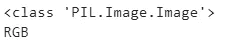
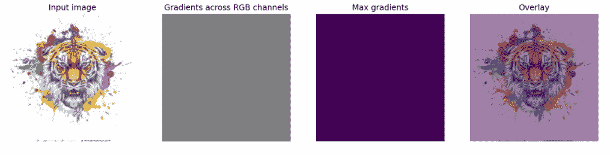

# PyTorch 中神经网络的可视化

> 原文：<https://towardsdatascience.com/visualization-for-neural-network-in-pytorch-7658cfd32149>

## Python 可视化工具包


照片由 [Unsplash](https://unsplash.com?utm_source=medium&utm_medium=referral) 上的 [Aziz Acharki](https://unsplash.com/@acharki95?utm_source=medium&utm_medium=referral) 拍摄

PyTorch 是一个基于 Python 的 Torch 库的开源 ML 框架。基本用于 NLP、计算机视觉等应用。它是由脸书开发的，并且是开源的。它是继 Tensorflow 和 Keras 之后使用最多的框架之一。PyTorch 和其他框架的主要区别在于 PyTorch 以更 Pythonic 化的方式工作，即面向对象的方法。

一旦使用 PyTorch 创建了一个模型，我们就可以使用 FlashTorch 创建不同的可视化效果。是为了解决理解神经网络如何工作的问题。它有助于使用不同的特征可视化技术(如显著图和激活最大化)来理解模型行为。

在本文中，我们将探索使用 FlashTorch 的不同类型的可视化，我们还将探索如何使用 FlashTorch 工具进行图像转换。

让我们开始吧…

# 安装所需的库

我们将从使用 pip 安装闪光灯开始。下面给出的命令可以做到这一点。

```
pip install flashtorch
```

# 导入所需的库

在这一步中，我们将导入所需的库来加载预训练的 PyTorch 模型并创建可视化。

```
%matplotlib inline
%config InlineBackend.figure_format = 'retina'
import matplotlib.pyplot as plt
from flashtorch.utils import(load_image, apply_transforms, denormalize, format_for_plotting)
```

# 正在加载图像

接下来，我们将加载将在本文中使用的图像。你可以使用任何你想要的图像

```
image = load_image('Image.jpg')
print(type(image))
print(image**.**mode)
```



图像属性(来源:作者)

# 可视化原始图像

在这一步中，我们将形象化我们将在本文中使用的图像。

```
plt.imshow(image)
plt.title('Original image');
```


原始图片(来源:作者)

# 转换图像

在这一步中，我们将加载预训练的模型来变换图像。我们正在使用 alexnet 模型，我们将使用 flash torch 的应用变换功能。

```
model = models.alexnet(pretrained=True)
backprop = Backprop(model)
input_ = apply_transforms(image)
target_class = 24
backprop.visualize(input_, target_class, guided=True, use_gpu=True)
```



转换(来源:作者)

在这里你可以清楚地看到转换后的图像，我们有最大梯度，RGB 通道和叠加。我们可以清楚地分析不同的图像及其差异。

继续尝试不同的图像，并转换它们。如果您发现任何困难，请在回复部分告诉我。

本文是与[皮尤什·英加尔](https://medium.com/u/40808d551f5a?source=post_page-----7658cfd32149--------------------------------)合作完成的。

# 在你走之前

***感谢*** *的阅读！如果你想与我取得联系，请随时通过 hmix13@gmail.com 联系我或我的* [***LinkedIn 个人资料***](http://www.linkedin.com/in/himanshusharmads) *。可以查看我的*[***Github***](https://github.com/hmix13)**简介针对不同的数据科学项目和包教程。还有，随意探索* [***我的简介***](https://medium.com/@hmix13) *，阅读我写过的与数据科学相关的不同文章。**