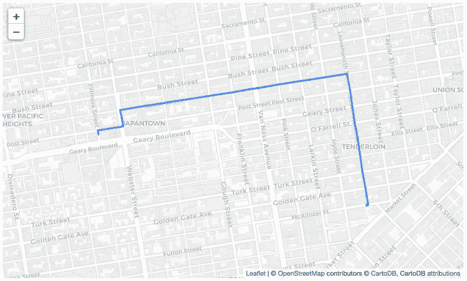
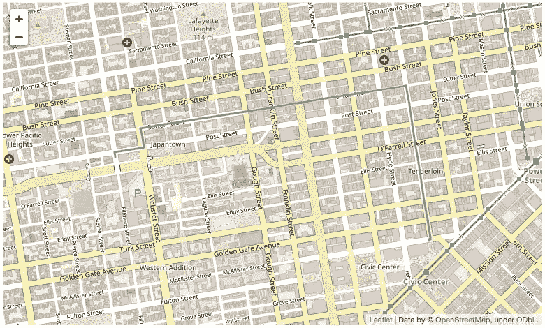
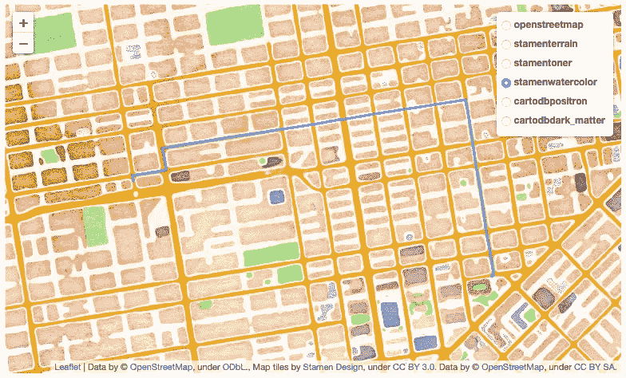
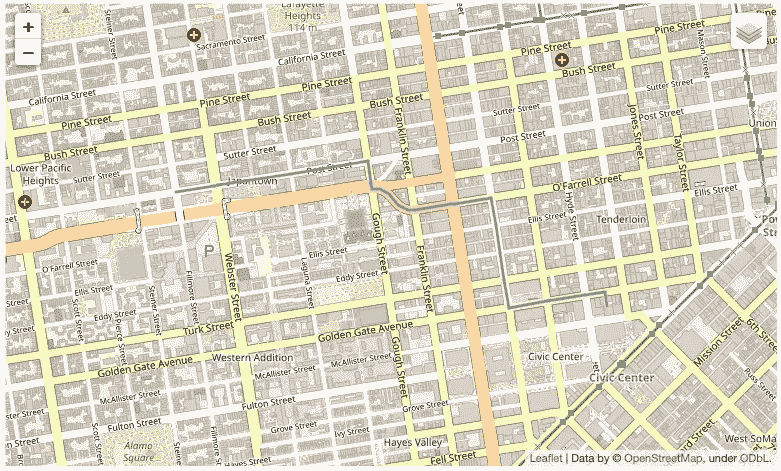
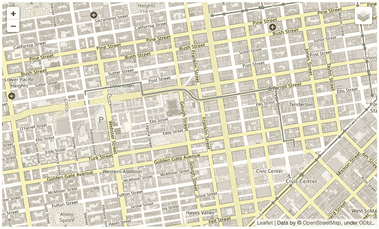
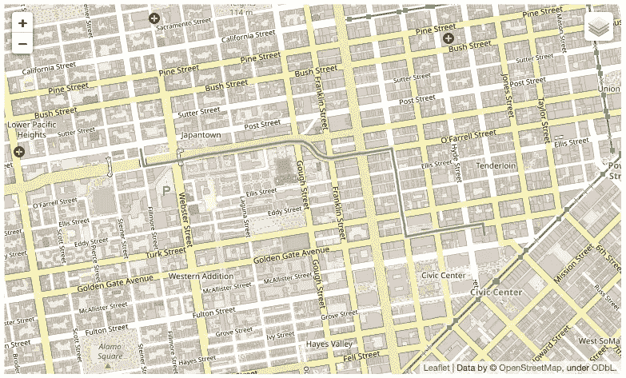
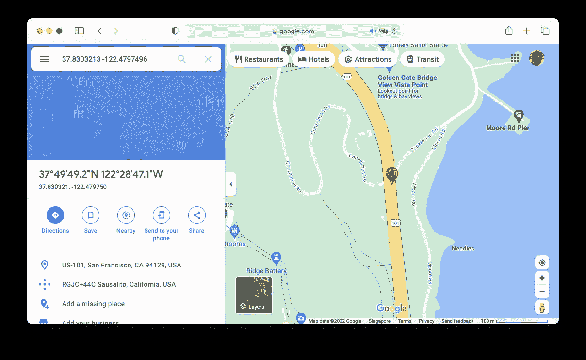
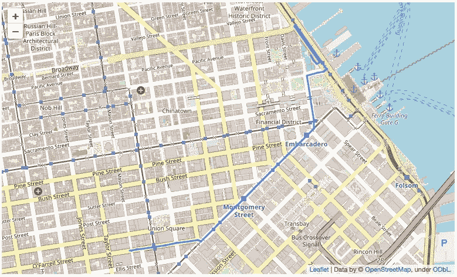
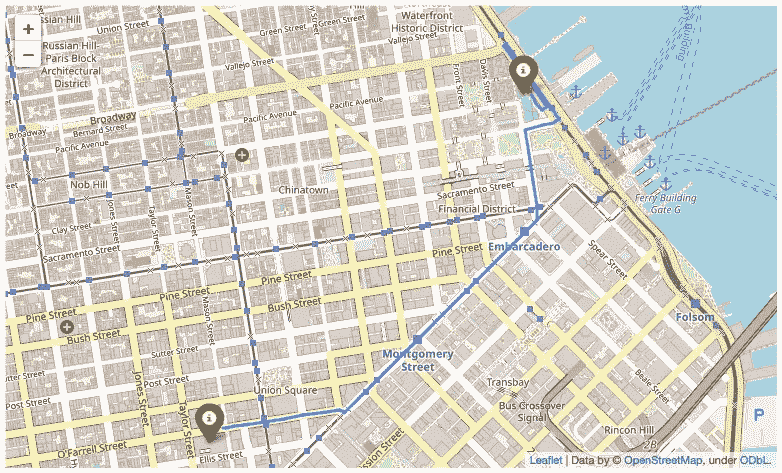
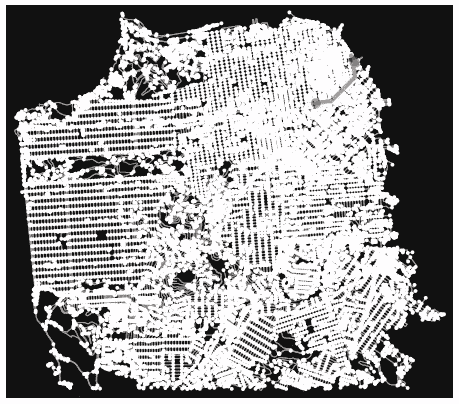

# Python 中的可视化:寻找点与点之间的路径

> 原文：<https://towardsdatascience.com/visualization-in-python-finding-routes-between-points-2d97d4881996>

## 了解如何对您的位置进行地理编码，并根据距离、出行模式和时间计算两点之间的最短路径


蒂莫·维林克在 [Unsplash](https://unsplash.com?utm_source=medium&utm_medium=referral) 上的照片

在我的上一篇文章中，我谈到了使用 leav 库可视化您的地理空间数据。

[](/visualization-in-python-visualizing-geospatial-data-122bf85d128f)  

开发人员经常必须使用地理空间数据执行的另一项任务是绘制各种兴趣点之间的路由路径。因此，在这篇文章中，我将向您展示如何:

*   对您的位置进行地理编码
*   查找两个位置之间的最短距离

# 安装 OSMnx

布线的第一步是安装 **OSMnx** 包。

> **OSMnx** 是一个 Python 包，允许您从 OpenStreetMap 下载地理空间数据，并对现实世界的街道网络和任何其他地理空间几何图形进行建模、投影、可视化和分析。

安装 OSMnx 包有点棘手——在执行通常的`pip/conda install`之前，您必须使用以下步骤:

```
$ **conda config --prepend channels conda-forge**
$ conda install osmnx
```

> 注意:如果`conda install osmnx`失效，使用`pip install osmnx`

一旦执行了上述步骤，OSMnx 现在应该可以使用了。

# 寻找最短的路线

您现在可以使用 **OSMnx** 包和 **NetworkX** 包来查找两点之间的路线。

> NetworkX 是一个 Python 包，用于创建、操作和研究复杂网络的结构、动态和功能。

以下代码片段查找旧金山两个地点之间的最短步行距离:

> **以下代码已更新，可使用最新版本的 OSMnx (1.3.0)**

```
import osmnx as ox
import networkx as nxox.settings.log_console=True
ox.settings.use_cache=True**# define the start and end locations in latlng**
start_latlng = (37.78497,-122.43327)
end_latlng = (37.78071,-122.41445)**# location where you want to find your route**
place     = 'San Francisco, California, United States'**# find shortest route based on the mode of travel**
mode      = 'walk'        # 'drive', 'bike', 'walk'**# find shortest path based on distance or time**
optimizer = 'time'        # 'length','time'**# create graph from OSM within the boundaries of some 
# geocodable place(s)**
graph = ox.graph_from_place(place, network_type = mode)**# find the nearest node to the start location**
orig_node = ox.distance.nearest_nodes(graph, start_latlng[1],
                                      start_latlng[0])**# find the nearest node to the end location**
dest_node = ox.distance.nearest_nodes(graph, end_latlng[1],
                                      end_latlng[0])**#  find the shortest path**
shortest_route = nx.shortest_path(graph,
                                  orig_node,
                                  dest_node,
                                  weight=optimizer)
```

> 寻找最短路径的默认方法是“`dijkstra`”。您可以通过将`shortest_path()`功能的`method`参数设置为“`bellman-ford`”来进行更改。

`shortest_route`变量现在保存了在最短的*时间内*从一点走到另一点的*路径的集合:*

```
[5287124093,
 65314192,
 258759765,
 65314189,
 5429032435,
 65303568,
 65292734,
 65303566,
 2220968863,
 4014319583,
 65303561,
 65303560,
 4759501665,
 65303559,
 258758548,
 4759501667,
 65303556,
 65303554,
 65281835,
 65303553,
 65303552,
 65314163,
 65334128,
 65317951,
 65333826,
 65362158,
 65362154,
 5429620634,
 65308268,
 4064226224,
 7240837048,
 65352325,
 7240837026,
 7240837027]
```

# 绘制路径

显然，拥有一个路径列表本身并没有多大用处。解释结果的更有意义的方法是使用`plot_route_folium()`函数绘制路径:

```
shortest_route_map = ox.**plot_route_folium**(graph, shortest_route)
shortest_route_map
```

`plot_route_folium()`函数返回一个树叶地图(`folium.folium.Map`)。当显示在 Jupyter 笔记本上时，它看起来是这样的:



作者图片

使用的默认 tileset 是`cartodbpositron`。如果您想要更改它，您可以将`tiles`参数设置为您想要使用的 tileset。以下代码片段显示了使用`openstreetmap` tileset 显示的地图:

```
shortest_route_map = ox.plot_route_folium(graph, shortest_route, 
                                          **tiles='openstreetmap'**)
shortest_route_map
```

以下是使用`openstreetmap` tileset 显示的地图:



作者图片

如果您想让用户在运行时选择他们的首选 tileset，请使用下面的代码片段:

```
import foliumfolium.TileLayer('openstreetmap').add_to(shortest_route_map)
folium.TileLayer('Stamen Terrain').add_to(shortest_route_map)
folium.TileLayer('Stamen Toner').add_to(shortest_route_map)
folium.TileLayer('Stamen Water Color').add_to(shortest_route_map)
folium.TileLayer('cartodbpositron').add_to(shortest_route_map)
folium.TileLayer('cartodbdark_matter').add_to(shortest_route_map)folium.LayerControl().add_to(shortest_route_map)shortest_route_map
```

用户现在可以选择自己的 tileset 来显示地图:



作者图片

# 改变出行模式和优化器

除了寻找步行的最短路径，您还可以绘制驾驶的最短路径:

```
# find shortest route based on the mode of travel
mode      = '**drive**'       # 'drive', 'bike', 'walk'# find shortest path based on distance or time
optimizer = 'time'        # 'length','time'
```

以下是驾驶路径:



作者图片

骑自行车怎么样？

```
# find shortest route based on the mode of travel
mode      = '**bike**'       # 'drive', 'bike', 'walk'# find shortest path based on distance or time
optimizer = 'time'       # 'length','time'
```

这里是骑自行车的最短路径:



作者图片

您还可以根据距离而不是时间来查找最短路径:

```
# find shortest route based on the mode of travel
mode      = 'bike'       # 'drive', 'bike', 'walk'# find shortest path based on distance or time
optimizer = '**length**'     # 'length','time'
```

这是骑自行车的最短距离:



作者图片

我会把剩下的组合留给你去尝试。

# 地理编码您的位置

在两点之间查找路径时，指定位置的纬度和经度并不方便(除非您的数据集中已经有了坐标)。相反，指定它们的友好名称要容易得多。您实际上可以使用 **geopy** 模块来执行这个步骤(称为*地理编码*)。

> **地理编码**是将地址转换成其坐标的过程。**反向地理编码**则是将一对坐标变成一个友好的地址。

要安装 **geopy** 模块，在终端中键入以下命令:

```
$ **pip install geopy**
```

以下代码片段为 OpenStreetMap 数据创建了一个`Nominatim`地理编码器类的实例。然后它调用`geocode()`方法对*金门大桥*的位置进行地理编码。使用地理编码位置，您现在可以提取位置的纬度和经度:

```
from geopy.geocoders import Nominatimlocator = Nominatim(user_agent = "myapp")
location = locator.geocode("Golden Gate Bridge")print(location.latitude, location.longitude)
# 37.8303213 -122.4797496print(location.point)
# 37 49m 49.1567s N, 122 28m 47.0986s Wprint(type(location.point))
# <class 'geopy.point.Point'>
```

你可以到[https://www.google.com/maps](https://www.google.com/maps)验证结果，并将经纬度粘贴到搜索框中:



作者图片

现在让我们修改我们的原始代码，以便我们可以对起点和终点进行地理编码:

> **以下代码已更新，可使用最新版本的 OSMnx (1.3.0)**

```
import osmnx as ox
import networkx as nxox.settings.log_console=True
ox.settings.use_cache=True**from geopy.geocoders import Nominatim
locator = Nominatim(user_agent = "myapp")**# define the start and end locations in latlng
**#** start_latlng = (37.78497,-122.43327)
**#** end_latlng = (37.78071,-122.41445)**start_location = "Hilton San Francisco Union Square"
end_location = "Golden Gateway Tennis & Swim Club"****# stores the start and end points as geopy.point.Point objects
start_latlng = locator.geocode(start_location).point
end_latlng = locator.geocode(end_location).point**# location where you want to find your route
place     = 'San Francisco, California, United States'# find shortest route based on the mode of travel
mode      = 'bike'       # 'drive', 'bike', 'walk'# find shortest path based on distance or time
optimizer = 'length'        # 'length','time'# create graph from OSM within the boundaries of some 
# geocodable place(s)
graph = ox.graph_from_place(place, network_type = mode)# find the nearest node to the start location
orig_node = ox.distance.nearest_nodes(graph, **start_latlng[1], 
                                      start_latlng[0]**)# find the nearest node to the end location
dest_node = ox.distance.nearest_nodes(graph, **end_latlng[1],
                                      end_latlng[0]**)...
```

> 注意，`get_nearest_node()`函数可以接受位置坐标，或者是包含纬度和经度的元组，或者是一个`geopy.point.Point`对象。

这里是从联合广场*希尔顿酒店**到旧金山*黄金门户网球&游泳俱乐部*的最短骑行距离:*

**

*作者图片*

# *显示起点和终点的标记*

*如果你能显示指示起点和终点的标记，那就更清楚了。正如我在上一篇文章中所描述的，您可以使用 follow 中的`Marker`类来显示带有弹出窗口的标记。*

*以下代码片段显示了两个标记，绿色表示起点，红色表示终点:*

```
*import folium**# Marker class only accepts coordinates in tuple form**
start_latlng = (start_latlng[0],start_latlng[1])
end_latlng   = (end_latlng[0],end_latlng[1])start_marker = folium.Marker(
            location = start_latlng,
            popup = start_location,
            icon = folium.Icon(color='green'))end_marker = folium.Marker(
            location = end_latlng,
            popup = end_location,
            icon = folium.Icon(color='red'))# add the circle marker to the map
start_marker.add_to(shortest_route_map)
end_marker.add_to(shortest_route_map)shortest_route_map*
```

> *注意`Marker`类只接受元组形式的坐标。因此，您需要修改`start_latlng`和`end_latlng`成为包含纬度和经度的元组。*

*这是指示路径起点和终点的两个标记:*

**

*作者图片*

# *绘制静态图*

*在前面的部分中，您使用了`plot_route_folium()`函数在一张树叶地图上绘制两点的最短路径:*

```
*shortest_route_map = ox.**plot_route_folium**(graph, shortest_route)
shortest_route_map*
```

*还有一个你可能会感兴趣的功能——`plot_graph_route()`。它不是输出交互式地图，而是生成静态图形。如果你想制作一个海报/图像显示两点的路径，这是很有用的。*

*以下代码片段使用上一节中使用的点生成了一个静态图:*

> ***以下代码已更新，可使用最新版本的 OSMnx (1.3.0)***

```
*import osmnx as ox
import networkx as nxox.settings.log_console=True
ox.settings.use_cache=Truegraph = ox.graph_from_place(place, network_type = mode)orig_node = ox.distance.nearest_nodes(graph, start_latlng[1],
                                      start_latlng[0])
dest_node = ox.distance.nearest_nodes(graph, end_latlng[1],
                                      end_latlng[0])shortest_route = nx.shortest_path(graph, 
                                  orig_node, 
                                  dest_node, 
                                  weight=optimizer)fig, ax = **ox.plot_graph_route**(graph,
                              shortest_route,
                              save=True)*
```

*您将看到以下输出:*

**

*作者图片*

# *摘要*

*我希望你从这篇文章中找到灵感，并开始使用它来创建兴趣点的路线。您可能希望让用户输入他们的当前位置，然后绘制路线，向他们显示如何到达目的地。无论如何，玩得开心！*

*[](https://weimenglee.medium.com/membership)  

> **参考文献**:波音，G. 2017。 [OSMnx:获取、构建、分析和可视化复杂街道网络的新方法](https://geoffboeing.com/publications/osmnx-complex-street-networks/)。*计算机、环境和城市系统* 65，126–139。doi:10.1016/j . compenurbsys . 2017 . 05 . 004*