# 用 NASA 数据和 Python 可视化不可见的 SO2

> 原文：<https://towardsdatascience.com/visualize-the-invisible-so2-with-nasa-data-and-python-2619f8ed4ea1>

## 绘制火山爆发后二氧化硫的移动。

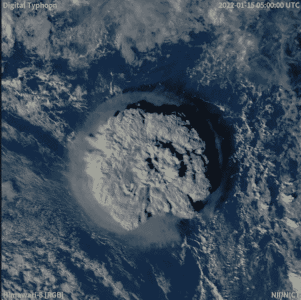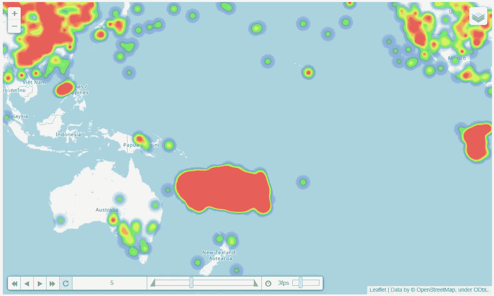

第一张图:2022 年 1 月 15 日洪加汤加-洪加 Haʻapai 火山爆发的卫星动画截图。图片来自[维基百科](https://en.wikipedia.org/wiki/2022_Hunga_Tonga%E2%80%93Hunga_Ha%27apai_eruption_and_tsunami)。第二张图片:热图显示了 1 月 17 日，也就是火山爆发几天后，SO2 的含量。使用由叶子制成的 GES 光盘中的数据。图片由作者提供。

2022 年 1 月中旬，汤加群岛的火山岛亨加汤加-亨加 Haʻapai 发生火山爆发。[一个卫星动画](https://en.wikipedia.org/wiki/2022_Hunga_Tonga%E2%80%93Hunga_Ha%27apai_eruption_and_tsunami#/media/File:Tonga_Volcano_Eruption_2022-01-15_0320Z_to_0610Z_Himawari-8_visible.gif)展示了一次巨大的爆炸，伴随着大量的烟雾。我们看到的烟雾自然包括[水蒸气、二氧化碳(CO2)、二氧化硫(SO2)和灰烬](https://eps.harvard.edu/faq/have-you-ever-wondered-what-comes-out-volcano-other-lava#:~:text=The%20%27smoke%27%20you%20see%20billowing,and%20depending%20on%20the%20volcano%29)。

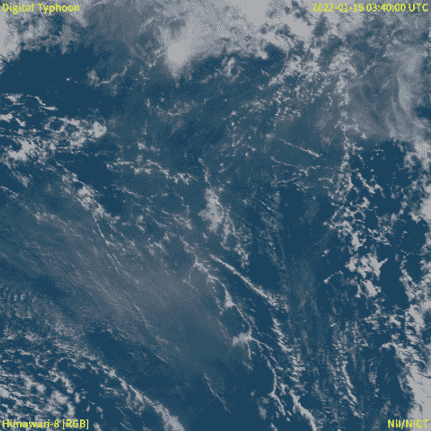

2022 年 1 月 15 日洪加汤加-洪加 Haʻapai 火山爆发的卫星动画。图片来自[维基百科](https://en.wikipedia.org/wiki/2022_Hunga_Tonga%E2%80%93Hunga_Ha%27apai_eruption_and_tsunami)

再来说说 SO2。二氧化硫被释放后，在高空转化为硫酸盐气溶胶。气溶胶能够反射阳光，使地球气候变冷，它们也是臭氧损耗的一个原因。随着大规模喷发，二氧化硫会被喷射到 10 公里以外的大气中。

然而，由于其[的不可见性](https://www.ifc.org/wps/wcm/connect/fa942b47-b7f2-421c-a48a-c3b824dfc168/HandbookSulfurOxides.pdf?MOD=AJPERES&CVID=jqeERsg#:~:text=Sulfur%20dioxide%20(SO2)%20is%20the,has%20a%20pungent%2C%20unpleasant%20odor.)，释放的 SO2 很难被观察到。

本文将展示如何用散点图和热图来可视化火山爆发后 SO2 的移动。

# 检索数据

大气成分数据，包括二氧化硫，可以从美国宇航局戈达德地球科学数据和信息服务中心( [GES 光盘](https://disc.gsfc.nasa.gov/))下载。注册后数据是公开的。

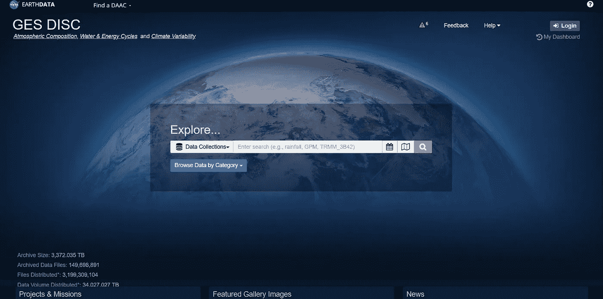

[GES 碟](https://disc.gsfc.nasa.gov/)网站

SO2 数据可通过 [OMPS_NPP_NMSO2_PCA_L2](https://docserver.gesdisc.eosdis.nasa.gov/public/project/MEaSUREs/Krotkov/README.OMPS_NPP_NMSO2_PCA_L2.v2.pdf) 数据产品获取。这是 NASA/NOAA Suomi 国家极地轨道伙伴关系(SNPP)卫星上的臭氧测绘和剖面仪套件(OMPS)天底成像仪(NM)的 2 级轨道火山和人为二氧化硫产品。

请考虑到这不是原始数据。2 级数据产品被定义为与 1 级源数据具有相同分辨率和位置的衍生地球物理变量。关于关卡的更多信息，你可以点击查看[。](https://earthdata.nasa.gov/collaborate/open-data-services-and-software/data-information-policy/data-levels)

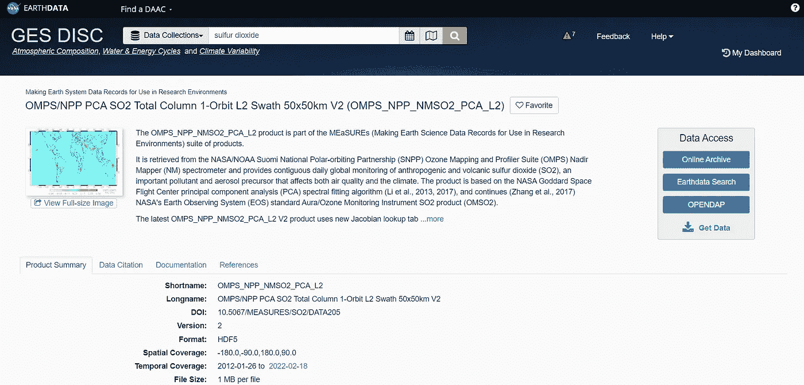

基于 PCA 算法的 OMPS 核电厂最低点映射 SO2 二级产品[页](https://disc.gsfc.nasa.gov/datasets/OMPS_NPP_NMSO2_PCA_L2_2/summary?keywords=sulfur%20dioxide)

为了从网站上获取 SO2 数据，我按照[中的有用步骤为你的下一个地理项目](/getting-nasa-data-for-your-next-geo-project-9d621243b8f3)获取 NASA 数据，这是一篇关于获取 GES 光盘数据文件的深刻文章。

由于洪加汤加-洪加 Haʻapai 火山爆发于 2022 年 1 月 15 日达到高潮，日期范围从 1 月 12 日细化到 1 月 23 日。

除了获取数据，还要下载一个文本文件(。txt)，点击*下载链接列表*。这个文本文件将帮助我们在下一步中获得文件名。

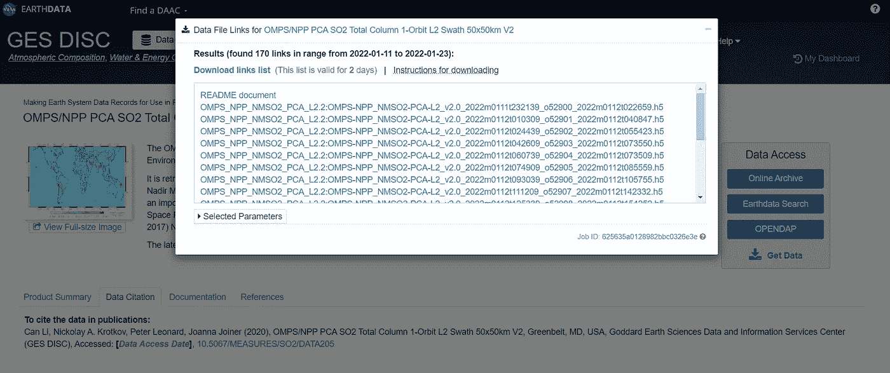

下载链接列表和数据 URL。图片来自 OMPS NPP NMSO2 PCA L2 页面。

# 输入数据

从库开始，除了 NumPy 和 Pandas，H5py 库是用来读取下载的 HDF5 文件的。

读取获得的文本文件(。txt)来获取文件名。

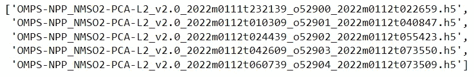

文本文件中的文件名示例

下面的代码展示了如何用 H5py 从文件名中读取文件。读取后，数据将保存在一个列表中。

# 选择键

HDF5 格式内部包含许多密钥。我们需要浏览数据来选择我们要使用的键。本文使用的两个主要关键字是 GEOLOCATION_DATA 和 SCIENCE_DATA。

```
list(dataset[0].keys())### Output: 
# ['ANCILLARY_DATA', 
# 'GEOLOCATION_DATA', 
# 'SCIENCE_DATA', 
# ...
```

GEOLOCATION_DATA:纬度、经度和 UTC_CCSDS_A。

```
list(dataset[0]['GEOLOCATION_DATA'].keys()) ### Output: 
#['Latitude', 
# 'LatitudeCorner', 
# 'Longitude', 
# ... 
# 'UTC_CCSDS_A', 
# ...
```

SCIENCE_DATA: ColumnAmountSO2，以 [Dobson 单位](https://en.wikipedia.org/wiki/Dobson_unit)表示的垂直列 SO2 总量。

```
list(dataset[0]['SCIENCE_DATA'].keys())### Output: 
# ... 
# 'ColumnAmountSO2', 
# ...
```

数据集内部还包含其他有趣的键。更多信息，官网提供了解释其他键[的 PDF 文件这里](https://docserver.gesdisc.eosdis.nasa.gov/public/project/MEaSUREs/Krotkov/README.OMPS_NPP_NMSO2_PCA_L2.v2.pdf)。

# 创建数据框架

现在我们已经选择了键，让我们定义一个函数来提取数据。

创建纬度、经度、二氧化硫含量和日期的列表。

在绘制散点图之前，我们必须转换经度范围。这是因为典型地图的经度范围，包括来自 GES 圆盘的数据，在-180°和 180°之间。

如果我们直接绘制位于经度-175.4°的亨加汤加-亨加 Haʻapai 的位置，SO2 的移动将由于靠近范围的极限(-180°)而被切断。下面的代码用于修改经度范围。

从列表中创建一个熊猫数据框。

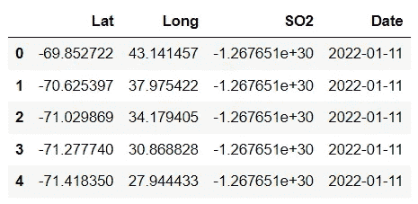

# 描述性分析

开始的一个重要步骤是做描述性分析。这是帮助我们理解数据的有用的一步。

要查看火山周围每天的 SO2 量，我们将创建一个过滤数据框，仅选择距离喷发点 15 度经纬度的正方形区域内的 SO2 量。我们还将只选择 SO2 值为正值的行。

按日期对过滤后的数据帧进行分组，并对 SO2 的日总量进行求和。

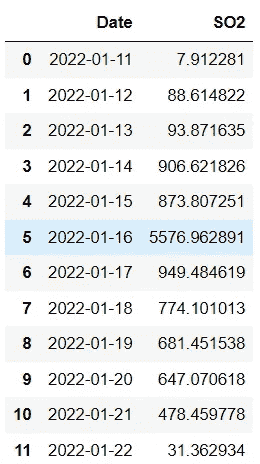

上表显示，SO2 日排放量在 1 月 16 日达到最大值。

从数据帧中绘制时间序列折线图，以查看时间线中的进度。

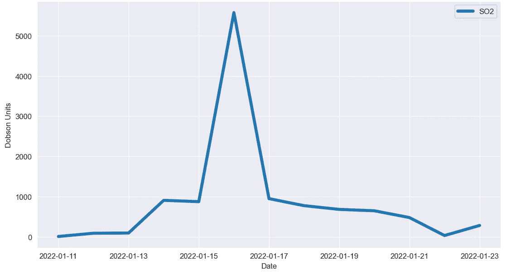

匈牙利汤加-匈牙利 Haʻapai 周围的 SO2 日排放量

图表显示，爆炸发生时，从 15 日到 1 月 16 日，该岛周围的二氧化硫急剧增加。

# 形象化

## 1.散点图

利用纬度和经度，SO2 的位置被绘制为点，根据位置和密度分别用颜色表示。

首先创建一个日期列表来过滤数据框架。仅选择 SO2 含量大于 0.5 DU 的行，以避免绘制时数据过多。

现在我们已经做了所有的事情，作为一个例子，我将展示 1 月 17 日，也就是火山爆发几天后，SO2 含量的散点图。

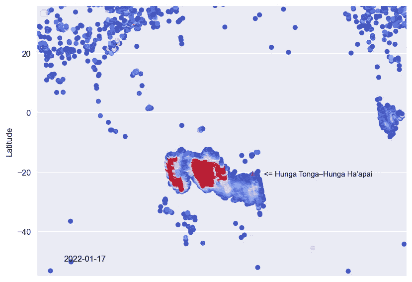

散点图显示了 1 月 17 日的二氧化硫含量。数据来自 GES 光盘。用 Seaborn 做的。图片由作者提供。

制作动画是为了让可视化看起来有趣。我们可以把这些日常的情节组合成一个 GIF 文件来看进度。为此，我们将绘制每个日散点图，并将它们存储在一个列表中。

组合这些图，并把它们转换成 GIF 文件。

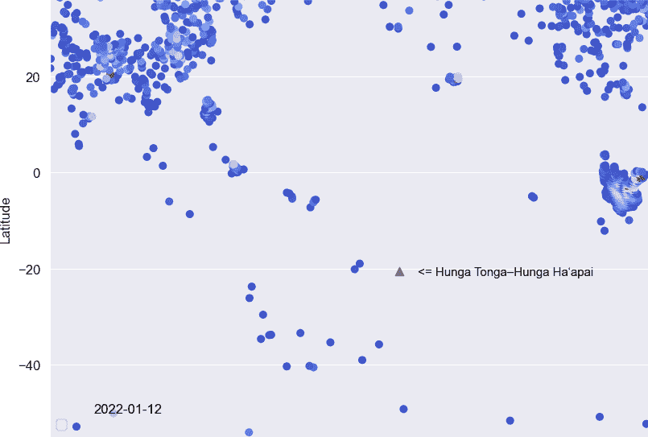

洪加汤加-洪加 Haʻapai 火山爆发后 SO2 的移动。数据来自 GES 光盘。图片由作者提供。

## 2.热图

yellow 是一个 Python 库，易于使用，功能强大，可以处理地理空间数据。从导入库开始。

例如，我将展示如何绘制 1 月 17 日 SO2 的热图。

为了使用叶子，我们需要从数据帧中创建一个纬度、经度和二氧化硫含量的列表。然后，使用[热图](https://python-visualization.github.io/folium/plugins.html)功能创建热图。

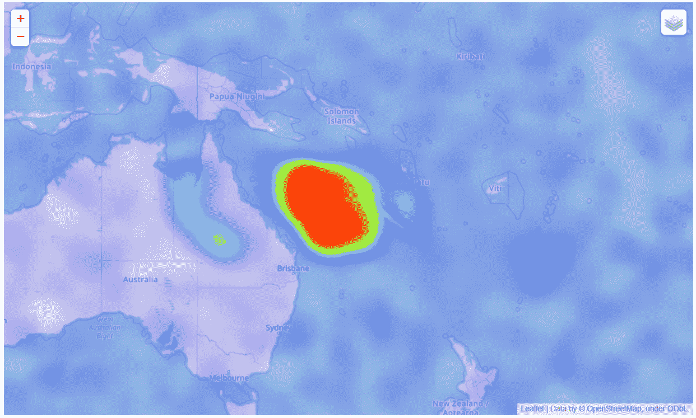

这张热图显示了 2022 年 1 月 17 日的二氧化硫含量。用叶子做的。数据来自 GES 光盘。图片由作者提供。

## 随时间变化的热图

Heat 有一个名为 [HeatMapWithTime](https://python-visualization.github.io/folium/plugins.html) 的功能，用于制作时间序列热图。这对于创建 SO2 运动的动画非常有用。

瞧啊。！…

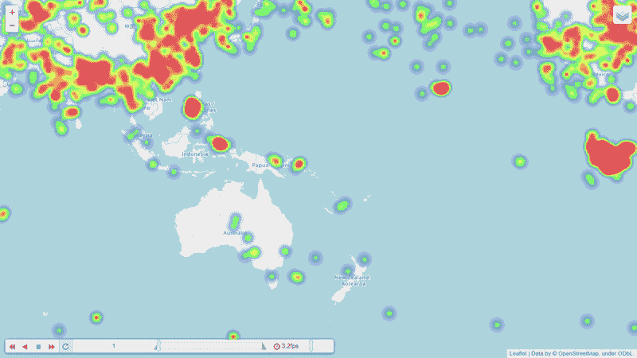

洪加汤加-洪加 Haʻapai.火山爆发后 SO2 的移动用叶子做的。数据来自 GES 光盘。图片由作者提供。

## 讨论

据[消息](https://www.bbc.com/news/world-asia-60106981)2022 年 1 月 15 日喷发达到高潮，之后趋于平静。然而，用 OMPS_NPP_NMSO2_PCA_L2 数据(这是一个 2 级产品)进行可视化显示，释放的 SO2 仍然在空气中保留了一个多星期。

结果与有毒物质和疾病登记机构(ATSDR)的信息一致，即 SO2 的大气寿命约为 [10 天](https://www.atsdr.cdc.gov/toxprofiles/tp116-c5.pdf)。

## 摘要

尽管用肉眼很难观察到二氧化硫，但我们可以使用 Python 和美国宇航局的数据来绘制二氧化硫释放后的移动情况。本文展示了数据的来源以及如何下载和可视化它们。

正如我在探索数据步骤中提到的，HDF5 文件中还有其他键。你可以回去和其他人一起玩。如果任何人有问题或建议，请随时留下评论。

这些是关于数据可视化的其他文章，您可能会感兴趣。

*   8 用 Python 处理多个时序数据的可视化([链接](/8-visualizations-with-python-to-handle-multiple-time-series-data-19b5b2e66dd0))
*   用 Python 可视化光速([链接](/visualizing-the-speed-of-light-in-the-solar-system-with-python-fa9ead33ac86))
*   用 Python 分 4 步进行图像颜色提取([链接](/image-color-extraction-with-python-in-4-steps-8d9370d9216e))

## 参考

*   李灿、Nickolay A. Krotkov、Peter Leonard、Joanna Joiner (2020 年)、OMPS/NPP 五氯苯甲醚 SO2 总列 1-轨道 L2 条带 50x50km V2，美国马里兰州格林贝尔特，戈达德地球科学数据和信息服务中心(GES 光盘)，访问日期:2022 年 3 月 19 日，10.5067/MEASURES/SO2/DATA205
*   Bhanot，K. (2020 年 8 月 12 日)。为你的下一个地理项目获取 NASA 数据。中等。2022 年 4 月 12 日检索，来自[https://towards data science . com/getting-NASA-data-for-your-next-geo-project-9d 621243 b8 F3](/getting-nasa-data-for-your-next-geo-project-9d621243b8f3)
*   Python 可视化。(2020).叶子。从 https://python-visualization.github.io/folium[取回](https://python-visualization.github.io/folium/)
*   有毒物质和疾病登记处。1998.二氧化硫的毒理学简介。佐治亚州亚特兰大:美国卫生与公众服务部，公共健康服务。