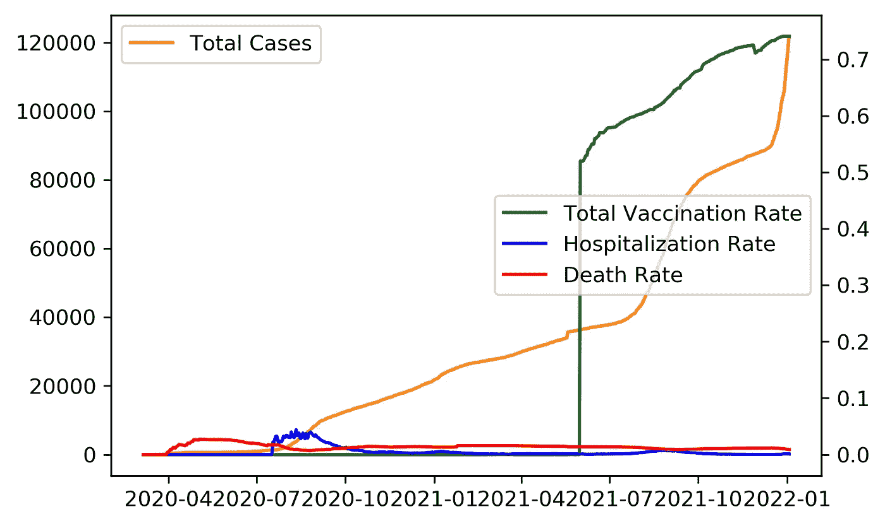
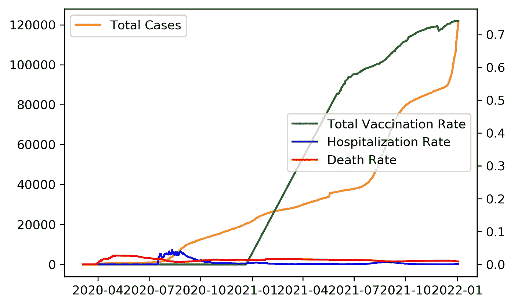
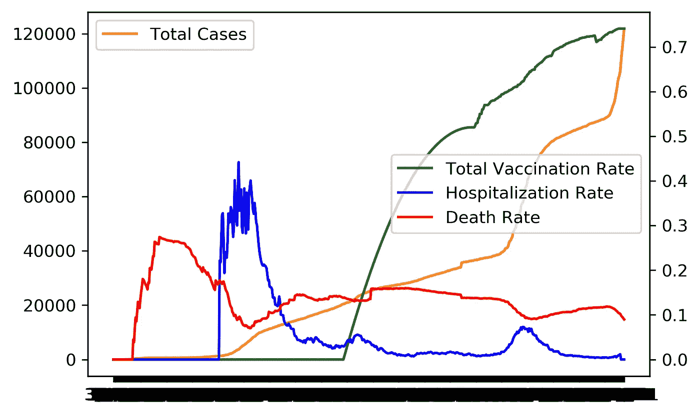
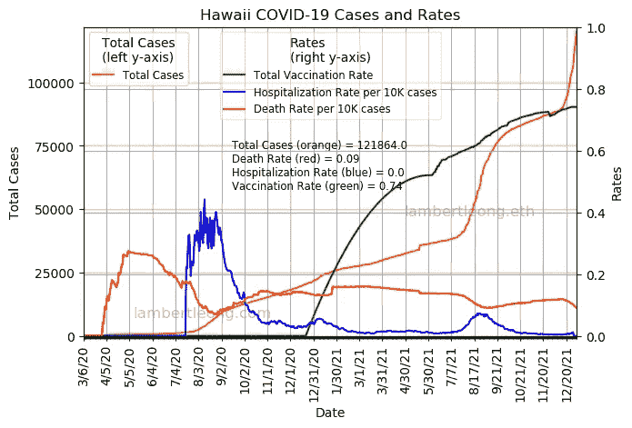
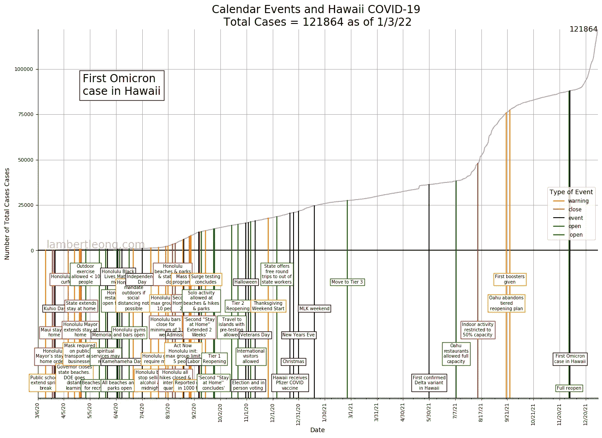
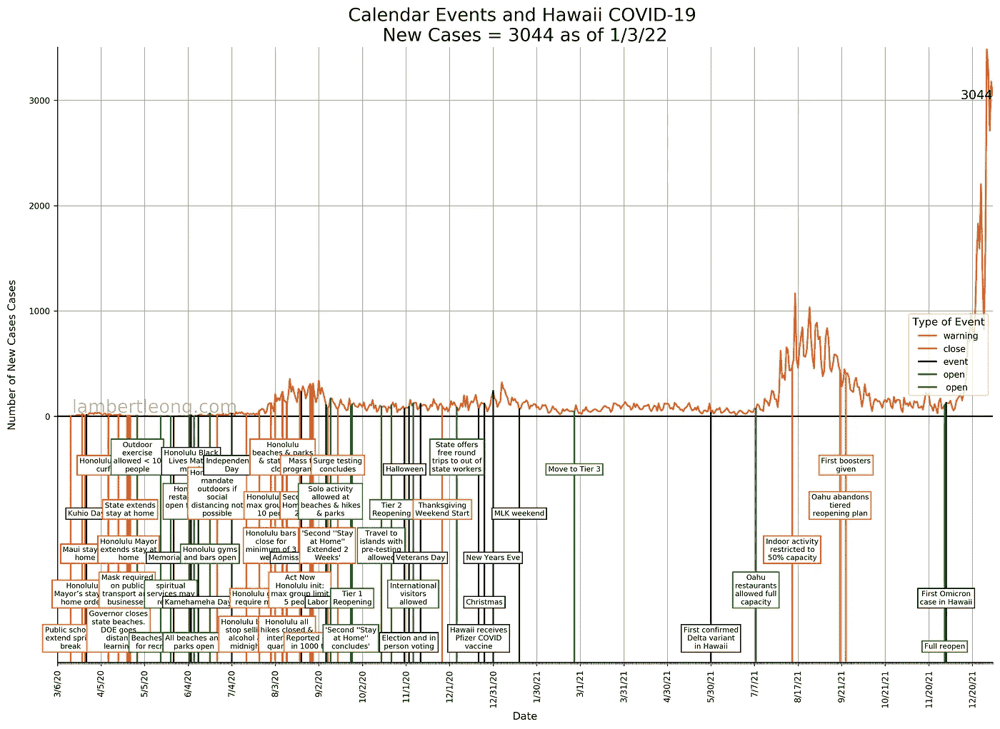

# 可视化两年的新冠肺炎在夏威夷与动画情节

> 原文：<https://towardsdatascience.com/visualizing-2-years-of-covid-19-in-hawaii-with-animated-plots-579c8570e7f>

## Python 可视化

## 动画图是强大的数据科学工具，我们将以夏威夷 COVID 数据为例向您展示如何制作动画图

你可以在这篇文章的结尾做这些(视频由作者提供)

**学习目标**

1.  构建动画情节[(如上图)](https://youtu.be/i6AgSlM40vc)可以提供额外维度的信息
2.  使用真实数据并学习清理数据的策略，以适应您的分析
3.  将领域知识和相关事件整合到您的时间序列数据分析中
4.  [本作品基于此处发表的原创作品](https://www.lambertleong.com/thoughts/hawaii-covid19-timeline)

[接着在 Github 上下载笔记本](https://github.com/LambertLeong/animated_hawaii_COVID_plots)

**为什么是夏威夷**

美国各州实施了自己的策略来应对新型冠状病毒(新冠肺炎)疫情。夏威夷是独一无二的，因为它是唯一一个不能被从另一个州赶到的州。因此，人们只能坐飞机或坐船去夏威夷，很少有人坐船去。由于夏威夷州地处偏远，人们大多乘飞机抵达，因此这为研究 COVID 疫情的影响提供了一个有趣的案例。此外，我来自夏威夷，一直关注当地与群岛上的 COVID 情况相关的时事。

你也可以制作这样的动画(作者的视频)

**动画剧情**

数据可视化是数据科学的重要组成部分，有助于深入了解感兴趣的数据。动画图(见上文)建立在标准可视化的基础上，在试图理解变化时很有帮助，尤其是时间序列数据。在这里，我们将查看来自夏威夷的 COVID 数据，希望这些动画能够阐明一些模式，如事件的起因、强制措施的影响、死亡和住院趋势等。虽然我有生物学背景，并且是夏威夷大学癌症中心流行病学系的一员，但我计划对所展示的结果提供一点解释，因为这篇文章的重点是可视化。此外，如果你的数据可视化足够好，那么解释应该是容易的，明显的，几乎是微不足道的。

**数据集**

当我开始这个项目时(2020 年疫情 6 个月后)，我使用了夏威夷州提供的公共数据。数据来自[夏威夷数据合作](https://www.hawaiidata.org/covid19)，数据被输入到[的谷歌表单](https://docs.google.com/spreadsheets/d/1z5U88_NVC84CB4kPyNbp5wy6liUyA2T9iPqmHfFpjr4/edit?usp=sharing) [1]，所有这些都在公共领域。该数据包含总病例、新病例、住院和疫苗数据等信息。作为一名消息灵通的夏威夷居民，我拥有可以告知我数据当前状态的知识。例如，在整个疫情，州卫生部一直超负荷工作，资金不足，人员流动率很高。结果，数据的收集和维护变得很困难，数据的状态，用一个更好的词来说，有点混乱。这些问题并不是这种情况下独有的，并且一直在发生，但幸运的是，有许多方法可以处理现实世界中可能并不完美的数据。我们将讨论一些数据清理的方法。

为了更好地了解夏威夷的 COVID 情况，我认为查看当前相关事件的趋势会很方便。因此，我收集了与 COVID 情况相关的事件数据，可在以下链接中找到:[事件数据](https://www.lambertleong.com/assets/docs/data/hawaii_covid_events_JAN22.csv)。在这些数据中，存在对层的引用，而这些层是檀香山市(夏威夷最大的县)为控制 COVID 情况而尝试实施的策略的一部分。有关各层的更多信息，请参见[这里的](https://www.lambertleong.com/assets/docs/data/2010105-CCH_Honolulus-COVID-19-Reopening-Framework-distribution-signed.pdf)。

现在我们已经对数据有了一个简单的概述，我们来做一些图吧！

我们导入一些模块开始吧！

```
import os, sys, time, math, random, imageio
from datetime import datetime### data science essen ###
import numpy as np
import pandas as pd
import matplotlib.pyplot as plt
import matplotlib as mpl
import matplotlib.gridspec as gridspec
from pylab import *
from scipy import ndimage, misc
import seaborn as sns
from matplotlib import collections as matcoll
import textwrap
import matplotlib.dates as dates### for streaming from google sheet ###
import gspread
from oauth2client.service_account import ServiceAccountCredentialsimport multiprocessing
from multiprocessing import Pool### set dots per square inch (dpi) for plots ###
mpl.rcParams['figure.dpi'] = 300
```

下面的代码用于直接从 google sheet 流式传输数据。要访问这些数据，您需要设置自己的身份验证令牌。设置这一点超出了本文的范围，但是代码是为那些已经设置了 api 的人准备的。

```
### Stream directly from google sheet ###
'''
scope = ['[https://spreadsheets.google.com/feeds'](https://spreadsheets.google.com/feeds')]
credentials = ServiceAccountCredentials.from_json_keyfile_name('./hawaii-covid-timeline-48aab0d374b0.json', scope)
gc = gspread.authorize(credentials)
spreadsheet_key = #TODO: get your key
worksheet = book.worksheet("COVID Data")
table = worksheet.get_all_values()##Convert table data into a dataframe
df = pd.DataFrame(table[1:], columns=table[0])##Convert number strings to floats and ints
df = df.apply(pd.to_numeric, errors='ignore')
df.head()
'''
```

该链接会将您带到一个 google 表单，可以以 csv 文件的形式下载。下面的代码假设您已经这样做了。如果您遵循 git repo，那么数据应该已经在那里了。

```
### Reade Hawaii Covid Data ###
### access and download at [https://docs.google.com/spreadsheets/d/1z5U88_NVC84CB4kPyNbp5wy6liUyA2T9iPqmHfFpjr4/edit?usp=sharing](https://docs.google.com/spreadsheets/d/1z5U88_NVC84CB4kPyNbp5wy6liUyA2T9iPqmHfFpjr4/edit?usp=sharing)
raw_data = pd.ExcelFile('Hawaii_Data_Collaborative_COVID_Dashboard_Data.xlsx')
print(raw_data.sheet_names)
df = raw_data.parse("COVID Data")
vax = raw_data.parse("DOH Vaccination Data")
hos = raw_data.parse("Hospital Data")### Read in timeline data by Lambert Leong ###
### download at [https://www.lambertleong.com/assets/docs/data/hawaii_covid_events_JAN22.csv'###](https://www.lambertleong.com/assets/docs/data/hawaii_covid_events_JAN22.csv'###)
events=pd.read_csv('[https://www.lambertleong.com/assets/docs/data/hawaii_covid_events_JAN22.csv'](https://www.lambertleong.com/assets/docs/data/hawaii_covid_events_JAN22.csv'))
```

数据表包含整个州的数据以及夏威夷州内每个县的数据。第一行代码解析出除了整个州的数据之外的所有数据。疫情进行到一半时，管理数据的小组从将总病例数输入“确诊病例”字段切换到“总病例”字段。转换的确切时间还不知道，但是为了这篇文章，我们选择了 2021 年 5 月 18 日。下面的代码还将病例表与住院和疫苗表合并。

```
### grab state totals ###
sdf=df[df['Region']=='State']### State started filling out 'Confirmed Cases' col then switched to 'Total Cases' ###
### We need to merge them ###
full_cc=sdf[sdf['Confirmed Cases'].notnull()]
full_tc=sdf[sdf['Total Cases'].notnull()]
old_data=sdf[sdf['Date']<='2021-05-18']
new_data=sdf[sdf['Date']>'2021-05-18']### merge ###
old_data['total_cases']=old_data['Confirmed Cases'].astype('float64')
new_data['total_cases']=new_data['Total Cases']
old_data['new_cases']=old_data['New Confirmed Cases'].astype('float64')
new_data['new_cases']=new_data['New Cases']### merge data and drop any duplicate rows ###
clean=old_data.append(new_data)
clean.drop_duplicates(subset=None,keep = 'first', inplace = True)### merge case data with vaccine data ###
clean_vax=pd.merge(clean, vax.iloc[:,:2], on='Date', how='left')
clean_vax=pd.merge(clean_vax, hos.iloc[:,:-1], on='Date', how='left')
```

由于我们将在接下来的几个编码部分清理数据，我们需要一种可视化结果的方法。下面是一个带有两个 y 轴的快速绘图函数，我们将调用它几次来查看我们对数据的更新。在下面的函数中，我们还计算了住院率和死亡率，方法是将当天的住院和死亡总数除以当天的病例总数。

```
### Lets make a quick plotting function for the next few concepts ###
def quick_plot(test: pd.DataFrame, scale: float=1) -> None:
    ### Lets create fields we are interested in ###
    test['vax_rate']=test['Value']
    test['death_rate']=test['Deaths_Tot']/test['total_cases']*scale
    test['hospital_rate']=test['Active Hospitalized']/test['total_cases']*scale ### lets look at the data ###
    fig, ax = plt.subplots()
    #fig.set_size_inches(xsize, ysize)
    ax2 = ax.twinx()
    ### plot data by date ###
    dates, cases, deaths =   test['Date'],test['total_cases'],test['death_rate']
    vax, hos = test['vax_rate'],test['hospital_rate']
    ax.plot_date(dates,cases, ls='-',marker='',color='darkorange',label='Total Cases')   
    ax2.plot_date(dates,vax, ls='-',marker='',color='g',label='Total Vaccination Rate')
    ax2.plot_date(dates,hos, ls='-',marker='',color='b',label='Hospitalization Rate')
    ax2.plot_date(dates,deaths, ls='-',marker='',color='r',label='Death Rate')
    ax.legend(loc=2)
    ax2.legend(loc=7)
    plt.close()return fig
```

数据包含空白单元格，当我们将数据导入数据框架时，pandas 会将这些值读取为 nan 或 Nan。我们使用“fillna()”函数用零填充这些空白，以便列中的所有数据都是数字数据类型(即 int、float 等)。我们调用我们制作的绘图函数来第一次查看数据。

```
test=clean_vax.copy(deep=True)
### lets fill nan values with zeros ###
test=test.fillna(0)first_pass=quick_plot(test)
first_pass#.savefig('covid_caseVrate_init.png', dpi=300, bbox_inches='tight')
```


(图片由作者提供)

上面的图告诉我们，我们有两个问题。第一个问题与 Nan 值有关，以及我们如何盲目地用零填充它们。盲目地用零填充 Nan 产生了速率的极端变化，如绿色图中的锯齿状图案所示。第二个问题与红蓝图或死亡率和住院率图的比例有关。我们通过使用插值函数来解决第一个问题，该函数可以用更接近缺失值的更真实的值来填充 Nan 值。下面的代码处理插值。

```
test=clean_vax.copy(deep=True)
### interpolate ###
test=test.interpolate()
test=test.fillna(0)
interopl=quick_plot(test)
interopl
```



(图片由作者提供)

正如你所看到的(上图),锯齿图案已经被插值函数修复了。然而，仍然有一条陡峭的垂直绿线表明疫苗接种率在一天之内从零上升到 50%。这是不现实的，因为初始值之前的所有值都是空的或 Nan。虽然我们不知道垂直绿线之前的确切疫苗接种率，但事件数据告诉我们夏威夷何时接种了疫苗。我们可以用那个日期推断出一个更[https://docs . Google . com/spreadsheets/d/1 z5u 88 _ NVC 84 C4 B4 kpynbp 5 wy 6 liuya 2t 9 ipqmhffpjr 4/edit？usp =共享](https://docs.google.com/spreadsheets/d/1z5U88_NVC84CB4kPyNbp5wy6liUyA2T9iPqmHfFpjr4/edit?usp=sharing)
raw_data = pd。excel file(' Hawaii _ Data _ Collaborative _ COVID _ Dashboard _ Data . xlsx ')
print(raw _ Data . sheet _ names)
df = raw _ Data . parse(" COVID Data ")
VAX = raw _ Data . parse(" DOH 疫苗接种数据")
hos = raw_data.parse("医院数据")
###读入时间轴数据作者 Lambert Leong # # # #
# # #下载于[https://www . Lambert Leong . com/assets/docs/Data 下面的代码就是这么做的。](https://www.lambertleong.com/assets/docs/data/hawaii_covid_events_JAN22.csv'###)

```
### find when the vaccines got to the islands and set that point to zero ###
start_vax=events[events['Event'].str.contains('vaccine')]['Date'].values[0]
test=clean_vax.copy(deep=True)
test['Value'][test[test.Date==start_vax].index[0]]=0
### interpolate ###
test=test.interpolate()
test=test.fillna(0)fix_vax=quick_plot(test)
fix_vax#.savefig('covid_caseVrate_iterpol.png', dpi=300, bbox_inches='tight')
```



(图片由作者提供)

如你所见，从疫苗到达夏威夷开始，垂直的绿线逐渐增加。这是一个例子，说明了如何使用相关的外部数据来进行数据分析或解释。我们没有指定什么函数，我们想使用插值和默认是线性的，因此，直线。从能量消耗到酶动力学，在生物学中经常观察到 sigmoid 曲线。疫苗接种率也可能遵循 s 形曲线。然而，据我所知，这个函数没有内置 sigmoid 插值。下一个最好的方法是使用二次函数。毕竟曲速行动是一件事，有一个尽快接种疫苗的推动，这可以反映二次率。我们使用下一个代码片段来获得更真实的插值曲线。

我们还用下面的代码解决了第二个问题。第二个问题与蓝色和红色曲线的分辨率有关。利率很低，很难看到。我们将比率乘以 10，以便它与疫苗比率更加一致。通过将比率乘以 10，我们可以有效地计算出每 10，000 个案例的比率，因为在上述比率计算中用作分母的总案例数以千计。我们将值 10 传递给 plot 函数，以指示比例的变化。

```
### find when the vaccines got to the islands and set that point to zero ###
start_vax=events[events['Event'].str.contains('vaccine')]['Date'].values[0]
test=clean_vax.copy(deep=True)
test['Value'][test[test.Date==start_vax].index[0]]=0
### interpolate ###
'''
sigmoid curve is more realistic for vaccine rate but since there is not a good way to
model quickely, we settle for a quadratic interpolation.
'''
test=test.interpolate(method='quadratic',limit_direction='forward')
test=test.fillna(0)

fix_scale=quick_plot(test,10)
fix_scale#.savefig('covid_caseVrate_fixed.png', dpi=300, bbox_inches='tight')
```



(图片由作者提供)

现在一切看起来都应该如此。只有图例需要更新，以反映死亡率和住院率的比例变化。

接下来，我们将案例数据与事件数据合并，以创建一个主数据表，用于下面的动画。我们通过用斜线代替破折号来调整数据时间字符串，使其在图上更加简洁易读。

```
### merge case data with vaccine data ###
clean_vax=pd.merge(clean, vax.iloc[:,:2], on='Date', how='left')
clean_vax=pd.merge(clean_vax, hos.iloc[:,:-1], on='Date', how='left')

### find when the vaccines got to the islands and set that point to zero ###
start_vax=events[events['Event'].str.contains('vaccine')]['Date'].values[0]
clean_vax['Value'][clean_vax[clean_vax.Date==start_vax].index[0]]=0
### handleing trailing NaN ###
max_vax=clean_vax.Value.idxmax()
clean_vax.Value[max_vax:]=clean_vax.Value.max()
### interpolate ###
clean_vax=clean_vax.interpolate(method='quadratic',limit_direction='forward')
clean_vax=clean_vax.fillna(0)
### clean date strings for presentation ###
clean_vax.Date=clean_vax['Date'].dt.strftime('%-m/%-d/%y')
### merge with events ###
full=pd.merge(clean_vax,events, how='left', on='Date')### create fields we want###
full['vax_rate']=full['Value']
full['death_rate']=full['Deaths_Tot']/full['total_cases']*10
full['hospital_rate']=full['Active Hospitalized']/full['total_cases']*10full.death_rate.max(), full.total_cases.max()/10, full.hospital_rate.max()
```

我们有完全合并的数据，我们可以使用新的 2 轴绘图功能来构建我们的最终绘图。

```
def plot_2axis(dates: pd.Series,cases: pd.Series, deaths: pd.Series, vax: pd.Series, hos: pd.Series, ymax1:float=None,ymax2:float=None, xsize: float=7,ysize: float=5):
    fig, ax = plt.subplots()
    fig.set_size_inches(xsize, ysize)
    ax2 = ax.twinx()
    ### plot data by date ###
    ax.plot_date(dates,cases, ls='-',marker='',color='darkorange',label='Total Cases')   
    ax2.plot_date(dates,vax, ls='-',marker='',color='g',label='Total Vaccination Rate')
    ax2.plot_date(dates,hos, ls='-',marker='',color='b',label='Hospitalization Rate per 10K cases')
    ax2.plot_date(dates,deaths, ls='-',marker='',color='r',label='Death Rate per 10K cases')
    ### set axis limits ##
    if not ymax1:
        ymax1=cases.max()*1.1
    if not ymax2:
        ymax2=max([deaths.max(),vax.max(),hos.max()])*1.1 #1
    ax.set_ylim([0,ymax1])
    ax2.set_ylim([0.0,ymax2])

    ax.margins(x=0)
    ax.xaxis.set_major_locator(MultipleLocator(30))
    ax.xaxis.set_minor_locator(MultipleLocator(1))
    ### date orientation and freq ###
    fig.autofmt_xdate(ha='center',rotation=90) #BTW, this is the slowest operation ### grid lines ###
    ax.grid(axis='y',color='darkorange', alpha=0.5)
    ax2.grid(axis='y')
    ax.grid(axis='x')
    ax.locator_params(axis="y", nbins=6)
    ax2.locator_params(axis="y", nbins=6)
    ### legend ###
    ax.legend(loc=2, title="Total Cases\n(left y-axis)", fontsize='small', fancybox=True)
    ax2.legend(loc=9, title="Rates\n(right y-axis)", fontsize='small', fancybox=True, framealpha=0.5)
    ### scoreboard ###
    ax.set_ylabel('Total Cases', fontsize='medium')
    ax2.set_ylabel('Rates', fontsize='medium')
    ax.set_xlabel('Date', fontsize='medium')
    ### title ###
    ax.set_title('Hawaii COVID-19 Cases and Rates')
    scoreboard= 'Total Cases (orange) = '+str(round(cases.values[-1],0))
    scoreboard+='\nDeath Rate (red) = '+str(round(deaths.values[-1],2))
    scoreboard+='\nHospitalization Rate (blue) = '+str(round(hos.values[-1],2))
    scoreboard+='\nVaccination Rate (green) = '+str(round(vax.values[-1],2))
    ax.text(0.3, 0.55, scoreboard, horizontalalignment='left', verticalalignment='center', 
             transform=ax.transAxes,fontsize='small')
    ax.text(0.1, 0.051, 'lambertleong.com',
             fontsize='large', color='gray',
             ha='left', va='bottom', alpha=0.5, transform=ax.transAxes)
    ax.text(0.65, 0.38, 'lambertleong.eth',
             fontsize='large', color='gray',
             ha='left', va='bottom', alpha=0.5, transform=ax.transAxes)
    plt.close()
    return fig
```

我们使用下面的代码来调用上面定义的绘图函数。

```
dates,t,d,v,h=full['Date'],full['total_cases'],full['death_rate'],full['vax_rate'],full['hospital_rate']
ymax1=full.total_cases.max()
ymax2=1
chart=plot_2axis(dates,t,d,v,h,ymax1=ymax1,ymax2=ymax2)
chart#.savefig('hawaii_covid_caseVrate.png', dpi=100, bbox_inches='tight')
```



(图片由作者提供)

看那个好看又有料的剧情！！！但是我们还没有完成。我们现在需要用下面的代码制作动画。动画代码基本上是在一个循环中调用 plot 函数，并且每次都向它传递一个更具填充性的数据帧版本。这些图被传回，转换成图像，imageio 用于将图像序列写入任何视频格式，在本例中为 mp4。

```
### Build Animation for case vs rate ###
'''
writer = imageio.get_writer('static_2axis.mp4', fps=20)
max_y=full.total_cases.max()
ysize, xsize = 5.25,7ymax1=full.total_cases.max()
ymax2=1
xmax=full.Date.values[-1]start = time.time()
for i in range(1,full.shape[0]):
    #if i>365:
    #    break
    sub_df=full.iloc[:i]
    dates,t,d,v,h=sub_df['Date'],sub_df['total_cases'],sub_df['death_rate'],sub_df['vax_rate'],sub_df['hospital_rate']
    chart=plot_2axis(dates,t,d,v,h,xsize=xsize,ysize=ysize, ymax1=ymax1,ymax2=ymax2)dpi=int(chart.dpi)
    chart.canvas.draw()
    image = np.frombuffer(chart.canvas.tostring_rgb(), dtype='uint8').reshape(int(ysize*dpi),int(xsize*dpi), 3)
    #print('\t\tto image')
    writer.append_data(image)
    print('processed =',i,' of ',full.shape[0],end='\r')writer.close()
end = time.time()
print('2 axis build time =',end - start)
'''
```

(作者视频)

上面的视频是用到目前为止的所有代码制作的。动画增加了故事情节，你可以通过观看剧情的视频版本来收集更多的信息。

绘图函数被注释掉了，因为它们确实很慢。虽然有许多方法可以加快视频构建时间，例如并行化，但这些 HPC 主题超出了本文的范围，我可能会继续发表一篇关于如何处理速度问题的帖子。由于我们不打算一直以高吞吐量构建视频，所以当前的速度很好。你可以一边运行它，一边品尝咖啡或茶。

**事件图**

现在，我们可以充分利用事件数据，并针对数据框架中的任何数据列创建带注释的动画图。我们使用下面的函数来处理所有的绘图。

```
def build_covid_timeline_plot(data_df: pd.DataFrame, data_field: str, title:str, xsize:float=15 ,ysize:float=10,video:bool=False,
                              plt_color:str='blue'):#
    ''' creates a timeline plot which contains a line plot with date on the x axis and some eval metric on the yargs:
            data_df (pd dataframe): dataframe containing atleast a date field and eval metric field
            (stored cummulatively) and "Events" field
            data_field (str): field to be plotted on the y axis
            xsize (int): plot width in inches, default = 15
            ysize (int): plot height in inches, default = 9
            plt_color (str): color of the line on the plot
            video (str): path to dir that stores video frames
    '''
    #define plot dimensions
    fig, ax = plt.subplots()
    fig.set_size_inches(xsize, ysize)
    ymax=int(data_df.loc[data_df[data_field].idxmax()][data_field])+20
    ymin=-(ymax// 1.5)
    ytot=ymax+(-1*ymin)
    #plotting
    ax.plot_date(data_df['Date'],data_df[data_field], ls='-',marker='',color=plt_color)
    ax.set_ylim([ymin,ymax])
    ax.axhline(y=0,color='black')#, xmin)
    #event plotting
    last_event=''
    rot=0
    color=None
    event_count=0
    large_list=0
    for i, row in data_df.iterrows():
        e_type=row['Type']
        if pd.isnull(e_type):
            continue
        e_type=str(e_type)
        if 'open' in e_type:
            color='green'
        elif 'close' in e_type:
            color='red'
        elif 'yield' in e_type:
            color='darkorange'
        elif 'event' in e_type:
            color='black'
        offset=1-(event_count%5*.18)-0.05 #.98 to pull off bottom axis
        event_count+=1
        bottom_y=(-1*ymin*offset)/ytot
        top_y=(int(row[data_field])+(-1*ymin))/ytot
        my_wrap = textwrap.TextWrapper(width = 15)
        #print(row)
        event_list = my_wrap.wrap(text=row['Event'])
        event_list=('\n').join(event_list)
        ax.axvline(row['Date'],ymin=ymin,ymax=top_y,c=color,label=e_type)
        ax.text(row['Date'],offset*ymin,event_list,rotation=rot, fontsize='x-small', ha='center',va='bottom', wrap=False,
                bbox=dict(boxstyle='square', fc='w', ec=color)#,alpha=.7)
               )
        last_event=event_list
    for tick in ax.yaxis.get_major_ticks():
        tick.label.set_fontsize(8)
    ax.margins(x=0)
    ax.xaxis.set_major_locator(MultipleLocator(30))
    ax.xaxis.set_minor_locator(MultipleLocator(1))
    fig.autofmt_xdate(ha='center',rotation=90)
    yticks = ax.yaxis.get_major_ticks()
    for i in range(1,len(yticks)//2-1):
        yticks[i].set_visible(False)
    tick_params(axis='x', which='major', labelsize=8)
    ax.grid(axis='x')
    ax.grid(axis='y')
    ax.spines['right'].set_color('none')
    ax.spines['top'].set_color('none')
    ax.set_title('Calendar Events and Hawaii COVID-19 \n'+title+' = '+
                 str(int(data_df.iloc[-1][data_field]))+' as of '+data_df.iloc[-1]['Date'], fontsize='xx-large')
    ax.set_ylabel('Number of '+title+' Cases', fontsize='medium')
    ax.set_xlabel('Date', fontsize='medium')
    handles, labels = ax.get_legend_handles_labels()
    handout=[]
    lablout=[]
    #rename legend
    for h,l in zip(handles,labels):
        if l == 'yield':
            l='warning'
        if l not in lablout:
            lablout.append(l)
            handout.append(h)
    ax.legend(handout, lablout,loc=7, title="Type of Event", fontsize='small', fancybox=True)
    ax.text(10, ytot*.0, 'lambertleong.com',
             fontsize='xx-large', color='gray',
             ha='left', va='bottom', alpha=0.5)
    #fig.tight_layout()
    ax.text(data_df['Date'].values[-1],data_df[data_field].values[-1], str(int(data_df[data_field].values[-1])),
             fontsize='large', color='black',
             ha='right', va='center', alpha=1.0)
    if video:
        ax.text(0.08,0.88,last_event,rotation=rot, fontsize='xx-large', ha='left', va='top', wrap=False,
        bbox=dict(boxstyle='square', fc='w', ec=color), transform=ax.transAxes)
    plt.close()
    return fig
```

由于事件数据中有许多事件，所以我内置了一种选择图的大小的方法，这样注释就不会挤在一起。让我们调用函数并查看图形。

```
xsize=16
ysize=12
chart=build_covid_timeline_plot(full, 'total_cases','Total Cases', xsize=xsize ,ysize=ysize,
                                plt_color='orchid',video=True)#, save='test', video=None)
chart#.savefig('totalcasesVevents.png', dpi=100, bbox_inches='tight')
```



(图片由作者提供)

我们走吧！我们可以看到所有案例的所有相关事件。通过这样的图，你可以看到不同的事件是如何引起斜率变化的。看看与 delta 和 omicron 相关的事件。同样，在保存图形时，可以调整一下 dpi，这样你就可以得到你想要的分辨率。

```
chart=build_covid_timeline_plot(full, 'new_cases','New Cases', xsize=xsize ,ysize=ysize,
                                plt_color='chocolate')
chart#.savefig('newcasesVevents.png', dpi=300, bbox_inches='tight')
```



(图片由作者提供)

上面是相同的事件图，但我们可以看看与事件相关的新案例。下面的代码将帮助我们制作这些事件图的动画。我们同时处理两个图，但是逻辑与前面的动画代码相同。再说一次，它不是最快的，所以启动它，在它建立的时候伸展一下你的腿。

```
### Build Animation ###
'''
start = time.time()
writer = imageio.get_writer('case_events2.mp4', fps=15)
writer2 = imageio.get_writer('new_case_events2.mp4', fps=15)
for i in range(1,full.shape[0]):
    #if i>365:
    #    break
    sub_df=full.iloc[:i]
    chart=build_covid_timeline_plot(sub_df, 'total_cases','Total Cases', xsize=xsize ,ysize=ysize,
                                plt_color='orchid',video=True)
    dpi=int(chart.dpi)
    chart.canvas.draw()
    image = np.frombuffer(chart.canvas.tostring_rgb(), dtype='uint8').reshape(ysize*dpi, xsize*dpi, 3)
    #print('\t\tto image')
    writer.append_data(image)
    ### writer2 below ###
    chart2=build_covid_timeline_plot(sub_df, 'new_cases','New Cases', xsize=xsize ,ysize=ysize,
                                plt_color='chocolate',video=True)
    dpi=int(chart2.dpi)
    chart2.canvas.draw()
    image2 = np.frombuffer(chart2.canvas.tostring_rgb(), dtype='uint8').reshape(ysize*dpi, xsize*dpi, 3)
    writer2.append_data(image2)
    print('processed =',i,end='\r')
writer.close()
writer2.close()
end = time.time()
print('event plot build time =',end - start)
'''
```

(作者视频)

你有它！你制作了多个非常有启发性的动画情节。现在，我鼓励您将代码和逻辑应用到您自己的数据分析或项目中。

**继续召集**

我们很乐意继续会议，欢迎您的反馈，并喜欢听你的解释！

**参考文献**

1.  夏威夷数据合作。(2021)夏威夷数据协作 COVID 仪表板数据。2022 年 1 月 31 日检索，来自[https://health . Hawaii . gov/coronavirusdisease 2019/current-situation-in-Hawaii/](https://www.hawaiidata.org/covid19)
2.  梁立伯。(2021)Hawaii _ covid _ events _ Jan 22 . CSV . 2022 年 2 月 25 日检索自[https://www . Lambert leong . com/assets/docs/data/Hawaii _ covid _ events _ Jan 22 . CSV](https://www.lambertleong.com/assets/docs/data/hawaii_covid_events_JAN22.csv'###)