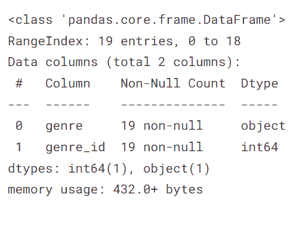
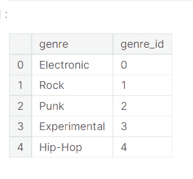
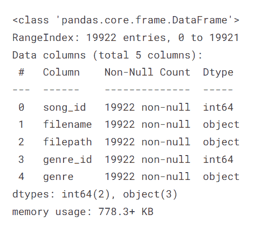
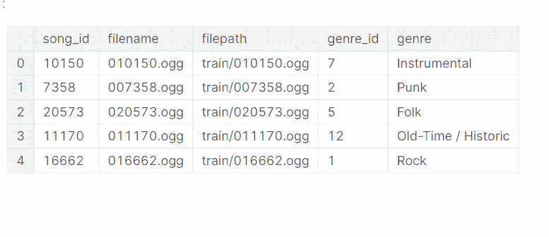
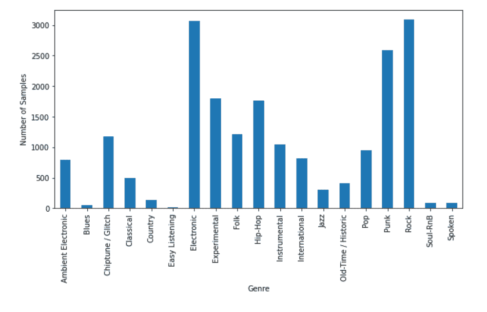
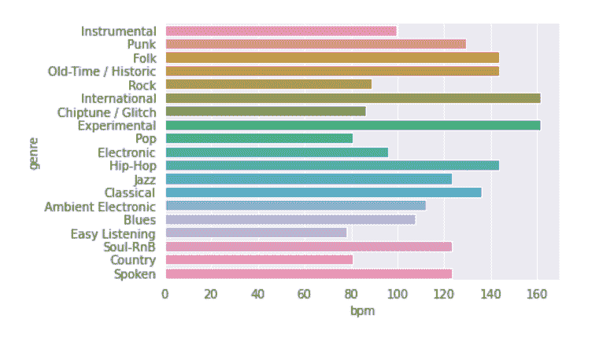
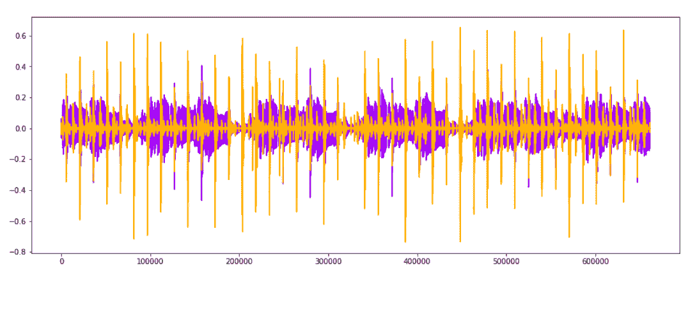
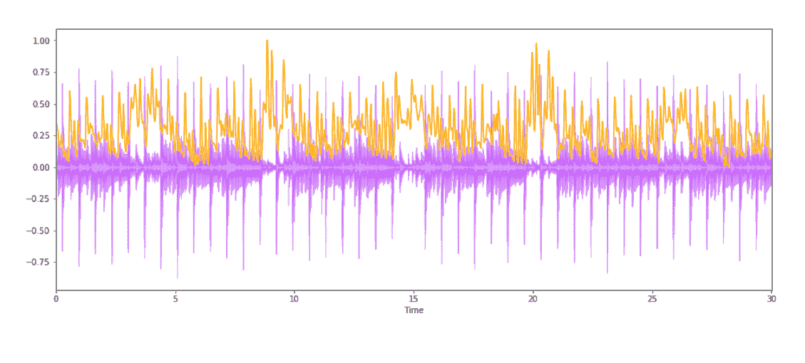

# 可视化音频数据并执行特征提取

> 原文：<https://towardsdatascience.com/visualizing-audio-data-and-performing-feature-extraction-e1a489046000>

丹尼尔·施鲁迪在 [Unsplash](https://unsplash.com/s/photos/audio?utm_source=unsplash&utm_medium=referral&utm_content=creditCopyText) 上拍摄的照片

# 介绍

音频只是简单的声音，我们在日常生活中听到的声音。例如，通过经验，人类大脑可以很好地区分救护车的声音和出租车的声音。但是我们能创建机器学习模型来进行这样的分类吗？

处理音频数据变得有点势不可挡，因为我们无法像处理一组表格或图像那样将其可视化。在本文中，我们将可视化音频数据，然后从音频中提取有用的特征。

# 数据

数据收集自 [Kaggle](https://www.kaggle.com/competitions/kaggle-pog-series-s01e02/overview) 。它包括 19 种不同风格音乐的音频数据。音频文件每个 30 秒。

我们有一个流派文件，具有以下特点:

*   流派:流派的名称
*   流派 id:流派的唯一 id

作者图片

作者图片

训练数据帧包括:

*   歌曲 id:音频文件的唯一 id
*   文件名:文件的名称
*   文件路径:音频文件可用的路径
*   流派:流派的名称
*   流派 id:流派的唯一 id

作者图片

作者图片

除了列流派和流派 id 之外，测试数据具有与列车相同的列数

快速浏览数据中可用的不同类型。

genre _ group = train . group by([' genre '])。计数()

作者图片

我们在类型变量上有一个不平衡；像电子和摇滚这样的流派有近 3000 个样本，而像布鲁斯和轻松听这样的流派甚至没有 100 个样本。

在将其传递给模型时，需要考虑到这一点。

# 重要的图书馆

这个库使得返回所有匹配特定模式的路径变得更加容易。因为我们将音频数据文件存储在基于流派的不同文件路径中，所以我们将使用这个库。

librosa :这个库是一个用于音乐和音频分析的构建模块。

**IPython.display:** 听我们笔记本里的音频。

让我们导入这些库:

音频文件格式

音频数据可以以不同的格式编码，如 wav，它代表波形音频文件格式。WAV 没有压缩，只有一些转换来存储声音，这将导致巨大的音频文件大小。

MP3 问世了，它通过压缩使音频文件变得更小。

我们的数据中有 Ogg 格式的音频文件。OGG 是一种开放的容器格式，将艺术家的元数据与音频文件一起存储。

# 可视化数据

我们使用 librosa load 加载不同流派的音频数据，并使用 matplotlib 绘制它们。

天秤座。load 返回一个音频时间序列，描述音频在不同时间步长的幅度。

振幅是麦克风或录音设备附近的压力变化。

正如你可以从下面的视频中看到的，不同类型的不同时间步长的幅度是非常不同的。

在对不同的音频进行分类时，我们必须使用相同的方法。接下来，我们转向特征工程。

# 特征工程

我们不能将原始音频文件原样传递给我们的机器学习模型，我们需要从音频数据中提取一些特征。在文章的这一部分，我们也在做同样的工作。

**1)过零率**

过零率描述信号从正到零再到负或从负到零再到正的速率。该特征在音乐检索系统中用于识别噪声信号。

噪声越大，过零率越高。我们使用 librosa 的函数 zero_crossing 进行计算。

作者图片

接下来，我们还可以看到过零率。

**观察:**

*   pop 的过零率最低(22405)，电子的过零率最高(151029)
*   对于易听、乡村、蓝调和古典等流派，过零率远低于摇滚、嘻哈和爵士等流派。

**2)速度/每分钟节拍数**

每分钟节拍数指定每分钟的节拍数。很简单的定义，不是吗？

每分钟节拍是一种表示音频速度的数字方式。

作者图片

国际和实验有大约 160 bpm，而易听有 80。

可以探索的一些其他特性的列表。

和声:这些是使我们能够听到旋律的音高声音。

**敲击声:**这更像是源自乐器的声音，就像鼓上的拍子。

作者图片

光谱质心

计算为音频文件中频率的加权平均值。

作者图片

# 结论:

我们在文章中使用了音频数据，使用 Ipython 显示库，我们听到了数据集的一些样本。

我们发现，数据集是不平衡的。我们探索了音频数据的重要库以及音频数据可用的各种格式。我们已经将过零率、节奏和频谱质心用于特征工程。您可以使用 librosa 中的各种功能来生成音频数据的特征。然后，这些特征可以作为输入提供给机器学习模型，或者用于更好地理解数据。您可以探索的其他功能有[这里](https://librosa.org/doc/main/feature.html)。