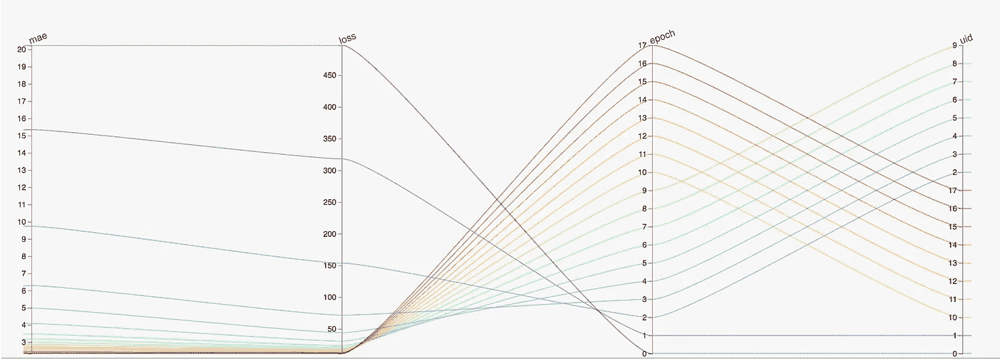
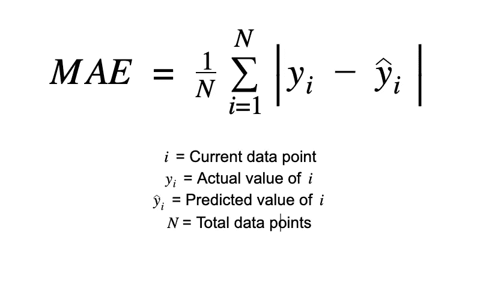
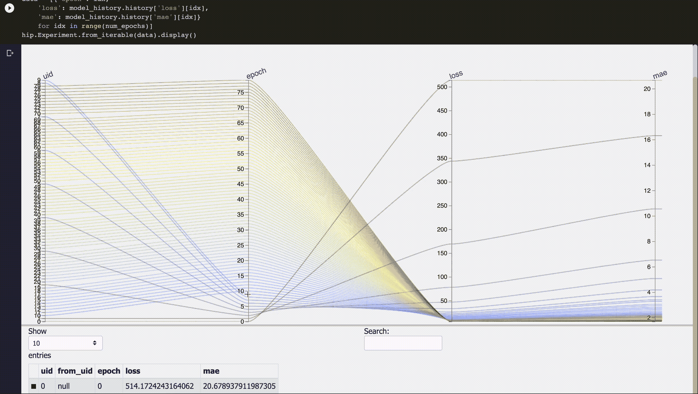

# 在任意尺度的神经网络训练中可视化反向传播

> 原文：<https://towardsdatascience.com/visualizing-backpropagation-in-neural-network-training-2647f5977fdb>

# 在任意尺度的神经网络训练中可视化反向传播

## 使用 HiPlot 生成平行坐标图来可视化深度学习模型训练。



一个平行坐标图来可视化 ML 训练(图片由作者提供)

理解和调试神经网络在数据集上的性能是机器学习(ML)模型的端到端生命周期中的关键一章。有能力理解一个模型是如何被训练的，可以提供有价值的洞察力，去发现哪里可以被改进。在本文中，我们将创建一个简单而有效的方法，在神经网络训练期间可视化一个称为[反向传播](/understanding-backpropagation-algorithm-7bb3aa2f95fd)的过程。我们将使用的可视化技术被称为[平行坐标图](https://www.data-to-viz.com/graph/parallel.html)。这通常是一种用于从多个数据点以不同的单位或类型可视化许多不同特征的技术。下面是本文其余部分的概要:

1.  理解评估深度学习模型的重要性
2.  建立基础
3.  生成可视化

# 1.理解评估深度学习模型的重要性


汉斯·雷尼尔斯在 [Unsplash](https://unsplash.com?utm_source=medium&utm_medium=referral) 拍摄的照片

深度学习模型在现实世界中有着广泛的应用，从欺诈检测到自动驾驶汽车。这些应用通常会影响我们的日常生活。当一个模型被扩展以供数百万用户每天使用数百万次时，模型指标的微小改进可能会导致整体模型性能的显著改进。

通过使用可视化，我们可以更深入地理解我们的模型在每个[时期](https://deepai.org/machine-learning-glossary-and-terms/epoch)的训练和表现。我们对模型了解得越多，我们在选择模型时就能做出更清晰的决策。我们还可以使用此信息来了解我们的模型是否基于所使用的评估度量过拟合或欠拟合，这有助于调整超参数。

# 2.建立基础


照片由[艾蒂安·吉拉尔代](https://unsplash.com/@etiennegirardet?utm_source=medium&utm_medium=referral)在 [Unsplash](https://unsplash.com?utm_source=medium&utm_medium=referral) 拍摄

既然我们理解了可视化模型训练可以提供的好处，让我们开始构建吧！这个例子将使用 Python 版。

我们将从导入 Python 依赖项开始:

```
import tensorflow as tffrom keras import layers
from keras import models
```

对于这个示例模型，我们将使用[1] [**Keras Boston Housing 数据集**](https://keras.io/api/datasets/boston_housing/) 。该数据集包含波士顿周围房屋的 13 个要素，目标值是房屋的价值。要下载和加载数据，请添加以下几行:

```
# Download dataset
dataset = tf.keras.datasets.boston_housing# Test train split
(x_train, y_train), (x_test, y_test) = dataset.load_data()# Normalize data using training data
mean = train_data.mean(axis=0)
train_data -= mean
std = train_data.std(axis=0)
train_data /= std

test_data -= mean
test_data /= std
```

既然数据已经准备好进行训练，我们将创建一个函数来构建我们的准系统神经网络。

```
def build_model(): model = models.Sequential() model.add(layers.Dense(64, activation='relu',
              input_shape=(x_train.shape[1],))) model.add(layers.Dense(64, activation='relu')) model.add(layers.Dense(1)) model.compile(optimizer='rmsprop', loss='mse', metrics=['mae']) return model
```

最后，让我们训练模型！

```
num_epochs = 18model = build_model()model_history = model.fit(x_train, y_train, epochs=num_epochs, batch_size=16, verbose=0)test_mse_score, test_mae_score = model.evaluate(x_test, y_test)print(test_mae_score)
```

这里的模型使用平均绝对误差作为评估标准。MAE 可以用来评估我们的模型有多精确，并且可以给出性能的感觉。MAE 分数将总是正数，分数越接近 0，模型的性能越好。MAE 可以通过取误差的平均值来计算。取预测值减去实际值的绝对值，取所有这些数值的和，最后除以数据点的总数，🎉你得到了你的梅分数。



计算 MAE(作者图片)的公式

# 3.生成可视化


照片由 [Isaac Smith](https://unsplash.com/@isaacmsmith?utm_source=medium&utm_medium=referral) 在 [Unsplash](https://unsplash.com?utm_source=medium&utm_medium=referral) 上拍摄

现在是最精彩的部分！让我们通过生成一个平行图来直观地观察我们的基线神经网络在每个时期的模型训练情况！

为此，我们将利用脸书的开源 HiPlot 库。 **HiPlot** 是一个轻量级工具，能够根据提供的数据轻松快速地生成平行坐标图。这是并排显示多个要素以直观分析数据外观的一种非常方便的方式。在我们的例子中，我们可以使用提取的关于模型训练的元数据来非常快速地创建令人惊叹的交互式可视化。关于 HiPlot 的更多信息可以在 [HiPlot Github 库](https://github.com/facebookresearch/hiplot)上找到。

要生成可视化，首先需要为 HiPlot 安装一个 Python 依赖项:

```
pip install -U hiplot
```

接下来，您需要导入 HiPlot 并使用函数来生成绘图。

```
import hiplot as hipdata = [{'epoch': idx,
         'loss': model_history.history['loss'][idx], 
         'mae': model_history.history['mae'][idx]}
       for idx in range(num_epochs)]
hip.Experiment.from_iterable(data).display()
```

上面的代码将使用 Keras model.fit()方法的返回值将模型历史加载到 HiPlot 中，以便进行可视化和交互。



与 HiPlot 生成的平行图交互(图片由作者提供)

🎉恭喜你建立了神经网络模型，并用 HiPlot 生成的并行图可视化了反向传播过程！您会注意到，对于每个时期，MAE 得分逐渐变得更好，现在我们能够分析并与这些数据进行交互，同时查看拟合在确切时期逐渐减弱的位置。

通过这个过程，我们可以看到创建这些交互式可视化的可行性和无缝性，同时还可以通过利用训练历史数据来深入了解模型在训练期间的运行情况。使用 HiPlot 的最大优势之一**是您可以添加许多其他属性来扩展到可视化中，以绘制更好的图片，而无需显著增加计算能力需求。**

# 参考

[1]波士顿住房数据集:[https://keras.io/api/datasets/boston_housing/](https://keras.io/api/datasets/boston_housing/)

Harrison d .和 Rubin feld d . l .‘[享乐价格和对清洁空气的需求](https://www.law.berkeley.edu/files/Hedonic.PDF)’(1978)，J. Environ。经济学&管理学，第 5 卷，81–102 页