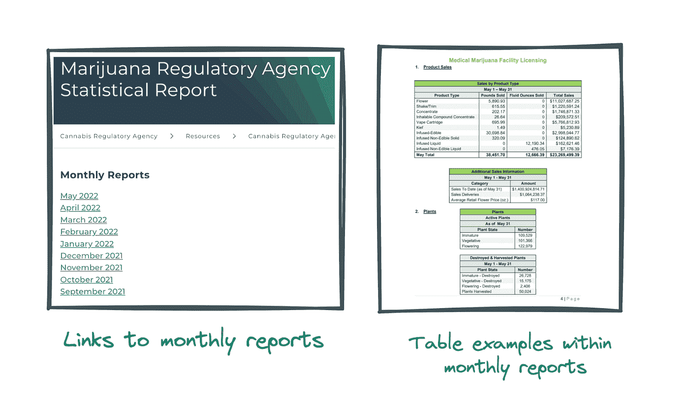
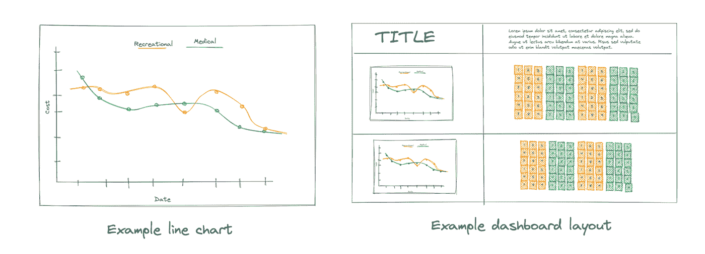
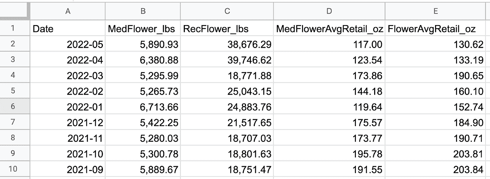
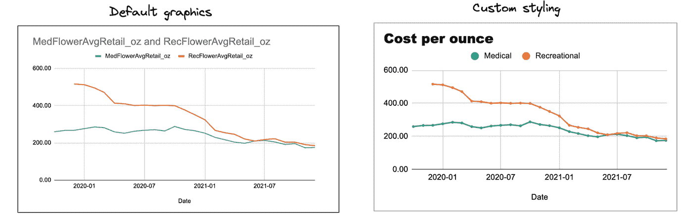
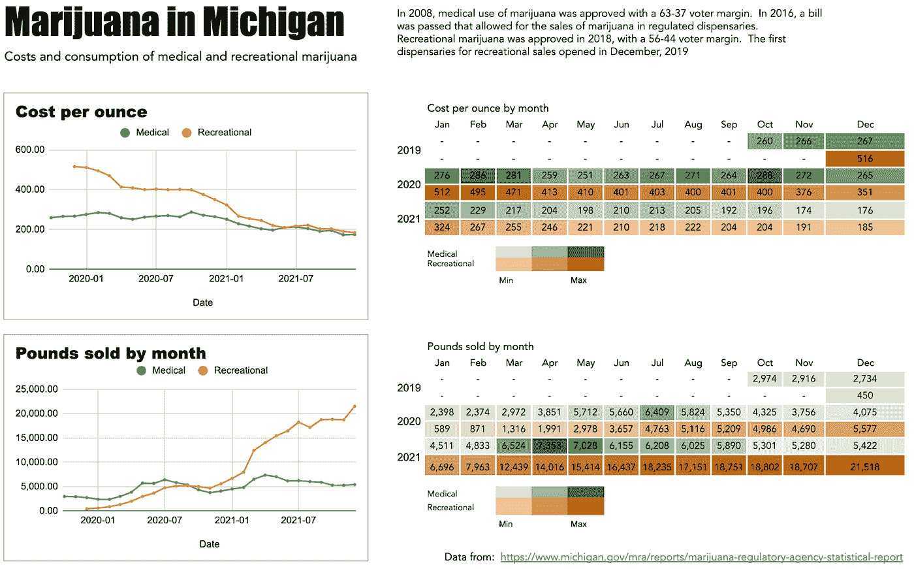
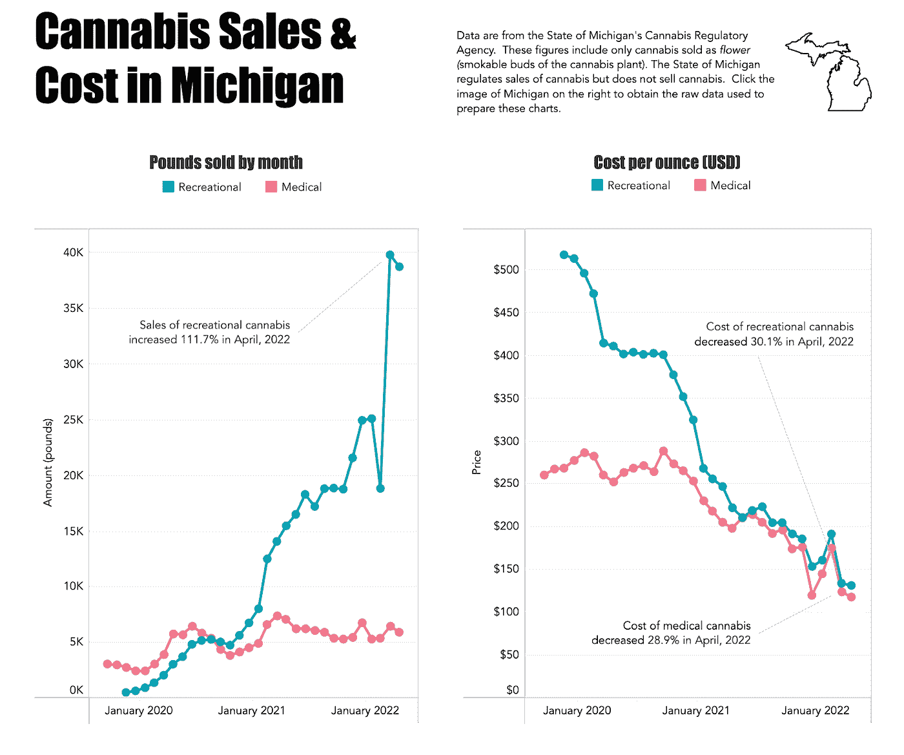

# 可视化大麻销售和成本

> 原文：<https://towardsdatascience.com/visualizing-cannabis-sales-and-cost-ddd35c2402b1>

## 将管理报告转换成有意义的信息

来自 Unsplash 的简·兹沃索埃德拍摄的大麻药房图片

要学习的最实用的技能之一，尤其是在数据可视化方面，是将管理报告转换成易于理解的图表。这项技能对于准备在社会和环境影响组织、非营利部门和政府部门工作的学生尤为重要。这些部门充满了大量的汇总数据表，需要大量的工作来审查和理解。有时，表格的数量多得令人无法承受，这就提出了它们是否能增加价值的问题。

数据可视化技能有利于解决这个问题。本文展示了我将管理报告转换成有意义的图形的工作流程。我使用可公开访问的数据，允许新的学习者重新创建(并改进！)我的工作流程。这个项目的原始数据可从密歇根州的大麻管理局获得，可通过此[链接](https://www.michigan.gov/cra/resources/cannabis-regulatory-agency-licensing-reports/marijuana-regulatory-agency-statistical-report)访问。

# 有哪些信息需求？

对于这个项目，我有兴趣了解密歇根的大麻销售趋势。密歇根州大麻管理局(CRA)在其[网站](https://www.michigan.gov/cra/resources/cannabis-regulatory-agency-licensing-reports/marijuana-regulatory-agency-statistical-report)上以 PDF 格式公开这些数据。报告以标准格式每月发布一次，大约 20 页，并填充有数据表，因为这些报告提供每月数据。由于它们没有累积汇总，推断趋势需要对每份报告进行人工审查。请注意，这些是政府数据，不需要任何特殊许可即可访问或使用。

密歇根州监管机构的报告截图

新学员的一个常见问题是试图可视化所有数据。有时，您会遇到由于表的创建者和最终用户之间的脱节而导致的大量表摘要。避免认为目标是可视化数据。你*能*不代表你*就应该*。阐明数据和可视化的目的。最终用户是要探索数据并做出发现吗？如果是，需要包括哪些重要的数据点？或者，你希望数据讲述一个故事——也就是说，解释一些事情？启动一个成功项目的最关键步骤是明确信息需求和最终用户。

# 什么样的数据产品能满足受众的信息需求？

当创建像可视化这样的数据产品时，你需要专注于你的受众和他们的信息需求。在这个例子中，我是希望深入了解大麻销售和成本的观众。

当启动一个新项目时，我喜欢通过勾画出最终产品或可交付成果的具体想法来创建一个可视化的路线图。路线图有助于建立一个清晰、连贯且有界限的计划。没有边界，项目将面临严重的项目漂移风险，这是我在最近的一篇文章中详细讨论的主题。

[https://medium . com/forward-data-science/protection-yourself-against-the-big-problem-in-data-consulting-projects-16d 76 b 779821](https://medium.com/towards-data-science/protecting-yourself-against-the-biggest-problem-in-data-consulting-projects-16d76b779821)

保持专注的另一个方法是清楚什么是*有趣的*和什么是*有用的。当你专注于有趣的事情时，项目会很快变得臃肿。专注于有用的东西。*

以下图片是我对这个项目的设想的例子。一些折线图和一个精确值的表格。不需要复杂。

作者的素描

# 如何高效地准备一个高质量的数据集？

当我教授数据入门课程时，我会在准备数据的基本技能上花费大量时间。我的理由很简单。数据密集型项目中的大部分资源都用于数据准备。由于我无法从国家获取原始数据文件，我不得不从月度报告中提取数据。

我尝试了一些不同的工具来从 pdf 中提取数据。Tabula 是一个优秀的开源程序，假设这些报告共享相同的结构，但这个项目不是这样的。我考虑了一些其他基于代码的解决方案，但认为将脚本放在一起的麻烦不值得。我决定最好的时间利用是分配几个小时来手动提取数据。

同样，我以简单为目标，选择 Google Sheets 作为我的主要数据存储。我填充了五个不同的字段:

*   日期:月度报告日期
*   MedFlower_lbs:作为医用大麻出售的可点燃抽吸的花蕾(即花)磅数
*   RecFlower_lbs:作为娱乐大麻出售的可点燃抽吸的芽磅数
*   MedFlowerAvgRetail_oz:一盎司作为医用烟草出售的平均成本
*   ` RecFlowerAvgRetail_oz `:作为娱乐用大麻出售的一盎司可吸烟花蕾的平均成本

作者准备的数据集截图

我承认我在数据提取的早期阶段偏离了方向。我提取的数据超出了我最初的兴趣。我违背了自己的原则，抓住有趣的数据，而不是专注于对 T2 有用的数据。幸运的是，我让自己重新聚焦，得到了我需要的数据。

# 构建数据产品

在收集了大量数据后，我得到了我最喜欢的东西:可视化数据。许多人对电子表格程序中创建的图表非常不满。理应如此。假设创建者接受默认输出，从远处发现 Excel 或 Google 工作表是没有问题的。正如我之前所描述的，你可以通过仔细应用设计原则来创建有效的图表。

[https://towards data science . com/less-software-more-design-449175 a34e 59](/less-software-more-design-449175a34e59)

以下示例显示了一些基本样式如何显著改善默认图形。

作者准备的图形截图

然后，在 Google Sheets 中，我通过创建一个简单的值的高亮表，或热图，进一步实现了可视化。因此，折线图提供了一种快速简单的方法来推断一段时间内的趋势，而右侧的热图提供了检查特定值的机会。

作者准备的图形截图

在这一点上，我认为我已经有了足够的正确格式的信息来提供我所需要的信息。表格显示了一种有趣的供求关系——对娱乐用大麻的需求持续大幅增长，而成本却稳步下降。数据表明，种植者正在用大麻产品充斥市场。(我不是在抱怨，只是在观察！)

所以，问题解决了，对吧？不完全是。

# 修订和迭代

改进你的工作和技能的最有效的方法之一是通过修改和迭代。对于这个项目，我的信息需求得到了满足。这个帖子也在密歇根州的 subred dit 上引起了很多讨论，表明其他人也对这个话题感兴趣。但是，我对设计工作不满意，认为热图占用了图形的太多空间。我决定更新数据并使用 Tableau 重建图形。我必须更新四个月的数据，但这很快就完成了，这证实了简单的手动提取是正确的方法。

考虑到创建交互式图形的功能，我决定使用 Tableau。我在这个环境中实现了以下变化:

*   添加了一个工具提示来提供悬停时的精确值，消除了对值表的需要；
*   工具提示中包含了一个表格计算，以显示与上个月相比的百分比变化；
*   带有嵌入链接的图标取代了难看的 URL
*   图表中添加了注释，突出了趋势中的显著特征；
*   可视化在 Tableau Public 上发布，允许可视化通过链接共享；
*   使用了不同的调色板，因为对于色盲的人来说，自然色是很难的。

随着这些变化，数据更新揭示了大麻市场中一些值得注意的事件。2022 年 3 月，每盎司成本略有上升，销售额显著下降。但是，2022 年 4 月，大麻销量翻了一番。密歇根人似乎非常重视 4 月 20 日的庆祝活动，同时享受着成本的大幅下降。您可以在 [Tableau Public](https://public.tableau.com/app/profile/beperron/viz/MichiganMarijuana/Amount-Price) 上访问可视化。

# 后续步骤

总的来说，我对这张图很满意。当我准备启动一个新项目时，反思和记录这个过程是很有帮助的。我知道有机会进一步改善视觉效果。因此，我在 Tableau Public 上共享了 viz，这样其他人就可以下载数据和 viz。您可以随意重用数据并重新制作这种可视化，应用您的设计策略或集成额外的信息。或者，在评论区提出你的建议。