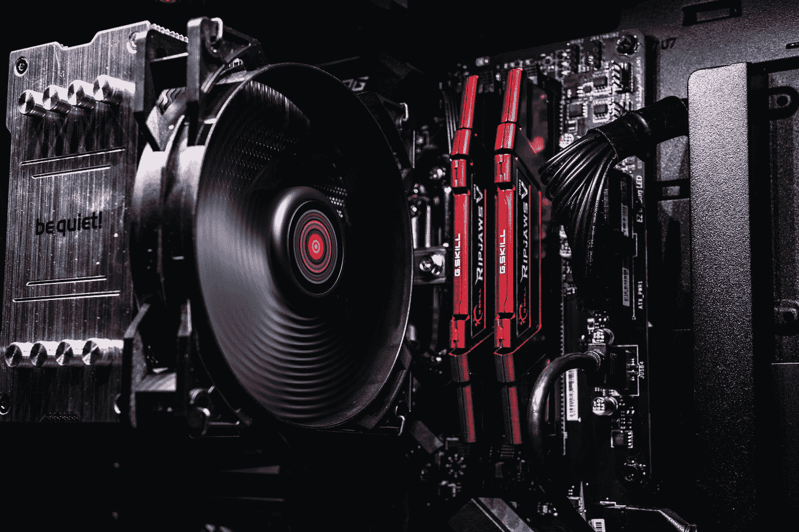
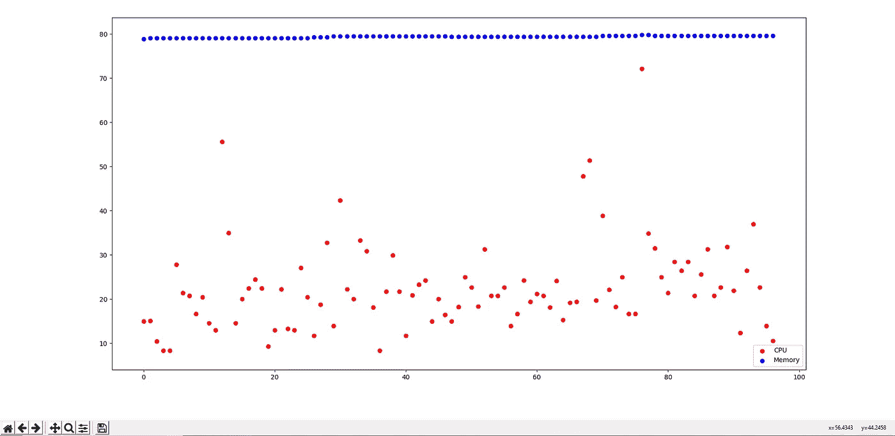
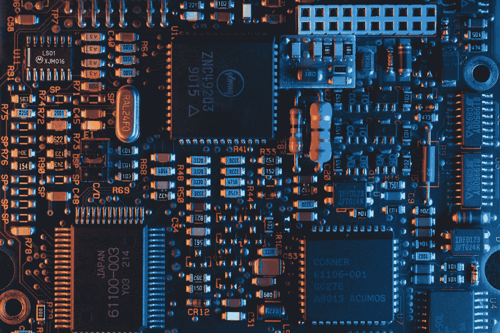

# 用 Python 可视化 CPU、内存和 GPU 工具

> 原文：<https://towardsdatascience.com/visualizing-cpu-memory-and-gpu-utilities-with-python-8028d859c2b0>

## 分析 CPU、内存使用和 GPU 组件，以监控您的 PC 和深度学习项目



帕特里克·帕尔克在 [Unsplash](https://unsplash.com?utm_source=medium&utm_medium=referral) 上的照片

当你沉迷于编程时，你是在试图计算、调试、编码来实现想要的任务。当项目更加复杂时，有几种情况需要打开多个选项卡进行研究，打开多个 Python 文件进行代码调试，打开各种数据元素进行分析。但是“轰”——突然有一个崩溃。

当您在编写各种项目代码时，您忘记了检查所利用的资源，这可能会导致未保存的数据丢失或更糟。CPU 和内存的使用是计算机系统的关键部分。GPU 是监控深度学习项目的必要元素。

在本文中，我们将研究一个 Python 项目，它将可视化并显示我们有兴趣分析的所有主要参数。我们将使用特定的工具使这一分析过程更加简单，因为这些资源对于系统监控、分析、限制进程资源和进程管理非常有用。

为了在你的预算范围内找到建造你自己的个人电脑的最佳质量，我推荐从这个[链接](/best-pc-builds-for-deep-learning-in-every-budget-ranges-3e83d1351a8)查看我以前的指南之一。如果您有兴趣了解 GPU 对于您的 PC 构建的复杂性和要求，我建议您查看下面提供的文章，其中包含了关于探索这一概念的深入指南。

[](/do-you-really-need-a-gpu-for-deep-learning-d37c05023226) [## 深度学习真的需要 GPU 吗？

### 获得一个 GPU 是深度学习的必备条件吗？了解 GPU 及其优势，并探索…

towardsdatascience.com](/do-you-really-need-a-gpu-for-deep-learning-d37c05023226) 

# 了解必要的库要求:


照片由[路易莎·布姆布尔](https://unsplash.com/@luisabrimble?utm_source=medium&utm_medium=referral)在 [Unsplash](https://unsplash.com?utm_source=medium&utm_medium=referral) 上拍摄

在这一节中，我们将了解成功完成这个项目所需的一些基本库要求。大多数这些库可以用一个简单的 pip 命令安装，不需要任何额外的步骤。让我们看一下前两个安装，您将需要读取和分析 CPU、内存和 GPU 组件。

```
pip install psutil
pip install GPUtil
```

如果您在安装过程中遇到第二个命令的问题，我建议您使用下面的 pip install 命令，并按照作者提供的 GitHub [链接](https://github.com/anderskm/gputil)继续参考。

```
pip install gputil
```

通过这些简单的库安装，用户已经可以获得这个项目所需的所有基本信息。首先，让我们导入两个库，通过它们我们可以测试它们是否被正确安装并按预期工作。一旦库被导入，我们就可以在使用 PC 时查看 CPU 的性能和内存使用情况。

可以遵循相同的步骤来分析 GPU 性能以及监控 GPU 消耗了多少内存。您可以注意到，开始时打印的值是相当恒定的。但是，当您移动光标或在系统上执行一些小操作时，打印的详细信息会出现峰值。下面是测试以下过程的代码块。

```
# Importing the essential libraries
import psutil
import GPUtil# Testing the psutil library for both CPU and RAM performance details
print(psutil.cpu_percent())
print(psutil.virtual_memory().percent)# Testing the GPUtil library for both GPU performance details
GPUtil.showUtilization()
```

在下一步中，我们将会看到一些可视化的东西，我们可能会发现这些东西对于轻松开发我们的项目很有用。我们将导入 numpy 和 matplotlib 库，通过它们我们可以创建自己的随机数据元素并相应地绘制信息。下面是测试和执行以下操作的代码片段。

```
# Importing the numpy and visualization library
import numpy as np
import matplotlib.pyplot as plt# Plotting the axis
plt.axis([0, 10, 0, 1])# Creating a random scatter plot
for i in range(10):
    y = np.random.random()
    plt.scatter(i, y)
    plt.pause(0.05)plt.show()
```

在上面的代码片段中，我提供了我们可以用可视化技术实现的一瞥。如果观众对可视化更感兴趣，这是数据科学不可或缺的一部分，我建议查看下面的文章。它涵盖了八种最重要的可视化技术，对于您计划构建的任何数据分析项目来说，这些技术都是必须考虑的。

[](/8-best-visualizations-to-consider-for-your-data-science-projects-b9ace21564a) [## 为您的数据科学项目考虑的 8 个最佳可视化！

### 分析数据科学项目探索性数据分析中的 8 种最佳可视化技术。

towardsdatascience.com](/8-best-visualizations-to-consider-for-your-data-science-projects-b9ace21564a) 

# 用 Python 开发自己的内存跟踪器:



作者图片

现在我们已经理解了所有的库需求以及如何有效地使用它们，我们可以开始开发我们的项目了。我们的目标是获得一个散点图，如上图所示，通过它我们可以相应地持续监控我们的资源。当它在执行深度学习项目、游戏、3-D 渲染或其他类似任务等要求更高的应用程序中达到其上限时，我们可以知道如何处理这种情况。

为了开发这个项目，我们将把前面讨论的所有库导入到一个 Python 文件中。一旦我们完成了这些库的导入，我们就可以继续创建一个无限的 for 循环，只要你的计算机还开着，这个循环就会运行很长时间。在这个循环中，我们将获得 CPU 利用率百分比、内存使用情况和 GPU 信息。下面是完整的代码块，用于绘制我们计划监视的各种系统任务的所有重要细节的信息。

```
# Importing the required libraries
import psutil
import GPUtil
import numpy as np
import matplotlib.pyplot as plt# Creating an almost infinite for loop to monitor the details continuously
for i in range(100000000):
    # Obtaining all the essential details
    cpu_usage = psutil.cpu_percent()
    mem_usage = psutil.virtual_memory().percent
    print(cpu_usage)
    print(mem_usage) # Creating the scatter plot
    plt.scatter(i, cpu_usage, color = "red")
    plt.scatter(i, mem_usage, color = "blue")
    plt.legend(["CPU", "Memory"], loc ="lower right")
    plt.pause(0.05) # Obtaining the GPU details
    GPUtil.showUtilization()# Plotting the information
plt.show()
```

我只为前两个组件创建了图，因为我在当前的过程中不会真正使用我的 GPU。如果用户认为有必要，他们可以自由地为 GPU 和其他功能创建自己的方法和图表。一旦程序完成，运行它的最佳方式是在命令提示符(或终端)中，在工作目录中打开它并运行 Python 文件。一旦程序运行，您就可以持续不断地监控相应的必要信息。

# 结论:



[翁贝托](https://unsplash.com/@umby?utm_source=medium&utm_medium=referral)在 [Unsplash](https://unsplash.com?utm_source=medium&utm_medium=referral) 上拍摄的照片

> “想象力比知识更重要。因为知识是有限的，而想象力包含整个世界，刺激进步，催生进化。”
> *—爱因斯坦*

当您在本地系统上处理大量打开了大量文件、文件夹和选项卡的任务和项目时，持续监控您的资源消耗以确保它们不会超出限制总是一个好主意。虽然这些问题在高端系统或工作站中并不常见，但对于大多数普通笔记本电脑和 PC 用户来说，确认其资源的最佳利用是强制性的。

在本文中，我们了解了一些基本的库需求，以及如何利用它们来分析 CPU 消耗、内存使用和 GPU 统计数据。我们还研究了一些基本的可视化概念，以相应地绘制这些内存实用程序。最后，我们将所有这些元素结合在一起，用 Python 开发了我们的内存跟踪器，用于监控您的 PC 和深度学习项目。

如果你想在我的文章发表后第一时间得到通知，请点击下面的[链接](https://bharath-k1297.medium.com/subscribe)订阅邮件推荐。如果你希望支持其他作者和我，请订阅下面的链接。

[](https://bharath-k1297.medium.com/membership) [## 通过我的推荐链接加入媒体

### 阅读 Bharath K(以及媒体上成千上万的其他作家)的每一个故事。您的会员费直接支持…

bharath-k1297.medium.com](https://bharath-k1297.medium.com/membership) 

如果你对这篇文章中提到的各点有任何疑问，请在下面的评论中告诉我。我会尽快给你回复。正如我在之前的[文章](/build-your-own-ai-voice-assistant-to-control-your-pc-f4112a664db2)中承诺的那样，我会尽量每个月发三到五篇文章！

看看我的一些与本文主题相关的文章，你可能也会喜欢阅读！

[](/build-highly-interactive-projects-with-jupyter-notebooks-c7fcf7f87633) [## 使用 Jupyter 笔记本电脑构建高度互动的项目

### 利用小部件为构建交互式 Python 和数据科学项目创建用户友好的环境…

towardsdatascience.com](/build-highly-interactive-projects-with-jupyter-notebooks-c7fcf7f87633) [](/best-seaborn-visualizations-for-data-science-3d866f99c3a9) [## 数据科学最佳 Seaborn 可视化

### 使用 Seaborn 库探索数据科学项目的一些最佳可视化选项

towardsdatascience.com](/best-seaborn-visualizations-for-data-science-3d866f99c3a9) [](/7-python-programming-tips-to-improve-your-productivity-a57802f225b6) [## 提高生产力的 7 个 Python 编程技巧

### 通过修正一些常见的不良编程实践，使您的 Python 编码更加有效和高效

towardsdatascience.com](/7-python-programming-tips-to-improve-your-productivity-a57802f225b6) 

谢谢你们坚持到最后。我希望你们都喜欢这篇文章。祝大家有美好的一天！