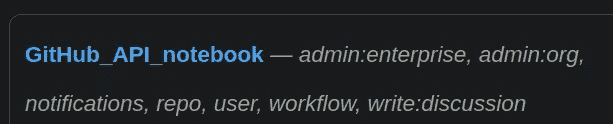
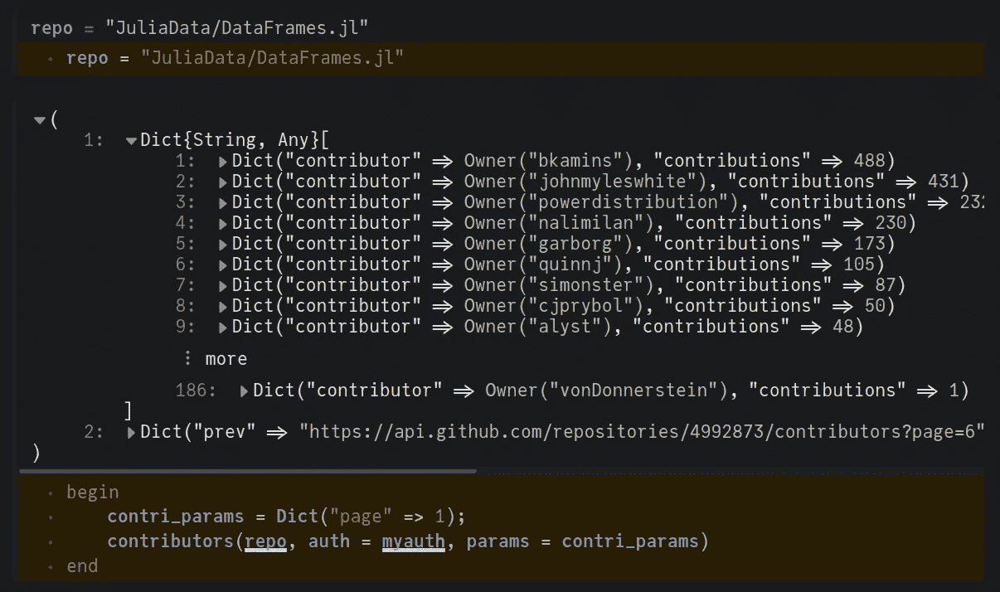
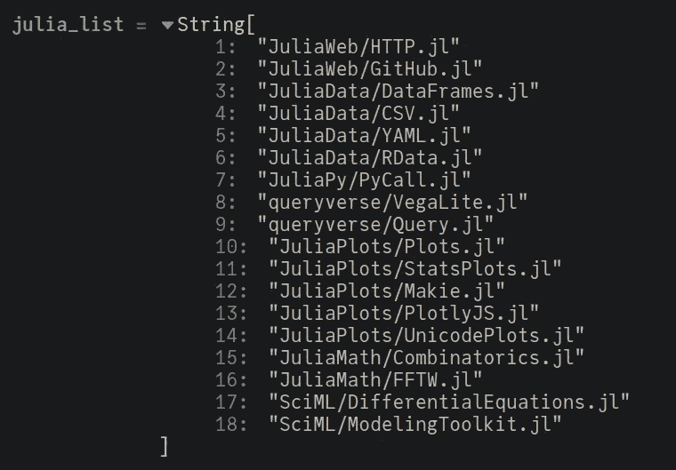
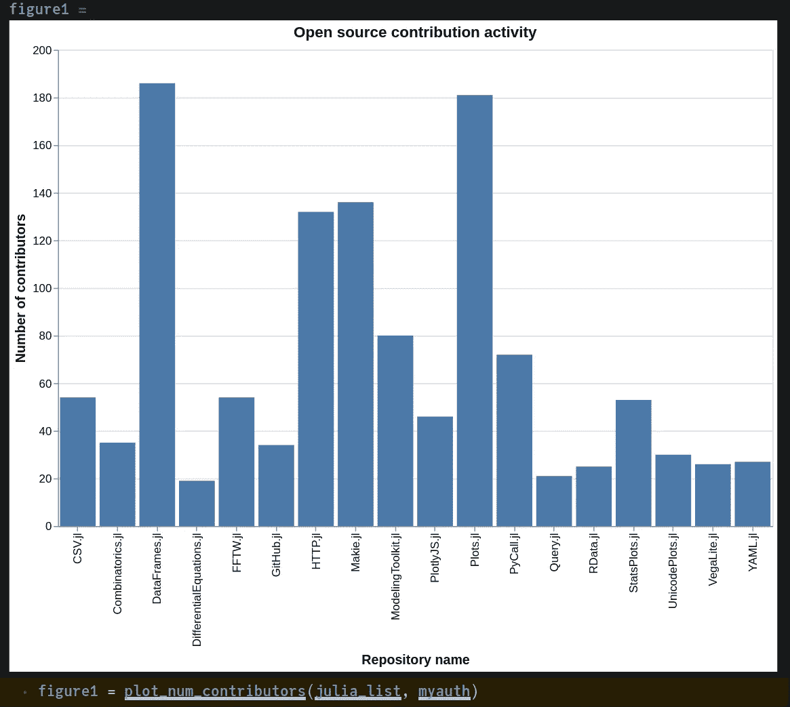
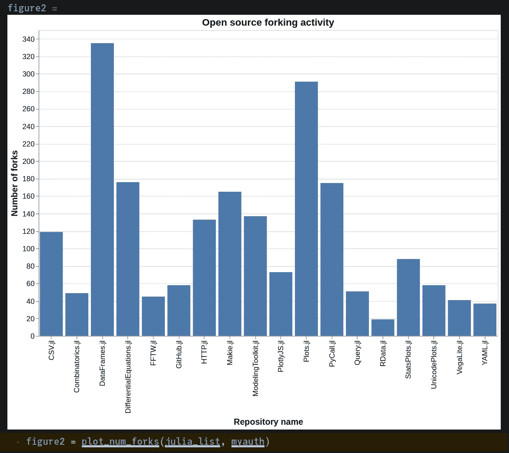
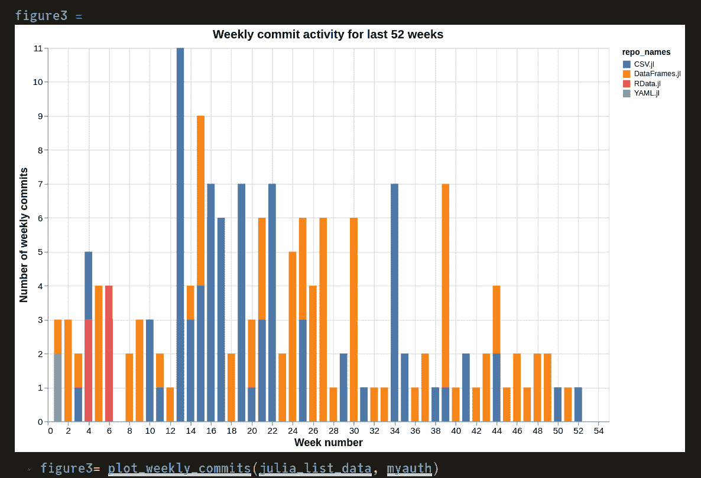
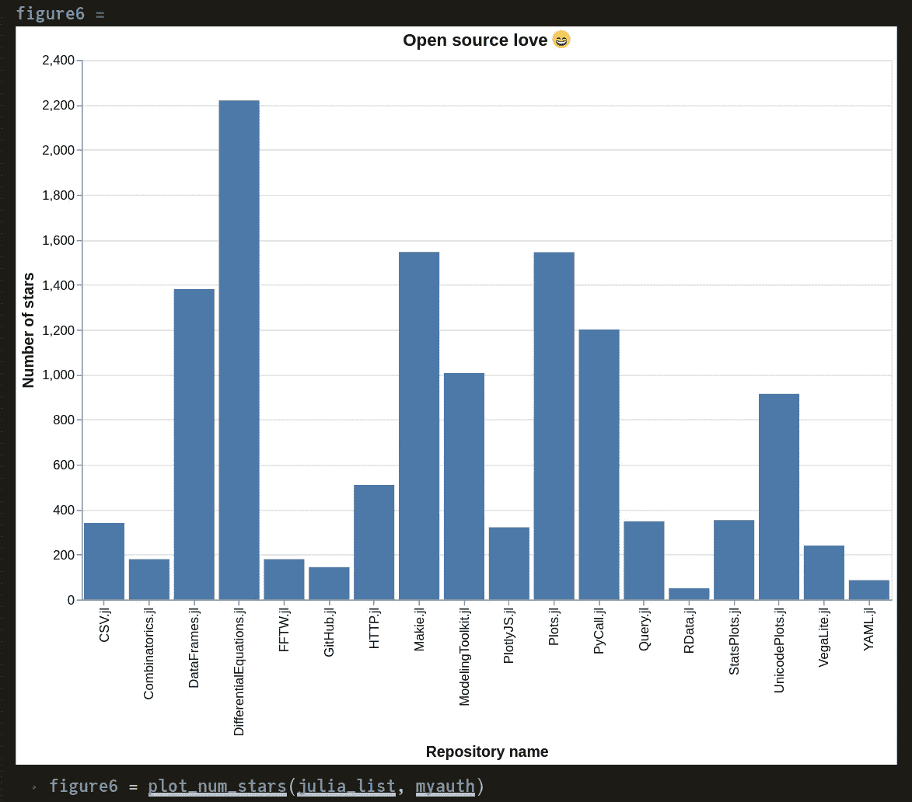
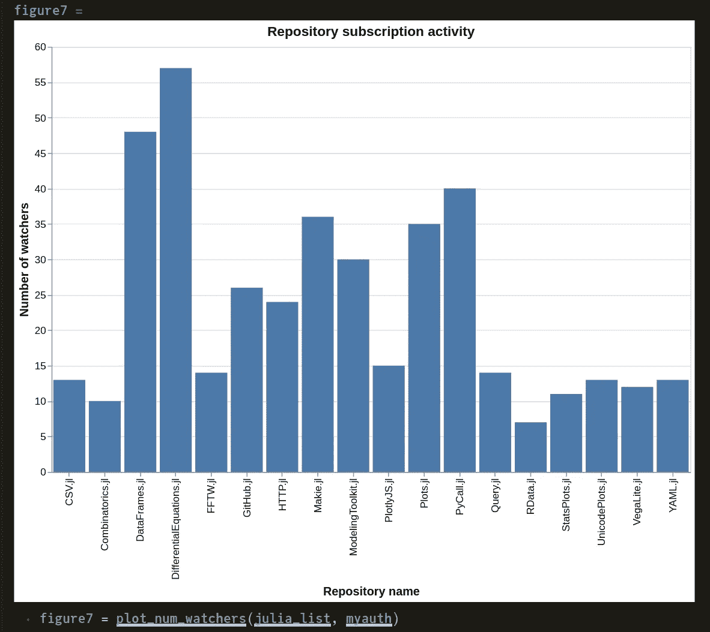

# 通过 GitHub API 可视化开发者活动

> 原文：<https://towardsdatascience.com/visualizing-developer-activity-via-the-github-api-48c38c40914f>

## 我们能以某种方式测量开源之爱吗？


罗曼·辛克维奇·🇺🇦在 [Unsplash](https://unsplash.com?utm_source=medium&utm_medium=referral) 上拍摄的照片

除了托管我们宝贵的代码，GitHub 还提供了大量的[REST API](https://docs.github.com/en/rest)。这些可以用于检索给定存储库的各种有用的度量，这也可以提供关于其当前状态的想法。Julia 是一种相对较新的语言，然而，它的包生态系统在过去几年里已经有了巨大的发展。新套餐的数量好像暴涨了！我想说的是，仅仅开发一个包是远远不够的，我们还需要维护和改进它。拥有成熟的套餐生态系统也有助于吸引新用户。

在本文中，我将向您展示如何使用 GitHub API 比较不同包的各种指标。在此基础上，我们也将尝试得出一些关于他们受欢迎程度的结论。为了实现这一点，我们将在 Pluto 笔记本环境中使用另一个包 [GitHub.jl](https://github.com/JuliaWeb/GitHub.jl) 。源代码可在[这里](https://github.com/vnegi10/GitHub_data_analysis)获得。

# 先决条件

为了使用 GitHub API，建议使用个人访问令牌来验证请求，如这里描述的[。](https://docs.github.com/en/authentication/keeping-your-account-and-data-secure/creating-a-personal-access-token)如果没有它，将会有一些限制，例如将请求限制为每小时 60 个。要授予的权限级别由您决定，但是最低限度的读取权限是必要的。下面显示了一个设置示例:



作者图片

# 添加必要的包

Pluto 内置的包管理器将处理包及其依赖项的安装。我们将利用以下内容来处理数据和创建图:

```
using GitHub, JSON, DataFrames, VegaLite, Dates
```

# 证明

使用前面描述的个人访问令牌，我们可以生成一个身份验证对象，稍后作为关键字参数传递给我们的请求。在代码中硬编码标记不是一个好的做法。相反，您可以从存储在私有位置的文件(例如 JSON)中读取它们。

```
# Contents of JSON file: 
# { "GITHUB_AUTH":"YOUR_TOKEN" }access_token = JSON.parsefile("/path/to/JSON/file")
myauth = GitHub.authenticate(access_token["GITHUB_AUTH"])typeof(myauth)
# GitHub.OAuth2
```

# 测试 API

让我们检查一下我们的凭证是否工作正常。我们将尝试获取 [DataFrames.jl](https://github.com/JuliaData/DataFrames.jl) 的贡献者列表，这是使用 Julia 进行数据科学研究的必备工具。



DataFrames.jl 供稿者(图片由作者提供)

注意类型`Tuple{Vector{T}, Dict}`的结果意味着它们是分页的。通过提供`Dict("page" => 1)`作为输入参数，我们可以看到第一个`Vector{T}`中的所有结果，如上所示。您还可以调整每页的结果，例如:`Dict("per_page" => 25, "page" => 2)`将从第 2 页开始每页返回 25 个结果。

# 有趣的包列表

我们现在可以开始收集多个包的数据，并将它们绘制在一起进行比较。我策划了下面的列表，涵盖了不同的领域(数据分析，解析，网络，绘图，数学等。)，这绝不意味着是详尽无遗的。你认为我们还能再补充些什么吗？请在评论中告诉我，我会相应地更新剧情。



本文中比较的软件包列表(图片由作者提供)

# 贡献者人数

让我们首先使用下面显示的函数来确定给定包的贡献者数量。

我们将对列表中的所有包都这样做，然后使用来自 [VegaLite.jl](https://github.com/queryverse/VegaLite.jl) 的 **@vlplot** 宏绘制结果。



作者图片

似乎 DataFrames.jl 目前拥有最多的贡献者，鉴于它在几乎所有数据科学工作流中的效用，这并不奇怪。 [Plots.jl](https://github.com/JuliaPlots/Plots.jl) 紧随其后，在本次比较中使用的所有绘图包中数量最多。

# 叉子的数量

使用与上面相同的逻辑，我们也可以比较分叉的数量。



作者图片

DataFrames.jl 再次领先，Plots.jl 紧随其后。

# 每周提交

GitHub 还提供了一个 API 来确定在过去的 52 周内提交给存储库的数量。我们需要解析 HTTP 响应对象，然后将它转换成 DataFrame，其中包用作列名。

然后，我们对所有包重复该过程，并构建一个新的数据帧，用作创建堆积条形图的输入。

请注意，为了更清楚起见，这里我们只查看上述包的一个子集。



作者图片

第一个图显示 DataFrames.jl 和 CSV.jl 在去年全年都有定期活动。这说明各自的包维护者一直在努力。向所有参与者致敬！

在第二个图中，我们注意到 Makie.jl 和 Plot.jl 在第 1–10 周发生了很多活动。在那之后，提交的数量比平时少了。

# 开放和关闭的问题

另一个值得关注的指标是当前打开/关闭问题的数量。这可能是包装成熟度的合理指标。毕竟，谁会想继续使用充满公开问题的代码呢？例如，如果打开和关闭问题的比率很高(> 0.7)，这表明开发人员修复 bug 的速度很慢，或者相关的问题很复杂，需要时间来修复。另一方面，较低的比率(< 0.3) indicates a healthy package development pace.

Keep in mind that the API also considers pull requests as closed issues. We would like to separate that from issues reported as bugs by users.

The gathered results can be combined and visualized once again as a stacked bar plot.


Image by author

It’s very heartening to see that most of the packages in our list do not have a big backlog of open issues. They have undergone a robust development and testing cycle, thus leading to a very mature state.

# Open source love

It could also be interesting to have a look at some social metrics such as the number of people that have starred or are following updates of a repository.



Image by author

[微分方程. jl](https://github.com/SciML/DifferentialEquations.jl) 在这里是明显的赢家，因为它在 Julia SciML 生态系统中非常受欢迎。在绘图引擎中，Plots.jl 和 Makie.jl 似乎并驾齐驱。看到 PyCall.jl 有这么多明星，我很惊讶。现在我想起来，这是有意义的，因为许多新的 Julia 用户可能会从 Python 转向。也可能是他们打算只在代码的性能关键部分使用 Julia。

观察者的数量也显示了类似的趋势，尽管我不认为这是开发人员的普遍习惯。



作者图片

# 结论

朱莉娅的生态系统正在快速发展。我很高兴看到大多数突出的包都被积极地维护着，这对开源精神来说是必不可少的。我希望你觉得这个练习很有趣。感谢您的宝贵时间！在 [LinkedIn](https://www.linkedin.com/in/negivikas/) 上与我联系，或者访问我的 [Web 3.0 支持的网站](https://vikasnegi.eth.link/)。

# 参考

1.  [https://docs.github.com/en/rest](https://docs.github.com/en/rest)
2.  [https://github.com/JuliaWeb/GitHub.jl](https://github.com/JuliaWeb/GitHub.jl)