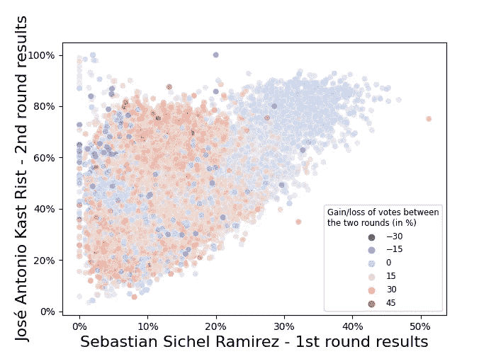
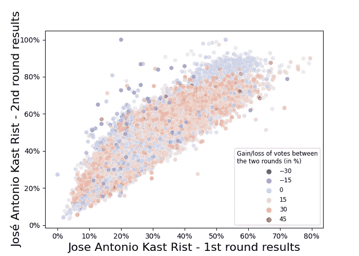
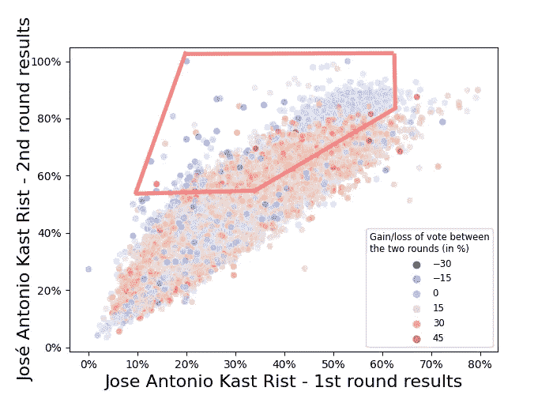
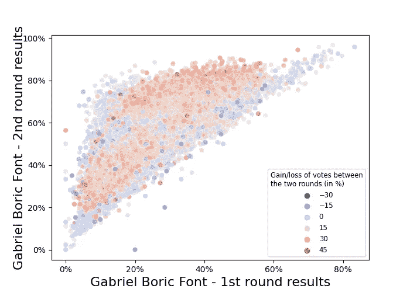
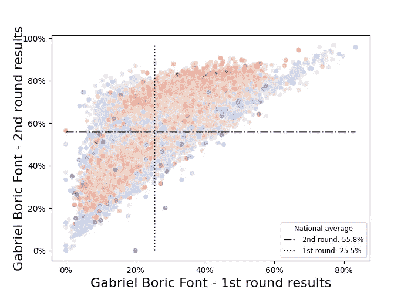
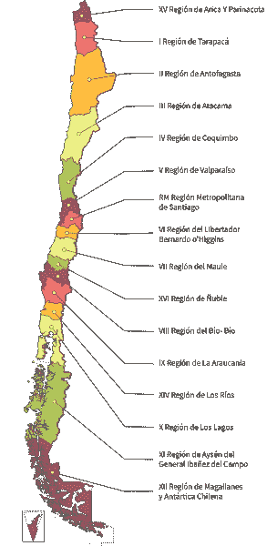
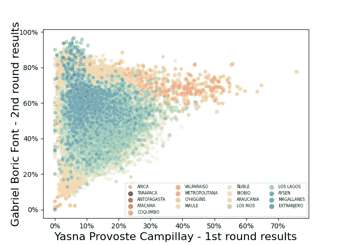

# 可视化选举数据:2021 年智利总统选举期间的极化和动员

> 原文：<https://towardsdatascience.com/visualizing-electoral-data-polarization-and-mobilization-during-the-2021-chilean-presidential-528230a98232>

## **智利上届总统选举案例研究**

12 月 21 日发生了智利历史上最具争议的总统选举。两轮投票制度将所有传统政党置于相当长时间未见的政治对抗背景之下，导致传统政党丧失资格。

但本文的目的不是讨论政治。相反，它是关于调查这次选举的一个有趣的事实:根据[国家选举服务局(SERVEL)](https://www.servel.cl/resultados-en-excel-por-mesa-a-partir-del-ano-2012/) 的数据，在两轮选举之间，表达选票的数量(即，非空白或无效的)大幅增加，从 7028345 张表达选票增加到第二轮的 8271893 张。增长了 17.7%，差不多 125 万张选票！

智利的弃权率通常很高。选民登记册统计了 1500 万选民，其中只有 47.5%参加了第一轮投票，55.9%参加了第二轮投票，但这被认为是该国最好的成绩之一。然而，我将只关注明示投票的增加，因为弃权背后的原因是一个完全不同的问题，我不会在这里处理。

如我所说，这些选举是高度两极化的。第二轮投票的增加有利于获胜的候选人加布里埃尔·硼酸。为了仔细研究这一现象，我分析了 SERVEL 的投票数据，这些数据为我们提供了全国和海外所有 46，888 个投票点的详细信息:每个候选人获得的票数、空白和无效票、弃权、地点、性别等。

提醒一下，在所有事情之前，我们先列出两轮的所有候选人，以及他们各自的分数。Gabriel Boric Font 在第二轮选举中获得 55.87%的选票，击败了获得 44.13%选票的 José Antonio Kast。

在第一轮投票中，José Antonio Kast 获得 27.91%的选票，Gabriel Boric 获得 25.83%的选票，位居第二。其余的候选人是弗朗西斯科·帕里西(12.80%)、塞巴斯蒂安·西谢尔(12.78%)、亚斯纳·普罗沃斯特(11.60%)、马尔科·恩里克斯·奥米纳米(7.60%)和爱德华多·阿特斯(1.47%)。

```
# libraries used
import numpy as np
import pandas as pd
import matplotlib.pyplot as plt
from matplotlib.pyplot import cm
from matplotlib.ticker import PercentFormatter
import seaborn as sn# preparation of the data includes:
   # importing [first-round](https://www.servel.cl/resultados-definitivos-eleccion-presidencial-parlamentarias-y-de-consejeros-as-regionales-2021/) and [second-round](https://www.servel.cl/resultados-definitivos-elecciones-segunda-votacion-presidencia-2021/) datasets
   # joining data from polling places within the country and abroad 
   # cleaning the data
   # counting total number of *expressed* ballots per polling station
    (abstention and blank/invalid votes are not taken into account)
   # computing percentage of each candidate in each polling station
   # returning a NumPy array of all 46,888 scores (one per polling
     station), for both the 7 first-round candidates and the 2
     second-round candidates 
   # calculating the difference of expressed votes between the two
     rounds to measure the electoral mobilization in each polling 
     station. Outliers are set to a limit to narrow the
     spread of the array when plotted as a heatmap# all operations are regularly asserted throughout the script to be consistent with the totals provided by SERVEL in a separate sheet. # the detailed script is available on [GitHub](https://github.com/louisleclerc/SERVEL_Data_Analysis/blob/main/SERVEL_EDA.py).
```

# 比较全国各投票站的第一轮和第二轮投票结果。

对于七名候选人中的每一名，我根据候选人在所述投票地点获得的分数在散点图的 x 轴上显示投票地点。每个投票点根据第二轮得分沿 y 轴移动，看看这个投票点的选民对第二轮对决的反应。

```
*# candidate is an array of scores of the 1st-round candidate 
# candidate2 is an array of scores of the 2nd-round candidate
#* diff_votes_perc *is an array of the differences of expressed votes between the two rounds*# plot 
sns.scatterplot(
x=candidate, 
y=candidate2, 
hue=diff_votes_perc, 
palette='coolwarm', 
alpha=0.5, 
ax=ax
)# legend
ax.legend(
title=f'Gain/loss of votes between\nthe two rounds (in %)', 
title_fontsize='small', 
fontsize='small'
)
```

候选人的选民由最右边的投票站组成，那里第一轮投票的得分最高。这些选民在 y 轴上的位置揭示了他们在第二轮投票中的表现。换句话说，它表明第一轮候选人的选民支持两个决选候选人中的一个。

图表还显示了每个投票站的选举动员情况。根据热图逻辑，点的颜色表示第一轮和第二轮之间表达投票的数量是增加还是减少:暖红色表示动员力度很大，而冷蓝色表示参与度下降。

```
*# check distribution of the difference of expressed ballots array
plt.hist(diff_votes_perc)
plt.show()**# narrow range of the array to avoid outliers* 
diff_votes_perc = np.where(
diff_votes_perc < -30, -30, diff_votes_perc
)
diff_votes_perc = np.where(
diff_votes_perc > 55, 55, diff_votes_perc
)
```

这样，图表不仅能告诉我们第一轮候选人的选民是否团结一致，还能告诉我们支持者是否热情。

让我们看一个例子来澄清这一点，例如，比较传统右翼候选人 sebastán Sichel 在第一轮和极右翼候选人 José Antonio Kast 在第二轮中获得的分数的图表。



作者图片

在图的右上方有一堆蓝色的点，从中我们可以得出两个结论:

*   首先，关于何塞·安东尼奥·卡斯特在第二轮中是否获得支持。Sichel 登记其最佳结果的投票站(x 轴右侧)在第二轮投票中投票支持 Kast 轴顶部)。换句话说，西谢尔的选民在第二轮选举中支持了卡斯特。
*   第二，关于这种支持的热情。蓝色的流行表明选举复员，因为在两轮选举之间丢失了明示选票。换句话说，西谢尔的选民向卡斯特提供了“复员支持”。

# 将决选候选人与他们自己进行比较

当我们比较同一候选人在第一轮和第二轮之间的分数变化时，这变得更加有趣。因此，我们只能与进入第二轮的候选人进行比较。

看候选人的选民是否在两轮选举中都支持他有什么意义？

这可能看起来违反直觉，因为我们可以合理地预期在第一轮投票中大量投票给候选人的投票站会在第二轮投票中投票给同一个候选人。

作为示范，让我们先来看看那些大量投票给 Kast 的投票站，他是落败的决选候选人。



作者图片

它看起来像一个密集的蜂群，顶部有一个肿胀。

散点图的线性形状表明他的选民是稳定的:在第一轮投票中投票给他的地方越多，在第二轮投票中大量投票给他的可能性就越大。

也有例外。一些地方在第二轮强烈投票给卡斯特，得分高达 100%，尽管他的首轮得分很低。但是我们谈论的只是总数为 46，888 个投票站中很少的几个投票站，而且通常是以被遣散的选民为代价的，正如蓝色圆点所示。

从这张图表中得出的最重要的结论并不那么引人注目。肿胀的大小没有那么大，尤其是左边。但左上/中上部分可能恰恰是胜利所在。在选举中，把第一轮没有投票给你的选民聚集起来是至关重要的。那些选民应该正好出现在红色所画的数字之内。



作者图片

# 选举爆发到胜利

为了更好地说明选举爆发的概念，现在让我们看看获胜候选人的得分。



作者图片

肿胀更明显，布满小点。它由两部分组成:左边的蓝色部分，在第二轮投票中强烈支持硼酸，但被遣散；另一个更大的红色部分，强烈动员支持硼酸。

让我们显示与 Boric 在每一轮中获得的全国平均分数完全相同的数字。

```
*# get max values of the data to get limit coordinates* X_max = float(max(candidate))
Y_max = float(max(candidate2))

*# plot, same as before* sns.scatterplot(
x=candidate, 
y=candidate2, 
hue=diff_votes_perc, 
palette='coolwarm', 
alpha=0.5, 
ax=ax
)*# compute national averages of candidates* cand2_mean = float(np.mean(candidate2))
cand_mean = float(np.mean(candidate))# compute number of polling places
nb_pp = int(len(SERVEL_data) / 7)*# plot national average of 2nd-round candidate* X_plot = np.linspace(0, X_max, nb_pp)
Y_plot = np.linspace(cand2_mean, cand2_mean, nb_pp)
ax.plot(
X_plot, 
Y_plot, 
color='black', 
linestyle='-.', 
label=f'{candidate2name}\n2nd round: {round(cand2_mean,1)}%'
)*# plot national average of 1st-round candidate* X_plot2 = np.linspace(cand_mean, cand_mean, nb_pp)
Y_plot2 = np.linspace(0, Y_max, nb_pp)
ax.plot(
X_plot2, 
Y_plot2, 
color='black', 
linestyle=':', 
label=f'{candidate1name}\n1st round: {round(cand_mean, 1)}%'
)
```



作者图片

右上角的四分之一收集了所有投票点，这些投票点在两轮投票中投票给 Boric 的人数都超过了全国平均水平。与卡斯特的图相比，我们可以看到它不是线形的。相反，扩大到顶部的红色爆发突出了有利于硼酸的动员。

左上方的四分之一也很有见地。它收集了所有在第一轮投票中没有给 Boric 投多少票的地方，少于全国平均水平。然而，在第二轮投票中，这些投票站明显支持他。他们动员了更多，如红色所示。

图表上部有很多红色的事实强调了 Boric 的当选是由于一个关键的选举动员，远远超出了他最初的选民范围。这一结论与他虽然在第一轮中名列第二，却以微弱优势赢得选举的事实是一致的。

相反，请记住，卡斯特的膨胀几乎是空的，充满了复员的投票站，这意味着他未能吸引选民以外的选民。

# 把所有的放在一起

这是第一轮所有七名候选人的完整数据。对于其中的每一个，都有相同数据的三个视图:

*   **表示每个投票站的投票数**，第一轮和第二轮候选人的全国平均分。没有基于颜色的信息来关注群体的形状和平均值是如何定位的。
*   **两轮**选举动员热图。这就是我们到目前为止看到的视觉效果。
*   **按地区投票**。另一种我遇到过最奇怪挑战的信息显示:根据两种不同类型的编号对区域进行排序(一些根据地理位置，另一些根据创建日期)。

作者提供的图片

下面是生成这些图的脚本。首先，我们定义候选对象并设置图形的一般特征。由于只显示了三个支线剧情，我们可以在右上角放置一个定制的图例，而不是第四个。

```
for i, candidate in enumerate(
[Boric, Kast, Provoste, Sichel, Artés, Ominami, Parisi]
):
    fig, axs = plt.subplots(2, 2, figsize=[15,10])

    *# extract name of the 1st round candidate* candidate1name = names[i].title()

    *# define candidate 2nd round to compare to* if i == 1 or i == 3:
        candidate2name= 'José Antonio Kast Rist'
        candidate2 = Kast2
    else:
        candidate2name= 'Gabriel Boric Font'
        candidate2 = Boric2

    *# format x and y axis in percentages* for a, b in [(0,0), (0,1), (1,0), (1,1)]:
        axs[a][b].xaxis.set_major_formatter(PercentFormatter())
        axs[a][b].yaxis.set_major_formatter(PercentFormatter())

    *# put the title in the second plot* axs[0][1].annotate(
text=f"2nd round behavior of\n{candidate1name}'s electorate",
xy=[0.5,0.8], 
horizontalalignment='center', 
fontsize=20, 
fontweight='bold'
) *# add general description
*    axs[0][1].annotate(
text='Comparison of the results obtained at each round of the\n2021 Chilean presidential elections (by polling station)',
xy=[0.5,0.6],
horizontalalignment='center',
fontsize=12,
fontstyle='italic'
) *# annote customized legend*
    axs[0][1].annotate('Legend:\n'
              '1 - Expressed votes per polling station (in %)\n'
              '2 - Electoral mobilization between the two rounds\n'
              '3 - Vote per region',
xy=[0.05,0.05], 
horizontalalignment='left', 
fontsize=12, 
fontweight='light',
backgroundcolor='white', 
bbox=dict(edgecolor='black', facecolor='white',boxstyle='round')
) *# fetch limit coordinates of each plot* 
    X_max = float(max(candidate))
    Y_max = float(max(candidate2)) *# put numbered references of the legend in the upper-right corner of each subplot*    axs[0][0].annotate(
text='1', 
xy=[X_max,90], 
color='darkred', 
fontsize=20, 
fontweight='black'
)
    axs[1][0].annotate(
text='2', 
xy=[X_max,90], 
color='darkred', 
fontsize=20, 
fontweight='black'
)
    axs[1][1].annotate(
text='3', 
xy=[X_max,90], 
color='darkred', 
fontsize=20, 
fontweight='black'
) # hide axis
    axs[0][1].axis('off')

    *# set labels of the general figure* fig.supylabel(
f'{candidate2name} - 2nd round results', 
fontsize=16, 
ha='center', 
va='center'
)
    fig.supxlabel(
f'{candidate1name} - 1st round results', 
fontsize=16, 
ha='center', 
va='center'
)
```

我们现在用全国平均值生成散点图。提醒一下，我们还是在同一个“for 循环”里。

```
 *# plot comparison of expressed votes in the first subplot* sns.scatterplot(
x=candidate, 
y=candidate2, 
color=colors[i], 
alpha=0.3, 
ax=axs[0][0]
)*# define variables to plot national averages of candidates* cand2_mean = float(np.nanmean(candidate2))
    cand_mean = float(np.nanmean(candidate))
    nb_pp = int(len(SERVEL_data) / 7) *# plot national average of 2nd-round candidate* X_plot = np.linspace(0, X_max, nb_pp)
    Y_plot = np.linspace(cand2_mean, cand2_mean, nb_pp) axs[0][0].plot(
X_plot, 
Y_plot, 
color='black', 
linestyle='-.', 
label=f'{candidate2name}\n2nd round: {round(cand2_mean,1)}%'
) *# plot national average of first-round candidate* X_plot2 = np.linspace(cand_mean, cand_mean, nb_pp)
    Y_plot2 = np.linspace(0, Y_max, nb_pp) axs[0][0].plot(
X_plot2, 
Y_plot2, 
color='black', 
linestyle=':', 
label=f' {candidate1name}\n1st round: {round(cand_mean, 1)}%'
)
    axs[0][0].legend(
fontsize='small', 
title='National average', 
title_fontsize='small'
)
```

然后是我们已经看到的选举动员热图。

```
*# plot electoral mobilization in the third subplot* sns.scatterplot(
x=candidate, 
y=candidate2, 
hue=diff_votes_perc, 
palette='coolwarm', 
alpha=0.5, 
ax=axs[1][0]
) *# legend with total number of votes in both rounds, as well as increase of participation in %* axs[1][0].legend(
title=f'Gain/loss of votes between\nthe two rounds (in %)', title_fontsize='small', 
fontsize='small'
)
```

# 智利是少数几个地区可以是数字变量而不是分类变量的国家之一。

最后，一个奖励区域图。对于那些不熟悉智利地理的人来说，它是世界上从北到南最长的国家，长达 4270 公里。

它从北方世界上最干燥的沙漠到南方的南极，汇集了各种气候。但是它很窄，夹在大海和雄伟的安第斯山脉之间。所以平均来说，它只有 177 千米大。

区域堆叠在另一个之上，并且在地图上没有出现精确的东/西分层。我们可以利用这种特殊的地理位置，根据点在南北轴上的位置，将颜色的深浅归属于这些点。毕竟，智利在某种程度上像一个轴心！



来自维基共享

换句话说，我们可以从数字上对智利的地区**进行排序**。能做到这一点的国家并不多！在大多数国家，区域布局的彩色图将是**分类图**，不太可能提供重要的视觉洞察。

因此，我们可以将智利的地理数据显示为从北到南的阴影。这种散点图让我们一眼就能看出投票站的大概位置。这为一些候选人带来了一些有趣的见解，比如帕里西和普罗沃斯特，他们的选民位于智利北部。


作者图片



作者图片

所以，回到剧本上。我们希望区域从北到南排序。好消息是，它们被编号了，显然是从北到南。但是如果你看看上面智利地区的地图，你会发现并不是所有的编号都有意义。

智利在几个场合创造了新的区域。这是一个棘手的问题！最初，给第一批地区编号的标准是它们的地理位置。但是几个新的区域同时产生了，它们的排名来自于它们产生的顺序，而不是它们的地理位置。

我们可以想象从北到南正确排序所有区域的许多方法，但也可以通过索引、压缩和 NumPy 手动完成。

```
 *# plot votes according to region in the last subplot
    # a reordering the position to the north is necessary to create a readable heatmap* *# instantiate a list with the result of* regions = np.unique(location_array) *# zip the region list with a list of their respective position starting from the north* north_to_south = [3, 1, 4, 15, 5, 12, 14, 13, 16, 2, 6, 10, 11, 8, 9, 17, 7]
    region_position = zip(regions, north_to_south) *# create an array of the regional position of each polling place* position_array = np.empty(len(location_array))
    for region, position in region_position:
        position_array[location_array == region] = position *# stack all arrays of interest into a single one* ordered_array = np.column_stack(
[candidate, candidate2, position_array]
) *# sort array according to the regional position*    sorted_array = ordered_array[
np.argsort(ordered_array[:,2])
] *# create plot* sns.scatterplot(
x=sorted_array[:,0], 
y=sorted_array[:,1], 
hue=sorted_array[:,2].astype('<U44'), 
palette='Spectral', 
alpha=0.4, 
ax=axs[1][1]
)
    *# readjust labels from north to south* location_labels = [
'ARICA', 
'TARAPACA', 
'ANTOFAGASTA', 
'ATACAMA', 
'COQUIMBO', 
'VALPARAISO', 
'METROPOLITANA',
"O'HIGGINS", 
'MAULE', 
'ÑUBLE', 
'BIOBIO', 
'ARAUCANIA', 
'LOS RIOS', 
'LOS LAGOS', 
'AYSEN',
'MAGALLANES', 
'EXTRANJERO'
]
    axs[1][1].legend(
labels = location_labels, 
ncol=4, 
fontsize='xx-small'
)
```

# 走得更远

这份分析没有涵盖很多内容，比如弃权背后的原因。但是这一数据可以用来提供另一项关于基于性别的投票的研究，因为除了国外的投票站之外，性别数据是可以获得的。

将性别数据与动员图进行比较可能会很有趣，因为据说 Boric 赢得了第二轮投票，这要归功于年轻女性选民的大力动员。

尽管选举发生在去年 12 月，案例研究来得有点晚，但在智利另一场关键选举即将到来的情况下分析这些数据仍然很有趣:9 月 4 日的宪法公投。

*此处可用*<https://medium.com/@louisleclerc/una-visualizaci%C3%B3n-de-datos-electorales-polarizaci%C3%B3n-y-movilizaci%C3%B3n-durante-las-elecciones-5315435af9b7>**翻译成西班牙语。**

**上一届法国总统选举后的一个形象化的* [*《世界报》*](https://www.lemonde.fr/les-decodeurs/article/2022/05/04/election-presidentielle-2022-quels-reports-de-voix-entre-les-deux-tours_6124672_4355770.html) *启发了这个案例研究。**