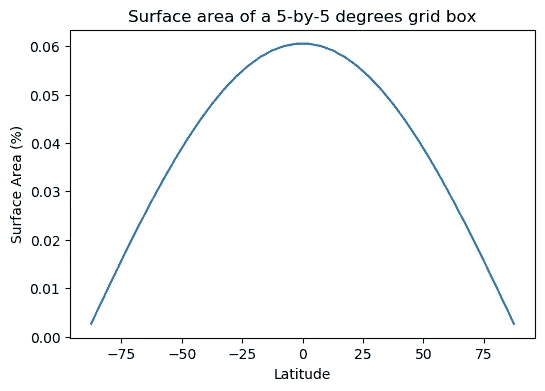
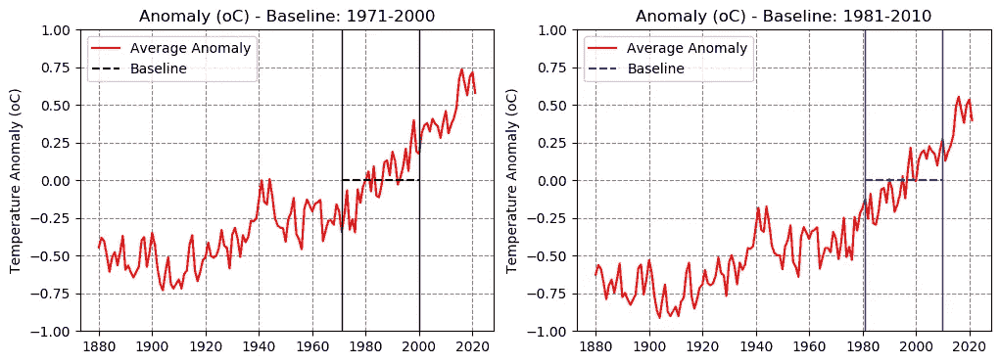
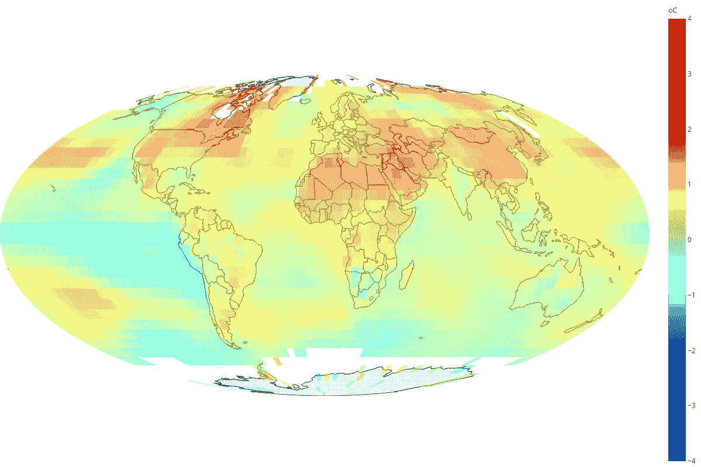
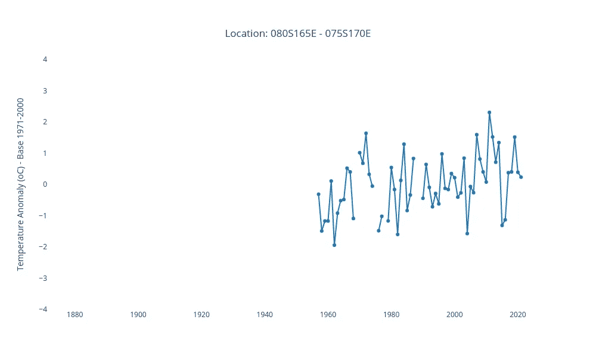
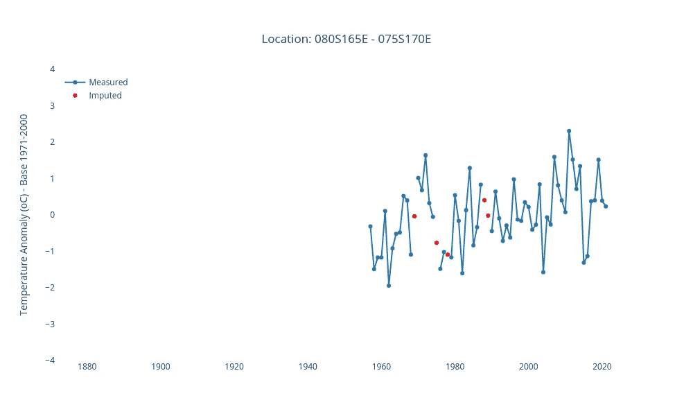
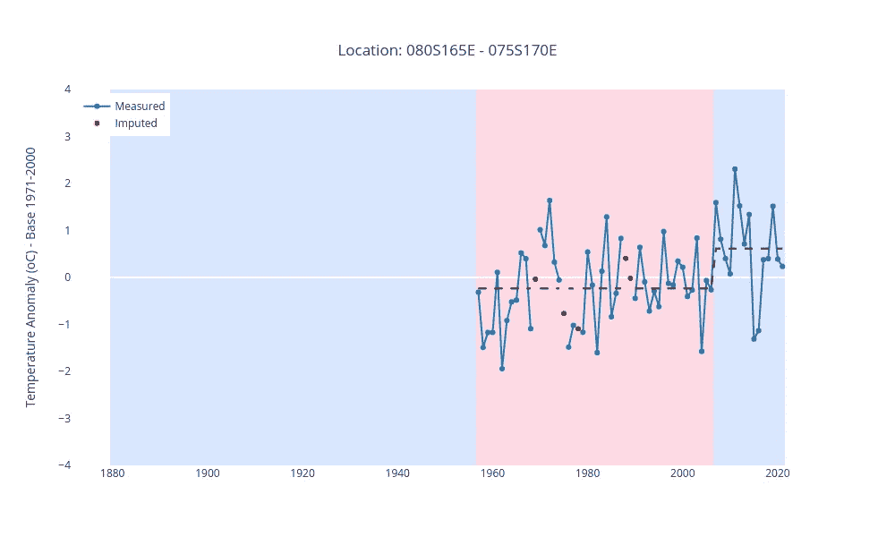
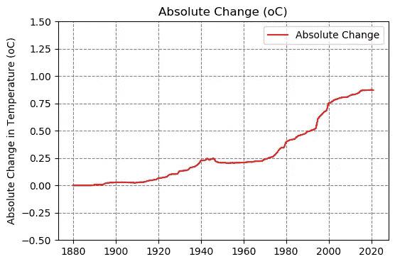
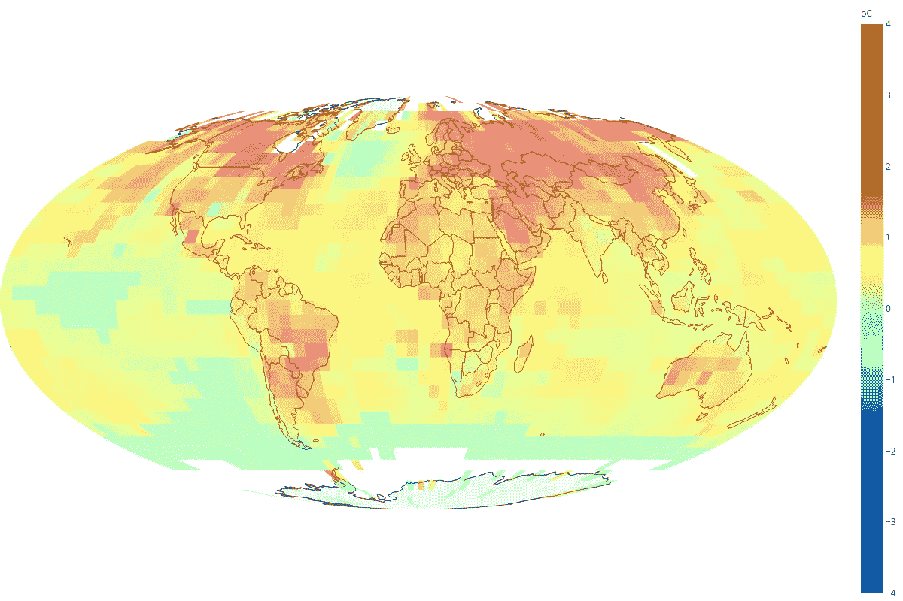
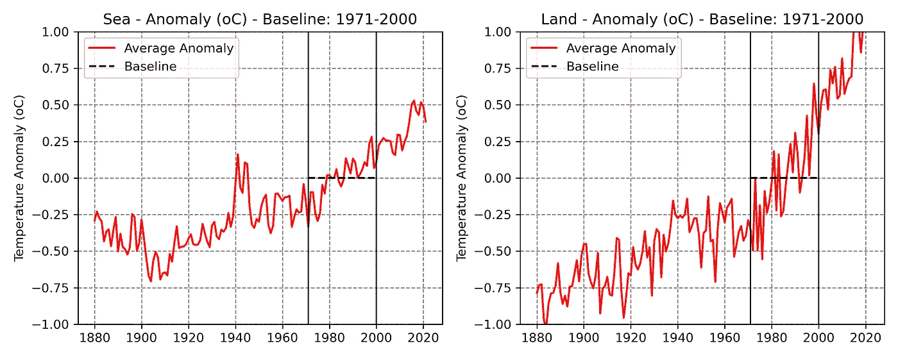
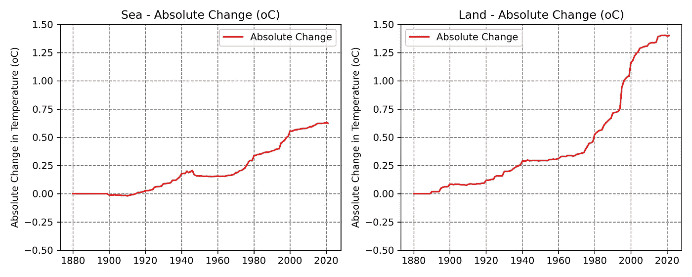

# 可视化全球变暖

> 原文：<https://towardsdatascience.com/visualizing-global-warming-832111f9891f>

## 走向温度变化的绝对测量

这个星球正在升温。多少钱？有多快？在媒体上，你会读到这个星球平均比一个世纪前高 1 摄氏度。你也会读到陆地变暖的速度比海洋快。但这些只是平均值；他们忽略了细节。

虽然互联网上有许多有趣的可视化工具，但我错过了一个真正互动的工具。我想点击地球上的任何一个地方，亲眼看看它的温度是如何随着时间的推移而变化的。

因此，我建立了自己的网站——[加热星球](https://heatingplanet.org)——试图通过数据分析和可视化更好地了解我们加热星球的动态。

> **免责声明:**我是**不是**气象学家/气候科学家。


[heatingplanet.org](https://heatingplanet.org)截图——来源:图片由作者生成

你可以用一个[谷歌 Colab 笔记本](https://colab.research.google.com/github/dvgodoy/AccompanyingNotebooks/blob/main/Visualizing%20Global%20Warming.ipynb)跟随。

# 动机

我总是对任意选择基线来计算平均温度异常感到有点恼火。当然，我知道图本身不会改变，不同的基线只会移动垂直轴，因为*零点*取决于用作基线的时间跨度。

尽管如此，并不是每个人都能轻易看穿。我一直认为这是对试图了解更多全球变暖知识的人的一种伤害，因为它给读者带来了负担。

更糟糕的是，NOAA 的网站甚至让经验丰富的专业人士感到非常困惑，当它提到，字面上，**四个**不同的跨度来引用相同的数据！

在与我们在此使用的数据 [GHCN 网格产品](https://www.ncei.noaa.gov/access/monitoring/ghcn-gridded-products/)相对应的页面中，我们看到:

*   [地图中的 1991 年到 2020 年](https://www.ncei.noaa.gov/access/monitoring/ghcn-gridded-products/)
*   [数据集开发](https://www.ncei.noaa.gov/access/monitoring/ghcn-gridded-products/development)中的 1961 年至 1990 年和 1981 年至 2010 年
*   [数据存取](https://www.ncei.noaa.gov/access/monitoring/ghcn-gridded-products/data-access)中的 1971 年到 2000 年，数据实际调整到的那个

此外，鉴于数据集的本质，NOAA 在[注释](https://www.ncei.noaa.gov/access/monitoring/ghcn-gridded-products/note)部分建议:

> *"* 开发这些网格数据集是为了尽可能产生最准确的时间序列。然而，这要求月份和网格框在时间上被独立处理。使用这些数据集最适合于分析一个特定的网格箱或一组网格箱几年内的温度变化。

*这是有道理的，因为不同的地方表现出非常不同的天气和温度模式，而且*更糟糕的是*，随着时间的推移，它们受到全球变暖的影响也不同。*

*比较和汇总它们的唯一合理的方法是试图找到它们自己的**基线**。*

***基线**代表在被全球变暖影响修改/扰乱之前**给定位置的典型温度模式。***

*不管用于计算温度异常的时间跨度是多少，都应该可以找出某一特定时间段内给定位置的*典型*温度。*

*一旦建立了该温度水平，我们可以寻找对应于温度状态变化的**变化点**。*

*与基线(第一次观察到的状态)相比，变化状态下的(相对)温度为我们提供了该区域**绝对变化**的指示。*

*这就是我们的目标！*

> ***免责声明**:我**不是**气象学家或气候科学家！作为一名数据科学家和开发人员，我正在使用我所掌握的工具，试图更好地理解全球变暖的动态，同时解决困扰我多年的一个棘手问题！*

*出于这个原因，我免费提供所有代码，如果你愿意，我邀请你使用不同的参数和假设亲自尝试一下。*

***剧透预警**:我尝试了很多不同的参数进行变点检测和插值算法，结果几乎纹丝不动。*

# *数据*

*我们使用的数据来自 NOAA 的国家环境信息中心(NCEI)。*

*数据*使用 GHCN 版本 5.0.0 的陆地和海洋温度异常网格文件*，显示了相对于 1971-2000 年平均温度的温度异常，以摄氏度为单位，用于每个 5x 5 网格框，可在此直接访问[。](https://www.ncei.noaa.gov/access/monitoring/ghcn-gridded-products/data-access)*

*`download()`函数从 NOAA 检索数据，`noaa_temperatures()`返回一个 3D Numpy 数组，其中包含每个网格框(36 x 72 个框)的年平均值。可以将温度异常的基线从默认的 1971-2000 年调整到任何其他年份(它使用了几个函数，`surface_polygons()`、`surface_area()`和`surface_stat()`，这些将在下一节“网格和投影”中解释)，坚持住！)*

*`noaa_temperatures()`函数故意使用`np.mean`(而不是`np.nanmean`)！如果给定年份中任何一个月的数据缺失，则整年都被视为缺失，否则平均值会有偏差。*

```
*fname = download()
griddedy = noaa_temperatures(fname, yearly=True)
griddedy.shape*
```

```
*(142, 36, 72)*
```

*该数据集涵盖了从 1880 年到 2021 年的 142 年时间。*

*如果您看一下`noaa_temperatures()`函数，您可能会注意到基线调整使用网格框的表面积来计算温度的加权平均值。*

*这是重要的一步，也是选择可视化投影的基本原理，我们将在下一节中看到。*

# *网格和投影*

*默认投影是 [Mollweide](https://en.wikipedia.org/wiki/Mollweide_projection) 投影，因为它是等面积投影，也就是说，它保留了网格框的相对大小。赤道线上的 5 乘 5 格网框大约比两极之一的 5 乘 5 格网框大 23 倍，在计算全球异常平均值时应考虑到这一点。*

**

*莫尔韦德投影—来源:图片由作者生成*

*以下函数计算每个 5x 5 度格网框中包含的地球表面的百分比:*

```
*polygons = surface_polygons(grid_size=5)
surface_perc = surface_area(polygons, perc=True)*
```

*在每个网格框中心的纬度上使用简单的余弦函数可以获得相同的结果，NOAA 称之为[余弦加权](https://www.ncei.noaa.gov/access/monitoring/ghcn-gridded-products/global-average):*

```
*lat = np.linspace(-87.5, 87.5, 36)
cosines = np.cos(lat/180*np.pi)
cosines = cosines/(72*cosines.sum())*
```

**

*网格框的表面积占全球纬度面积的百分比——来源:图片由作者生成*

# *温度异常*

*现在我们可以计算平均全球异常加权的网格盒的表面积，不计算丢失的数据。*

*这些是相对于 1971-2000 年平均值的全球平均异常值:*

```
*avg_temp = surface_stat(griddedy, surface_perc)
avg_temp*
```

```
*array([-0.49040517, -0.42640984, -0.4501344 , -0.54361733, -0.65312965, 
       -0.55727405, -0.52217539, -0.60998217, -0.52090297, -0.41504064,
       -0.63962642, -0.60986579, -0.65473334, -0.69056367, -0.65487515,
       -0.62069087, -0.44596375, -0.42243461, -0.62026229, -0.52627162,
       -0.39377437, -0.47255557, -0.63087155, -0.73131404, -0.77620984,
       -0.65267418, -0.55622029, -0.73383994, -0.76423131, -0.73207139,
       -0.70305171, -0.76428098, -0.66780868, -0.64435368, -0.47254251, 
       -0.41023309, -0.64005227, -0.71519683, -0.65357198, -0.57490523,
       -0.5554808 , -0.45848703, -0.5467363 , -0.56028976, -0.54642186,
       -0.49404915, -0.37506068, -0.47987741, -0.49419296, -0.63032366,
       -0.40723178, -0.36059279, -0.43182238, -0.55395911, -0.40894764,
       -0.45732789, -0.4206011 , -0.31420012, -0.31789399, -0.30104638,
       -0.17343342, -0.04507401, -0.18998909, -0.20513829, -0.03826748,
       -0.1500386 , -0.29561027, -0.34690677, -0.35984154, -0.36330008,
       -0.45330106, -0.30084738, -0.26084233, -0.16263568, -0.40363231,
       -0.43880239, -0.50342084, -0.23517682, -0.17391467, -0.21231317,
       -0.25260908, -0.20197015, -0.19219163, -0.17505876, -0.4492755 ,
       -0.37807454, -0.31324477, -0.31261297, -0.34156166, -0.20498813,
       -0.25041461, -0.38749686, -0.27546437, -0.11170245, -0.37279272,
       -0.30405625, -0.39141602, -0.10668805, -0.19571924, -0.08526681,
       -0.04434497,  0.01278888, -0.11869109,  0.04697251, -0.14785713,
       -0.15757651, -0.07080541,  0.07593977,  0.08581962, -0.01262859,
        0.14421966,  0.0828533 , -0.07326519, -0.02707226,  0.04222761,
        0.16466974,  0.01674365,  0.21072811,  0.35305309,  0.14390712,
        0.12960248,  0.27025706,  0.31848434,  0.33468245,  0.27861425,
        0.36319536,  0.32961664,  0.312321  ,  0.23507969,  0.33654589,
        0.41432372,  0.26552093,  0.32406343,  0.3662596 ,  0.4349947 ,
        0.62627734,  0.6920348 ,  0.59963278,  0.51818839,  0.63898567,
        0.67217742,  0.53352703])*
```

*注意:如果你计算从 1971 年到 2000 年(`avg_temp[91:120].mean()`)的平均值，它不会像人们预期的那样精确地得出**零度**，而是 **-0.0518** 度。不幸的是，我想不出为什么 NOAA 的数据会出现这种情况。*

```
*avg_temp[91:120].mean()*
```

```
*-0.051824857209641896*
```

*除了这一微小的差异之外，用来计算全球异常的平均窗口的选择是任意的。正如在动机中提到的，这是我的**烦恼**，因为如果基线不断变化，就很难提出观点。*

*如下图所示，例如，从 1971–2000 年到 1981–2010 年的变化仅改变了 y 轴**:整个图向下移动了大约 **0.18 度**，但是图中两点之间的任何**差异保持不变**。***

> *所以，**用哪个基线**不重要，2021 年和 1880 年全球气温差是一样的: **1.02 度**。*

*尽管如此，对温度随时间的变化进行绝对测量还是很有帮助的。这就是我们在这里努力实现的目标。*

**

*使用不同基线的温度异常—来源:图片由作者生成*

*然而，平均数并不能说明全部情况。更有趣的是观察记录在每个网格盒上的温度异常。*

**

*全球气温异常——来源:图片由作者生成*

*上面的图不是交互式的，但是如果我们观察单独的网格框，我们会发现它们中的许多都有许多缺失的数据点。这完全在意料之中，因为数据不是在 19 世纪末或 20 世纪初的偏远地区收集的。*

# *时间序列*

*让我们来看看南极洲附近的一个网格盒子。它的测量始于 20 世纪 50 年代末，有几年遗漏了。*

**

*单个网格单元的温度异常——来源:图片由作者生成*

# *缺失数据插补*

*我们需要采取的第一步是估算一些缺失数据。我们将使用一些简单的线性插值，但仅在数据中的**间隙**不太长的情况下。*

*这是对应于上图的 Numpy 数组:*

```
*gy, gx = 33, 69
signal = griddedy[:, gy, gx]
signal*
```

```
*array([nan, nan, nan, nan, nan, nan, nan, nan, nan, nan, nan, nan, nan, nan,
       nan, nan, nan, nan, nan, nan, nan, nan, nan, nan, nan, nan, nan, nan,
       nan, nan, nan, nan, nan, nan, nan, nan, nan, nan, nan, nan, nan, nan, 
       nan, nan, nan, nan, nan, nan, nan, nan, nan, nan, nan, nan, nan, nan,
       nan, nan, nan, nan, nan, nan, nan, nan, nan, nan, nan, nan, nan, nan,
       nan, nan, nan, nan, nan, nan, nan, 
      -0.3141667 , -1.4891667 , -1.1691667 , -1.17      ,  0.10916665,
      -1.9425001 , -0.9183333 , -0.52      , -0.4816667 ,  0.5216667 ,
       0.40083337, -1.09      , nan        ,  1.0158335 ,  0.6791666 ,
       1.6383333 ,  0.32500005, -0.05333332, nan        , -1.4816666 ,
      -1.0191666 , nan        , -1.1666666 ,  0.5425    , -0.16333331,
      -1.6008333 ,  0.13083331,  1.29      , -0.83666664, -0.3374999 ,
       0.83083344, nan        , nan        , -0.44333336,  0.6416666 ,
      -0.09333333, -0.715     , -0.28833324, -0.6225    ,  0.97749996,
      -0.12583338, -0.16166663,  0.34833336,  0.21833332, -0.405     ,
      -0.26833335,  0.8408334 , -1.5741667 , -0.065     , -0.26250002,
       1.5941668 ,  0.81333333,  0.40083334,  0.07666666,  2.3058333 ,
       1.5224999 ,  0.71333337,  1.3391666 , -1.3108333 , -1.1324999 ,
       0.37750006,  0.40166667,  1.5166665 ,  0.39000002,  0.23416667], 
dtype=float32)*
```

*除了最初的 77 年，没有任何测量数据，只有五个测量数据缺失:其中三个是单一年份，另外两个是连续年份。*

*显然，我们对最初的 77 年无能为力，但我们可以用线性插值来填补其他五个缺失点。下面的函数`bounds()`返回 Numpy 数组的第一个和最后一个索引，该数组包含可用作插补基础的最长数据点序列。*

*让我们创建三个虚拟数组来说明上面的函数是如何工作的。*

```
*dummy1 = np.ones(15)
dummy1[2:5] = np.nan
dummy1, bounds(dummy1)*
```

```
*(array([ 1.,  1., nan, nan, nan,  1.,  1.,  1.,
         1.,  1.,  1.,  1.,  1.,  1.,  1.]), (0, 15))*
```

*这是一个简单的例子:只有三个连续数据点的间隙(因此低于默认的阈值 5)，所以我们可以使用整个序列(start=0，end=15)并估算这三个值。*

```
*dummy2 = np.ones(15)
dummy2[2:8] = np.nan
dummy2, bounds(dummy2)*
```

```
*(array([ 1.,  1., nan, nan, nan, nan, nan, nan,  
         1.,  1.,  1.,  1.,  1.,  1.,  1.]), (8, 15))*
```

*第二个序列有六个连续的缺失点，所以它们不会被估算，我们将只考虑从第 9 个数据点开始的序列(索引=8)。*

```
*dummy3 = np.ones(15)
dummy3[2:5] = np.nan
dummy3[8:14] = np.nan
dummy3, bounds(dummy3)*
```

```
*(array([ 1.,  1., nan, nan, nan,  1.,  1.,  1., nan,
         nan, nan, nan, nan, nan,  1.]), (0, 8))*
```

*第三个例子有点奇怪，因为在它的结尾有六个连续的缺失点。因此，我们可以使用的最长序列实际上在第 9 个数据点结束(索引=8)。这是一个相当罕见的情况，因为大多数网格盒只有在早些年丢失的数据点。*

*在我们的真实例子中，我们可以使用从 1957 年到 2021 年的序列:*

```
*ini, end = bounds(signal, max_contiguous_na=5)
ini, end, signal[ini:end]*
```

```
*(77, 142, 
array([-0.3141667 , -1.4891667 , -1.1691667 , -1.17      ,  0.10916665, 
       -1.9425001 , -0.9183333 , -0.52      , -0.4816667 ,  0.5216667 ,
        0.40083337, -1.09      ,         nan,  1.0158335 ,  0.6791666 ,
        1.6383333 ,  0.32500005, -0.05333332,         nan, -1.4816666 ,
       -1.0191666 ,         nan, -1.1666666 ,  0.5425    , -0.16333331,
       -1.6008333 ,  0.13083331,  1.29      , -0.83666664, -0.3374999 ,
        0.83083344,         nan,         nan, -0.44333336,  0.6416666 ,
       -0.09333333, -0.715     , -0.28833324, -0.6225    ,  0.97749996,
       -0.12583338, -0.16166663,  0.34833336,  0.21833332, -0.405     ,
       -0.26833335,  0.8408334 , -1.5741667 , -0.065     , -0.26250002,
        1.5941668 ,  0.81333333,  0.40083334,  0.07666666,  2.3058333 ,
        1.5224999 ,  0.71333337,  1.3391666 , -1.3108333 , -1.1324999 ,
        0.37750006,  0.40166667,  1.5166665 ,  0.39000002,  0.23416667],
dtype=float32))*
```

*下面的函数`fill_values()`使用 Scipy 的`[interp1d()](https://docs.scipy.org/doc/scipy/reference/generated/scipy.interpolate.interp1d.html)`来估算由`bounds()`函数识别的最长序列中的缺失值:*

*我们可以将`fill_values()`函数应用到我们的实际例子中:*

```
*fill_values(signal[ini:end])*
```

```
*array([-0.31416669, -1.48916674, -1.16916668, -1.16999996,  0.10916665, 
       -1.94250011, -0.91833329, -0.51999998, -0.48166671,  0.52166671,
        0.40083337, -1.09000003, -0.03708327,  1.0158335 ,  0.67916662,
        1.63833332,  0.32500005, -0.05333332, -0.76749994, -1.48166656,
       -1.01916659, -1.09291661, -1.16666663,  0.54250002, -0.16333331,
       -1.6008333 ,  0.13083331,  1.28999996, -0.83666664, -0.33749989,
        0.83083344,  0.40611117, -0.01861109, -0.44333336,  0.64166659,
       -0.09333333, -0.71499997, -0.28833324, -0.6225    ,  0.97749996,
       -0.12583338, -0.16166663,  0.34833336,  0.21833332, -0.405     ,
       -0.26833335,  0.84083343, -1.57416666, -0.065     , -0.26250002,
        1.59416676,  0.81333333,  0.40083334,  0.07666666,  2.30583334,
        1.52249992,  0.71333337,  1.33916664, -1.31083333, -1.13249993,
        0.37750006,  0.40166667,  1.51666653,  0.39000002,  0.23416667])*
```

*此外，我们还可以创建另一个函数`fill_series()`，将`fill_values()`函数应用于每个网格框的时间序列。*

```
*filled = fill_series(griddedy)
filled.shape*
```

```
*(142, 36, 72)*
```

*变量`filled`具有与网格数据相同的形状，它包含一些缺失点*的估算值。**

*让我们想象一下我们的真实例子，靠近南极洲的网格盒:*

**

*单个网格单元的温度异常——来源:图片由作者生成*

*太好了，这个时间序列中再也没有遗漏点了。*

*现在，我们可以用它来执行下一步的**变化点检测(CPD)** 。*

# *变点检测*

*我们正在使用[破裂](https://centre-borelli.github.io/ruptures-docs/)包来检测对应于每个网格盒的一系列温度异常中的变化点。*

*`change_points()`函数使用线性惩罚分割([毛皮](https://centre-borelli.github.io/ruptures-docs/user-guide/detection/pelt/))检测变化点，以`l1`为模型，惩罚为 3。*

*对于我们的真实示例，我们为`change_points()`函数提供填充的时间序列，结果如下:*

```
*change_points(filled[:, gy, gx])*
```

```
*(array([ 77, 127, 142]), array([-0.23556663,  0.6161668 ], dtype=float32))*
```

*它确定了一个发生在 2007 年的变化点(指数 127)。从该系列开始的 1957 年(指数 77)，直到 2007 年，平均气温异常为-0.236 度。从 2008 年开始，新的天气状况平均气温异常为 0.616 度。*

*我们可以使用这些信息来构建代表这些制度的时间序列，这就是下面的函数`change_evolution()`所做的:*

```
*change_evolution(change_points(filled[:, gy, gx]), offset=False)*
```

```
*array([nan, nan, nan, nan, nan, nan, nan, nan, nan, nan, nan, nan, nan, 
       nan, nan, nan, nan, nan, nan, nan, nan, nan, nan, nan, nan, nan, 
       nan, nan, nan, nan, nan, nan, nan, nan, nan, nan, nan, nan, nan,
       nan, nan, nan, nan, nan, nan, nan, nan, nan, nan, nan, nan, nan, 
       nan, nan, nan, nan, nan, nan, nan, nan, nan, nan, nan, nan, nan, 
       nan, nan, nan, nan, nan, nan, nan, nan, nan, nan, nan, nan,
       -0.23556663, -0.23556663, -0.23556663, -0.23556663, -0.23556663,
       -0.23556663, -0.23556663, -0.23556663, -0.23556663, -0.23556663,
       -0.23556663, -0.23556663, -0.23556663, -0.23556663, -0.23556663,
       -0.23556663, -0.23556663, -0.23556663, -0.23556663, -0.23556663,
       -0.23556663, -0.23556663, -0.23556663, -0.23556663, -0.23556663,
       -0.23556663, -0.23556663, -0.23556663, -0.23556663, -0.23556663,
       -0.23556663, -0.23556663, -0.23556663, -0.23556663, -0.23556663,
       -0.23556663, -0.23556663, -0.23556663, -0.23556663, -0.23556663,
       -0.23556663, -0.23556663, -0.23556663, -0.23556663, -0.23556663,
       -0.23556663, -0.23556663, -0.23556663, -0.23556663, -0.23556663,
        0.61616677,  0.61616677,  0.61616677,  0.61616677,  0.61616677,
        0.61616677,  0.61616677,  0.61616677,  0.61616677,  0.61616677,
        0.61616677,  0.61616677,  0.61616677,  0.61616677,  0.61616677])*
```

*我们也可以将`offset`参数设置为`True`，以将**第一种状态视为基线**，从而计算相对于其平均值的温度:*

```
*change_evolution(change_points(filled[:, gy, gx]), offset=True)*
```

```
*array([nan, nan, nan, nan, nan, nan, nan, nan, nan, nan, nan, nan, nan,
       nan, nan, nan, nan, nan, nan, nan, nan, nan, nan, nan, nan, nan,
       nan, nan, nan, nan, nan, nan, nan, nan, nan, nan, nan, nan, nan, 
       nan, nan, nan, nan, nan, nan, nan, nan, nan, nan, nan, nan, nan,
       nan, nan, nan, nan, nan, nan, nan, nan, nan, nan, nan, nan, nan,
       nan, nan, nan, nan, nan, nan, nan, nan, nan, nan, nan, nan,
       0\. , 0\. , 0\. , 0\. , 0\. , 0\. , 0\. , 0\. , 0\. , 0\. , 0\. , 0\. , 0\. ,
       0\. , 0\. , 0\. , 0\. , 0\. , 0\. , 0\. , 0\. , 0\. , 0\. , 0\. , 0\. , 0\. ,
       0\. , 0\. , 0\. , 0\. , 0\. , 0\. , 0\. , 0\. , 0\. , 0\. , 0\. , 0\. , 0\. ,
       0\. , 0\. , 0\. , 0\. , 0\. , 0\. , 0\. , 0\. , 0\. , 0\. , 0\. , 0.85173339,
       0.85173339, 0.85173339, 0.85173339, 0.85173339, 0.85173339,
       0.85173339, 0.85173339, 0.85173339, 0.85173339, 0.85173339,
       0.85173339, 0.85173339, 0.85173339, 0.85173339])*
```

*在上面的例子中，第二状态表现出比第一基准状态高 0.85 度的温度。我们将使用这种方法来计算相对于第一次观察到的状态(在上面的例子中，状态在 1957 年和 2007 年之间)的**绝对温度变化**。*

*不过，估计的绝对变化的质量受到早年数据可用性的限制。在我们的例子中，在 1957 年之前，可能还有另一个温度可能更低的政权。*

*如果是这样的话，这意味着实际的变化可能更大。相反，如果那个未被观测到的区域温度更高，实际的变化会比我们估计的要低。鉴于后一种情况在实践中很少观察到，可以相当安全地假设温度绝对变化的总体估计实际上是一个下限。*

*接下来，我们可以创建另外两个函数，`series_changes()`和`series_evolution()`，分别将`change_points()`和`change_evolution()`函数应用于每个网格框的时间序列。*

```
*model = 'l1'
pen = 3
changes = series_changes(filled, model=model, pen=pen)
regimes = series_evolution(griddedy, changes, keep_missing=True)
regimes.shape*
```

```
*(142, 36, 72)*
```

*正如所料，`regimes`变量与`filled`和`griddedy`具有相同的形状，代表每个网格框的一个时间序列。*

*让我们想象一下南极洲附近网格盒的状态:*

**

*单个网格单元的温度异常—来源:图片由作者生成*

# *温度的绝对变化*

*由于我们有估计状态的时间序列，我们可以用它们来计算全球温度绝对变化的平均值，该平均值由每个网格盒的表面积加权。*

```
*avg_temp_regimes = surface_stat(regimes, surface_perc)
avg_temp_regimes*
```

```
*array([0\.        , 0\.        , 0\.        , 0\.        , 0\.        ,
       0\.        , 0\.        , 0\.        , 0\.        , 0\.        ,
       0.00576335, 0.00580329, 0.00707719, 0.00694469, 0.00672578,
       0.01834079, 0.02212073, 0.02420542, 0.02469429, 0.02571803,
       0.02925433, 0.02838276, 0.02776722, 0.02960892, 0.02895156,
       0.02864731, 0.02761619, 0.02568091, 0.02537386, 0.02314328,
       0.02520285, 0.02881464, 0.03121997, 0.03067486, 0.03366899,
       0.04119744, 0.04603328, 0.0462651 , 0.0511927 , 0.05288778,
       0.06770082, 0.06838848, 0.07115542, 0.07475784, 0.07688982,
       0.09671996, 0.10174075, 0.10285812, 0.10276389, 0.10513163,
       0.13238765, 0.13284342, 0.13526591, 0.13752306, 0.14154711,
       0.16200084, 0.16699853, 0.17127526, 0.18274286, 0.19690109,
       0.22714448, 0.22896972, 0.23010422, 0.24669774, 0.23283419,
       0.24106541, 0.24799387, 0.21955436, 0.21295449, 0.20745591,
       0.20640894, 0.20799534, 0.20507451, 0.20498372, 0.20576691,
       0.20651061, 0.20562891, 0.20712536, 0.20695692, 0.20878697,
       0.21100393, 0.21289192, 0.21458437, 0.21573853, 0.21344726,
       0.21931271, 0.22112944, 0.22111773, 0.2225343 , 0.22586358,
       0.24031732, 0.24258621, 0.25459703, 0.2577666 , 0.2645934 ,
       0.28262642, 0.30619518, 0.33423281, 0.34660399, 0.34488311,
       0.39779741, 0.40840923, 0.4162796 , 0.42082517, 0.42332179,
       0.4440393 , 0.45619066, 0.46173487, 0.46749258, 0.47442235,
       0.49173493, 0.49636275, 0.50507246, 0.51133605, 0.52102668,
       0.61102596, 0.63321358, 0.65210243, 0.67432724, 0.68344587,
       0.755153  , 0.75700098, 0.77379877, 0.78516061, 0.78950154,
       0.79942277, 0.80310933, 0.8069333 , 0.8086264 , 0.81033482,
       0.8229554 , 0.8297085 , 0.8308874 , 0.83842405, 0.84456048,
       0.86581081, 0.8699356 , 0.87017374, 0.87180792, 0.8736366 ,
       0.87485245, 0.8718763 ])*
```

*只是在这个系列的第 11 年(1890 年)，全球某个地方发生了政权更迭。让我们在图中可视化数据:*

**

*估计的全球绝对温度变化——来源:图片由作者生成*

*90 年代的气温变化尤为惊人！*

*最后，让我们来看看 2021 年全球气温的绝对变化:*

**

*全球气温的绝对变化——来源:图片由作者生成*

*自 1880 年以来，北半球的许多地区出现了比它们相应的(观测到的)第一个状态高出 3 摄氏度或更多的状态。*

*要探索随时间的演变，只需在[加热星球](https://heatingplanet.org/)主页面的互动剧情中选择`**Absolute**`。*

*在探索互动情节时，注意一些区域如何比其他区域更早升温，以及更温暖的区域如何随着时间的推移而扩散。*

*你注意到陆地变得比海洋更温暖了吗？让我们深入了解一下！*

# *越过陆地和海洋*

*首先，我们需要为网格单元定义一个掩码，这是一个 Numpy 数组，表示那些超过 50%面积为陆地的网格单元(1 表示陆地，0 表示海洋)。我已经准备好了这个数组，并将其保存在`land.npy`文件中。*

```
*with open('land.npy', 'rb') as f:
    land_mask = np.load(f)*
```

## *反常*

*现在我们可以制作异常的深层拷贝(`griddedy`)并使用`land_mask`变量来掩盖陆地或海洋。这允许我们再次使用`surface_stat`函数，分别计算陆地和海洋的平均全球异常。让我们看看 2021 年的当前数字是什么:*

```
*from copy import deepcopy

griddedy_land = deepcopy(griddedy)
griddedy_sea = deepcopy(griddedy)
griddedy_land[:, land_mask==0] = np.nan
griddedy_sea[:, land_mask==1] = np.nan

avg_temp_land = surface_stat(griddedy_land, surface_perc)
avg_temp_sea = surface_stat(griddedy_sea, surface_perc)
avg_temp_land[-1], avg_temp_sea[-1]*
```

```
*(0.9967666810102901, 0.3257011776518976)*
```

*陆地上的全球平均温度异常约为 1 摄氏度，而海洋变暖约为 0.3 摄氏度。我们可以在下图中看到这些数字随时间的演变:*

**

*陆地和海洋的温度异常——来源:图片由作者提供*

*很明显，陆地上的温度上升趋势更加陡峭。*

*温度的绝对变化呢？*

## *绝对变化*

*我们可以将相同的掩码应用于我们之前计算的绝对变化(`regimes`)，并再次计算全局平均值:*

```
*regimes_land = deepcopy(regimes)
regimes_sea = deepcopy(regimes)
regimes_land[:, land_mask==0] = np.nan
regimes_sea[:, land_mask==1] = np.nan

avg_temp_regimes_land = surface_stat(regimes_land, surface_perc)
avg_temp_regimes_sea = surface_stat(regimes_sea, surface_perc)
avg_temp_regimes_land[-1], avg_temp_regimes_sea[-1]*
```

```
*(1.4010793734655795, 0.625477496613651)*
```

*在 2021 年，我们系列中的最后一个数据点，陆地比 1880 年时温暖了 1.4 摄氏度，而海洋大约温暖了 0.6 摄氏度。我们可以在下图中看到这些数字随时间的演变:*

**

*估计全球陆地和海洋温度的绝对变化——来源:图片由作者提供*

*在 20 世纪 80 年代、90 年代和 21 世纪初，陆地上的温度上升尤为显著。特别是在 20 世纪 90 年代，我们看到陆地和海洋都变暖得非常快。*

# *最后的想法*

*让我澄清一下:**我不是气象学家或气候学家**，但我关心地球的未来。*

*作为一名数据科学家，我觉得有必要更多地了解 NOAA 网站上的可用数据，并进一步探索这些数据。这篇文章、附带的笔记本(在这里你可以[运行 Google Colab 中的所有代码](https://colab.research.google.com/github/dvgodoy/AccompanyingNotebooks/blob/main/Visualizing%20Global%20Warming.ipynb))和[加热星球](https://heatingplanet.org)网站是我试图与你，读者，分享这些知识，并使你能够自己探索这些数据。*

*谢谢大家！*