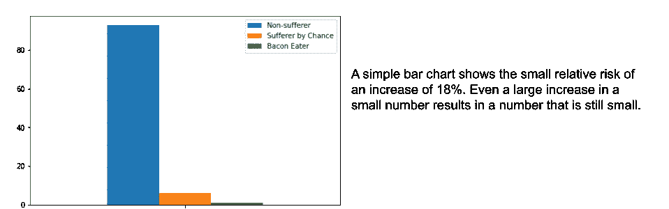
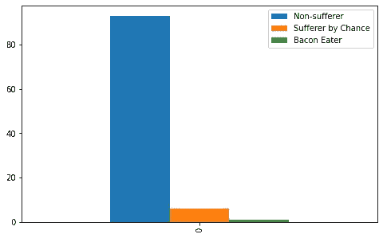
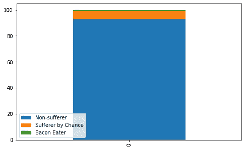
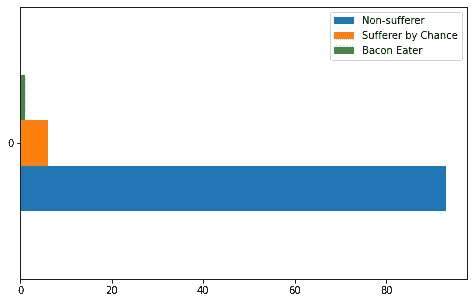
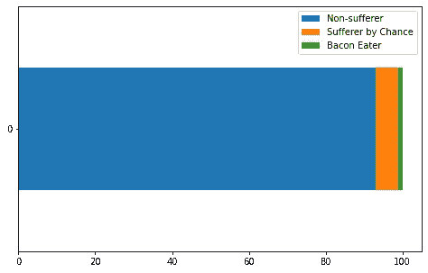
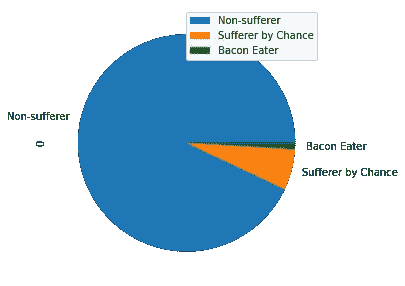
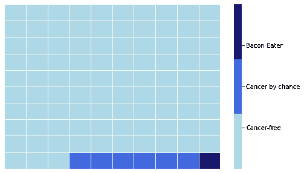
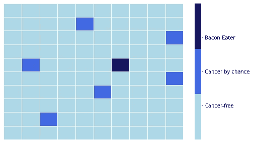
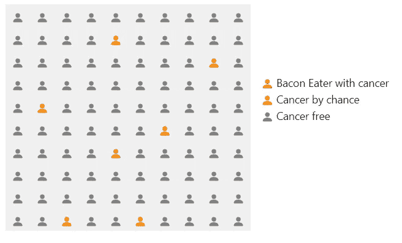

# 可视化健康风险

> 原文：<https://towardsdatascience.com/visualizing-health-risk-2a082417f3f2>

## 媒体在处理健康风险数据时很容易出错。数据可视化会有所帮助。


丰盛的早餐——照片由乔纳森·法伯在 [Unsplash](https://unsplash.com?utm_source=medium&utm_medium=referral) 上拍摄

2015 年 11 月，国际癌症研究机构(世界卫生组织的一部分)[报告](https://www.iarc.who.int/wp-content/uploads/2018/07/pr240_E.pdf)称，食用 50 克加工肉类——例如培根或香肠——与肠癌风险增加 18%有关[1]。

媒体报道了这一听起来可怕的增长，但媒体没有明确表示这是一个相对风险，而不是绝对风险。换句话说，这是风险的增加，而不是实际的风险。

可疑的报道可能是因为像“ **X 让你得癌症**”这样耸人听闻的标题对一些报纸来说太难以抗拒，但有时媒体会误解，因为数据被不一定理解他们所得到的信息的记者曲解了。

总的来说，患肠癌的风险约为 6%。增加 18%意味着风险上升到 7%左右。

```
6 * 1.18 = 7.08
```

因此，从绝对意义上来说，风险上升了 1%——这是一个不那么可怕的数字，也是一个不太可能阻止人们偶尔吃英式早餐或培根三明治的数字。

展示统计数据真实影响的简单可视化比简单地报告数字更容易理解。例如，一个条形图可以显示 1%的增长有多小。



作者图片

一项调查人们对重大健康事件(如中风或死亡)风险的理解的研究[2]发现，简单的条形图在传达风险方面确实有效。尽管在一项类似的研究[3]中，结论是饼状图更好。然而，在他的优秀著作《统计的艺术》中，David Speigelhalter 认为图标数组会更好。

那么选哪个呢？

我将在 Jupyter 笔记本上写一些 Python 代码，看看一些可视化风险的选项，包括条形图、热图、图标阵列和饼图。如果您想继续，请将每个代码块复制到一个新的单元格中。你可以在我的 [Github repo](https://github.com/alanjones2/Alan-Jones-article-code/tree/master/riskviz) 中找到整个笔记本的链接。从导入这些库开始。

```
import random
import numpy as np
import seaborn as sns
import matplotlib.pyplot as plt
import pandas as pd
```

# 构建数据

下面的代码构建了一个数据框架，表示 100 个人以及他们中患癌症的人数。6 个人会偶然得癌症，6 个人中有 18%会因为吃加工过的肉而得癌症(我在代码中用*培根*来代表任何加工过的肉)。其余的不会得癌症。

```
data = pd.DataFrame()
pop = 100                   # total population
chance = 6                  # number who get cancer by chance
bacon = int(6 * 0.18)       # number who get cancer by eating bacon
none = pop - chance - bacon # number who won't get cancer data['Non-sufferer'] = [none]
data['Sufferer by Chance'] = [chance]
data['Bacon Eater'] = [bacon]
```

首先，我们会画一些条形图，看看这是否更好地代表了吃熏肉的风险。我们将使用熊猫的绘图功能来做到这一点。

# 条形图

下面的条形图比原始数据更好地反映了额外的风险。与总人口相比，*熏肉食用者*的数量很少。

```
data.plot.bar(figsize=(8,5))
```



作者图片

这相当清楚，但作为堆积图会更好吗？

```
data.plot.bar(stacked=True,figsize=(8,5))
```



作者图片

当然，数字是相同的，但是条形图的顶层不是很明显，所以第一个条形图可能更好。

长宽比在很大程度上隐藏了吃熏肉的人，那么如果我们把他们变成单杠会怎么样呢？

```
data.plot.barh(figsize=(8,5))
```



作者图片

```
data.plot.barh(stacked=True,figsize=(8,5))
```



作者图片

在这种情况下，堆积图更清晰，但这主要是由于图的大小和比例。

像这样的图表可能比原始百分比要好，但不是特别有吸引力。也许我们可以做得更好。

# 圆形分格统计图表

让我们试试饼状图。

```
data.T.plot.pie(subplots=True,figsize=(8,5))
```



作者图片

有时饼图一点也不清晰，特别是当有几个类别要表示的时候。然而，这个只有 3 个不同的数据，所以它很好地显示了相对比例。

我对这些图表都使用了默认的配色方案——改变颜色来突出吃熏肉的人数较少可能会更好。

但是让我们来看看完全不同的东西——热图。

# 热图

为此，我将使用 Seaborn 数据可视化包。首先，数据需要以不同的方式表示。我将构建一个 10 乘 10 的网格，每个细胞代表一个没有癌症的人，一个偶然感染疾病的人，或者一个屈服于过多熏肉的人。

我首先制作 3 个代表 3 个不同类别的数组，然后将它们拼接成一个一维数组。

```
# Arrays of the different cases
a1 = [0]*data['Non-sufferer'].values[0]
a2 = [1]*data['Sufferer by Chance'].values[0]
a3 = [2]*data['Bacon Eater'].values[0]# Stitch them together
a1.extend(a2)
a1.extend(a3)
```

然后我把它做成 10 乘 10 的网格。

```
# Create a grid from the array
b = np.array(a1).reshape((10,10))
```

Seaborn 热图实际上是为连续变量设计的，而不是我们这里的离散变量。因此，我将颜色映射设置为只有 3 种颜色来映射到 3 个类别，适当地调整了颜色条(图例)并设置了正确的标签。

```
# Plot the grid as a heat map in Seaborn
fig, ax = plt.subplots(figsize=(8,5))
sns.heatmap(b, 
            linewidths=0.5, 
            yticklabels=False,
            xticklabels=False, 
            cmap=['lightblue','royalblue','midnightblue']
)# Customize legend
colorbar = ax.collections[0].colorbar 
colorbar.set_ticks([0.5,1,1.5])
colorbar.set_ticklabels(['Cancer-free','Cancer by chance','Bacon Eater'])
```

结果是这样的。



作者图片

这确实很好地显示了比例，但是 Speigelhalter 提出，标记的随机分散可能会对事件的随机性质给出更好的印象。下面的代码和上面的差不多，除了我在把一维数组转换成网格之前打乱了它的顺序。

```
# Shuffle the data and redrawrandom.shuffle(a1)
b2 = np.array(a1).reshape((10,10))
fig, ax = plt.subplots(figsize=(8,5))
sns.heatmap(b2, 
            linewidths=0.5, 
            yticklabels=False,
            xticklabels=False,
            cmap=['lightblue','royalblue','midnightblue']
            )# Customize legend
colorbar = ax.collections[0].colorbar 
colorbar.set_ticks([0.5,1,1.5])
colorbar.set_ticklabels(['Cancer-free','Cancer by chance','Bacon Eater'])
```

这是一个更好的情况吗？



作者图片

在我看来，*是*更好的代表，可能是迄今为止最好的图表。但是让我们看看 Speigelhalter 关于图标数组的建议是否更清楚。

# 图标阵列

一个看起来更个性化的图表可能是一个图标阵列，它使用我们习惯看到的东西来表示人。下面是来自开源[引导图标](https://icons.getbootstrap.com/)集合的图标:


作者图片

到目前为止，我不知道有什么简单的方法可以用我用过的任何技术来创建图标数组，所以我用 Python 编写了一个解决方案来创建一个 HTML 表，类似于上一个热图，但是用图标代替了磁贴。然后用 IPython 函数`display`显示 HTML。这里有相当多的代码，但是非常简单。

```
# Use icons to represent people and draw them in an HTML table

from IPython import display

# Create three icons of different colours
personOrange = """<i class="bi-person-fill" 
                    style="font-size: 1rem; 
                    color: orange;"></i>"""
personRed = """<i class="bi-person-fill" 
                style="font-size: 1rem; 
                color: red;"></i>"""
personGrey = """<i class="bi-person-fill" 
                style="font-size: 1rem; 
                color: grey;"></i>"""

# The first part of the HTML

head = """
<link rel="stylesheet" 
    href="https://cdn.jsdelivr.net/npm/bootstrap-icons@1.3.0/font/bootstrap-icons.css">

<div">
"""

# The last part of the HTML
tail = "</div>"

# The middle
rows=""
for r in range(0,b2.shape[1]):
    rows = rows + "<tr style='background-color:#f0f0f0'>"
    td = ""
    for c in range(0,b2.shape[0]):
        icon = personGrey
        if b2[c][r] == 1:
            icon = personOrange
        elif b2[c][r] == 2:
            icon = personRed
        td = td + f"<td>{icon}</td>"
    rows = rows + td + "</tr>" 

legend = f"""
    <div style="display:inline-block;padding:10px">
    {personRed} Bacon Eater with cancer<br/> 
    {personOrange} Cancer by chance <br/>
    {personGrey} Cancer free
    </div>
"""

table = "<table style='display:inline-block'>"+rows+"</table>"

table = head + table + legend + tail

display.HTML(table)
```

这给了我们 Speigelhalter 喜欢的图标阵列，虽然我倾向于同意他的判断，但只有适当的调查才能证明他是对的。



作者图片

我觉得这个管用。图标的随机分布给人一种正确的印象，即感染疾病的随机性很大，图标的使用让它感觉更加个性化——就好像这些图标中的一个实际上代表了我。我已经改变了颜色，因为我认为小的马克笔需要更亮一点。

总的来说，我觉得这是最有效的图表。

因此，快速浏览一些选项可以帮助您更清楚地传达健康(或任何其他类型的)风险。我对你的想法很感兴趣，所以如果你有意见、批评或其他想法，请在下面留下评论。

一如既往，感谢阅读。我希望你会觉得有趣，并看看我的 [Github repo](https://github.com/alanjones2/Alan-Jones-article-code/tree/master/riskviz) 中的代码。

[](https://alanjones2.github.io)  

如果你对我的其他文章感兴趣，你可以在 Medium 上浏览我的简介，或者在我的[网站](http://alanjones2.github.io)上看到它们。你也可以订阅我的时事通讯， [Technofile](http://technofile.substack.com) ，以获得新文章的通知。

[](https://technofile.substack.com)  

# 笔记

[1] [IARC 专论评估红肉和加工肉的消费](https://www.iarc.who.int/wp-content/uploads/2018/07/pr240_E.pdf)

[2]比较图标阵列与条形图对偏好和理解风险信息的影响:来自一项在线随机研究的结果，彼得·斯卡利亚、丹妮尔·c·舒贝、艾米丽·s·卢、玛丽·安妮·杜兰德、豪尔赫·弗拉斯卡拉、吉列尔米纳·诺尔、a·詹姆斯·欧玛利、格林·埃尔温出版:2021 年 7 月 23 日，https://doi.org/10.1371/journal.pone.0253644 一中

[3]为面临颈动脉狭窄治疗选择的患者呈现基于时间的中风和死亡风险:患者更喜欢饼状图而不是图标阵列 PeterScalia。詹姆斯。《患者教育和咨询》第 102 卷第 10 期，2019 年 10 月【https://doi.org/10.1016/j.pec.2019.05.004

[4]这句话出自大卫·斯皮格尔哈尔特 2021 年出版的《统计的艺术:如何从数据中学习》[(*附属链接*)](https://www.amazon.com/Art-Statistics-How-Learn-Data/dp/1541675703/ref=sr_1_1?_encoding=UTF8&amp;camp=1789&amp;creative=9325&amp;crid=1PPXO3JG9UPDR&amp;keywords=the+art+of+statistics&amp;linkCode=ur2&amp;linkId=b71669deca0a471424d5bc6fccbba1b3&amp;qid=1648295722&amp;sprefix=the+art+of+statistics%25252Caps%25252C177&amp;sr=8-1&_encoding=UTF8&tag=alanjones01-20&linkCode=ur2&linkId=fdf08c9a6a07285fa2432673497c25ec&camp=1789&creative=9325)