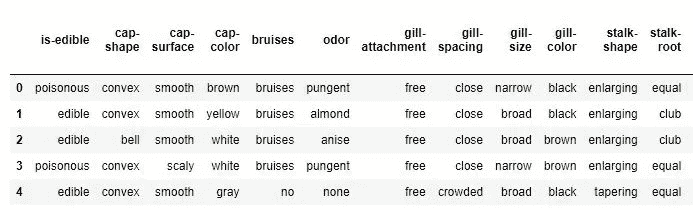
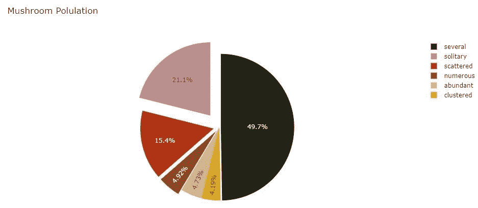
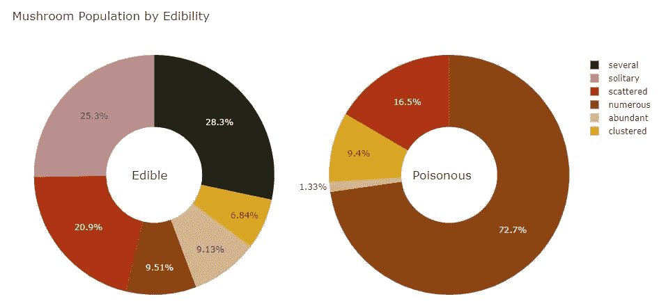
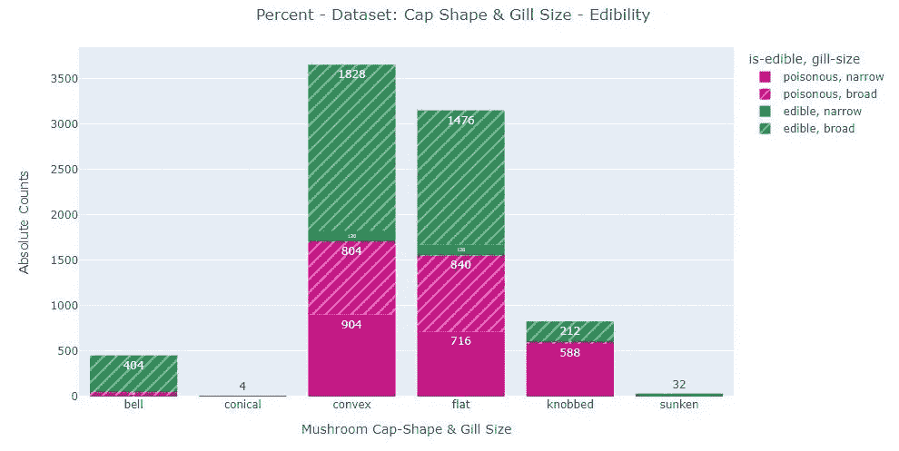
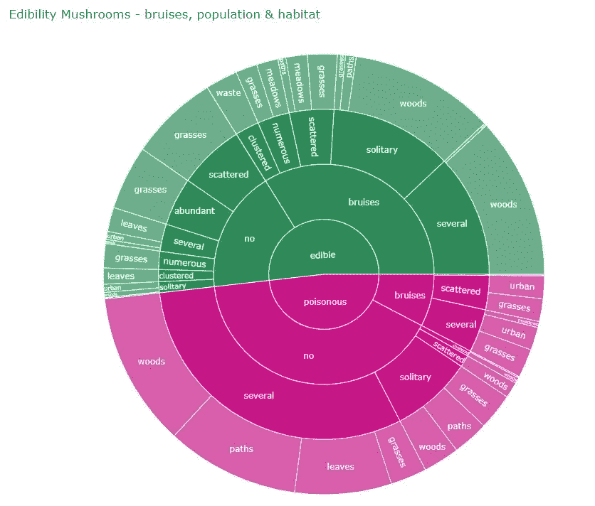
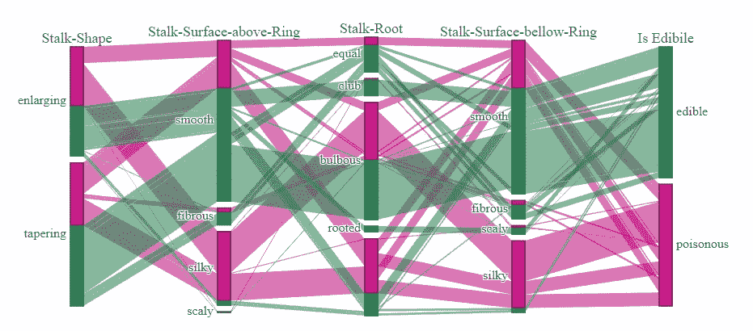

# 使用 Plotly 可视化多维分类数据

> 原文：<https://towardsdatascience.com/visualizing-multidimensional-categorical-data-using-plotly-bfb521bc806f>

## 以著名的蘑菇数据集为例


有毒蘑菇与可食用蘑菇

**简介** 数据可视化是任何数据专家的关键技能，应用于从科学研究到工业应用的广泛领域。因此，毫不奇怪，这些年来，为了简化数据可视化的开发，出现了多种工具。在这篇文章中，我将展示几个例子，告诉你如何使用流行的 [Plotly](https://plotly.com/python/) 库可视化分类数据。覆盖的是从一个到五个维度的图。此外，我将提供如何嵌入解释的例子。

**数据** 首先，我们从准备好数据开始。这篇文章的数据作为 [UCI 机器学习知识库](https://archive.ics.uci.edu/ml/datasets/mushroom)发布。数据集也可以从 [Kaggle](https://www.kaggle.com/datasets/uciml/mushroom-classification) 竞赛网站下载。下载后，您可以使用以下代码来读取数据:

```
# Replace this path with your file path
file_path = r”.\Data\mushrooms.csv”# read csv data from file into pandas dataframe
df = pd.read_csv(file_path, na_values=”?”)#rename columns
df.rename(columns = {"class":"is-edible"}, inplace = True)
df.columns = df.columns
```

请注意，`na_values`关键字参数是用一个`?` 字符串指定的。这样做是为了用`NaN`值替换`?` 。此外，目标变量从`class`更名为`is_edible`。目的是使这个小数据集可读。类似地，代码被用来用人类可读的等价物替换默认值。在文章的最后，你可以找到一个 GitHub 链接来查看完整的代码。

让我们直观地检查数据:



蘑菇分类数据集— head

**一维图:饼图**
现在，让我们从一个简单的一维图开始。饼图是一个经典，因为它易于阅读和解释。因此，在任何分类数据分析中都不应遗漏它。虽然您可以使用 Plotly Express 绘制基本的饼图，但是更通用的 Plotly graph 对象(.go)库允许您轻松定制图表。这篇文章主要描述情节。去图表。

将使用`population`功能绘制饼图。首先，对`population`执行一个`group-by`，然后对每组中的项目(蘑菇)数量执行一个`size` 。然后，结果数据按人口名称的字母顺序排序。

```
## dataframe creation - for plotting# create new pandas dataframe which contains all counts sorted by population
population_df = (
    df.groupby(["population"])
    .size()
    .reset_index(name="Counts")
    .sort_values(by=["population"])
)
```

每个`population` 字符串的唯一出现次数被视为`label`。分别将之前导出的`Counts`作为`values.` 注意，可以根据 rgb 标准指定几个自定义颜色。我建议使用[快速表格](https://www.rapidtables.com/web/color/RGB_Color.html)选择离散颜色。在该图表中，颜色存储在`earth_colors.`中

接下来，指定`pull`关键字参数。图中的`pull`表示每个扇区在图表中心的展开程度。拉动可以大大增强图表的可读性，尤其是如果你有很多扇区的话。但是请记住，如果一个特性的基数太高，图表将变得无法阅读。

```
## Creating a pie chart# create labels using all unique values in the column named "population"
labels = population_df["population"].unique()# group by count of the "population" column.
values = population_df["Counts"]# Custom define a list of colors to be used for the pie chart.
# Note that the same number of colors are specified as there are unique populations. It is not mandatory, but
# will avoid a single color to be used multiple times.
earth_colors = [
    "rgb(210,180,140)",
    "rgb(218,165,32)",
    "rgb(139,69,19)",
    "rgb(175, 51, 21)",
    "rgb(35, 36, 21)",
    "rgb(188,143,143)",
]# defining the actual figure using the dimension: population
# Note that a pull keyword was specified to explode pie pieces out of the center
fig = go.Figure(
    data=[
        go.Pie(
            labels=labels,
            values=values,
            # pull is given as a fraction of the pie radius
            pull=[0, 0, 0.07, 0.08, 0.02, 0.2],
            # iterate through earth_colors list to color individual pie pieces
            marker_colors=earth_colors,
        )
    ]
)# Update layout to show a title
fig.update_layout(title_text="Mushroom Polulation")# display the figure
fig.show()
```



蘑菇数量饼图

> 蘑菇是根据它们栖息的种群来分类的。这个饼图的例子代表了蘑菇在每个群体中的比例。大多数蘑菇以几个为一组生活，而不到 15%的蘑菇以众多、丰富或成簇的形式生活。该数据集中包含的大约三分之一的蘑菇单独或分散出现。

**二维图:饼图** 正如你可能猜到的，这个数据集经常被用来将蘑菇分为有毒或可食用。因此，好奇的头脑想知道属于任一种群的蘑菇的比例在食用蘑菇和有毒蘑菇之间是否不同？这可以通过使用两个饼状图支线剧情来实现，每个支线剧情对应于有毒或者可食用的职业。首先，需要准备好数据。如在前面的例子中，执行一个`group by`加一个`size`。之后，根据`population` 变量对结果进行排序。然而这一次，我们首先使用`.loc` 函数来过滤有毒或可食用的条目。结果是总结蘑菇数量的两个熊猫数据框。

```
## dataframe creation - for plotting# create new pandas dataframe which contains all counts filtered by 'is-edible' == "edible" and sorted by population
edible_population_df = (
    df.loc[df["is-edible"] == "edible"]
    .groupby(["population"])
    .size()
    .reset_index(name="Counts")
    .sort_values(by=["population"])
)# create new pandas dataframe which contains all counts filtered by 'is-edible' == "poisonous" and sorted by population
poisonous_population_df = (
    df.loc[df["is-edible"] == "poisonous"]
    .groupby(["population"])
    .size()
    .reset_index(name="Counts")
    .sort_values(by=["population"])
)# get unique values from the just created pandas dataframes and store them in an array
labels_edible_population = edible_population_df["population"].unique()
labels_poisonous_population = poisonous_population_df["population"].unique()# get all the counts from the created pandas dataframes and store them in an array
values_edible_population = edible_population_df["Counts"]
values_poisonous_population = poisonous_population_df["Counts"]
```

然后将数据框传递给 Plotly 图形对象进行绘制。事实上，前两个支线剧情是使用提供的关键字`rows, cols`和`specs`创建和安排的。然后在变量`earth_colors`下定义标记颜色。然后，使用`add_trace`将数据传递给两个人物对象。同样，标签和值被指定，图表被给定名称，我们指示哪个图表将到达哪个位置。使用`update_trace`,我们通过向用户显示悬停信息，让饼图变得更具交互性。最后，图布局被更新以显示图表标题和饼图描述。

```
## Creating two pie charts# Create subplots: use 'domain' type for Pie subplot
fig = make_subplots(rows=1, cols=2, specs=[[{"type": "domain"}, {"type": "domain"}]])# create an array of colors which will be custom colors to the plot
earth_colors = [
    "rgb(210,180,140)",
    "rgb(218,165,32)",
    "rgb(139,69,19)",
    "rgb(175, 51, 21)",
    "rgb(35, 36, 21)",
    "rgb(188,143,143)",
]# crate traces to specify the various properties of the first pie chart subplot
fig.add_trace(
    go.Pie(
        labels=labels_edible_population,
        values=values_edible_population,
        name="Edible Mushroom",
        marker_colors=earth_colors,
    ),
    1,
    1,
)# crate traces to specify the various properties of the second pie chart subplot
fig.add_trace(
    go.Pie(
        labels=labels_poisonous_population,
        values=values_poisonous_population,
        name="Poisonous Mushroom",
        marker_colors=earth_colors,
    ),
    1,
    2,
)# Use `hole` to create a donut-like pie chart
fig.update_traces(hole=0.4, hoverinfo="label+percent+name")# adapt layout of the chart for readability
fig.update_layout(
    title_text="Mushroom Population by Edibility",
    # Add annotations in the center of the donut pies.
    annotations=[
        dict(text="Edible", x=0.18, y=0.5, font_size=17, showarrow=False),
        dict(text="Poisonous", x=0.82, y=0.5, font_size=17, showarrow=False),
    ],
)
fig.show()
```



蘑菇群体由可食用馅饼

> 的确，毒蘑菇和食用蘑菇的比例差别很大！首先映入眼帘的是，几乎四分之三的毒蘑菇生活在被描述为“众多”的种群中。另一方面，只有约 10%的食用菌被算作“众多”部门。此外，所有单独的蘑菇都是可食用的。总之，如果我们要设计一个分类算法，我们会知道“群体”确实是关于目标变量的一个重要特征。

**三维图:条形图** 在不降低清晰度的情况下，可以显示多少维度的分类数据？事实上，在使用条形图时，绘制三个类别仍然很简单。在一维条形图中，类别位于 x 轴，数字位于 y 轴。然而，为了增加更多的维度，可以使用着色和阴影。

在下面的柱状图中，蘑菇状特征`cap-shape`绘制在 x 轴上。颜色由`is-edible`给出，图案由`gill-size`给出。如前所述，创建了一个. go。然后。go 图使用 Plotly express 直方图函数进行更新，我们将数据框传递给该函数，并指定各种关键字参数。请注意，除了`colors` 参数之外，还需要给出一个离散的颜色序列。此外，Plotly 允许直方图值的自动标准化。通过使用`histnorm`或`barnorm`实现标准化。你可以根据自己的需要选择。欲了解更多信息，您可以查看[此处](https://plotly.github.io/plotly.py-docs/generated/plotly.express.histogram.html)。

在下一步中，更新布局以显示标题文本。`tile`字典中的`x`关键字参数不代表数据。相反，它允许用户指定一个值来使标题居中。同样，您可以查找所有可用的[选项](https://plotly.com/python-api-reference/generated/plotly.graph_objects.Layout.html)。

最后但同样重要的是，用户可以通过指定`yaxis_title`和`xaxis_title`参数来手动指定所需的轴标题。最后，`update_xaxes`参数被指定为类别按字母升序排序。

```
## Creating bar chart# define figure element
fig = go.Figure()# define histogram properties
fig = (
    px.histogram(
        df,
        x="cap-shape",
        color="is-edible",
        pattern_shape="gill-size",
        color_discrete_sequence=[medimumvioletred, seagreen],
        barmode="relative",
        # barnorm = "percent",
        # histnorm = "probability",
        text_auto=True,
        labels={"cap-shape": "Mushroom Cap-Shape & Gill Size",},
    )
    .update_traces(hoverinfo="all")
    .update_layout(
        # update layout with titles
        title={
            "text": "Percent - Dataset: Cap Shape & Gill Size - Edibility",
            "x": 0.5,
        },
        yaxis_title="Absolute Counts",
    )
    .update_xaxes(categoryorder="category ascending")
)# display the figure
fig.show()
```



> 图中显示的是有毒和可食用蘑菇的绝对数量，按照菌盖形状和菌盖大小分类。大多数蘑菇的帽子(顶部)要么是凸的，要么是平的。凸形、扁形和钟形蘑菇既可以有毒，也可以食用。事实上，只有下沉的帽状蘑菇是有毒的，而下沉的帽状蘑菇是可以食用的。注意凹陷的和圆锥形的蘑菇出现的频率最低。凸而平的帽状蘑菇在有毒和可食用两类中都有窄而宽的鳃。

**四维图:旭日图**

随着维数的增加，绘图变得更难解释和编程。旭日图可视化了从根到叶径向向外延伸的分层数据，根据数据集的不同，这是一个很好的选择。

使用 Plotly express 创建的[旭日图](https://plotly.com/python-api-reference/generated/plotly.express.sunburst.html)如下所述。数据被传递给 sunburst 对象。然后指定一个路径。该路径对应于一个希望在旭日图中绘制的列的列表。这些列是按照人们希望它们被绘制的顺序传递的。例如，如果一个人希望 is-eatable 位于情节的中心，那么它应该首先被命名。

`values`关键字用于使每个楔形区的大小与给定值成比例。在这个例子中，`count`列被传递给`values`。

```
## dataframe creation - for plotting
df_combinations = (
    df.groupby(["is-edible", "population", "habitat", "bruises"])
    .size()
    .reset_index()
    .rename(columns={0: "count"})
)## Creating sunburst chart# define figure element
fig = px.sunburst(
    df,
    path=["is-edible", "bruises", "population", "habitat"],
    title="Edibility Mushrooms - bruises, population & habitat",
    color="is-edible",
    color_discrete_sequence=[medimumvioletred, seagreen],
    height=800,
)
# display the figure
fig.show()
```



旭日图

> 该图显示了蘑菇的数量，按其特征从根节点到叶节点按比例分类。虽然有毒和可食用蘑菇的数量几乎相等，但人们可以看出有毒蘑菇被碰伤的频率要低得多。未受损伤的毒蘑菇成群生长在树林、树叶、草地或小路上。伤痕累累的毒蘑菇生活在分散的种群中，最好是在城市或长满草的栖息地。
> 有伤痕的食用菌大多生活在独居或分散的种群中，最常见于林区。可食用的和未受损伤的蘑菇大多生活在分散和丰富的种群中，喜欢草和叶子的栖息地。总之，旭日图显示了蘑菇是如何根据不同的特征分组的。请注意，解释需要涵盖广泛的细节。

**五维图:平行坐标图**

平行坐标图(parcats)是一个优雅的工具，可用于可视化多个分类变量。

要生成绘图，首先将目标变量的值映射到整数。这样做是因为 parcats 函数不接受字符串对象。然后，根据想要使用的变量创建五维对象。除了先前创建的变量`is-edible-int`被传递给`color`之外，颜色被照常定义。最后，定义 figure 对象，传递维度变量并指定各种其他关键字参数，以增加图表的可读性。

```
## Creating parallel categores chart# creation is edible integer
df["is-edible-bool"] = df["is-edible"].map({"edible": 1, "poisonous": 0})# Create dimensions
# stalk-shape
stalk_shape_dim = go.parcats.Dimension(
    values=df["stalk-shape"], categoryorder="category ascending", label="Stalk-Shape"
)
# stalk-root
stalk_root_dim = go.parcats.Dimension(values=df["stalk-root"], label="Stalk-Root")
# stalk-surface-above-ring
stalk_surface_above_ring_dim = go.parcats.Dimension(
    values=df["stalk-surface-above-ring"], label="Stalk-Surface-above-Ring"
)
# stalk-surface-below-ring
stalk_surface_bellow_ring_dim = go.parcats.Dimension(
    values=df["stalk-surface-below-ring"], label="Stalk-Surface-bellow-Ring"
)# is-edible
edible_dim = go.parcats.Dimension(
    values=df["is-edible"],
    label="Is Edibile",
    categoryarray=["edible", "poisonous"],
    ticktext=["edible", "poisonous"],
)# Create parcats trace
color = df["is-edible-bool"]
colorscale = [[0, medimumvioletred], [1, seagreen]]# create figure object
fig = go.Figure(
    data=[
        go.Parcats(
            dimensions=[
                stalk_shape_dim,
                stalk_surface_above_ring_dim,
                stalk_root_dim,
                stalk_surface_bellow_ring_dim,
                edible_dim,
            ],
            line={"color": color, "colorscale": colorscale},
            hoveron="color",
            hoverinfo="count + probability",
            labelfont={"size": 18, "family": "Times"},
            tickfont={"size": 16, "family": "Times"},
            arrangement="freeform",
        )
    ]
)# display the figure
fig.show()
```



平行坐标图

> 蘑菇通过它的柄状、环上柄面、柄根和环下柄面来区别于其他蘑菇。这些特征能解释蘑菇的可食用性吗？事实上，蘑菇柄的形状是变大还是变小似乎没有太大的区别。然而，“蘑菇圈”上方的表面提供了更多的信息。如果我们选择一种具有光滑或纤维状茎表面的蘑菇，人们会更加确信这种蘑菇是可食用的。蘑菇圈上方的光滑表面应该避免。“茎-根”应该是棒状或同等的。如果环下面的茎表面是光滑的，那么很有可能找到了可食用的蘑菇。
> 这些特征的组合增加了区分有毒和可食用蘑菇的机会。

在高维空间中可视化分类数据是一个挑战。如果你对其他人如何解决绘制多维数据感兴趣，我可以推荐来自[di panjan](/the-art-of-effective-visualization-of-multi-dimensional-data-6c7202990c57)(Matplotlib&Seaborn)的“[多维数据有效可视化的艺术](/the-art-of-effective-visualization-of-multi-dimensional-data-6c7202990c57)”文章。关于如何使用 [plotly](https://plotly.com/graphing-libraries/) 图形的更多详细信息，我可以推荐这本[指南](https://www.analyticsvidhya.com/blog/2021/10/interactive-plots-in-python-with-plotly-a-complete-guide/)。

希望你觉得这篇文章很有趣，并能学到一些新东西。重现剧情的代码可以在我的 [GitHub Repo](https://github.com/DataBach-maker/Mushroom_Visuals) 上找到。
注意，Plotly 是开源的，可以用于商业和私人目的。

我非常感谢 Evgeniy 为这篇文章提供了插图。如果你喜欢他的画，请在 Instagram 上关注他。


Evgeniy 食用菌

[1]Dua d .和 Graff c .(2019 年)。UCI 机器学习知识库[http://archive . ics . UCI . edu/ml]。加州欧文:加州大学信息与计算机科学学院。