# 可视化纽约市的地铁交通和人口普查数据

> 原文：<https://towardsdatascience.com/visualizing-nycs-subway-traffic-census-data-using-leafmap-29904b634046>

# 可视化纽约市的地铁交通和人口普查数据

## 使用 Python 的 Geopandas 和 Leafmap 包可视化开放城市数据。


米歇尔·特罗特在 [Unsplash](https://unsplash.com?utm_source=medium&utm_medium=referral) 上的照片

Metis 的第一个模块[数据科学和机器学习训练营](https://www.thisismetis.com/bootcamps/online-machine-learning-bootcamp)已经在书里了&这是旋风般的几周！

模块 1 涵盖了探索性数据分析，对于相关项目，我们的任务是为取自 MTA 纽约市的[十字转门数据](http://web.mta.info/developers/turnstile.html)制定一个用例，并进行分析以从数据中获得洞察力。

对于我的项目，我选择分析 2021 年全年的十字转门数据，因为我觉得从全年来看，这些见解会更可靠，还因为 2021 年刚刚结束，所以这些数据来自一个刚刚完成的日历年！

# 辖域

为了确定本提案的分析范围，我从一个基本问题开始: ***地铁交通系统的总体趋势是什么，以及各个车站的交通状况如何？***

我想确定系统范围内的趋势，如下所示:一天中的哪些时间流量最高？一周中的哪几天？几个月？对于车站指标，我想知道哪个车站的交通流量最高。


[晋振伟](https://unsplash.com/@michaeljinphoto?utm_source=medium&utm_medium=referral)在 [Unsplash](https://unsplash.com?utm_source=medium&utm_medium=referral) 上拍照

作为进一步的目标，我想看看纽约市每个街区的人口统计数据，看看交通和人口统计数据之间是否有任何关联，例如低收入地区的地铁交通更多，或者旧街区的交通更少。

所以，我问自己的下一个问题是: ***这些信息在专业环境中如何有用？***

嗯，这些数据可能有很多应用！

1.  非营利、广告、政治动员和公共卫生等用例的目标拓展。
2.  与疫情前交通量的对比分析。([纽约时报](https://www.nytimes.com/2022/01/17/nyregion/nyc-subway-ridership.html)
3.  与犯罪数据一起使用时的公共安全分析
4.  优化的地铁维护计划。

鉴于潜在用例的数量(以及项目两周的周转时间)，我选择将我的可交付成果保持如下:

*   按一天中的时间、一周中的日期、一年中的星期、一年中的月份划分的全系统流量趋势。
*   各行政区流量排名靠前的站点
*   可视化提供车站交通数据旁边的人口统计信息

# 战术、工具和数据

从高层次来说，我脑海中的“关系框架”如下:

**地铁站十字转门数据-车站位置数据-纽约市社区地理数据-纽约市社区人口统计信息**

因此，在投入工作之前，我问自己的最后一个问题是: ***如何才能最好地向潜在客户传达这些见解？***

答案是用地图！

我找到了来自纽约 MTA 的第二个数据集，其中包含地铁站的经度和纬度坐标。一旦我按车站汇总，我就能把它加入十字转门数据集。

从那里，我获取了纽约市规划部发布的 [NTA(街区制表区)形状文件](https://www1.nyc.gov/site/planning/data-maps/open-data/census-download-metadata.page)，将它们与在 NTA 层面进行的[美国社区调查](https://www1.nyc.gov/site/planning/planning-level/nyc-population/american-community-survey.page.page)的最新数据(2019 年)结合起来，并绘制了地铁站，计算了带有人口统计信息的街区的交通数据。

本项目中使用的所有数据都获得了纽约市机构的免费使用许可。您可以在以下位置找到每个数据集的具体使用条款:

*   [MTA 十字转门和位置数据](https://new.mta.info/developers)
*   [来自纽约市规划局的 NTA 2020 造型文件](https://www1.nyc.gov/home/terms-of-use.page)
*   [纽约市规划局 NTA 层面的 ACS 5 年估计值](http://www.nyc.gov/html/data/about.html)

为了完成这个项目的目标，我需要几个不同的 Python 包:

*   [**SQLAlchemy**](https://www.sqlalchemy.org/)**:**用于处理包含我们十字转门数据的本地数据库
*   [**熊猫**](https://pandas.pydata.org/) ， [**Numpy**](https://numpy.org/) ， [**Matplotlib**](https://matplotlib.org/) ，[**Seaborn**](https://seaborn.pydata.org/)**和/或[**Plotly**](https://plotly.com/python/)**:**用于操作和可视化表格数据。**
*   **[**FuzzyWuzzy**](https://pypi.org/project/fuzzywuzzy/) :用于连接车站十字转门数据和车站地理信息(两个数据集中车站的命名不同，谢谢 MTA！).**
*   **[**Geopandas**](https://geopandas.org/en/stable/) ， [**Leafmap**](https://leafmap.org/) :用于绘制静态和交互地图。**

# **方法和代码**

**你可以在 GitHub [repo](https://github.com/NateDiR/NYC_MTA_EDA_Project/blob/main/MTA%20EDA.ipynb) 中找到完整的代码。下面我来提供亮点！**

## **摄取**

**一旦导入了包，并设置了格式和样式选项，第一步就是使用 SQLAlchemy 连接到保存旋转栅门数据的数据库:**

```
engine = create_engine("sqlite:////Users/USER/Documents/GitHub/NYC_MTA_EDA_Project/mta_data.db")
```

**接下来，我将这个数据库读入一个熊猫数据帧，如下所示:**

```
df = pd.read_sql('SELECT * FROM mta_data;', engine)
```

**在这里，我们可以对 SQL 查询做任何我们想做的事情，但是对于我的 EDA，我更喜欢 pandas。**

```
select *, ENTRIES - coalesce(lag(ENTRIES) over (ORDER BY "C/A", UNIT, SCP, STATION, DATE, TIME), 0) AS NET_ENTRIES, EXITS - coalesce(lag(EXITS) over (ORDER BY "C/A", UNIT, SCP, STATION, DATE, TIME), 0) AS NET_EXITS from mta_data  order by "C/A", UNIT, SCP, STATION, DATE, TIME LIMIT 100;
```

**会给你:**

**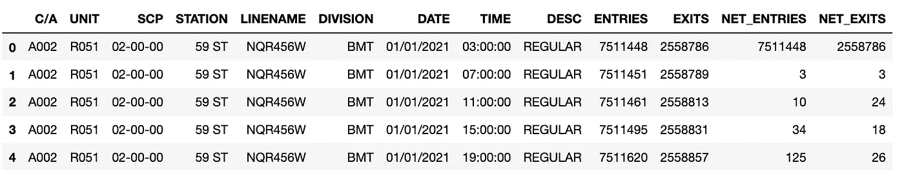**

**需要一点清理，但你得到了要点。图片作者。**

## **清洁**

**当我将数据(以原始格式)读入熊猫数据帧后，我做了几件事:**

1.  **重命名列以便于操作。**
2.  **从日期和时间列创建了日期时间列**
3.  **去掉任何 DESC 为“AUD RECOVR”的值(更多信息)**
4.  **计算聚合列 net_traffic，这是我们进一步分析的基础。**

## **极端值**

**在运行了一个[熊猫档案](https://github.com/pandas-profiling/pandas-profiling)报告后，我看到我们的网络流量字段到处都是。有些是负值，有些是几十亿。在这一点上，我做了一些行政决策:**

```
df['net_traffic'] = abs(df.net_traffic)q = np.quantile(df['net_traffic'], .99)
df=df[df['net_traffic'] < q]
```

**这将我们的 net_traffic 列的所有值都转换为正值，并去掉任何超过 99%的值。这应该可以去除最严重的异常值，同时尽可能地保留数据集。这是一种缺乏细微差别的方法，绝对是一个需要改进的地方！**

**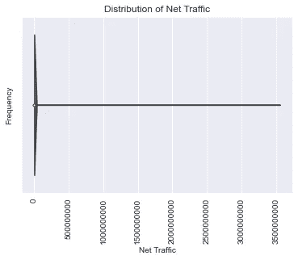**

**之前的净流量。图片作者。**

**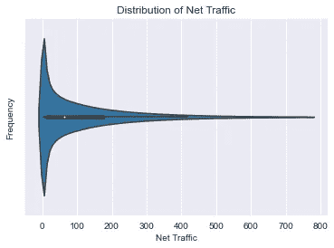**

**之后的净流量。图片作者。**

## **肉眼观察**

**因为目标是在给定的时间范围内提供一系列系统范围的洞察，所以我需要使用 date_time 列将这些时间范围添加为列:**

```
df['date'] = df.date_time.dt.date
df['day_of_week'] = df.date_time.dt.dayofweek
df['month'] = df.date_time.dt.month
df['week'] = df.date_time.dt.isocalendar().week
df['hour'] = df.date_time.dt.hour
```

**然后，我开始可视化给定时间范围内的全系统流量:**

```
hourly_df = df.groupby(['hour'])[['net_traffic']].mean().reset_index()plt.plot(hourly_df.hour,hourly_df.net_traffic);
plt.xlabel('Time')
plt.ylabel('Average Traffic')
plt.title('Traffic is highest 8AM - 8 PM')
plt.xticks(np.arange(24), rotation=45);
```

**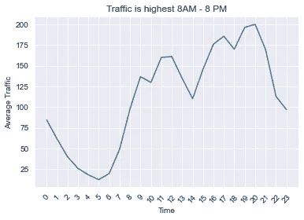**

**高峰时间是 8-12 和 5-8。图片作者。**

```
weekly_timelapse_df = df.groupby(['week'])[['net_traffic']].sum().reset_index().copy()weekly_timelapse_df['pct_change'] = weekly_timelapse_df.net_traffic.pct_change()
weekly_timelapse_df['pct_change'].iloc[0] = 0weekly_timelapse_df['pct_total'] = weekly_timelapse_df['net_traffic'].apply(lambda x: x / weekly_timelapse_df.net_traffic.sum())plt.figure(figsize=(10,10))
sns.lineplot(data=weekly_timelapse_df, x='week', y='net_traffic');
plt.title('Timelapse of Traffic by Week');
plt.xlabel('Week');
plt.ylabel('Total Traffic');
plt.ticklabel_format(axis='y', style='plain');
plt.xticks(np.linspace(1,52,52), rotation=90, fontsize=10);
```

**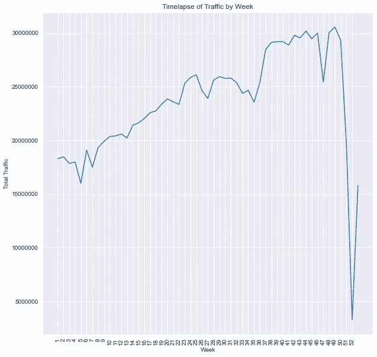**

**假期前后急剧下降。图片作者。**

```
monthly_df = df.groupby(df.month)[['net_traffic']].sum().reset_index().copy()plt.plot(monthly_df.month, monthly_df.net_traffic);
plt.ticklabel_format(axis='y', style='plain');
plt.xlabel('Month');
plt.ylabel('Total Traffic');
plt.title('Total Traffic by Month');
```

**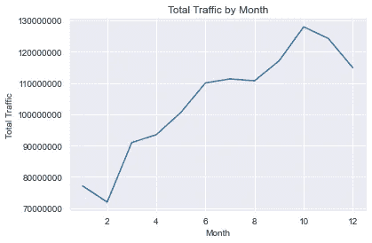**

**八月至十月是客流量最大的月份。图片作者。**

```
dayofweek_df = df.groupby(df.day_of_week)[['net_traffic']].sum()dayofweek_df['pct_change'] = dayofweek_df.net_traffic.pct_change()dayofweek_df['pct_change'].iloc[0] = ((dayofweek_df.net_traffic.iloc[0] - dayofweek_df.net_traffic.iloc[6]) / dayofweek_df.net_traffic.iloc[6])dayofweek_df['pct_total'] = dayofweek_df['net_traffic'].apply(lambda x: x / dayofweek_df.net_traffic.sum())plt.plot(dayofweek_df.index, dayofweek_df.net_traffic);
plt.xticks(np.arange(7), ['Monday', 'Tuesday', 'Wednesday', 'Thursday', 'Friday', 'Saturday', 'Sunday'], rotation=45);
plt.ticklabel_format(axis='y', style='plain')
plt.xlabel('Day of Week')
plt.ylabel('Total Riders')
plt.title('Total Riders by Day of Week')
```

**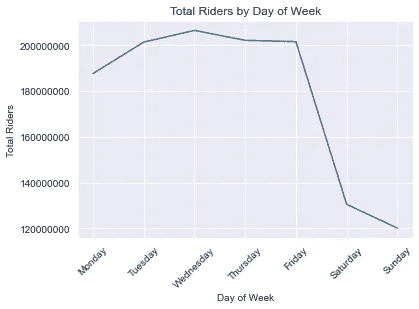**

**周末是低流量。图片作者。**

**太好了！这些对我们的客户来说是非常有用的见解。但他们真正想知道的是，在他们担心交通之前，他们应该在哪些车站安装广播站！让我们开始吧:**

## **热门电台**

```
top_stations = df.groupby('station')[['net_traffic']].sum().sort_values(by='net_traffic', ascending=False).reset_index().copy()top_stations['pct_total'] = top_stations['net_traffic'].apply(lambda x: x / top_stations.net_traffic.sum())
```

**这创建了一个所有车站的数据框架，按交通价值降序排列，不考虑区。检查笔记本，看看它的(非常大的)情节！**

**按区获取热门站点的下一步是引入来自 MTA 的第二个数据集，除了经度/纬度信息之外，该数据集还包含区信息:**

```
station_data = pd.read_csv([http://web.mta.info/developers/data/nyct/subway/Stations.csv](http://web.mta.info/developers/data/nyct/subway/Stations.csv))
```

**接下来，我使用 [FuzzyWuzzy](https://pypi.org/project/fuzzywuzzy/) 对 top_stations 数据帧和 station_data 数据帧进行模糊连接。原因是两个数据集之间的站的命名非常相似，但在许多小的、特殊的方面有所不同。FuzzyWuzzy 得到了大多数正确的匹配，并在这个过程中节省了我的时间。肯定不是完美的，也是需要改进的地方！**

**我按照[这个指南](https://www.geeksforgeeks.org/how-to-do-fuzzy-matching-on-pandas-dataframe-column-using-python/)完成了一个模糊连接，但是代码如下:**

```
station_data.stop_name = station_data.stop_name.str.replace(" - ","_")
station_data.stop_name = station_data.stop_name.str.replace(" ","_")
station_data.stop_name = station_data.stop_name.str.replace("(","")
station_data.stop_name = station_data.stop_name.str.replace(")","")
station_data.stop_name = station_data.stop_name.str.replace("/","_")
station_data.stop_name = station_data.stop_name.str.replace(".","")
station_data.stop_name = station_data.stop_name.str.replace("-","_")
station_data.stop_name = station_data.stop_name.str.lower()mat1 = []
mat2 = []
p= []
list1 = top_stations.station.tolist()
list2 = station_data.stop_name.tolist()threshold = 50 ## Needs to be at 50 or there are some values without matches.for i in list1:
    mat1.append(process.extractOne(i, list2, scorer=fuzz.ratio))
top_stations['matches'] = mat1for j in top_stations['matches']:
    if j[1] >= threshold:
        p.append(j[0])

    mat2.append(','.join(p))
    p= []

top_stations['matches'] = mat2top_station_df = pd.merge(top_stations, right=station_data, left_on='matches', right_on='stop_name', how='left')top_station_df = top_station_df.groupby(['station'])[['net_traffic', 'pct_total', 'borough', 'gtfs_longitude', 'gtfs_latitude', 'avg_daily']].first().sort_values(by='net_traffic', ascending=False).reset_index()
```

## **映射热门站点**

**所以现在我有了最高的车站，有经度/纬度信息，区，和计算的交通数量。我可以开始绘制地图了！**

**在我开始互动之前，我想使用 [Geopandas](https://geopandas.org/en/stable/) 静态绘制每个区的热门站点。**

**顾名思义，Geopandas 是一个用于在 Python 中处理地理数据的包。值得注意的是，它引入了一种特殊的数据类型，称为 Points:**

```
top_station_df['geometry'] = [Point(xy) for xy in zip(top_station_df['gtfs_longitude'],top_station_df['gtfs_latitude']]
```

**一旦创建了几何列，我就可以绘制点了。但是！如果没有纽约市的背景地图作为背景，它们将毫无意义。进入我们的 [NTA 形状文件](https://www1.nyc.gov/site/planning/data-maps/open-data/census-download-metadata.page)！**

```
nta_map = gpd.read_file('/Users/USER/Documents/GitHub/NYC_MTA_EDA_Project/nynta2020.shp')
nta_map.to_crs(4326, inplace=True)
```

**什么是 to_crs？一个[坐标参考系统](https://en.wikipedia.org/wiki/Spatial_reference_system)基本上是一个框架，计算机通过它解释比例尺。to_crs 是 geopandas 函数，用于更改地理数据框架的 crs。注意我们在。使用 gpd.read_file 的 shp 文件-它不是数据框，而是地理数据框！**

**如果我想让 NTA 地图和点数据有意义，那么将它们放在同一个 CRS 中是很重要的。首先，我还必须将 top_station_df 转换为地理数据框架:**

```
top_station_geo_df = gpd.GeoDataFrame(top_station_df, crs=4326, geometry = top_station_df.geometry)# Just to be extra suretop_station_geo_df.to_crs(4326, inplace=True)
```

**现在，我可以画出来！**

## **布鲁克林区**

```
fig,ax = plt.subplots(figsize=(10,10))nta_map.boundary.plot(ax=ax, edgecolor='k');top_station_geo_df[top_station_geo_df.borough == 'Bk'].head(10).plot(column='station', ax=ax, legend=True, marker='.', markersize=top_station_geo_df.pct_total.astype('float') * 10000);
```

**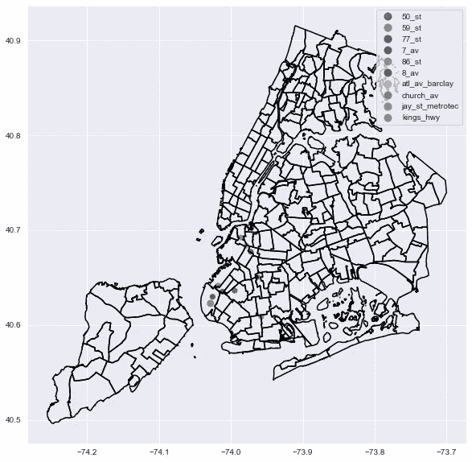**

**图片作者。**

```
bk_df = top_station_df[top_station_df.borough == 'Bk'].copy()
bk_df.reset_index()
bk_df = bk_df.head(10)
plt.bar(bk_df.station, bk_df.net_traffic);
plt.title('Top 10 Brooklyn Stations')
plt.xlabel('Stations');
plt.ylabel('Total Traffic');
plt.xticks(rotation=90);
plt.ticklabel_format(axis='y', style='plain');
```

**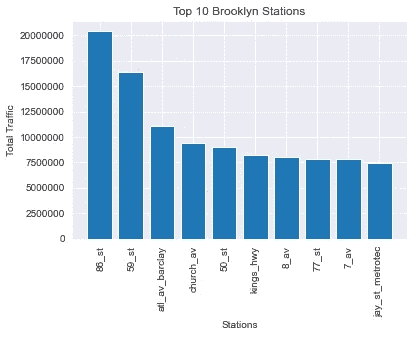**

**图片作者。**

**这个代码在所有的行政区都是可重复的，所以我就不重复了:**

## **曼哈顿**

****

**图片作者。**

**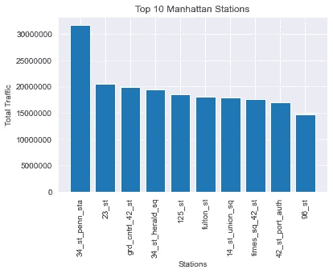**

**图片作者。**

## **昆斯区**

****

**图片作者。**

**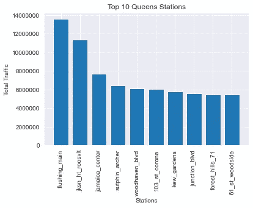**

**图片作者。**

## **布朗克斯区**

****

**图片作者。**

**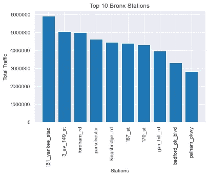**

**图片作者。**

## **斯塔腾岛**

**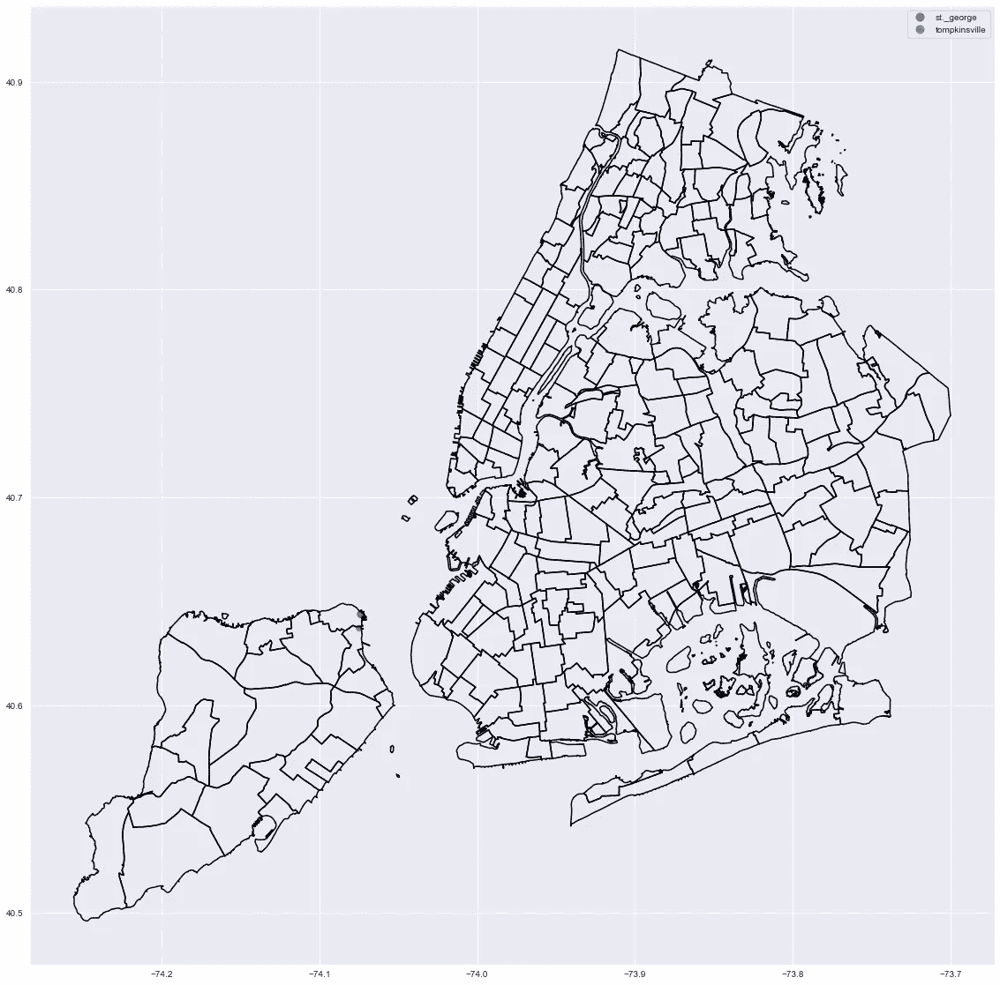**

**图片作者。**

**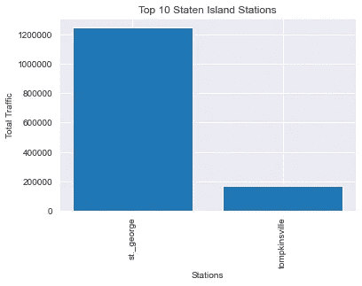**

**图片作者。**

## **(奖金)非 MTA 站:**

**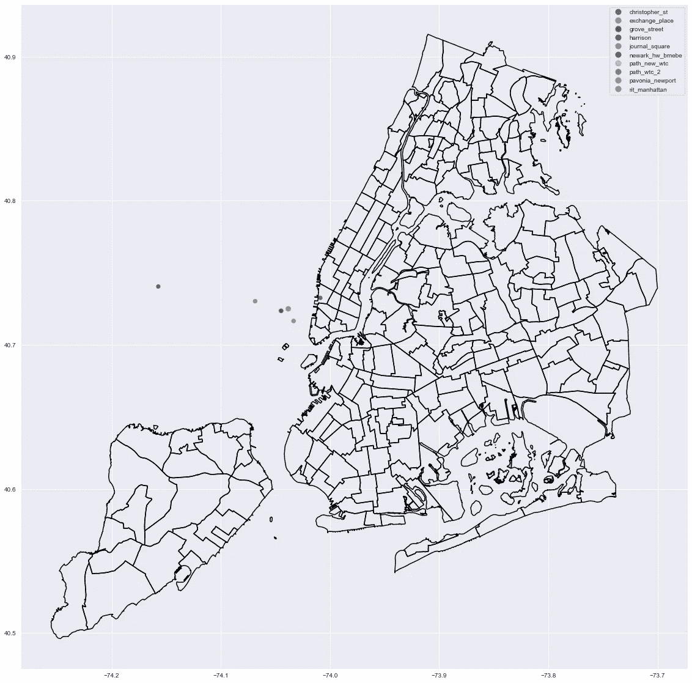**

**这些应该在新泽西..如果是在这里画的。图片作者。**

**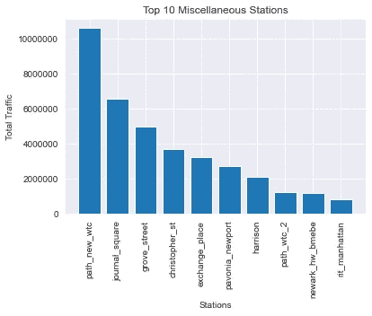**

**图片作者。**

## **使用 Leafmap 的交互式制图**

**在游戏的后期，我被我们的教练带上了树叶地图。这是一个非常强大且易于使用的工具，可以在笔记本上制作交互式地图。**

**但是在我开始制作交互式地图之前，我需要引入一些人口统计数据。**

```
nta_demos = 
pd.read_excel('[https://www1.nyc.gov/assets/planning/download/office/planning-level/nyc-population/acs/demo_2019_acs5yr_nta.xlsx'](https://www1.nyc.gov/assets/planning/download/office/planning-level/nyc-population/acs/demo_2019_acs5yr_nta.xlsx'))
```

**就这么简单-直接从网上。**

**现在合并(不模糊):**

```
nta_df = nta_map.merge(nta_demos, how='left', left_on='NTA2020', right_on='GeoID')
```

## **树叶地图**

**现在是互动地图！**

**实际上，我最终需要重新保存我的 top_station_geo_df 和计算的流量列作为 GeoJSON，这样才能工作:**

```
top_station_geo_df.to_file("top_station.json", driver="GeoJSON")
```

**一旦我在回购中有了它，创建交互式地图所需的所有代码如下:**

```
m = leafmap.Map(center=(40,-100),zoom=4)m.add_gdf(nta_df, layer_name='2020 NTA Demographic Information', info_mode='on_click')m.add_point_layer(filename='/Users/USER/Documents/GitHub/NYC_MTA_EDA_Project/top_station.json', popup=['station', 'net_traffic', 'pct_total', 'avg_daily'], layer_name="Stations")m
```

**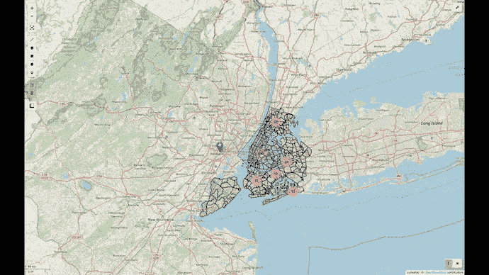**

**Leafmap 的力量！图片作者。**

# **见解和结论**

**当一切都说了，做了，我将能够向客户提供以下内容:**

1.  **系统级指标，如高峰流量时间、一周中的天数、一年中的周数和月数。**
2.  **按区排列的前 10 个站点，或按流量排序的所有站点，而不考虑区。**
3.  **一个交互式地图，显示每个车站的交通数据，以及周围社区的人口统计数据。**

**有了这些见解，我们的客户应该能够对他们的业务问题做出明智的、数据驱动的决策。无论这是如何最好地达到某些观众，还是轨道维护的最佳时间表。**

# **有待改进的领域**

**我把它带到了很多不同的方向，作为一个展示项目，这太棒了！对于一个客户来说，可交付的东西就没那么多了。在现实世界中，如果有更少有趣的软件包，更简洁的分析和演示，我会感觉更好。**

**在此基础上，格式化无疑也是一个需要改进的领域。骨架已经就位，而且功能正常，但整个东西需要重新刷一层漆。所有的图形和地图，包括交互式的，都可以以更清晰的格式呈现。考虑到前面关于时间管理的观点，我可能会更好地减少视觉化图像的数量，并专注于制作一些真正高质量的图像。**

# **需要进一步分析的领域**

**这个项目中有很多细节。但是，可以真正提高其效用的三个进一步分析的领域如下:**

1.  **这些见解与我们在系统级产生的见解相似，但针对的是每个区的前 10 个电台。**
2.  **除了人口统计之外的其他数据将被添加到 NTA 数据中——除了我们现在拥有的种族数据之外，拥有性别和收入等信息将会产生影响。此外，清理 NTA 数据，以减少列数，使其更具描述性。**
3.  **地铁乘客数量是 2019 年疫情之前的一小部分。2019 年、2020 年和 2021 年之间的同比分析将这些流量信息联系起来，并帮助广告商了解趋势。**

****

**凯文·钦奇利亚在 [Unsplash](https://unsplash.com?utm_source=medium&utm_medium=referral) 上的照片**