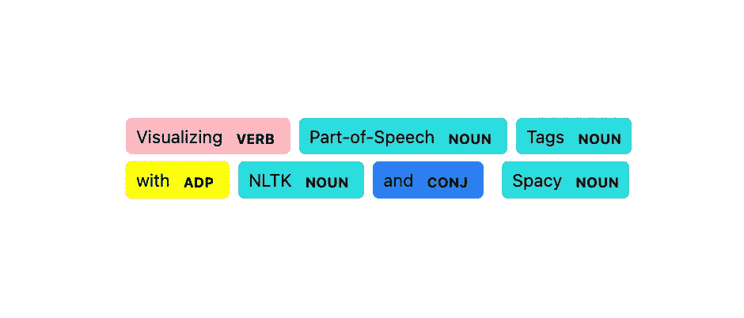
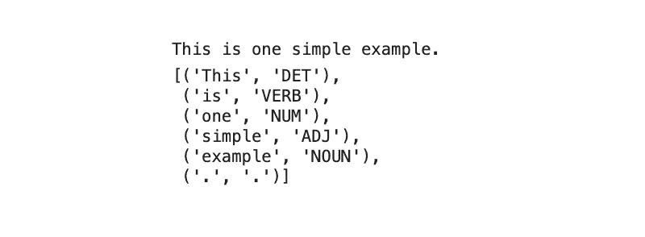
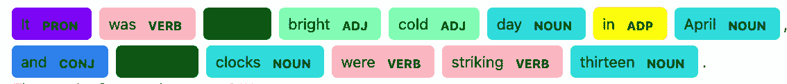

# 用 NLTK 和 SpaCy 可视化词性标签

> 原文：<https://towardsdatascience.com/visualizing-part-of-speech-tags-with-nltk-and-spacy-42056fcd777e>

## 自定义 displaCy 的实体可视化工具



图片由作者提供。

在本教程中，我们将开发一个函数来可视化带有 [NLTK](https://www.nltk.org/) 和 [SpaCy](https://spacy.io/) 的词性(POS)标签。

结果函数将把这个


输入句子(图片由作者提供)

变成这样:


输出句子(图片由作者提供)

# 动机

**词性标注**是自然语言处理中使用的一种技术。它将文本中的标记分类为名词、动词、形容词等等。在 Python 中，您可以使用 [NLTK](https://www.nltk.org/) 库来实现这个目的。

```
import nltk
from nltk import word_tokenizetext = "This is one simple example."tokens = word_tokenize(text)
tags = nltk.pos_tag(tokens, tagset = "universal")
```

在上面截取的代码中，首先用`word_tokenize()`函数对示例`text = "This is one simple example."`进行标记化(`This`、`is`、`one`、`simple`、`example`和`.`)。然后用功能`pos_tag()`对代币进行 POS 标记。对于这个例子，我们将使用`tagset = "universal"`，因为它使用了一个更通用的标签集，而默认标签集提供了更详细的标签。

下面你可以看到例句的词性标记。



带词性标签的例句(图片由作者提供)

空间带有一个**可视化器**，叫做[显示](https://spacy.io/usage/visualizers)。例如，您可以使用`style = "dep"`呈现如下的 POS 标签和语法依赖。

```
import spacy
from spacy import displacynlp = spacy.load("en_core_web_sm")
doc = nlp(text)displacy.render(doc, **style = "dep"**)
```


带有 displaCy 的例句的可视化依赖关系(图片由作者提供)

一个更加丰富多彩的选项是用`style = "ent"`突出显示命名实体及其标签。

```
displacy.render(doc, **style = "ent"**)
```


带有 displaCy 的例句的可视化实体(图片由作者提供)

不幸的是，`style = "dep"`选项不使用任何颜色来显示位置标签，并且`style = "ent"`不显示位置标签。因此，在 [NLTK](https://www.nltk.org/) 的帮助下，我们将开发一个功能来突出显示 POS 标签，类似于[空间](https://spacy.io/)的实体突出显示。

# 开发可视化功能

在本节中，我们将通过两个简单的步骤来开发可视化功能:

1.  自定义显示选项
2.  填充实体字典

## 自定义显示选项

虽然 [displaCy](https://spacy.io/usage/visualizers) 的命名实体突出显示并不突出显示现成的 POS 标签，但是您可以定制它应该突出显示的内容。

> 也可以使用 displaCy 手动呈现数据。[…]如果您在`render()`或`serve()`上设置了`manual=True`，您可以将 displaCy 格式的数据作为字典(而不是`Doc`对象)传入。— [2]

```
from spacy import displacydisplacy.render(doc, 
                style = "ent", 
                **options = options, 
                manual = True**)
```

> 实体可视化工具允许您定制以下`*options*` :
> `*ents*`实体类型以高亮显示。
> `*colors*`颜色覆盖。实体类型应该映射到颜色名称或值。— [2]

在本例中，要突出显示的实体类型将是不同的 POS 标签。我们会用`tagset = "universal"`。该标签集由以下 12 个粗略标签组成:[1]

> 动词—动词(所有时态和情态)
> 名词—名词(普通和专有)
> PRON —代词
> ADJ —形容词
> ADV —副词
> ADP —形容词(介词和后置)
> CONJ —连词
> DET —限定词
> NUM —基数
> PRT —助词或其他虚词
> X —其他:外来词、错别字、缩略语
> 。—标点符号

我们将使用除“X”和“.”之外的所有位置标签，以至于`option`的`ents`和`colors`长这样。

```
pos_tags = ["PRON", "VERB", "NOUN", "ADJ", "ADP", "ADV", "CONJ", "DET", "NUM", "PRT"]colors = {"PRON": "blueviolet",
          "VERB": "lightpink",
          "NOUN": "turquoise",
          "ADJ" : "lime",
          "ADP" : "khaki",
          "ADV" : "orange",
          "CONJ" : "cornflowerblue",
          "DET" : "forestgreen",
          "NUM" : "salmon",
          "PRT" : "yellow"}options = {"ents": pos_tags, "colors": colors}
```

在这一部分，您可以决定要使用哪些标签并自定义颜色。

## 填充实体字典

接下来，我们需要定义`doc`。

```
doc = {"text" : text, "ents" : ents}
```

虽然`"text"`只是我们想要可视化的文本，但是`"ents"`是每个要突出显示的实体的字典。

对于每个实体，我们需要在文本中定义`start`和`end`索引。此外，我们需要定义实体的`label`，在我们的例子中是 POS 标签。

让我们从标记文本和标记标记的位置开始。与“动机”部分的代码片段相比，我们将使用`TreebankWordTokenizer`而不是`word_tokenize()`函数。原因是`TreebankWordTokenizer`提供了更多的灵活性，这是我们马上就需要的。

```
import nltk
from nltk.tokenize import TreebankWordTokenizer as twt# Tokenize text and pos tag each token
tokens = twt().tokenize(text)
tags = nltk.pos_tag(tokens, tagset = "universal")
```

POS 标记的令牌`tags`看起来像这样:

```
[('This', 'DET'),
 ('is', 'VERB'),
 ('one', 'NUM'),
 ('simple', 'ADJ'),
 ('example', 'NOUN'),
 ('.', '.')]
```

如上所述，`TreebankWordTokenizer`提供了一个函数来获取每个标记的跨度，这是我们在`"ents"`字典中需要的。

```
# Get start and end index (span) for each token
span_generator = twt().span_tokenize(text)
spans = [span for span in span_generator]
```

`spans`长这样:

```
# text = "This is one simple example."
[(0, 4), (5, 7), (8, 11), (12, 18), (19, 26), (26, 27)]
```

现在我们有了`tags`和`spans`，我们可以填充`"ents"`字典了。

```
# Create dictionary with start index, end index, pos_tag for each token
ents = []
for tag, span in zip(tags, spans):
    if tag[1] in pos_tags:
        ents.append({"start" : span[0], 
                     "end" : span[1], 
                     "label" : tag[1] })
```

就是这样！

# 结果和结论

在本教程中，我们开发了一个简短的函数来可视化带有 [NLTK](https://www.nltk.org/) 和 [SpaCy](https://spacy.io/) 的 POS 标签。

完整的功能如下所示:

让我们举几个例子:

```
visualize_pos("Call me Ishmael.")
```


```
visualize_pos("It was a bright cold day in April, and the clocks were striking thirteen.")
```



```
visualize_pos("The train leaves here at 9AM.")
```


# 喜欢这个故事吗？

*如果你想把我的新故事直接发到你的收件箱，请务必订阅*[](https://medium.com/subscribe/@iamleonie)**！**

**成为媒介会员，阅读更多来自我和其他作家的故事。报名时可以用我的* [*推荐链接*](https://medium.com/@iamleonie/membership) *支持我。我将收取佣金，不需要你额外付费。**

*[](https://medium.com/@iamleonie/membership)  

*在*[*LinkedIn*](https://www.linkedin.com/in/804250ab/)*和* [*上找我 Kaggle*](https://www.kaggle.com/iamleonie) *！*

# 参考

[1]“NLTK”，“nltk.tag.mapping 的源代码”。nltk.org。[https://www.nltk.org/_modules/nltk/tag/mapping.html](https://www.nltk.org/_modules/nltk/tag/mapping.html)(2022 年 8 月 2 日访问)

[2]“空间”，“可视化工具”。https://spacy.io/usage/visualizers(2022 年 8 月 1 日访问)*