# 使用 Plotly Express 可视化 Polars 数据帧

> 原文：<https://towardsdatascience.com/visualizing-polars-dataframes-using-plotly-express-8da4357d2ee0>

## 了解如何绘制极坐标数据帧


[马泰奥·卡塔内塞](https://unsplash.com/@matteocatanese?utm_source=medium&utm_medium=referral)在 [Unsplash](https://unsplash.com?utm_source=medium&utm_medium=referral) 上的照片

在我的上一篇文章中，我谈到了新的 DataFrame 库，它的速度比熊猫还要快。

[](/getting-started-with-the-polars-dataframe-library-6f9e1c014c5c) [## Polars 数据帧库入门

### 了解如何使用 Polars dataframe 库操作表格数据(并替换 Pandas)

towardsdatascience.com](/getting-started-with-the-polars-dataframe-library-6f9e1c014c5c) 

随之而来的一个很自然的问题是:*可视化*怎么样？Polars 内置可视化功能吗？因此，在本文中，我将向您展示如何使用 Polars DataFrame 进行可视化。

但是在我继续之前，让我先告诉你一个坏消息— **Polars 没有内置的绘图功能**。

> 至少在当前版本(0.13.51)中没有。希望在未来的版本中，它能集成流行的绘图库。

也就是说，您必须使用绘图库(如 matplotlib、Seaborn 或 Plotly Express)显式绘制您的 Polars 数据帧。在这篇文章中，我想把重点放在使用带有 **Plotly Express** 的 Polars 来完成我们的可视化任务。

# Plotly 和 Plotly 表达的是什么？

**plottly**[Python 库](https://plotly.com/python/)是一个交互式的开源绘图库。它支持不同的图表类型，涵盖广泛的统计、金融、地理、科学和三维用例。**另一方面，Plotly Express** 是 Plotly 库的一个包装器，让你不用写太多代码就能更容易地创建好看的图表。Plotly 和 Plotly Express 的关系类似于 **matplotlib** 和 **Seaborn** 的关系:

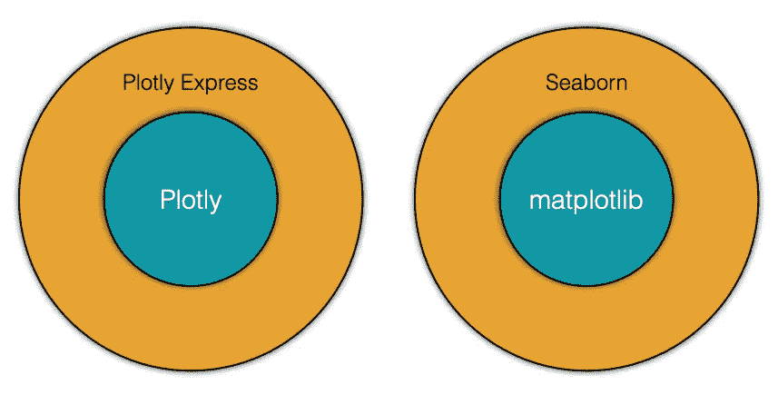

作者图片

## 安装 Plotly Express

要安装 plotly，您可以使用`pip`:

```
pip install plotly
```

或者`conda`:

```
conda install plotly
```

# 创建我们的样品极化数据框架

让我们从字典中创建我们的示例极坐标数据帧:

```
import polars as pldf = pl.DataFrame(
     {
         'Model': ['iPhone X','iPhone XS','iPhone 12',
                   'iPhone 13','Samsung S11','Samsung S12',
                   'Mi A1','Mi A2'],
         'Sales': [80,170,130,205,400,30,14,8],     
         'Company': ['Apple','Apple','Apple','Apple',
                     'Samsung','Samsung','Xiao Mi','Xiao Mi'],
     }
)
df
```

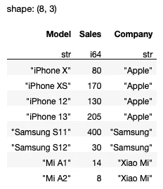

作者图片

## 使用 matplotlib 绘图

首先，画一个柱状图展示每种型号的销售情况是很有用的。大多数数据分析师/科学家都熟悉 matplotlib，所以让我们先尝试使用它:

```
plt.bar(df['Model'], df['Sales'])
```

您应该会看到以下输出:

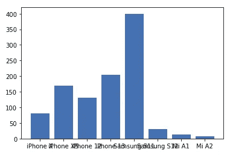

作者图片

上面的工作是因为`df[‘Model’]`和`df[‘Sales’]`各自返回一个极坐标序列，这是 matplotlib 的`bar()`方法可以接受的。然而，由于方括号索引是 Polars 中的反模式，您应该使用`select()`方法来选择您想要绘制的列:

```
import matplotlib.pyplot as pltplt.bar(
    df.**select('Model').to_series()**, 
    df.**select('Sales').to_series()**
)
```

> 注意，您必须使用`to_series()`方法将`select()`方法的结果显式转换为一个序列。这是因为`select()`方法返回一个数据帧。

## 使用 Plotly Express 绘图

现在让我们使用 Plotly Express 绘制条形图:

```
import plotly.express as pxpx.bar(x = df.select('Model').to_series(), 
       y = df.select('Sales').to_series())
```

就像使用 matplotlib 一样，您需要显式地将列作为一个序列传递给 Plotly Express 的方法，在本例中是`bar()`方法。

Plotly Express 以交互方式显示条形图，您可以将鼠标悬停在条形上，弹出窗口将显示条形的详细信息，您还可以使用工具栏中的各种项目放大图表、将图表另存为 PNG 等:

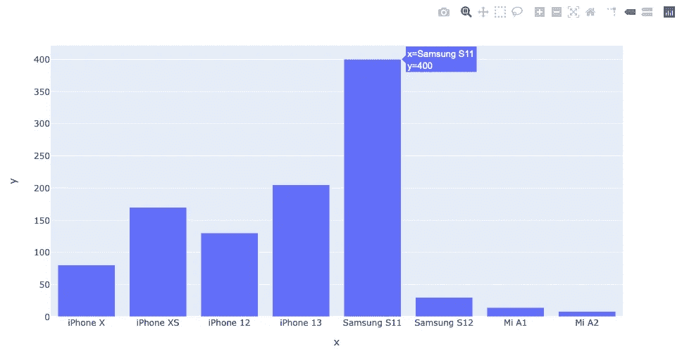

作者图片

使用 Polars 数据框架绘制图表的另一种方法是将其转换为 Pandas 数据框架，然后在 Plotly Express 中直接使用 Pandas 数据框架:

```
px.bar(df.to_pandas(),     **# convert from Polars to Pandas DataFrame**
       x = 'Model', 
       y = 'Sales')
```

> 只要方便，我就会使用这种方法。

如果上面的语句出错，您需要安装 **pyarrow** 库:

```
pip install pyarrow
```

## 绘制饼图

要在 Plotly Express 中绘制饼图，请使用`pie()`方法:

```
px.pie(df,                                   **# Polars DataFrame**
       names = df.select('Model').to_series(),
       values = df.select('Sales').to_series(), 
       hover_name = df.select('Model').to_series(),
       color_discrete_sequence= px.colors.sequential.Plasma_r)
```

或者，如果您使用的是熊猫数据框架:

```
px.pie(**df.to_pandas()**,                      **# Pandas DataFrame**
       names = 'Model',
       values = 'Sales', 
       hover_name = 'Model',
       color_discrete_sequence= px.colors.sequential.Plasma_r)
```

无论哪种情况，您都会看到下面的饼图:

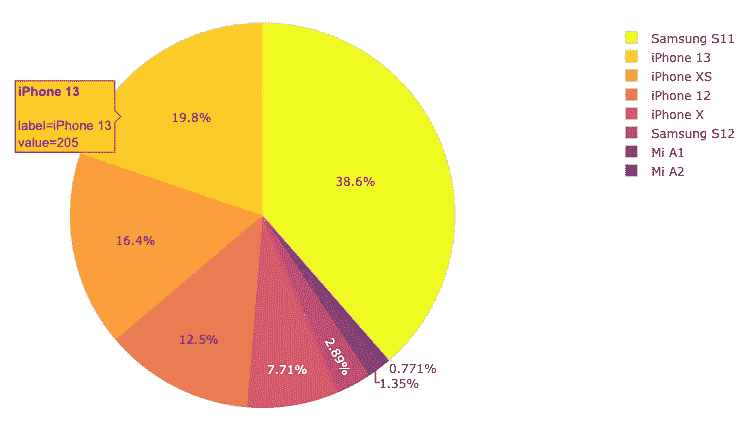

作者图片

## 绘制折线图

对于这个例子，我将使用来自[https://www . ka ggle . com/datasets/meet nagadia/apple-stock-price-from-1980 2021](https://www.kaggle.com/datasets/meetnagadia/apple-stock-price-from-19802021)的 **AAPL-10.csv** 文件

> **许可证** —开放数据共享开放数据库许可证(ODbL) v1.0\. **描述** —这是一个关于苹果公司股票预测的数据集，这个数据集从 1980 年开始到 2021 年。它是从雅虎财经收集来的。

要绘制显示**开盘**、**收盘**、**高**和**低**价格的折线图，将 Polars 数据帧直接转换为 Pandas 数据帧并在 Plotly Express 的`line()`方法中使用会更容易:

```
df = (
    pl.scan_csv('AAPL-10.csv')
).collect()px.line(df.to_pandas(),               **# covert to Pandas DataFrame**
        x = 'Date', 
        y = ['Open','Close','High','Low']
)
```

输出如下所示:

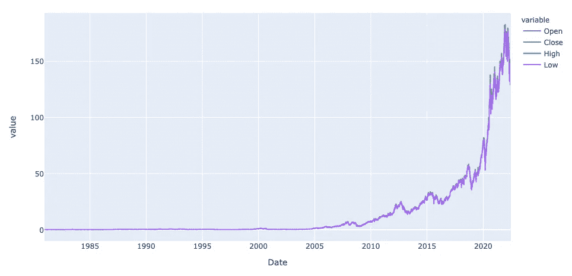

作者图片

# 执行探索性数据分析(EDA)

在下一个例子中，让我们对保险数据集进行一些 EDA。对于这个例子，我们将使用位于[的数据集 https://www . ka ggle . com/datasets/teer tha/ushealthsiicedataset？资源=下载。](https://www.kaggle.com/datasets/teertha/ushealthinsurancedataset?resource=download.)

> **许可** : [CC0:公共领域](https://creativecommons.org/publicdomain/zero/1.0/)。**描述** —该数据集包含 1338 行被保险人数据，其中根据被保险人的以下属性给出保险费用:年龄、性别、身体质量指数、子女数、吸烟者和地区。属性是数字和分类变量的混合。

首先，将 CSV 文件作为 Polars 数据帧加载:

```
import polars as plq = (
    pl.scan_csv('insurance.csv')
)df = q.collect()
df
```

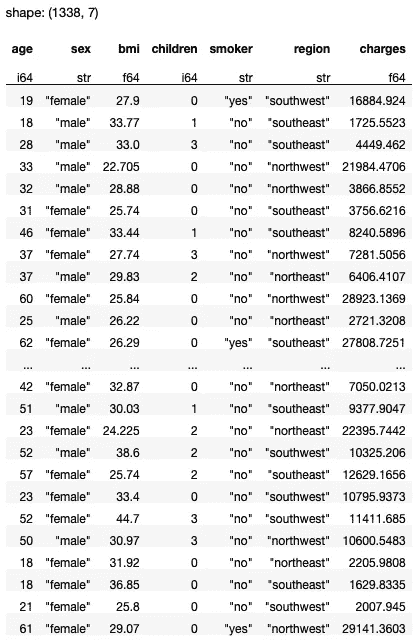

作者图片

## 分析吸烟者的性别分布

让我们分析一下不同性别吸烟者的分布情况:

```
import plotly.express as pxpx.histogram(df.to_pandas(),
             x = 'sex', 
             color = 'smoker',
             barmode = 'group',
             color_discrete_sequence = px.colors.qualitative.D3)
```

像往常一样，我发现在我绘图之前，把极地数据帧转换成熊猫数据帧更容易。对于绘图，我使用 Plotly Express 中的`histogram()`方法。下面是上述语句的输出:

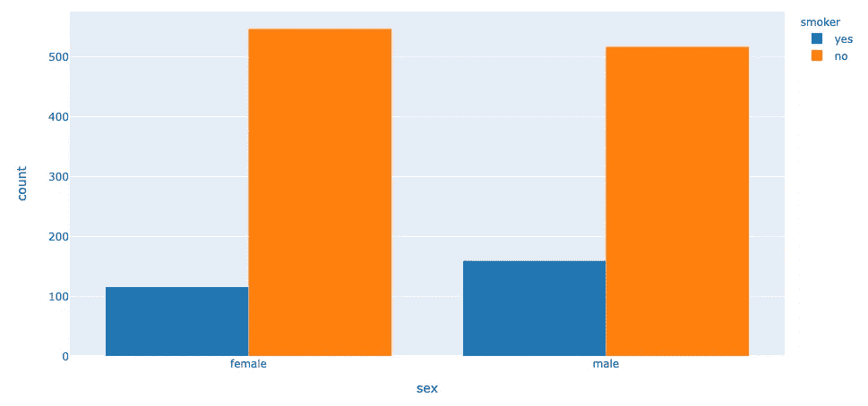

作者图片

如你所见，对于每个性别，不吸烟的人比吸烟的人多。

## 吸烟者的性别分布分析

接下来，我们有兴趣看看男性吸烟者多还是女性吸烟者多:

```
px.histogram(df.to_pandas(),
             x = 'smoker',
             color = 'sex',
             barmode = 'group',
             color_discrete_sequence = px.colors.qualitative.Safe)
```

下面的结果表明，男性吸烟者比女性吸烟者多:

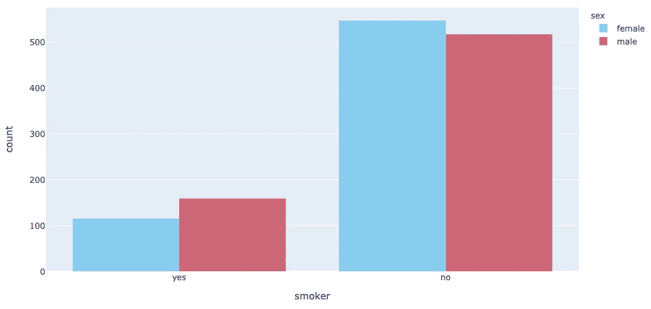

作者图片

## 分析费用如何取决于年龄

我想对这个数据集做的最后一个分析是，电荷如何依赖于年龄。由于 **age** 列是一个连续变量，如果能够将值绑定到不同的组中，然后将其转换为分类字段，将会非常有用。在 Polars 中，您可以使用`apply()`和`cast()`方法:

```
def age_group(x):
    if x>0 and x<=20:
        return '20 and below'
    if x>20 and x<=30:
        return '21 to 30'
    if x>30 and x<=40:
        return '31 to 40'
    if x>40 and x<=50:
        return '41 to 50'
    if x>50 and x<=60:
        return '51 to 60'
    if x>60 and x<=70:
        return '61 to 70'
    return '71 and above'df = df.select(    
    [
        pl.col('*'),        
        **pl.col('age').apply(age_group).cast(pl.Categorical)
            .alias('age_group')**
    ]
)
df
```

> 在熊猫身上，你可以用`pd.cut()`的方法来表演宁滨。不幸的是，在 Polars 中没有等效的方法。

您将获得以下输出:

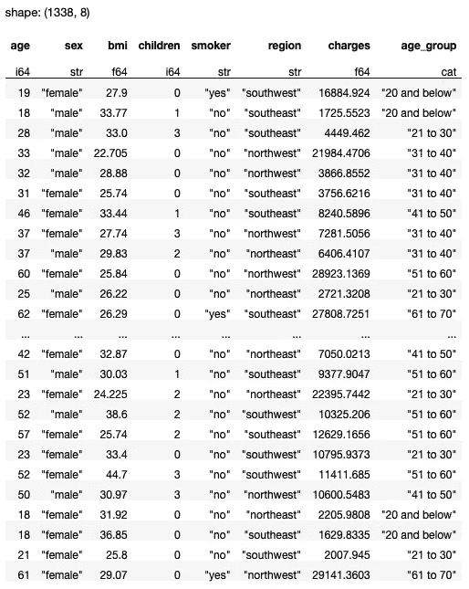

作者图片

现在，您可以根据 **age_group** 字段对数据帧进行分组，然后计算所有男性和女性的平均费用:

```
df = df.**groupby**('age_group').**agg**(  
        [
           (pl.col('charges')
                 .filter(pl.col('sex')== 'male'))
                .mean()
                .alias('male_mean_charges'),
           (pl.col('charges')
                 .filter(pl.col('sex')== 'female'))
                .mean()
                .alias('female_mean_charges'),        
        ]
    ).sort(by='age_group')
df
```

您将看到以下输出:

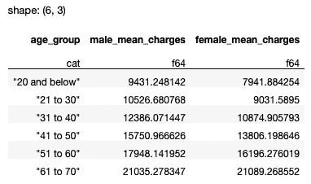

作者图片

最后，您现在可以绘制图表，显示每个年龄组的平均费用如何变化:

```
px.bar(
    df.to_pandas(),
    x = "age_group",
    y = ['male_mean_charges','female_mean_charges'],
    barmode = 'group',
    color_discrete_sequence=px.colors.colorbrewer.Accent,
)
```

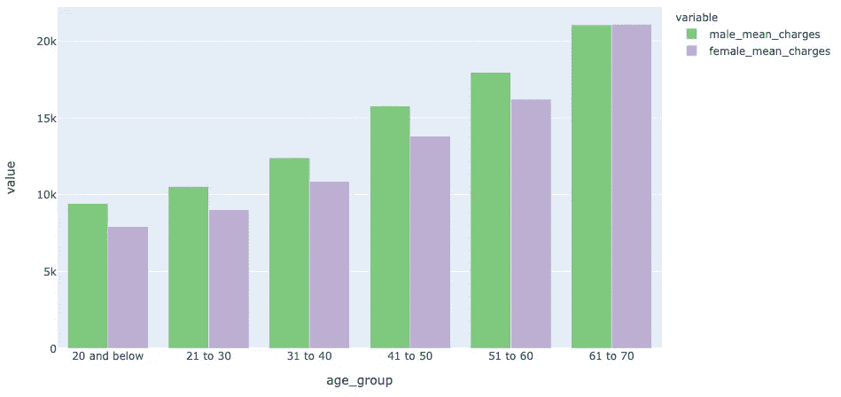

作者图片

因为我们使用了 Polars，所以让我们利用惰性评估，将上面的所有代码片段合并到一个查询中:

```
import polars as pldef age_group(x):
    if x>0 and x<=20:
        return '20 and below'
    if x>20 and x<=30:
        return '21 to 30'
    if x>30 and x<=40:
        return '31 to 40'
    if x>40 and x<=50:
        return '41 to 50'
    if x>50 and x<=60:
        return '51 to 60'
    if x>60 and x<=70:
        return '61 to 70'
    return '71 and above'**q = (
    pl.scan_csv('insurance.csv')
    .select(    
        [
            pl.col('*'),        
            pl.col('age').apply(age_group).cast(pl.Categorical)
                .alias('age_group')
        ]
    )
    .groupby('age_group').agg(  
        [
           (pl.col('charges')
                 .filter(pl.col('sex')== 'male'))
                .mean()
                .alias('male_mean_charges'),
           (pl.col('charges')
                 .filter(pl.col('sex')== 'female'))
                .mean()
                .alias('female_mean_charges'),        
        ]
    ).sort(by='age_group')
)**px.bar(
    q.collect().to_pandas(),
    x = "age_group",
    y = ['male_mean_charges','female_mean_charges'],
    barmode = 'group',
    color_discrete_sequence=px.colors.colorbrewer.Accent,
)
```

[](https://weimenglee.medium.com/membership) [## 加入媒介与我的介绍链接-李伟孟

### 阅读李维孟(以及媒体上成千上万的其他作家)的每一个故事。您的会员费直接支持…

weimenglee.medium.com](https://weimenglee.medium.com/membership) 

> 我将在即将到来的新加坡 ML 会议(2022 年 11 月 22-24 日)上主持一个关于 Polars 的研讨会。如果你想在 Polars 数据框架上快速起步，请在[https://ml conference . ai/machine-learning-advanced-development/using-Polars-for-data-analytics-workshop/](https://mlconference.ai/machine-learning-advanced-development/using-polars-for-data-analytics-workshop/)上注册我的研讨会。


# 摘要

在本文中，您了解了 Polars 没有自己的可视化 API。而是要在自己的绘图库比如 matplotlib 和 Plotly Express 上回复。虽然您可以将 Polars 数据帧作为系列直接传递到各种绘图库，但有时如果您只是将 Polars 数据帧转换为 Pandas 数据帧会更容易，因为大多数绘图库都具有对 Pandas 的固有支持。

将来，Polars 很有可能会有自己的绘图 API，但是现在，你必须用你现有的来凑合。